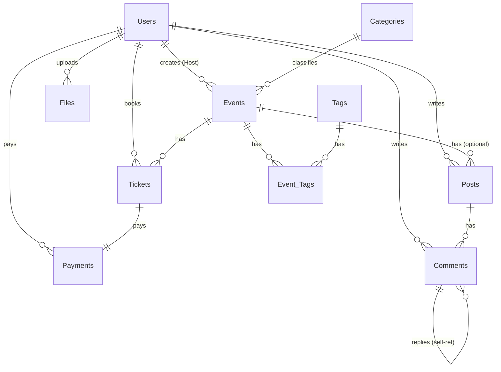

# ERD 설계서 - Event Platform (VenueOn)

## 개요

이벤트 플랫폼의 데이터베이스 설계 문서입니다.  
총 **10개 테이블**로 구성되며, Admin / Host / User 3가지 역할을 기반으로 동작합니다.

---

## ERD 다이어그램

---

## 테이블 상세 정의

---

### 1. Users (회원)

| 컬럼 | 타입 | 제약조건 | 설명 |
|------|------|----------|------|
| user_id | BIGINT | PK, AUTO_INCREMENT | 회원 고유 ID |
| email | VARCHAR(255) | UNIQUE, NOT NULL | 로그인용 이메일 |
| password | VARCHAR(255) | NOT NULL | 암호화된 비밀번호 |
| nickname | VARCHAR(50) | NOT NULL | 닉네임 |
| role | ENUM('ADMIN','HOST','USER') | NOT NULL, DEFAULT 'USER' | 역할 구분 |
| profile_image | VARCHAR(500) | NULL | 프로필 이미지 URL |
| phone | VARCHAR(20) | NULL | 연락처 |
| created_at | DATETIME | NOT NULL, DEFAULT NOW | 가입일시 |
| updated_at | DATETIME | NOT NULL, DEFAULT NOW | 수정일시 |
| is_deleted | BOOLEAN | NOT NULL, DEFAULT FALSE | 소프트 삭제 여부 |

---

### 2. Categories (이벤트 카테고리)

| 컬럼 | 타입 | 제약조건 | 설명 |
|------|------|----------|------|
| category_id | BIGINT | PK, AUTO_INCREMENT | 카테고리 고유 ID |
| name | VARCHAR(100) | UNIQUE, NOT NULL | 카테고리명 (세미나, 워크숍 등) |
| description | VARCHAR(500) | NULL | 카테고리 설명 |
| created_at | DATETIME | NOT NULL, DEFAULT NOW | 생성일시 |

---

### 3. Tags (태그)

| 컬럼 | 타입 | 제약조건 | 설명 |
|------|------|----------|------|
| tag_id | BIGINT | PK, AUTO_INCREMENT | 태그 고유 ID |
| name | VARCHAR(50) | UNIQUE, NOT NULL | 태그명 (#개발, #디자인 등) |

---

### 4. Events (이벤트)

| 컬럼 | 타입 | 제약조건 | 설명 |
|------|------|----------|------|
| event_id | BIGINT | PK, AUTO_INCREMENT | 이벤트 고유 ID |
| host_id | BIGINT | FK → Users(user_id), NOT NULL | 이벤트 생성자 (Host) |
| category_id | BIGINT | FK → Categories(category_id), NULL | 카테고리 |
| title | VARCHAR(200) | NOT NULL | 이벤트 제목 |
| description | TEXT | NOT NULL | 이벤트 상세 설명 |
| location | VARCHAR(300) | NULL | 장소 (오프라인) |
| online_url | VARCHAR(500) | NULL | 온라인 링크 |
| event_start | DATETIME | NOT NULL | 이벤트 시작 일시 |
| event_end | DATETIME | NOT NULL | 이벤트 종료 일시 |
| max_capacity | INT | NOT NULL | 최대 수용 인원 |
| status | ENUM('DRAFT','OPEN','CLOSED','CANCELLED') | NOT NULL, DEFAULT 'DRAFT' | 이벤트 상태 |
| thumbnail | VARCHAR(500) | NULL | 썸네일 이미지 URL |
| created_at | DATETIME | NOT NULL, DEFAULT NOW | 생성일시 |
| updated_at | DATETIME | NOT NULL, DEFAULT NOW | 수정일시 |
| is_deleted | BOOLEAN | NOT NULL, DEFAULT FALSE | 소프트 삭제 |

**상태 흐름:** `DRAFT` → `OPEN` → `CLOSED` / `CANCELLED`

---

### 5. Event_Tags (이벤트-태그 연결)

| 컬럼 | 타입 | 제약조건 | 설명 |
|------|------|----------|------|
| event_id | BIGINT | PK, FK → Events(event_id) | 이벤트 ID |
| tag_id | BIGINT | PK, FK → Tags(tag_id) | 태그 ID |

> Events와 Tags의 N:N(다대다) 관계를 위한 중간 테이블

---

### 6. Tickets (티켓/예매)

| 컬럼 | 타입 | 제약조건 | 설명 |
|------|------|----------|------|
| ticket_id | BIGINT | PK, AUTO_INCREMENT | 티켓 고유 ID |
| event_id | BIGINT | FK → Events(event_id), NOT NULL | 이벤트 |
| user_id | BIGINT | FK → Users(user_id), NOT NULL | 예매한 사용자 |
| ticket_number | VARCHAR(50) | UNIQUE, NOT NULL | 티켓 고유 번호 |
| quantity | INT | NOT NULL, DEFAULT 1 | 수량 |
| total_price | DECIMAL(10,2) | NOT NULL | 총 금액 |
| status | ENUM('RESERVED','CONFIRMED','CANCELLED') | NOT NULL, DEFAULT 'RESERVED' | 예매 상태 |
| created_at | DATETIME | NOT NULL, DEFAULT NOW | 예매 일시 |
| updated_at | DATETIME | NOT NULL, DEFAULT NOW | 수정 일시 |

**상태 흐름:** `RESERVED` → `CONFIRMED` / `CANCELLED`

---

### 7. Payments (결제)

| 컬럼 | 타입 | 제약조건 | 설명 |
|------|------|----------|------|
| payment_id | BIGINT | PK, AUTO_INCREMENT | 결제 고유 ID |
| ticket_id | BIGINT | FK → Tickets(ticket_id), NOT NULL | 티켓 |
| user_id | BIGINT | FK → Users(user_id), NOT NULL | 결제한 사용자 |
| amount | DECIMAL(10,2) | NOT NULL | 결제 금액 |
| payment_method | ENUM('CARD','BANK_TRANSFER','VIRTUAL') | NOT NULL, DEFAULT 'CARD' | 결제 수단 (더미) |
| status | ENUM('PENDING','COMPLETED','CANCELLED','REFUNDED') | NOT NULL, DEFAULT 'PENDING' | 결제 상태 |
| paid_at | DATETIME | NULL | 결제 완료 시각 |
| cancelled_at | DATETIME | NULL | 취소 시각 |
| cancel_reason | VARCHAR(500) | NULL | 취소 사유 |
| created_at | DATETIME | NOT NULL, DEFAULT NOW | 생성일시 |

**상태 흐름:** `PENDING` → `COMPLETED` → `REFUNDED` / `CANCELLED`

---

### 8. Posts (커뮤니티 글)

| 컬럼 | 타입 | 제약조건 | 설명 |
|------|------|----------|------|
| post_id | BIGINT | PK, AUTO_INCREMENT | 글 고유 ID |
| user_id | BIGINT | FK → Users(user_id), NOT NULL | 작성자 |
| event_id | BIGINT | FK → Events(event_id), NULL | 이벤트별 커뮤니티일 경우 연결 |
| title | VARCHAR(200) | NOT NULL | 글 제목 |
| content | TEXT | NOT NULL | 글 내용 |
| view_count | INT | NOT NULL, DEFAULT 0 | 조회수 |
| created_at | DATETIME | NOT NULL, DEFAULT NOW | 작성일시 |
| updated_at | DATETIME | NOT NULL, DEFAULT NOW | 수정일시 |
| is_deleted | BOOLEAN | NOT NULL, DEFAULT FALSE | 소프트 삭제 |

> `event_id`가 NULL → 일반 커뮤니티 글  
> `event_id`가 있으면 → 해당 이벤트의 커뮤니티 글

---

### 9. Comments (댓글)

| 컬럼 | 타입 | 제약조건 | 설명 |
|------|------|----------|------|
| comment_id | BIGINT | PK, AUTO_INCREMENT | 댓글 고유 ID |
| post_id | BIGINT | FK → Posts(post_id), NOT NULL | 글 |
| user_id | BIGINT | FK → Users(user_id), NOT NULL | 작성자 |
| parent_id | BIGINT | FK → Comments(comment_id), NULL | 대댓글의 부모 댓글 |
| content | TEXT | NOT NULL | 댓글 내용 |
| created_at | DATETIME | NOT NULL, DEFAULT NOW | 작성일시 |
| updated_at | DATETIME | NOT NULL, DEFAULT NOW | 수정일시 |
| is_deleted | BOOLEAN | NOT NULL, DEFAULT FALSE | 소프트 삭제 |

> `parent_id`가 NULL → 일반 댓글  
> `parent_id`가 있으면 → 대댓글

---

### 10. Files (첨부 파일/이미지)

| 컬럼 | 타입 | 제약조건 | 설명 |
|------|------|----------|------|
| file_id | BIGINT | PK, AUTO_INCREMENT | 파일 고유 ID |
| uploader_id | BIGINT | FK → Users(user_id), NOT NULL | 업로드한 사용자 |
| ref_type | ENUM('EVENT','POST','PROFILE') | NOT NULL | 참조 대상 유형 |
| ref_id | BIGINT | NOT NULL | 참조 대상 ID |
| original_name | VARCHAR(300) | NOT NULL | 원본 파일명 |
| stored_url | VARCHAR(500) | NOT NULL | 저장 경로/URL |
| file_size | INT | NULL | 파일 크기 (bytes) |
| mime_type | VARCHAR(100) | NULL | 파일 타입 |
| created_at | DATETIME | NOT NULL, DEFAULT NOW | 업로드 일시 |

> **다형성 관계:** `ref_type` + `ref_id` 조합으로 Events, Posts, Users에 연결  
> - `EVENT` + event_id → 이벤트 첨부 파일  
> - `POST` + post_id → 커뮤니티 글 첨부 파일  
> - `PROFILE` + user_id → 프로필 이미지  

---

## 관계 요약

| 관계 | 유형 | 설명 |
|------|------|------|
| Users → Events | 1:N | Host가 이벤트 생성 |
| Users → Tickets | 1:N | User가 티켓 예매 |
| Users → Payments | 1:N | User가 결제 |
| Users → Posts | 1:N | 누구나 글 작성 |
| Users → Comments | 1:N | 누구나 댓글 작성 |
| Users → Files | 1:N | 누구나 파일 업로드 |
| Categories → Events | 1:N | 카테고리별 이벤트 분류 |
| Events ↔ Tags | N:N | Event_Tags 중간 테이블 (다대다) |
| Events → Tickets | 1:N | 이벤트당 여러 티켓 |
| Events → Posts | 1:N | 이벤트별 커뮤니티 글 (optional) |
| Tickets → Payments | 1:1 | 티켓당 결제 1건 |
| Posts → Comments | 1:N | 글당 여러 댓글 |
| Comments → Comments | 1:N | 대댓글 (자기 참조) |
