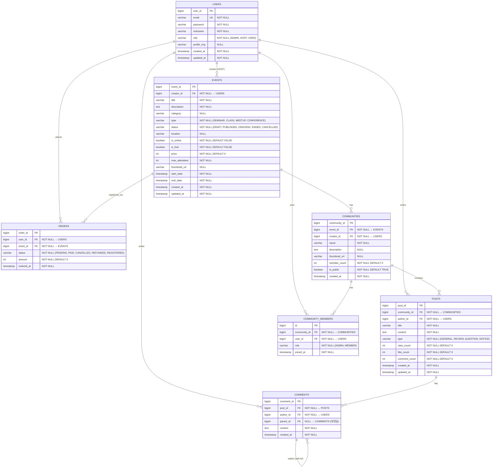
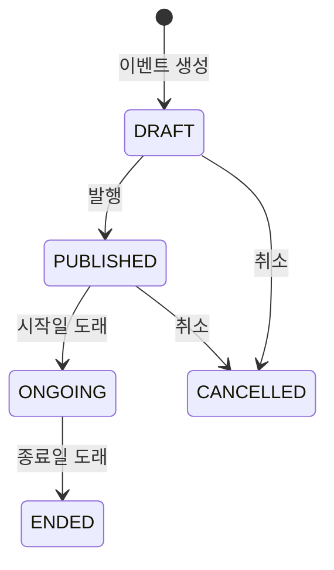
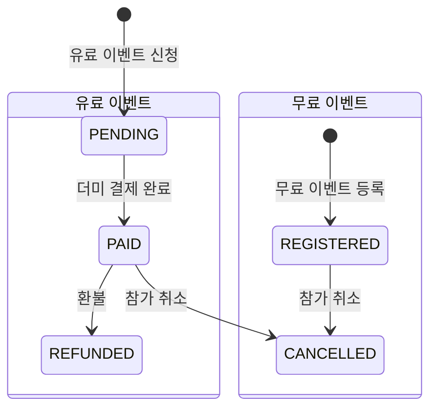

# ERD 설계서 v2 - VenueOn Event Platform

## 개요

이벤트 플랫폼 VenueOn의 데이터베이스 설계 문서입니다.  
`MVP_아키텍처_v3.md` 기반으로 설계되었으며, 총 **8개 테이블**로 구성됩니다.  
Admin / Host / User 3가지 역할을 기반으로 동작합니다.

> **기술 스택:** H2 (개발) / PostgreSQL 15 (운영)  
> **ORM:** JPA · Hibernate  
> **아키텍처:** Hexagonal (Domain Entity ↔ JPA Entity 분리)

---

## ERD 다이어그램

---

## 테이블 상세 정의

---

### 1. USERS (회원)

| 컬럼 | 타입 | 제약조건 | 설명 |
|------|------|----------|------|
| user_id | BIGINT | PK, AUTO_INCREMENT | 회원 고유 ID |
| email | VARCHAR(255) | UNIQUE, NOT NULL | 로그인용 이메일 |
| password | VARCHAR(255) | NOT NULL | BCrypt 암호화된 비밀번호 |
| nickname | VARCHAR(50) | NOT NULL | 닉네임 |
| role | VARCHAR(20) | NOT NULL, DEFAULT 'USER' | 역할 (ADMIN / HOST / USER) |
| profile_img | VARCHAR(500) | NULL | 프로필 이미지 URL |
| created_at | TIMESTAMP | NOT NULL, DEFAULT NOW | 가입일시 |
| updated_at | TIMESTAMP | NOT NULL, DEFAULT NOW | 수정일시 |

**인덱스:**
- `UK_users_email` — UNIQUE (email)

**역할 구분:**

| 역할 | 설명 | 가입 방식 |
|------|------|----------|
| `ADMIN` | 관리자 — 전체 회원 조회 | 시스템 등록 |
| `HOST` | 기획자 — 이벤트 생성·관리·티켓 판매 | 사업자/기관 인증 가입 |
| `USER` | 일반 사용자 — 이벤트 탐색·티켓 구매·커뮤니티 참여 | 이메일 기반 가입 |

---

### 2. EVENTS (이벤트)

| 컬럼 | 타입 | 제약조건 | 설명 |
|------|------|----------|------|
| event_id | BIGINT | PK, AUTO_INCREMENT | 이벤트 고유 ID |
| creator_id | BIGINT | FK → USERS(user_id), NOT NULL | 이벤트 생성자 (HOST) |
| title | VARCHAR(200) | NOT NULL | 이벤트 제목 |
| description | TEXT | NOT NULL | 이벤트 상세 설명 (리치 텍스트) |
| category | VARCHAR(100) | NULL | 카테고리 (자유 입력) |
| type | VARCHAR(20) | NOT NULL | 이벤트 유형 |
| status | VARCHAR(20) | NOT NULL, DEFAULT 'DRAFT' | 이벤트 상태 |
| location | VARCHAR(300) | NULL | 오프라인 장소 |
| is_online | BOOLEAN | NOT NULL, DEFAULT FALSE | 온라인 여부 |
| is_free | BOOLEAN | NOT NULL, DEFAULT FALSE | 무료 여부 |
| price | INT | NOT NULL, DEFAULT 0 | 가격 (원) — 무료면 0 |
| max_attendees | INT | NOT NULL | 최대 참석자 수 |
| thumbnail_url | VARCHAR(500) | NULL | 썸네일 이미지 URL |
| start_date | TIMESTAMP | NOT NULL | 이벤트 시작 일시 |
| end_date | TIMESTAMP | NOT NULL | 이벤트 종료 일시 |
| created_at | TIMESTAMP | NOT NULL, DEFAULT NOW | 생성일시 |
| updated_at | TIMESTAMP | NOT NULL, DEFAULT NOW | 수정일시 |

**인덱스:**
- `IX_events_creator` — (creator_id)
- `IX_events_status` — (status)
- `IX_events_start_date` — (start_date)

**type 값:**

| 값 | 설명 |
|----|------|
| `SEMINAR` | 세미나 |
| `CLASS` | 클래스/강의 |
| `MEETUP` | 밋업/네트워킹 |
| `CONFERENCE` | 컨퍼런스 |

**status 상태 흐름:**

---

### 3. ORDERS (주문/참가 신청)

| 컬럼 | 타입 | 제약조건 | 설명 |
|------|------|----------|------|
| order_id | BIGINT | PK, AUTO_INCREMENT | 주문 고유 ID |
| user_id | BIGINT | FK → USERS(user_id), NOT NULL | 신청한 사용자 |
| event_id | BIGINT | FK → EVENTS(event_id), NOT NULL | 대상 이벤트 |
| status | VARCHAR(20) | NOT NULL, DEFAULT 'PENDING' | 주문 상태 |
| amount | INT | NOT NULL, DEFAULT 0 | 결제 금액 (원) — 무료면 0 |
| ordered_at | TIMESTAMP | NOT NULL, DEFAULT NOW | 신청 일시 |

**인덱스:**
- `IX_orders_user` — (user_id)
- `IX_orders_event` — (event_id)

**status 상태 흐름:**

> **MVP 더미 결제:** `POST /orders` 호출 시 PG 연동 없이 즉시 `PAID` 처리.  
> 향후 포트원(PortOne) 연동 시 `PaymentPort` + `PortOnePaymentAdapter`를 추가하면 됩니다.

---

### 4. COMMUNITIES (커뮤니티)

| 컬럼 | 타입 | 제약조건 | 설명 |
|------|------|----------|------|
| community_id | BIGINT | PK, AUTO_INCREMENT | 커뮤니티 고유 ID |
| event_id | BIGINT | FK → EVENTS(event_id), NOT NULL | 연결된 이벤트 |
| creator_id | BIGINT | FK → USERS(user_id), NOT NULL | 커뮤니티 생성자 |
| name | VARCHAR(200) | NOT NULL | 커뮤니티 이름 |
| description | TEXT | NULL | 커뮤니티 설명 |
| thumbnail_url | VARCHAR(500) | NULL | 커뮤니티 썸네일 URL |
| member_count | INT | NOT NULL, DEFAULT 0 | 현재 멤버 수 (비정규화) |
| is_public | BOOLEAN | NOT NULL, DEFAULT TRUE | 공개/비공개 여부 |
| created_at | TIMESTAMP | NOT NULL, DEFAULT NOW | 생성일시 |

**인덱스:**
- `IX_communities_event` — (event_id)
- `IX_communities_creator` — (creator_id)

> **관계:** 하나의 이벤트에 여러 커뮤니티 생성 가능 (1:N)  
> **member_count:** 가입/탈퇴 시 증감 처리 (비정규화 — 조회 성능 최적화)

---

### 5. COMMUNITY_MEMBERS (커뮤니티 멤버)

| 컬럼 | 타입 | 제약조건 | 설명 |
|------|------|----------|------|
| id | BIGINT | PK, AUTO_INCREMENT | 멤버십 고유 ID |
| community_id | BIGINT | FK → COMMUNITIES(community_id), NOT NULL | 커뮤니티 |
| user_id | BIGINT | FK → USERS(user_id), NOT NULL | 가입한 사용자 |
| role | VARCHAR(20) | NOT NULL, DEFAULT 'MEMBER' | 커뮤니티 내 역할 |
| joined_at | TIMESTAMP | NOT NULL, DEFAULT NOW | 가입 일시 |

**인덱스:**
- `UK_cm_community_user` — UNIQUE (community_id, user_id) — 중복 가입 방지
- `IX_cm_user` — (user_id)

**role 값:**

| 값 | 설명 |
|----|------|
| `ADMIN` | 커뮤니티 관리자 (생성자) |
| `MEMBER` | 일반 멤버 |

---

### 6. POSTS (게시글)

| 컬럼 | 타입 | 제약조건 | 설명 |
|------|------|----------|------|
| post_id | BIGINT | PK, AUTO_INCREMENT | 게시글 고유 ID |
| community_id | BIGINT | FK → COMMUNITIES(community_id), NOT NULL | 소속 커뮤니티 |
| author_id | BIGINT | FK → USERS(user_id), NOT NULL | 작성자 |
| title | VARCHAR(200) | NOT NULL | 글 제목 |
| content | TEXT | NOT NULL | 글 내용 |
| type | VARCHAR(20) | NOT NULL, DEFAULT 'GENERAL' | 게시글 유형 |
| view_count | INT | NOT NULL, DEFAULT 0 | 조회수 |
| like_count | INT | NOT NULL, DEFAULT 0 | 좋아요 수 |
| comment_count | INT | NOT NULL, DEFAULT 0 | 댓글 수 (비정규화) |
| created_at | TIMESTAMP | NOT NULL, DEFAULT NOW | 작성일시 |
| updated_at | TIMESTAMP | NOT NULL, DEFAULT NOW | 수정일시 |

**인덱스:**
- `IX_posts_community` — (community_id)
- `IX_posts_author` — (author_id)
- `IX_posts_type` — (type)

**type 값:**

| 값 | 설명 |
|----|------|
| `GENERAL` | 일반 글 |
| `REVIEW` | 후기/리뷰 |
| `QUESTION` | 질문 |
| `NOTICE` | 공지사항 |

---

### 7. COMMENTS (댓글)

| 컬럼 | 타입 | 제약조건 | 설명 |
|------|------|----------|------|
| comment_id | BIGINT | PK, AUTO_INCREMENT | 댓글 고유 ID |
| post_id | BIGINT | FK → POSTS(post_id), NOT NULL | 소속 게시글 |
| author_id | BIGINT | FK → USERS(user_id), NOT NULL | 작성자 |
| parent_id | BIGINT | FK → COMMENTS(comment_id), NULL | 대댓글의 부모 댓글 |
| content | TEXT | NOT NULL | 댓글 내용 |
| created_at | TIMESTAMP | NOT NULL, DEFAULT NOW | 작성일시 |

**인덱스:**
- `IX_comments_post` — (post_id)
- `IX_comments_author` — (author_id)
- `IX_comments_parent` — (parent_id)

> `parent_id`가 NULL → 일반 댓글  
> `parent_id`가 있으면 → 대댓글 (1depth만 허용 권장)

---

## 관계 요약

| 관계 | 유형 | FK 위치 | 설명 |
|------|------|---------|------|
| USERS → EVENTS | 1:N | EVENTS.creator_id | HOST가 이벤트 생성 |
| USERS → ORDERS | 1:N | ORDERS.user_id | USER가 참가 신청 |
| USERS → POSTS | 1:N | POSTS.author_id | 누구나 글 작성 |
| USERS → COMMENTS | 1:N | COMMENTS.author_id | 누구나 댓글 작성 |
| USERS → COMMUNITY_MEMBERS | 1:N | COMMUNITY_MEMBERS.user_id | 사용자가 커뮤니티 가입 |
| EVENTS → ORDERS | 1:N | ORDERS.event_id | 이벤트당 여러 주문 |
| EVENTS → COMMUNITIES | 1:N | COMMUNITIES.event_id | 이벤트당 여러 커뮤니티 |
| COMMUNITIES → COMMUNITY_MEMBERS | 1:N | COMMUNITY_MEMBERS.community_id | 커뮤니티당 여러 멤버 |
| COMMUNITIES → POSTS | 1:N | POSTS.community_id | 커뮤니티당 여러 게시글 |
| POSTS → COMMENTS | 1:N | COMMENTS.post_id | 게시글당 여러 댓글 |
| COMMENTS → COMMENTS | 1:N (Self) | COMMENTS.parent_id | 대댓글 (자기 참조) |

---

## v1 → v2 변경 이력

| # | 변경 내용 | 이유 |
|---|----------|------|
| 1 | `Tickets` + `Payments` → **`ORDERS`** 단일 테이블로 통합 | 아키텍처 v3의 Order 엔티티와 일치시킴. MVP 더미 결제에는 단일 테이블이 적합 |
| 2 | **`COMMUNITIES`** 테이블 추가 | 아키텍처 v3의 핵심 엔티티. community 모듈의 CRUD 기능 구현에 필수 |
| 3 | **`COMMUNITY_MEMBERS`** 테이블 추가 | 커뮤니티 가입/탈퇴, 멤버 관리 기능에 필수 |
| 4 | `Categories` / `Tags` / `Event_Tags` 테이블 제거 | 아키텍처 v3에서는 `category`를 Event의 문자열 필드로 처리. MVP 범위 축소 |
| 5 | `Files` 테이블 제거 | 아키텍처 v3에서는 외부 볼륨(`dist/upload`)에 저장하고 URL만 반환. 별도 테이블 불필요 |
| 6 | Event `status` 값 통일 | `OPEN/CLOSED` → `PUBLISHED/ONGOING/ENDED` (아키텍처 v3에 맞춤) |
| 7 | Event에 `type`, `is_online`, `is_free`, `price` 컬럼 추가 | 아키텍처 v3 ERD에 정의된 필수 컬럼 |
| 8 | Post에 `community_id FK` 추가, `event_id` 제거 | Post → Community → Event 구조로 변경 (아키텍처 v3 구조) |
| 9 | Post에 `type`, `like_count`, `comment_count` 추가 | 아키텍처 v3 ERD에 정의된 컬럼 |
| 10 | 컬럼명 통일 (`host_id`→`creator_id`, `event_start`→`start_date` 등) | 아키텍처 v3의 네이밍 컨벤션에 맞춤 |
| 11 | 테이블 수 8개로 통일 | 아키텍처 v3 명시: "Entity 수: 8개 → PDF 요구사항(최소 5개) 충족" |

---

## 헥사고날 아키텍처 매핑

> Domain Entity (순수 비즈니스) ↔ JPA Entity (DB 매핑) 분리

| 테이블 | Domain Entity | JPA Entity | 모듈 |
|--------|--------------|------------|------|
| USERS | `User.java` | `UserJpaEntity.java` | `user/` |
| EVENTS | `Event.java` | `EventJpaEntity.java` | `event/` |
| ORDERS | `Order.java` | `OrderJpaEntity.java` | `event/` |
| COMMUNITIES | `Community.java` | `CommunityJpaEntity.java` | `community/` |
| COMMUNITY_MEMBERS | `CommunityMember.java` | `CommunityMemberJpaEntity.java` | `community/` |
| POSTS | `Post.java` | `PostJpaEntity.java` | `community/` |
| COMMENTS | `Comment.java` | `CommentJpaEntity.java` | `community/` |

> **참고:** Domain Entity에는 JPA 어노테이션 없음. `Mapper` 클래스가 Domain ↔ JPA 변환 담당.

---

## 🔍 정규화 검토 결과 (1NF ~ 4NF)

> **검토일:** 2026-03-30

### 단계별 판정

| 정규형 | 판정 | 요약 |
|--------|------|------|
| **1NF** | ✅ 통과 | 모든 컬럼 원자값, PK 존재, 반복 그룹 없음 |
| **2NF** | ✅ 통과 | 모든 테이블이 단일 대리키(PK) 사용 → 부분 종속 구조적 불가 |
| **3NF** | ⚠️ 이슈 4건 | 아래 상세 참고 |
| **BCNF** | ✅ 통과 | 모든 함수 종속의 결정자가 슈퍼키 |
| **4NF** | ✅ 통과 | 다치 종속 없음, 모든 M:N 관계가 별도 테이블로 분리됨 |

---

### ⚠️ 3NF 이슈 — 팀 결정 필요

#### 이슈 1. 🟠 POSTS.`like_count` — 원본 테이블(LIKES) 부재

`like_count` 컬럼이 있지만, **누가 좋아요 했는지 기록하는 LIKES 테이블이 없습니다.**

| 문제 | 설명 |
|------|------|
| 중복 좋아요 | 같은 사용자가 여러 번 좋아요 가능 (방지 불가) |
| 좋아요 취소 | 구현 불가 (누가 눌렀는지 모름) |

**선택지:**

- [ ] **A안) `like_count` 컬럼 제거** — MVP에서 좋아요 기능 미구현 (가장 간단)
- [ ] **B안) LIKES 테이블 추가** — `(post_id, user_id, created_at)` 구조로 추가 (테이블 9개로 증가)

---

#### 이슈 2. 🟡 EVENTS.`is_free` ↔ `price` 상호 종속

`is_free = TRUE`이면 `price`는 반드시 0이고, `price = 0`이면 `is_free`는 TRUE입니다.  
두 컬럼이 서로 종속되므로 엄밀하게는 3NF 위반입니다.

**선택지:**

- [ ] **A안) `is_free` 컬럼 제거** — `price == 0`이면 무료로 판단 (애플리케이션 로직에서 처리)
- [ ] **B안) 현행 유지** — 개발 편의를 위해 `is_free` 유지 (쿼리 시 `WHERE is_free = TRUE`가 직관적)

---

#### 이슈 3. ✅ COMMUNITIES.`member_count` — 의도적 비정규화

`member_count`는 `COMMUNITY_MEMBERS` 테이블의 COUNT로 계산 가능한 파생값입니다.

| 항목 | 설명 |
|------|------|
| 왜 비정규화? | 커뮤니티 목록 조회 시 매번 JOIN + COUNT 하면 성능 저하 |
| 주의사항 | 가입/탈퇴 시 `member_count`를 정확히 증감하는 동기화 로직 필수 |

> **현재 판정:** 유지 (성능 목적 의도적 비정규화)

---

#### 이슈 4. ✅ POSTS.`comment_count` — 의도적 비정규화

`comment_count`는 `COMMENTS` 테이블의 COUNT로 계산 가능한 파생값입니다.

| 항목 | 설명 |
|------|------|
| 왜 비정규화? | 게시글 목록에서 댓글 수 표시할 때 매번 COUNT 서브쿼리 방지 |
| 주의사항 | 댓글 작성/삭제 시 `comment_count`를 정확히 증감하는 동기화 로직 필수 |

> **현재 판정:** 유지 (성능 목적 의도적 비정규화)
