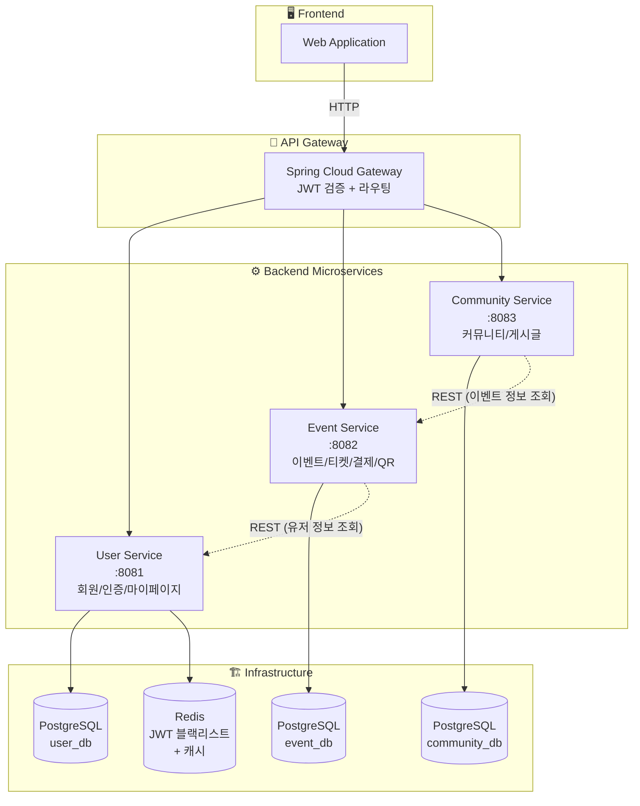
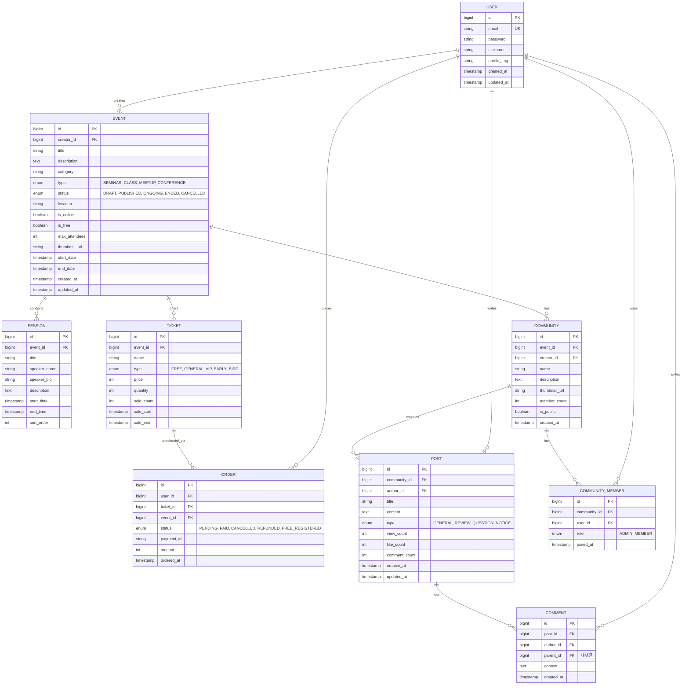
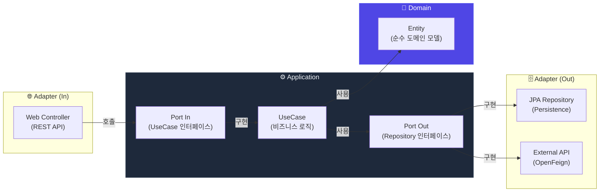
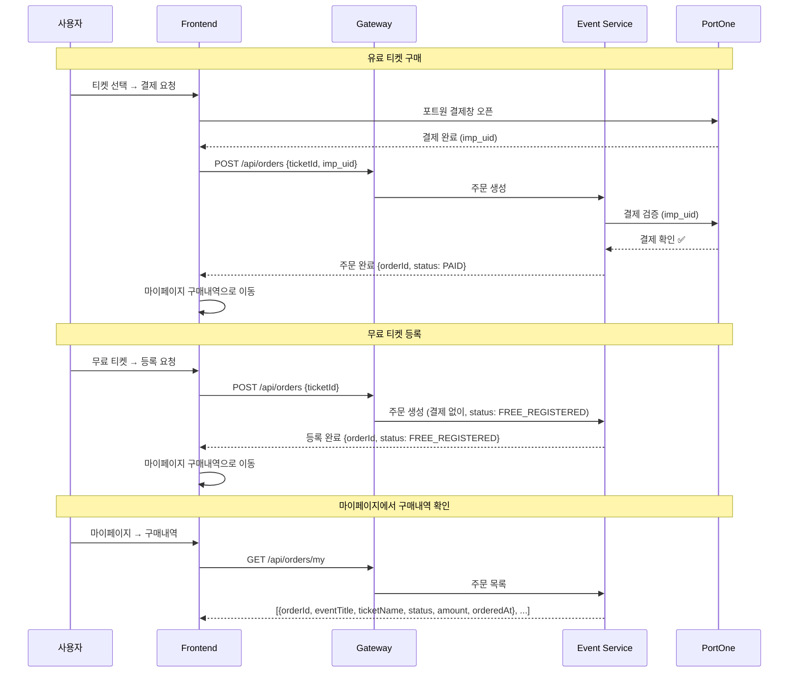
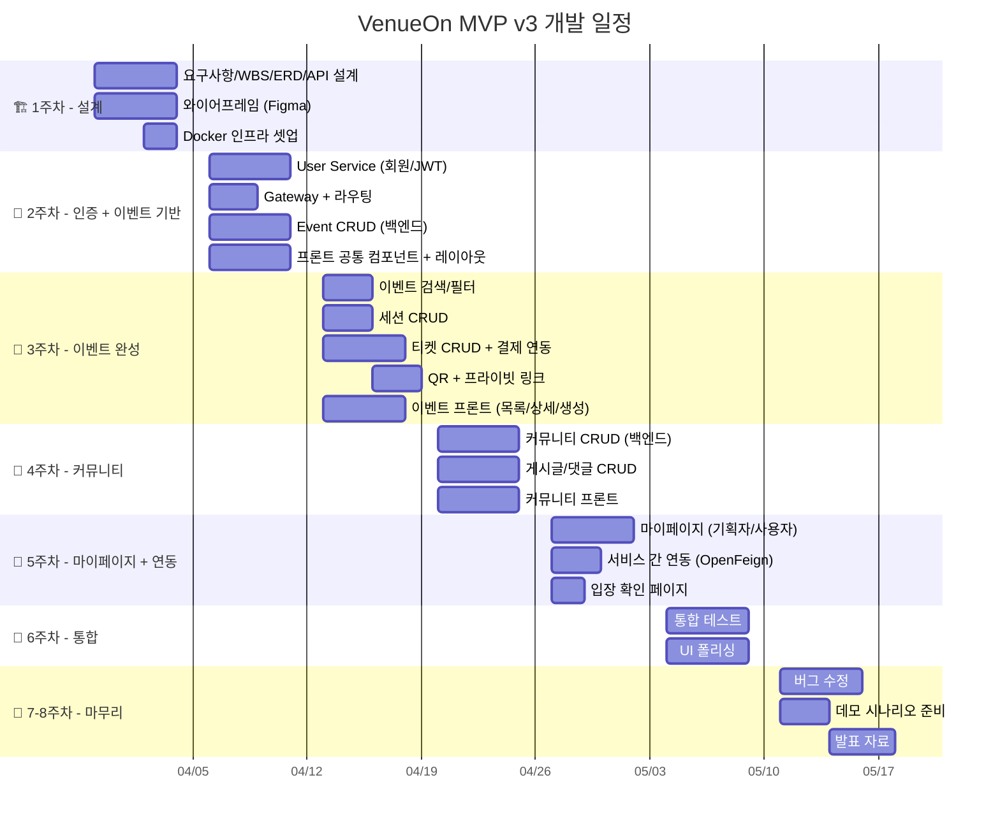

# 🏗️ VenueOn MVP 아키텍처 v3

> **작성일:** 2026-03-25
> **핵심:** 유료·무료 이벤트 중계 + 커뮤니티 연장선
> **기술 스택:** Spring Boot + Next.js + Vanilla CSS Module

---

## 📌 1. MVP 기능 범위

| # | 기능 | 설명 |
|---|------|------|
| 1 | **회원가입/로그인** | JWT 인증 |
| 2 | **이벤트 CRUD** | 이벤트 생성·조회·수정·삭제, 세션/프로그램 관리 |
| 3 | **마이페이지** | 내 이벤트 관리, 구매내역, 참여 이력 |
| 4 | **이벤트 티켓팅 + 결제** | 유료·무료 티켓 구매, 포트원 결제 연동, 구매 후 마이페이지 반영 |
| 5 | **이벤트 커뮤니티 CRUD** | 이벤트 기반 커뮤니티 생성·조회·수정·삭제 |
| 6 | **커뮤니티 글 CRUD** | 커뮤니티 내 게시글 작성·조회·수정·삭제, 후기 |

---

## 📌 2. 사용자 정책

> **권한 분리 없음** — 모든 사용자가 이벤트 생성·참여·구매·커뮤니티 활동 등 모든 기능을 동일하게 사용할 수 있습니다.

| 항목 | 설명 |
|------|------|
| **권한** | 단일 권한 (로그인 사용자 = 모든 기능 접근 가능) |
| **이벤트 관리** | 본인이 만든 이벤트만 수정/삭제 가능 (작성자 검증) |
| **커뮤니티 관리** | 본인이 만든 커뮤니티만 수정/삭제 가능 (작성자 검증) |
| **게시글/댓글** | 본인이 작성한 글만 수정/삭제 가능 (작성자 검증) |
| **향후 확장** | 필요 시 역할(HOST/ADMIN) 분리 가능하도록 구조는 유지 |

---

## 📌 3. MSA 서비스 분리 (3개)



### 서비스별 역할

| 서비스 | 포트 | 담당 | DB |
|--------|------|------|-----|
| **User Service** | 8081 | 회원가입, 로그인, JWT 발급/갱신, 프로필, 마이페이지 | user_db |
| **Event Service** | 8082 | 이벤트 CRUD, 세션 관리, 티켓 CRUD, 주문/결제, 구매내역 관리 | event_db |
| **Community Service** | 8083 | 커뮤니티 CRUD, 게시글 CRUD, 댓글, 후기 | community_db |

**서비스 수: 3개** → PDF 요구사항(최소 3개) 충족 ✅

### 서비스 간 통신

| 호출 방향 | 방식 | 목적 |
|-----------|------|------|
| Event → User | REST (OpenFeign) | 주문 시 유저 정보 확인 |
| Community → Event | REST (OpenFeign) | 커뮤니티 생성 시 이벤트 정보 참조 |
| Community → User | REST (OpenFeign) | 게시글 작성자 정보 조회 |

---

## 📌 4. ERD (11개 Entity)



**Entity 수: 11개** → PDF 요구사항(최소 5개) 충족 ✅  
**관계 포인트:** ORDER에 `qr_code`와 `private_link` 필드가 있어, 결제 완료 시 둘 다 발급됩니다.

---

## 📌 5. 기술 스택

| 카테고리 | 기술 | 비고 |
|----------|------|------|
| **프론트엔드** | Next.js 14+ (App Router) | React 18, SSR/SSG |
| **스타일링** | **Vanilla CSS Module** (.module.css) | Tailwind X — 컴포넌트별 스코프 CSS |
| **백엔드** | Spring Boot 3.x, Java 17 | RESTful API |
| **아키텍처 패턴** | **Hexagonal Architecture** (Ports & Adapters) | 기능별 UseCase 독립 확장 |
| **API Gateway** | Spring Cloud Gateway | JWT 검증, 라우팅, 로드밸런싱 |
| **서비스 간 통신** | OpenFeign | 동기 REST 호출 |
| **DB** | PostgreSQL 15 | 서비스별 독립 DB (3개) |
| **캐시** | Redis 7 | JWT 블랙리스트, 세션 캐시 |
| **인증** | Spring Security + JWT | Access Token + Refresh Token |
| **결제** | 포트원 (PortOne) API | 유료 티켓 결제 |

| **파일 저장** | 로컬 스토리지 (MVP) | 향후 S3/MinIO 전환 |
| **컨테이너** | Docker + Docker Compose | 로컬 개발 환경 |
| **CI/CD** | GitHub Actions | 빌드/테스트 자동화 |
| **API 문서** | Swagger (SpringDoc) | 자동 API 문서 생성 |

---

## 📌 6. 헥사고날 아키텍처 (Ports & Adapters)

### 왜 헥사고날인가?

기능이 계속 추가될 예정이므로, **기능별 UseCase를 독립적으로 추가/수정/삭제**할 수 있는 구조가 필요합니다.

| 레이어드 아키텍처 (기존) | 헥사고날 아키텍처 (적용) |
|----------------------|---------------------|
| Controller → Service → Repository | Adapter(in) → Port → UseCase → Port → Adapter(out) |
| 계층 간 강결합 | **도메인이 외부에 의존하지 않음** |
| 기능 추가 시 전 계층 수정 | **UseCase만 추가하면 끝** |
| 테스트 시 DB 필요 | Port를 Mock하여 **단위 테스트 용이** |

### 의존성 방향도



> **핵심 규칙:** 의존성은 항상 **바깥 → 안쪽**으로만 향합니다. Domain은 어떤 외부 기술(JPA, Spring, HTTP)도 모릅니다.

### 프로젝트 구조

```
team_project/
├── frontend/                              # Next.js 14 (App Router)
│   ├── src/
│   │   ├── app/
│   │   │   ├── layout.tsx
│   │   │   ├── page.tsx                   # 메인 홈
│   │   │   ├── page.module.css
│   │   │   ├── (auth)/
│   │   │   │   ├── login/page.tsx
│   │   │   │   ├── signup/page.tsx         # 역할 선택 (기획자/사용자)
│   │   │   │   └── components/
│   │   │   │       ├── LoginForm.tsx
│   │   │   │       ├── SignupForm.tsx
│   │   │   │       └── useAuth.ts          # 인증 Hook
│   │   │   ├── events/
│   │   │   │   ├── page.tsx               # 이벤트 탐색
│   │   │   │   ├── [id]/page.tsx          # 이벤트 상세 + 티켓 구매
│   │   │   │   ├── new/page.tsx           # 이벤트 생성 (기획자)
│   │   │   │   └── components/
│   │   │   │       ├── EventList.tsx       # 이벤트 목록 섹션
│   │   │   │       ├── EventDetail.tsx     # 이벤트 상세 섹션
│   │   │   │       ├── EventForm.tsx       # 이벤트 생성/수정 폼
│   │   │   │       ├── TicketSection.tsx   # 티켓 선택/구매 섹션
│   │   │   │       ├── useEvents.ts       # 이벤트 CRUD Hook
│   │   │   │       └── useOrder.ts        # 주문/결제 Hook
│   │   │   ├── community/
│   │   │   │   ├── page.tsx               # 커뮤니티 목록
│   │   │   │   ├── [id]/page.tsx          # 커뮤니티 상세
│   │   │   │   ├── [id]/posts/new/page.tsx
│   │   │   │   ├── [id]/posts/[postId]/page.tsx
│   │   │   │   └── components/
│   │   │   │       ├── CommunityList.tsx   # 커뮤니티 목록 섹션
│   │   │   │       ├── PostList.tsx        # 게시글 목록 섹션
│   │   │   │       ├── PostForm.tsx        # 게시글 작성 폼
│   │   │   │       ├── CommentList.tsx     # 댓글 섹션
│   │   │   │       ├── useCommunity.ts    # 커뮤니티 CRUD Hook
│   │   │   │       └── usePosts.ts        # 게시글 CRUD Hook
│   │   │   └── mypage/
│   │   │       ├── page.tsx               # 마이페이지
│   │   │       ├── events/page.tsx        # 내 이벤트 (기획자)
│   │   │       ├── tickets/page.tsx       # 구매내역 (사용자)
│   │   │       ├── communities/page.tsx
│   │   │       └── components/
│   │   │           ├── MyEventList.tsx     # 내 이벤트 섹션
│   │   │           ├── OrderHistory.tsx    # 구매내역 섹션
│   │   │           └── useMyPage.ts       # 마이페이지 Hook
│   │   ├── components/                    # 공통 재사용 UI 컴포넌트만
│   │   │   ├── Button.tsx
│   │   │   ├── Card.tsx
│   │   │   ├── Modal.tsx
│   │   │   ├── Header.tsx
│   │   │   ├── Footer.tsx
│   │   │   └── Pagination.tsx
│   │   ├── lib/                           # api.ts, auth.ts, utils.ts
│   │   └── styles/
│   │       ├── globals.css
│   │       └── variables.css              # CSS Custom Properties
│   └── package.json
│
├── backend/
│   ├── gateway/                           # API Gateway (:8080)
│   │   └── src/main/java/.../gateway/
│   │       ├── GatewayApplication.java
│   │       └── config/
│   │           ├── RouteConfig.java
│   │           └── JwtAuthFilter.java
│   │
│   ├── user-service/                      # ── 헥사고날 구조 (:8081) ──
│   │   └── src/main/java/com/venueon/user/
│   │       │
│   │       ├── domain/                    # 💎 도메인 (순수 비즈니스)
│   │       │   ├── model/
│   │       │   │   └── User.java          # 도메인 엔티티 (JPA 어노테이션 없음)
│   │       │   └── exception/
│   │       │       └── UserDomainException.java
│   │       │
│   │       ├── application/               # ⚙️ 유스케이스 + 포트
│   │       │   ├── port/
│   │       │   │   ├── in/                # --- Inbound Port (UseCase 인터페이스) ---
│   │       │   │   │   ├── SignupUseCase.java
│   │       │   │   │   ├── LoginUseCase.java
│   │       │   │   │   ├── LogoutUseCase.java
│   │       │   │   │   ├── GetProfileUseCase.java
│   │       │   │   │   └── UpdateProfileUseCase.java
│   │       │   │   └── out/               # --- Outbound Port (외부 의존 인터페이스) ---
│   │       │   │       ├── LoadUserPort.java
│   │       │   │       ├── SaveUserPort.java
│   │       │   │       ├── TokenPort.java         # JWT 생성/검증
│   │       │   │       └── TokenBlacklistPort.java # Redis 블랙리스트
│   │       │   │
│   │       │   ├── service/               # --- UseCase 구현체 ---
│   │       │   │   ├── SignupService.java         # implements SignupUseCase
│   │       │   │   ├── LoginService.java          # implements LoginUseCase
│   │       │   │   ├── LogoutService.java         # implements LogoutUseCase
│   │       │   │   ├── GetProfileService.java     # implements GetProfileUseCase
│   │       │   │   └── UpdateProfileService.java   # implements UpdateProfileUseCase
│   │       │   │
│   │       │   └── dto/                   # --- 입출력 DTO ---
│   │       │       ├── SignupCommand.java
│   │       │       ├── LoginCommand.java
│   │       │       └── UserInfo.java
│   │       │
│   │       └── adapter/                   # 🔌 어댑터 (외부 연결)
│   │           ├── in/web/               # --- Inbound Adapter (REST) ---
│   │           │   ├── AuthController.java
│   │           │   ├── UserController.java
│   │           │   └── dto/
│   │           │       ├── SignupRequest.java      # → SignupCommand 변환
│   │           │       ├── LoginRequest.java
│   │           │       └── UserProfileResponse.java
│   │           │
│   │           └── out/                   # --- Outbound Adapter ---
│   │               ├── persistence/       # DB 연결
│   │               │   ├── UserJpaEntity.java     # @Entity (JPA 매핑)
│   │               │   ├── UserJpaRepository.java # JpaRepository
│   │               │   ├── UserPersistenceAdapter.java  # implements LoadUserPort, SaveUserPort
│   │               │   └── UserMapper.java        # JpaEntity ↔ Domain 변환
│   │               └── jwt/               # JWT 연결
│   │                   ├── JwtTokenAdapter.java    # implements TokenPort
│   │                   └── RedisBlacklistAdapter.java # implements TokenBlacklistPort
│   │
│   ├── event-service/                     # ── 헥사고날 구조 (:8082) ──
│   │   └── src/main/java/com/venueon/event/
│   │       │
│   │       ├── domain/
│   │       │   ├── model/
│   │       │   │   ├── Event.java
│   │       │   │   ├── Session.java
│   │       │   │   ├── Ticket.java
│   │       │   │   ├── Order.java
│   │       │   │   ├── EventStatus.java   # enum: DRAFT, PUBLISHED, ONGOING, ENDED
│   │       │   │   ├── TicketType.java    # enum: FREE, GENERAL, VIP, EARLY_BIRD
│   │       │   │   └── OrderStatus.java   # enum: PENDING, PAID, CANCELLED...
│   │       │   └── exception/
│   │       │       └── EventDomainException.java
│   │       │
│   │       ├── application/
│   │       │   ├── port/
│   │       │   │   ├── in/                # --- UseCase 인터페이스 ---
│   │       │   │   │   ├── CreateEventUseCase.java
│   │       │   │   │   ├── GetEventUseCase.java
│   │       │   │   │   ├── UpdateEventUseCase.java
│   │       │   │   │   ├── DeleteEventUseCase.java
│   │       │   │   │   ├── SearchEventUseCase.java
│   │       │   │   │   ├── ManageSessionUseCase.java
│   │       │   │   │   ├── ManageTicketUseCase.java
│   │       │   │   │   ├── CreateOrderUseCase.java
│   │       │   │   │   ├── CancelOrderUseCase.java
│   │       │   │   │   └── GetMyOrdersUseCase.java
│   │       │   │   └── out/               # --- 외부 의존 인터페이스 ---
│   │       │   │       ├── LoadEventPort.java
│   │       │   │       ├── SaveEventPort.java
│   │       │   │       ├── LoadOrderPort.java
│   │       │   │       ├── SaveOrderPort.java
│   │       │   │       ├── LoadTicketPort.java
│   │       │   │       ├── SaveTicketPort.java
│   │       │   │       ├── PaymentPort.java        # 포트원 결제
│   │       │   │       └── UserQueryPort.java       # 유저 정보 조회 (타 서비스)
│   │       │   │
│   │       │   ├── service/               # --- UseCase 구현체 ---
│   │       │   │   ├── CreateEventService.java
│   │       │   │   ├── GetEventService.java
│   │       │   │   ├── UpdateEventService.java
│   │       │   │   ├── DeleteEventService.java
│   │       │   │   ├── SearchEventService.java
│   │       │   │   ├── ManageSessionService.java
│   │       │   │   ├── ManageTicketService.java
│   │       │   │   ├── CreateOrderService.java
│   │       │   │   ├── CancelOrderService.java
│   │       │   │   └── GetMyOrdersService.java
│   │       │   │
│   │       │   └── dto/
│   │       │       ├── CreateEventCommand.java
│   │       │       ├── UpdateEventCommand.java
│   │       │       ├── CreateOrderCommand.java
│   │       │       ├── EventInfo.java
│   │       │       └── OrderInfo.java
│   │       │
│   │       └── adapter/
│   │           ├── in/web/
│   │           │   ├── EventController.java
│   │           │   ├── SessionController.java
│   │           │   ├── TicketController.java
│   │           │   ├── OrderController.java
│   │           │   └── dto/               # Request/Response DTO
│   │           │
│   │           └── out/
│   │               ├── persistence/
│   │               │   ├── entity/        # JPA Entity (@Entity)
│   │               │   │   ├── EventJpaEntity.java
│   │               │   │   ├── SessionJpaEntity.java
│   │               │   │   ├── TicketJpaEntity.java
│   │               │   │   └── OrderJpaEntity.java
│   │               │   ├── repository/    # Spring Data JPA
│   │               │   │   ├── EventJpaRepository.java
│   │               │   │   ├── SessionJpaRepository.java
│   │               │   │   ├── TicketJpaRepository.java
│   │               │   │   └── OrderJpaRepository.java
│   │               │   ├── EventPersistenceAdapter.java
│   │               │   ├── OrderPersistenceAdapter.java
│   │               │   └── mapper/
│   │               │       ├── EventMapper.java
│   │               │       └── OrderMapper.java
│   │               ├── payment/
│   │               │   └── PortOnePaymentAdapter.java  # implements PaymentPort
│   │               └── external/
│   │                   └── UserFeignAdapter.java        # implements UserQueryPort
│   │
│   ├── community-service/                 # ── 헥사고날 구조 (:8083) ──
│   │   └── src/main/java/com/venueon/community/
│   │       │
│   │       ├── domain/
│   │       │   ├── model/
│   │       │   │   ├── Community.java
│   │       │   │   ├── CommunityMember.java
│   │       │   │   ├── Post.java
│   │       │   │   ├── Comment.java
│   │       │   │   └── PostType.java      # enum: GENERAL, REVIEW, QUESTION, NOTICE
│   │       │   └── exception/
│   │       │       └── CommunityDomainException.java
│   │       │
│   │       ├── application/
│   │       │   ├── port/
│   │       │   │   ├── in/
│   │       │   │   │   ├── CreateCommunityUseCase.java
│   │       │   │   │   ├── GetCommunityUseCase.java
│   │       │   │   │   ├── UpdateCommunityUseCase.java
│   │       │   │   │   ├── DeleteCommunityUseCase.java
│   │       │   │   │   ├── JoinCommunityUseCase.java
│   │       │   │   │   ├── LeaveCommunityUseCase.java
│   │       │   │   │   ├── CreatePostUseCase.java
│   │       │   │   │   ├── GetPostUseCase.java
│   │       │   │   │   ├── UpdatePostUseCase.java
│   │       │   │   │   ├── DeletePostUseCase.java
│   │       │   │   │   ├── CreateCommentUseCase.java
│   │       │   │   │   └── DeleteCommentUseCase.java
│   │       │   │   └── out/
│   │       │   │       ├── LoadCommunityPort.java
│   │       │   │       ├── SaveCommunityPort.java
│   │       │   │       ├── LoadPostPort.java
│   │       │   │       ├── SavePostPort.java
│   │       │   │       ├── LoadCommentPort.java
│   │       │   │       ├── SaveCommentPort.java
│   │       │   │       ├── EventQueryPort.java     # 이벤트 정보 조회
│   │       │   │       └── UserQueryPort.java       # 유저 정보 조회
│   │       │   │
│   │       │   ├── service/
│   │       │   │   ├── CreateCommunityService.java
│   │       │   │   ├── GetCommunityService.java
│   │       │   │   ├── UpdateCommunityService.java
│   │       │   │   ├── DeleteCommunityService.java
│   │       │   │   ├── JoinCommunityService.java
│   │       │   │   ├── LeaveCommunityService.java
│   │       │   │   ├── CreatePostService.java
│   │       │   │   ├── GetPostService.java
│   │       │   │   ├── UpdatePostService.java
│   │       │   │   ├── DeletePostService.java
│   │       │   │   ├── CreateCommentService.java
│   │       │   │   └── DeleteCommentService.java
│   │       │   │
│   │       │   └── dto/
│   │       │       ├── CreateCommunityCommand.java
│   │       │       ├── CreatePostCommand.java
│   │       │       ├── CommunityInfo.java
│   │       │       └── PostInfo.java
│   │       │
│   │       └── adapter/
│   │           ├── in/web/
│   │           │   ├── CommunityController.java
│   │           │   ├── PostController.java
│   │           │   ├── CommentController.java
│   │           │   └── dto/
│   │           │
│   │           └── out/
│   │               ├── persistence/
│   │               │   ├── entity/
│   │               │   ├── repository/
│   │               │   ├── CommunityPersistenceAdapter.java
│   │               │   ├── PostPersistenceAdapter.java
│   │               │   └── mapper/
│   │               └── external/
│   │                   ├── EventFeignAdapter.java   # implements EventQueryPort
│   │                   └── UserFeignAdapter.java    # implements UserQueryPort
│   │
│   └── common/                            # 공통 모듈
│       └── src/main/java/.../common/
│           ├── dto/ApiResponse.java
│           ├── exception/
│           │   ├── GlobalExceptionHandler.java
│           │   └── ErrorCode.java
│           └── annotation/
│               └── UseCase.java           # @UseCase 커스텀 어노테이션
│
├── infra/
│   ├── docker-compose.yml
│   └── .env.example
│
└── .github/
    └── workflows/
        └── ci.yml
```

### UseCase 추가 패턴 (기능 확장 시)

새 기능을 추가할 때는 **3단계**만 따르면 됩니다:

```
1️⃣ Port In (인터페이스 정의)  →  application/port/in/XxxUseCase.java
2️⃣ Service (비즈니스 구현)    →  application/service/XxxService.java
3️⃣ 필요 시 Port Out 추가      →  application/port/out/XxxPort.java
                              →  adapter/out/.../XxxAdapter.java
```

**예시: "이벤트 북마크" 기능 추가**

```java
// 1️⃣ Port In — 인터페이스만 정의
public interface BookmarkEventUseCase {
    void bookmark(Long userId, Long eventId);
    void unbookmark(Long userId, Long eventId);
    List<EventInfo> getMyBookmarks(Long userId);
}

// 2️⃣ Service — 비즈니스 로직 구현
@UseCase
@RequiredArgsConstructor
public class BookmarkEventService implements BookmarkEventUseCase {
    private final LoadEventPort loadEventPort;
    private final SaveBookmarkPort saveBookmarkPort;  // 3️⃣ 새 Out Port

    @Override
    public void bookmark(Long userId, Long eventId) {
        Event event = loadEventPort.findById(eventId)
            .orElseThrow(() -> new EventDomainException("이벤트 없음"));
        saveBookmarkPort.save(userId, event.getId());
    }
}

// 3️⃣ Port Out — 필요한 경우만 추가
public interface SaveBookmarkPort {
    void save(Long userId, Long eventId);
}
```

> **기존 코드를 건드리지 않고** UseCase + Port + Adapter만 추가하면 기능이 확장됩니다. (OCP 원칙)

### @UseCase 커스텀 어노테이션

```java
// common 모듈
@Target(ElementType.TYPE)
@Retention(RetentionPolicy.RUNTIME)
@Service  // Spring Bean 등록
public @interface UseCase {
}
```

### Domain Entity vs JPA Entity 분리

```java
// 💎 domain/model/Event.java — 순수 도메인 (Spring/JPA 의존 없음)
public class Event {
    private Long id;
    private String title;
    private EventStatus status;
    private boolean isFree;

    public void publish() {
        if (this.status != EventStatus.DRAFT)
            throw new EventDomainException("DRAFT 상태에서만 공개 가능");
        this.status = EventStatus.PUBLISHED;
    }

    public void end() {
        this.status = EventStatus.ENDED;
    }
}

// 🗄️ adapter/out/persistence/entity/EventJpaEntity.java — JPA
@Entity @Table(name = "events")
public class EventJpaEntity {
    @Id @GeneratedValue
    private Long id;
    private String title;
    @Enumerated(EnumType.STRING)
    private EventStatus status;
    // ... JPA 어노테이션 전용
}

// 🔄 adapter/out/persistence/mapper/EventMapper.java — 변환
public class EventMapper {
    public static Event toDomain(EventJpaEntity jpa) { ... }
    public static EventJpaEntity toJpa(Event domain) { ... }
}
```

---

## 📌 7. API 목록

### User Service (8 APIs)

| Method | Endpoint | 설명 |
|--------|----------|------|
| POST | `/api/auth/signup` | 회원가입 |
| POST | `/api/auth/login` | 로그인 → JWT 발급 |
| POST | `/api/auth/refresh` | Access Token 갱신 |
| POST | `/api/auth/logout` | 로그아웃 (토큰 블랙리스트) |
| GET | `/api/users/me` | 내 프로필 조회 |
| PUT | `/api/users/me` | 내 프로필 수정 |
| GET | `/api/users/{id}` | 타 유저 프로필 조회 |

### Event Service (18 APIs)

| Method | Endpoint | 설명 |
|--------|----------|------|
| **이벤트** | | |
| POST | `/api/events` | 이벤트 생성 |
| GET | `/api/events` | 이벤트 목록 (필터/검색/페이징) |
| GET | `/api/events/{id}` | 이벤트 상세 |
| PUT | `/api/events/{id}` | 이벤트 수정 (작성자만) |
| DELETE | `/api/events/{id}` | 이벤트 삭제 (작성자만) |
| PATCH | `/api/events/{id}/status` | 상태 변경 (작성자만) |
| GET | `/api/events/my` | 내가 만든 이벤트 목록 (마이페이지) |
| **세션** | | |
| POST | `/api/events/{id}/sessions` | 세션 등록 (이벤트 작성자만) |
| GET | `/api/events/{id}/sessions` | 세션 목록 |
| PUT | `/api/sessions/{id}` | 세션 수정 (작성자만) |
| DELETE | `/api/sessions/{id}` | 세션 삭제 (작성자만) |
| **티켓** | | |
| POST | `/api/events/{id}/tickets` | 티켓 생성 (이벤트 작성자만) |
| GET | `/api/events/{id}/tickets` | 티켓 목록 |
| **주문/결제** | | |
| POST | `/api/orders` | 티켓 구매 (유료: 결제 / 무료: 즉시 등록) |
| GET | `/api/orders/my` | 내 구매내역 목록 (마이페이지) |
| GET | `/api/orders/{id}` | 주문 상세 (이벤트 정보 + 결제 정보) |
| POST | `/api/orders/{id}/cancel` | 주문 취소/환불 |
| POST | `/api/payments/confirm` | 포트원 결제 승인 웹훅 |

### Community Service (17 APIs)

| Method | Endpoint | 설명 |
|--------|----------|------|
| **커뮤니티** | | |
| POST | `/api/communities` | 커뮤니티 생성 (이벤트 연동) |
| GET | `/api/communities` | 커뮤니티 목록 |
| GET | `/api/communities/{id}` | 커뮤니티 상세 |
| PUT | `/api/communities/{id}` | 커뮤니티 수정 (작성자만) |
| DELETE | `/api/communities/{id}` | 커뮤니티 삭제 (작성자만) |
| POST | `/api/communities/{id}/join` | 커뮤니티 가입 |
| DELETE | `/api/communities/{id}/leave` | 커뮤니티 탈퇴 |
| GET | `/api/communities/{id}/members` | 멤버 목록 |
| GET | `/api/communities/my` | 내 커뮤니티 목록 (마이페이지) |
| **게시글** | | |
| POST | `/api/communities/{id}/posts` | 게시글 작성 |
| GET | `/api/communities/{id}/posts` | 게시글 목록 (타입별 필터) |
| GET | `/api/posts/{id}` | 게시글 상세 |
| PUT | `/api/posts/{id}` | 게시글 수정 (작성자만) |
| DELETE | `/api/posts/{id}` | 게시글 삭제 (작성자만) |
| **댓글** | | |
| POST | `/api/posts/{id}/comments` | 댓글 작성 (대댓글 지원) |
| GET | `/api/posts/{id}/comments` | 댓글 목록 |
| DELETE | `/api/comments/{id}` | 댓글 삭제 (작성자만) |

**총 API: 42개** → PDF 요구사항(20개 이상) 충족 ✅

---

## 📌 8. 티켓 구매 → 마이페이지 구매내역 흐름



> 구매 완료 시 **마이페이지 구매내역**에 자동으로 표시됩니다. 이벤트명, 티켓 종류, 결제 상태, 금액을 확인할 수 있습니다.

---

## 📌 9. 페이지 구성 (6개)

| # | 페이지 | 경로 | 핵심 기능 |
|---|--------|------|----------|
| 1 | 🏠 **메인 홈** | `/` | 이벤트 목록/검색/필터, 인기 이벤트 |
| 2 | 🔐 **로그인/가입** | `/auth/*` | 회원가입, 로그인 |
| 3 | 📄 **이벤트 상세** | `/events/[id]` | 이벤트 정보, 세션, 티켓 구매 |
| 4 | ✏️ **이벤트 생성/수정** | `/events/new` | 이벤트 작성 폼 (정보→세션→티켓) |
| 5 | 👥 **커뮤니티** | `/community/[id]` | 게시글 목록, 글 작성, 댓글 |
| 6 | 👤 **마이페이지** | `/mypage/*` | 내 이벤트 관리, 구매내역, 참여 이력 |

---

## 📌 10. CSS Module 컨벤션

```css
/* src/styles/variables.css — 디자인 토큰 */
:root {
  /* Colors */
  --color-primary: #6366f1;
  --color-primary-hover: #4f46e5;
  --color-secondary: #f59e0b;
  --color-bg: #0f172a;
  --color-surface: #1e293b;
  --color-surface-hover: #334155;
  --color-text: #f1f5f9;
  --color-text-muted: #94a3b8;
  --color-border: #334155;
  --color-success: #22c55e;
  --color-error: #ef4444;

  /* Typography */
  --font-sans: 'Pretendard', 'Inter', -apple-system, sans-serif;
  --font-size-xs: 0.75rem;
  --font-size-sm: 0.875rem;
  --font-size-base: 1rem;
  --font-size-lg: 1.125rem;
  --font-size-xl: 1.25rem;
  --font-size-2xl: 1.5rem;
  --font-size-3xl: 1.875rem;

  /* Spacing */
  --space-1: 0.25rem;
  --space-2: 0.5rem;
  --space-3: 0.75rem;
  --space-4: 1rem;
  --space-6: 1.5rem;
  --space-8: 2rem;

  /* Border Radius */
  --radius-sm: 0.375rem;
  --radius-md: 0.5rem;
  --radius-lg: 0.75rem;
  --radius-full: 9999px;

  /* Shadow */
  --shadow-sm: 0 1px 2px rgba(0, 0, 0, 0.3);
  --shadow-md: 0 4px 6px rgba(0, 0, 0, 0.3);
  --shadow-lg: 0 10px 15px rgba(0, 0, 0, 0.3);

  /* Transitions */
  --transition: 150ms ease;
}
```

```css
/* 컴포넌트 예시: EventCard.module.css */
.card {
  background: var(--color-surface);
  border: 1px solid var(--color-border);
  border-radius: var(--radius-lg);
  overflow: hidden;
  transition: transform var(--transition), box-shadow var(--transition);
}
.card:hover {
  transform: translateY(-2px);
  box-shadow: var(--shadow-lg);
}
.thumbnail { ... }
.title { ... }
.price { ... }
```

```tsx
// 사용법: EventCard.tsx
import styles from './EventCard.module.css';

export function EventCard({ event }) {
  return (
    <div className={styles.card}>
      
      <h3 className={styles.title}>{event.title}</h3>
      <span className={styles.price}>
        {event.isFree ? '무료' : `₩${event.price.toLocaleString()}`}
      </span>
    </div>
  );
}
```

---

## 📌 11. Docker Compose

```yaml
version: '3.8'

services:
  # ─── Databases (서비스별 독립) ────────
  user-db:
    image: postgres:15
    environment:
      POSTGRES_DB: user_db
      POSTGRES_USER: ${DB_USER}
      POSTGRES_PASSWORD: ${DB_PASSWORD}
    ports:
      - "5433:5432"
    volumes:
      - user-db-data:/var/lib/postgresql/data

  event-db:
    image: postgres:15
    environment:
      POSTGRES_DB: event_db
      POSTGRES_USER: ${DB_USER}
      POSTGRES_PASSWORD: ${DB_PASSWORD}
    ports:
      - "5434:5432"
    volumes:
      - event-db-data:/var/lib/postgresql/data

  community-db:
    image: postgres:15
    environment:
      POSTGRES_DB: community_db
      POSTGRES_USER: ${DB_USER}
      POSTGRES_PASSWORD: ${DB_PASSWORD}
    ports:
      - "5435:5432"
    volumes:
      - community-db-data:/var/lib/postgresql/data

  # ─── Cache ───────────────────────────
  redis:
    image: redis:7-alpine
    ports:
      - "6379:6379"

  # ─── Backend Services ────────────────
  gateway:
    build: ../backend/gateway
    ports:
      - "8080:8080"
    depends_on:
      - user-service
      - event-service
      - community-service

  user-service:
    build: ../backend/user-service
    ports:
      - "8081:8081"
    depends_on:
      - user-db
      - redis
    environment:
      SPRING_DATASOURCE_URL: jdbc:postgresql://user-db:5432/user_db
      SPRING_DATASOURCE_USERNAME: ${DB_USER}
      SPRING_DATASOURCE_PASSWORD: ${DB_PASSWORD}
      SPRING_REDIS_HOST: redis
      JWT_SECRET: ${JWT_SECRET}

  event-service:
    build: ../backend/event-service
    ports:
      - "8082:8082"
    depends_on:
      - event-db
    environment:
      SPRING_DATASOURCE_URL: jdbc:postgresql://event-db:5432/event_db
      SPRING_DATASOURCE_USERNAME: ${DB_USER}
      SPRING_DATASOURCE_PASSWORD: ${DB_PASSWORD}
      PORTONE_API_KEY: ${PORTONE_API_KEY}
      PORTONE_API_SECRET: ${PORTONE_API_SECRET}
      USER_SERVICE_URL: http://user-service:8081

  community-service:
    build: ../backend/community-service
    ports:
      - "8083:8083"
    depends_on:
      - community-db
    environment:
      SPRING_DATASOURCE_URL: jdbc:postgresql://community-db:5432/community_db
      SPRING_DATASOURCE_USERNAME: ${DB_USER}
      SPRING_DATASOURCE_PASSWORD: ${DB_PASSWORD}
      EVENT_SERVICE_URL: http://event-service:8082
      USER_SERVICE_URL: http://user-service:8081

volumes:
  user-db-data:
  event-db-data:
  community-db-data:
```

---

## 📌 12. 개발 일정 (8주)



---

## 📌 13. 팀원 역할 (5인)

| 역할 | 인원 | 담당 |
|------|------|------|
| **프론트 A** | 1명 | 메인 홈, 이벤트(목록/상세/생성), 검색/필터 |
| **프론트 B** | 1명 | 커뮤니티(목록/상세/글 작성), 마이페이지, 입장 확인 |
| **백엔드 - User + Gateway** | 1명 | 회원가입/JWT, Gateway, Redis |
| **백엔드 - Event** | 1명 | 이벤트/세션/티켓 CRUD, 결제, QR/링크 |
| **백엔드 - Community** | 1명 | 커뮤니티/게시글/댓글 CRUD, OpenFeign 연동 |

---

## 📌 요약

```
┌────────────────────────────────────────────────────────┐
│                    VenueOn MVP v3                    │
├──────────────┬─────────────────┬───────────────────────┤
│  User Service │  Event Service  │  Community Service    │
│  회원/인증    │  이벤트 CRUD     │  커뮤니티 CRUD         │
│  마이페이지   │  세션 관리       │  게시글 CRUD           │
│  JWT/Redis   │  티켓/결제       │  댓글                 │
│              │  QR/프라이빗링크  │  후기                 │
├──────────────┴─────────────────┴───────────────────────┤
│  Frontend: Next.js 14 + Vanilla CSS Module             │
│  Infra: Docker Compose + PostgreSQL×3 + Redis          │
│  통신: Spring Cloud Gateway + OpenFeign                 │
└────────────────────────────────────────────────────────┘

기능: 이벤트 CRUD → 티켓팅/결제 → QR/링크 발급 → 커뮤니티 → 소통
역할: 기획자(HOST) = 이벤트 만드는 사람 / 사용자(USER) = 참여하는 사람
```
