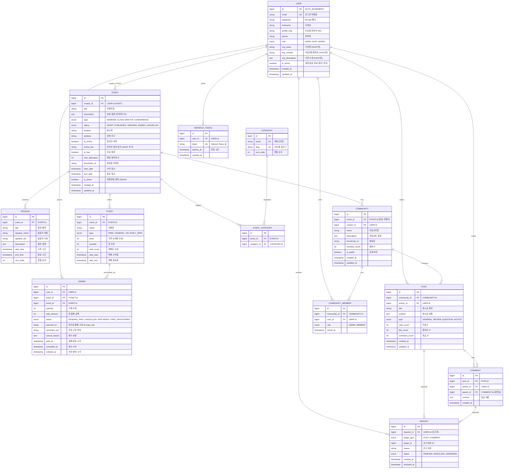

# 🗄️ VenueOn ERD (Entity Relationship Diagram)

> **작성일:** 2026-03-27  
> **기반 문서:** erd-list.md, MVP_아키텍처_v3.md  
> **총 Entity 수:** 14개  
> **서비스:** User Service / Event Service / Community Service

---

## 📌 1. ERD 다이어그램

---

## 📌 2. 서비스별 Entity 매핑

| 서비스 | DB | Entity | 비고 |
|--------|-----|--------|------|
| **User Service** (:8081) | `user_db` | `USER`, `REFRESH_TOKEN` | 인증/인가/프로필/토큰 관리 |
| **Event Service** (:8082) | `event_db` | `EVENT`, `CATEGORY`, `EVENT_CATEGORY`, `SESSION`, `TICKET`, `ORDER` | 이벤트 CRUD, 티켓, 결제, 주문 |
| **Community Service** (:8083) | `community_db` | `COMMUNITY`, `COMMUNITY_MEMBER`, `POST`, `COMMENT`, `REPORT` | 커뮤니티, 게시글, 댓글, 신고 |

---

## 📌 3. erd-list.md 기능 ↔ Entity 매핑

### 1) Auth / User
| 기능 | 관련 Entity | 설명 |
|------|------------|------|
| 회원가입 | `USER` | email, password, role(USER/HOST) 저장 |
| 로그인 | `USER`, `REFRESH_TOKEN` | 비밀번호 검증 → JWT Access/Refresh Token 발급 |
| 로그아웃 | `REFRESH_TOKEN` | Refresh Token 삭제 + Access Token Redis 블랙리스트 |
| 유저 정보 조회 | `USER` | 프로필 정보 반환 |
| 로그인 상태 유지 | `REFRESH_TOKEN` | `/api/auth/refresh` → 새 Access Token 발급 |

### 2) 랜딩 / 탐색
| 기능 | 관련 Entity | 설명 |
|------|------------|------|
| 강의 검색 (키워드) | `EVENT` | title, description 대상 검색 |
| 강의 필터 | `EVENT`, `CATEGORY`, `EVENT_CATEGORY` | 카테고리/가격(is_free)/날짜 필터링 |
| 강의 리스트 조회 | `EVENT`, `TICKET` | 이벤트 목록 + 최저 티켓 가격 표시 |
| 추천 강의 조회 | `EVENT` | view_count, 최신순 등 정렬 |

### 3) 강의 (Seminar/Event)
| 기능 | 관련 Entity | 설명 |
|------|------------|------|
| 강의 생성 | `EVENT`, `SESSION`, `TICKET` | Step-by-Step 폼으로 생성 |
| 강의 수정/삭제 | `EVENT` | creator_id 검증 후 수정/삭제 |
| 강의 상세 조회 | `EVENT`, `SESSION`, `TICKET` | 이벤트 + 세션 목록 + 티켓 목록 |
| 강의 상태 관리 | `EVENT` | status: DRAFT → PUBLISHED → ONGOING → ENDED |

### 4) 결제 / 등록 (Order)
| 기능 | 관련 Entity | 설명 |
|------|------------|------|
| 티켓/수량 선택 | `TICKET` | 잔여 수량(quantity - sold_count) 확인 |
| 무료 강의 등록 | `ORDER` | status = FREE_REGISTERED, amount = 0 |
| 유료 결제 요청 | `ORDER` | 포트원 결제 → payment_id(imp_uid) 저장 |
| 결제 성공/실패 | `ORDER`, `TICKET` | 성공: status=PAID, sold_count++ / 실패: status=CANCELLED |
| 환불/취소 | `ORDER` | status=REFUNDED, cancel_reason 기록 |

### 5) 마이페이지
| 기능 | 관련 Entity | 설명 |
|------|------------|------|
| 내 강의 목록 조회 | `ORDER` → `EVENT` | user_id로 주문 조회 → 이벤트 정보 JOIN |
| 강의 상태별 분류 | `EVENT` | status 기준 필터 (예정/진행중/완료) |
| 결제 내역 조회 | `ORDER` | 주문 목록 + 결제 상태 + 금액 |

### 6) 커뮤니티
| 기능 | 관련 Entity | 설명 |
|------|------------|------|
| 게시글 CRUD | `POST` | community_id, author_id 기반 |
| 댓글 CRUD | `COMMENT` | parent_id로 대댓글 지원 |
| 접근 권한 체크 | `COMMUNITY_MEMBER` | 해당 커뮤니티 멤버인지 확인 |

### 7) 강사 / 기관 (Organizer)
| 기능 | 관련 Entity | 설명 |
|------|------------|------|
| 강의 생성/게시/관리 | `EVENT` | role=HOST인 USER만 가능 |
| 참가자 리스트 조회 | `ORDER` → `USER` | event_id로 주문 조회 → 유저 정보 |
| 참가자 결제 상태 확인 | `ORDER` | status 확인 (PAID/FREE_REGISTERED) |
| 온라인 링크 추가 | `EVENT` | online_link 필드 업데이트 |

### 8) 관리자 (Admin)
| 기능 | 관련 Entity | 설명 |
|------|------------|------|
| 전체 강의 조회/삭제/비활성화 | `EVENT` | is_active = false 처리 |
| 전체 유저 조회/계정 정지 | `USER` | is_active = false 처리 |
| 신고 콘텐츠 조회/삭제 | `REPORT`, `POST`, `COMMENT` | 신고 내역 관리 |

---

## 📌 4. Enum 값 정리

| Enum | 값 | 사용 Entity |
|------|----|------------|
| **UserRole** | `USER`, `HOST`, `ADMIN` | USER.role |
| **EventType** | `SEMINAR`, `CLASS`, `MEETUP`, `CONFERENCE` | EVENT.type |
| **EventStatus** | `DRAFT`, `PUBLISHED`, `ONGOING`, `ENDED`, `CANCELLED` | EVENT.status |
| **TicketType** | `FREE`, `GENERAL`, `VIP`, `EARLY_BIRD` | TICKET.type |
| **OrderStatus** | `PENDING`, `PAID`, `CANCELLED`, `REFUNDED`, `FREE_REGISTERED` | ORDER.status |
| **CommunityMemberRole** | `ADMIN`, `MEMBER` | COMMUNITY_MEMBER.role |
| **PostType** | `GENERAL`, `REVIEW`, `QUESTION`, `NOTICE` | POST.type |
| **ReportTargetType** | `POST`, `COMMENT` | REPORT.target_type |
| **ReportStatus** | `PENDING`, `RESOLVED`, `DISMISSED` | REPORT.status |

---

## 📌 5. 인덱스 권장사항

| Entity | 인덱스 컬럼 | 용도 |
|--------|------------|------|
| `USER` | `email` (UNIQUE) | 로그인 조회 |
| `EVENT` | `creator_id`, `status`, `start_date` | 목록 필터/정렬 |
| `EVENT` | `title` (GIN/FULLTEXT) | 키워드 검색 |
| `ORDER` | `user_id`, `event_id`, `status` | 마이페이지 조회 |
| `TICKET` | `event_id` | 이벤트별 티켓 조회 |
| `SESSION` | `event_id`, `sort_order` | 이벤트별 세션 정렬 |
| `POST` | `community_id`, `type`, `created_at` | 게시글 필터/정렬 |
| `COMMENT` | `post_id`, `parent_id` | 댓글/대댓글 조회 |
| `COMMUNITY_MEMBER` | `community_id`, `user_id` (UNIQUE) | 중복 가입 방지 |
| `REPORT` | `status`, `target_type` | 관리자 신고 목록 조회 |
| `REFRESH_TOKEN` | `user_id`, `token` (UNIQUE) | 토큰 조회/삭제 |
