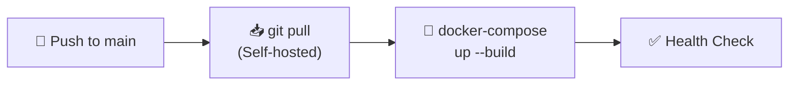
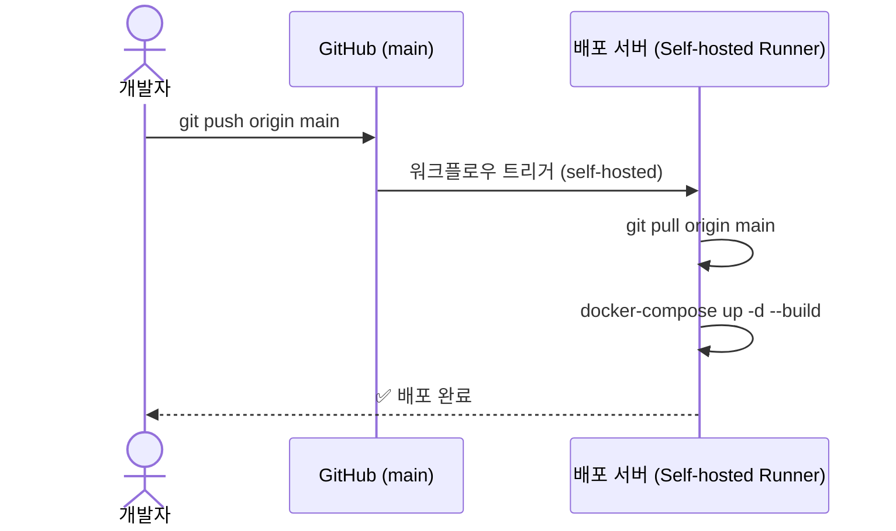

# 🚀 VenueOn 배포 환경 설정 기획서

> **작성일:** 2026-03-27  
> **대상 프로젝트:** VenueOn (이벤트 중계 플랫폼)  
> **아키텍처:** 모놀리식 (BFF 패턴) — Spring Boot + Next.js

---

## 📌 1. 개요

본 기획서는 VenueOn 프로젝트의 **배포 자동화 환경**을 구축하기 위한 상세 계획입니다.  
기존 `LOCAL-DEVELOPMENT-GUID.md`의 Docker 기반 로컬 개발 환경을 참고하여, **운영(prod) 환경**과 **개발(dev) 환경**을 분리하고, GitHub Actions를 통해 CI/CD 파이프라인을 구축합니다.

### 핵심 목표
| # | 목표 | 설명 |
|---|------|------|
| 1 | **GitHub Actions 배포 자동화** | `deploy.yml` 워크플로우로 push → 빌드 → 배포 자동화 |
| 2 | **환경별 설정 파일 분리** | `application.properties` dev/prod 분리 + 환경변수 주입 |
| 3 | **보안 강화** | JWT + BFF (httpOnly 쿠키) · 민감 정보 `.gitignore` 관리 |
| 4 | **기존 로컬 개발 환경 유지** | Docker Compose 기반 로컬 환경은 그대로 유지 |

---

## 📌 2. 기술 스택 (WBS 기준)

| 카테고리 | 기술 |
|----------|------|
| **프론트엔드** | Next.js (최신) / React / TypeScript / App Router |
| **스타일링** | Vanilla CSS Module (.module.css) |
| **상태 관리** | Zustand |
| **백엔드** | Java 21 / Spring Boot / Gradle |
| **DB** | PostgreSQL (Docker 컨테이너) |
| **인증** | JWT + BFF (Next.js server-side, httpOnly 쿠키) |
| **배포** | GitHub Actions (yml CI/CD, 환경변수 직접 주입) |
| **포트** | 내부 3000 / 8080 고정, 호스트 포트포워딩(30xx:3000) |

> [!NOTE]
> **모놀리식(Monolithic)**: 모든 기능(사용자, 이벤트, 커뮤니티 등)이 **하나의 백엔드 서버**에 들어있는 구조입니다. MSA(마이크로서비스)와 달리 서버 1대, 배포 1번으로 간단하며 MVP 단계에 적합합니다. **BFF 패턴**은 Next.js가 프론트엔드와 백엔드 사이에서 중간 역할(인증 처리, API 프록시)을 하는 구조를 말합니다.

---

## 📌 3. 디렉토리 구조 (배포 관련 파일)

```
~/ (Home Directory)
├── dist/
│   └── upload/                                     # ⭐ 업로드 이미지 (프로젝트 외부)
│
└── team3-jangane-venueon/                           # 프로젝트 폴더
    ├── .github/
    │   └── workflows/
    │       └── deploy.yml                           # ⭐ GitHub Actions CI/CD
    │
    ├── frontend/
    │   ├── Dockerfile                               # 단일 Dockerfile (배포용)
    │   └── next.config.ts                           # API 프록시 rewrite
    │
    ├── backend/
    │   ├── src/main/
    │   │   ├── java/.../config/
    │   │   │   └── DataInitializer.java             # 초기 데이터 삽입
    │   │   └── resources/
    │   │       ├── application.properties            # 공통 설정
    │   │       ├── application-dev.properties        # 개발 전용
    │   │       └── application-prod.properties       # 배포 전용 (.gitignore 권장)
    │   ├── Dockerfile                               # 단일 Dockerfile (배포용)
    │   └── build.gradle
    │
    ├── docker-compose.yml                           # 배포용
    └── docker-compose.local.yml                     # 로컬 개발용
```

---

## 📌 4. 환경별 설정 파일 분리 전략

### 4-1. 백엔드 (Spring Boot) — `application.properties` 분리

Spring Boot의 프로파일 기능을 사용하여 `application-{profile}.properties`로 환경을 분리합니다.  
DB는 dev·prod 모두 **PostgreSQL** (Docker 컨테이너)을 사용하고, `ddl-auto=create-drop` + **DataInitializer**로 매 실행 시 초기 데이터를 삽입합니다.

#### `application.properties` (공통)
```properties
# 공통 설정
spring.application.name=venueon-backend
spring.profiles.active=dev

server.port=8080

# JPA 공통
spring.jpa.database-platform=org.hibernate.dialect.PostgreSQLDialect

# JWT 공통
jwt.expiration=3600000

# 정적 리소스 URL 패턴
spring.mvc.static-path-pattern=/**
```

#### `application-dev.properties` (개발 환경)
```properties
# ===== PostgreSQL (로컬 Docker 컨테이너) =====
spring.datasource.url=jdbc:postgresql://localhost:5432/venueon_dev
spring.datasource.driver-class-name=org.postgresql.Driver
spring.datasource.username=venueon
spring.datasource.password=venueon1234

# JPA
spring.jpa.hibernate.ddl-auto=create-drop
spring.jpa.show-sql=true
spring.jpa.properties.hibernate.format_sql=true

# JWT
jwt.secret=dev-secret-key-for-local-development-only

# 이미지 업로드 경로
file.upload-dir=~/dist/upload

# 업로드 파일 정적 리소스 서빙
spring.web.resources.static-locations=file:~/dist/upload/, classpath:/static/

# 로깅
logging.level.root=DEBUG
```

#### `application-prod.properties` (배포 환경)
```properties
# ===== PostgreSQL (배포 Docker 컨테이너) =====
spring.datasource.url=jdbc:postgresql://db:5432/venueon_prod
spring.datasource.driver-class-name=org.postgresql.Driver
spring.datasource.username=${DB_USERNAME}
spring.datasource.password=${DB_PASSWORD}

# JPA — 매 실행 시 테이블 재생성 + DataInitializer로 초기 데이터 삽입
spring.jpa.hibernate.ddl-auto=create-drop
spring.jpa.show-sql=false

# JWT — GitHub Secrets에서 주입
jwt.secret=${JWT_SECRET}

# 이미지 업로드 경로
file.upload-dir=/home/upload

# 업로드 파일 정적 리소스 서빙
spring.web.resources.static-locations=file:/home/upload/, classpath:/static/
```

> [!WARNING]
> **민감 정보 관리:** `application-dev.properties` 및 `application-prod.properties` 파일에 실제 비밀번호를 노출하지 않도록 `${변수명}` 형식을 사용하고, 해당 파일들은 반드시 **`.gitignore`**에 추가할 것을 강력히 권장합니다. 실제 값은 Docker Compose의 `environment` 섹션 또는 GitHub Actions Secrets에서 주입합니다.


### 4-2. DataInitializer (초기 데이터)

`ddl-auto=create-drop` 설정으로 서버 재시작 시 테이블이 재생성되므로, `DataInitializer`가 매 실행 시 필요한 초기 데이터를 삽입합니다.

```java
@Component
@RequiredArgsConstructor
public class DataInitializer implements CommandLineRunner {

    private final UserRepository userRepository;
    // 필요한 Repository 주입

    @Override
    public void run(String... args) {
        // 관리자 계정 생성
        if (userRepository.count() == 0) {
            userRepository.save(User.builder()
                .email("admin@venueon.com")
                .password(passwordEncoder.encode("admin1234"))
                .nickname("관리자")
                .role(Role.ADMIN)
                .build());
        }
        // 필요한 초기 데이터 추가...
    }
}
```

> [!NOTE]
> dev·prod 환경 모두 `ddl-auto=create-drop` + DataInitializer 조합으로, 매 실행 시 일관된 초기 상태를 보장합니다.

### 4-2. JWT + BFF (Next.js) 보안 전략

프론트엔드에서 토큰을 `localStorage`에 저장하는 대신, **BFF(Next.js Server Side)**에서 토큰을 관리하여 보안을 강화합니다.

#### **보안 강화형 BFF (True BFF) 전략**
1.  **JWT 은닉화**: 백엔드에서 발급한 원본 JWT를 브라우저에 그대로 보내지 않습니다.
2.  **암호화된 세션 쿠키**: BFF(Next.js)가 원본 JWT를 **`SESSION_SECRET`으로 암호화**하여 쿠키에 담습니다. (`iron-session` 사용)
3.  **JS 접근 원천 차단**: 쿠키에 `httpOnly`, `Secure` 설정을 적용하여 JS 코드에서 토큰 존재 자체를 알 수 없게 합니다.
4.  **인증 흐름**: 브라우저 요청 → Next.js Middleware가 쿠키 복호화 → 원본 JWT 추출 → 백엔드 API Header에 전달.

#### **구현 계획**

```bash
# iron-session 설치 (frontend/)
npm install iron-session
```

```typescript
// frontend/middleware.ts
import { getIronSession } from 'iron-session';

export async function middleware(req: NextRequest) {
  const session = await getIronSession(req, res, {
    password: process.env.SESSION_SECRET!,  // ⭐ GitHub Secrets에서 주입
    cookieName: 'venueon_session',
    cookieOptions: {
      httpOnly: true,
      secure: process.env.NODE_ENV === 'production',
      sameSite: 'lax',
    },
  });
  // session.jwt에서 원본 JWT 추출 → 백엔드 전달
}
```

> [!IMPORTANT]
> `SESSION_SECRET`은 **32자 이상의 무작위 문자열**이어야 하며, GitHub Secrets에 등록하여 관리합니다.

### 4-3. 프론트엔드 환경변수 주입 (No `.env` Files)

Next.js 빌드 시 필요한 환경변수는 별도의 `.env` 파일 대신 **Docker 빌드 인자(Build Args)** 또는 **실행 시 환경변수**를 통해 주입합니다.

*   **빌드 시점**: `NEXT_PUBLIC_` 변수가 필요한 경우 Docker `ARG`를 통해 주입합니다.
*   **실행 시점**: 서버 코드는 Docker `ENV`를 통해 직접 주입된 변수를 사용합니다.

> [!TIP]
> `.env.development`, `.env.production` 파일 관리를 제거하고, `docker-compose.yml` 또는 CI/CD 단계에서 통합 관리함으로써 설정 누락 및 누출 사고를 방지합니다.


---

## 📌 5. GitHub Actions CI/CD 파이프라인 (Self-hosted Runner)

> **Self-hosted Runner:** 배포 서버에서 직접 워크플로우를 실행하므로, SSH 접속이나 Docker Hub가 불필요합니다. 서버에서 바로 `git pull` → `docker-compose up --build`를 실행합니다.

### 5-1. 워크플로우 흐름도



### 5-2. GitHub Settings 등록 목록

GitHub에서는 **Variables** (공개, 설정값)과 **Secrets** (비공개, 민감정보)를 분리하여 관리합니다.

#### Secrets (비공개 — 서버 암호화 저장)
| Secret 이름 | 용도 | 예시 |
|-------------|------|------|
| `SPRING_DATASOURCE_PASSWORD` | PostgreSQL 비밀번호 | `prod-db-password` |
| `POSTGRES_PASSWORD` | PostgreSQL 컨테이너 비밀번호 | `prod-db-password` |
| `JWT_SECRET` | JWT 서명 키 | `prod-jwt-secret-key-xxx` |
| `SESSION_SECRET` | True BFF 쿠키 암호화 키 (32자+) | `my-session-secret-32chars-xxxxx` |

#### Variables (공개 — 설정값)
| Variable 이름 | 용도 | 예시 |
|-------------|------|------|
| `COMPOSE_PROJECT_NAME` | Docker Compose 프로젝트명 | `venueon` |
| `SPRING_DATASOURCE_URL` | DB 접속 URL | `jdbc:postgresql://db:5432/venueon_prod` |
| `SPRING_DATASOURCE_USERNAME` | DB 계정 | `venueon` |
| `POSTGRES_DB` | PostgreSQL DB명 | `venueon_prod` |
| `BACKEND_PORT` | 백엔드 포트 | `8080` |
| `FRONTEND_PORT` | 프론트엔드 포트 | `30xx` |
| `DB_PORT` | DB 포트 | `5432` |

> [!TIP]
> **Variables**은 로그에 그대로 노출되어도 문제없는 설정값, **Secrets**는 노출되면 안되는 민감 정보입니다.

### 5-3. `deploy.yml` 설계

```yaml
# .github/workflows/deploy.yml
name: VenueOn Deploy

on:
  push:
    branches: [ main ]       # main 브랜치 push 시 자동 배포

jobs:
  deploy:
    runs-on: self-hosted       # ⭐ 배포 서버에서 직접 실행

    # ⭐ 환경변수 정의 — docker-compose가 자동으로 읽음
    env:
      COMPOSE_PROJECT_NAME: ${{ vars.COMPOSE_PROJECT_NAME }}
      SPRING_DATASOURCE_URL: ${{ vars.SPRING_DATASOURCE_URL }}
      SPRING_DATASOURCE_USERNAME: ${{ vars.SPRING_DATASOURCE_USERNAME }}
      SPRING_DATASOURCE_PASSWORD: ${{ secrets.SPRING_DATASOURCE_PASSWORD }}
      JWT_SECRET: ${{ secrets.JWT_SECRET }}
      SESSION_SECRET: ${{ secrets.SESSION_SECRET }}
      POSTGRES_DB: ${{ vars.POSTGRES_DB }}
      POSTGRES_PASSWORD: ${{ secrets.POSTGRES_PASSWORD }}
      BACKEND_PORT: ${{ vars.BACKEND_PORT }}
      FRONTEND_PORT: ${{ vars.FRONTEND_PORT }}
      DB_PORT: ${{ vars.DB_PORT }}

    steps:
      # 1. 최신 소스 반영
      - name: Pull latest code
        run: |
          cd ~/team3-jangane-venueon
          git pull origin main

      # 2. Docker Compose로 빌드 & 배포
      - name: Build and Deploy
        run: |
          cd ~/team3-jangane-venueon
          docker-compose up -d --build

      # 3. 불필요한 이미지 정리
      - name: Cleanup
        run: docker image prune -f
```

> [!NOTE]
> `env:` 블록에 정의된 환경변수는 모든 step에서 자동으로 사용 가능하며, `docker-compose`가 `${변수명}` 형식으로 자동 읽습니다.

---

## 📌 6. Docker 설정 (배포용)

### 6-1. `backend/Dockerfile`

> `eclipse-temurin`은 **Eclipse 재단이 관리하는 무료 OpenJDK 배포판**입니다. IDE(Eclipse)와는 관계없으며, Docker에서 Java 애플리케이션 실행 시 가장 많이 사용되는 공식 JDK 이미지입니다. Gradle은 이 JDK 위에서 동작합니다.

```dockerfile
# === Stage 1: Build (JDK 필요 — 컨파일용) ===
FROM eclipse-temurin:21-jdk AS builder
WORKDIR /app

# 의존성 캐싱 (변경 빈도 낮음 → 레이어 캐시 활용)
COPY build.gradle settings.gradle gradlew ./
COPY gradle ./gradle
RUN ./gradlew dependencies --no-daemon

# 소스 빌드
COPY src ./src
RUN ./gradlew clean build -x test --no-daemon

# === Stage 2: Run (JRE만 — 실행용, 경량) ===
FROM eclipse-temurin:21-jre
WORKDIR /app
COPY --from=builder /app/build/libs/*.jar app.jar

ENV SPRING_PROFILES_ACTIVE=prod
EXPOSE 8080
ENTRYPOINT ["java", "-jar", "app.jar"]
```

### 6-2. `frontend/Dockerfile`

> 3-stage 빌드: 의존성 캐싱 + standalone 모드 + 비root 사용자로 이미지 최소화 및 보안 강화.

```dockerfile
# === Stage 1: Dependencies ===
FROM node:20-alpine AS deps
WORKDIR /app
COPY package.json package-lock.json ./
RUN npm ci

# === Stage 2: Build ===
FROM node:20-alpine AS builder
WORKDIR /app
COPY --from=deps /app/node_modules ./node_modules
COPY . .
RUN npm run build

# === Stage 3: Run ===
FROM node:20-alpine AS runner
WORKDIR /app

ENV NODE_ENV=production

# 비root 사용자 생성 (보안)
RUN addgroup --system --gid 1001 nodejs && \
    adduser --system --uid 1001 nextjs

# standalone output 복사
COPY --from=builder /app/public ./public
COPY --from=builder --chown=nextjs:nodejs /app/.next/standalone ./
COPY --from=builder --chown=nextjs:nodejs /app/.next/static ./.next/static

USER nextjs

EXPOSE 3000

ENV PORT=3000
ENV HOSTNAME="0.0.0.0"

CMD ["node", "server.js"]
```

> [!NOTE]
> **standalone 모드** 사용을 위해 `next.config.ts`에 `output: 'standalone'` 설정이 필요합니다. 이 모드는 `node_modules` 전체를 복사하지 않아 이미지 크기가 **약 1/10**로 줄어듭니다.

### 6-3. `docker-compose.yml` (배포용 — 로컬 빌드)

> Docker Hub 없이 **서버에서 직접 빌드**하고, 환경변수는 `deploy.yml`의 `env:` 블록에서 자동 주입됩니다.

```yaml
version: '3.8'

services:
  db:
    image: postgres:15-alpine
    container_name: venueon-db
    ports:
      - "${DB_PORT}:5432"
    environment:
      - POSTGRES_DB=${POSTGRES_DB}
      - POSTGRES_USER=${SPRING_DATASOURCE_USERNAME}
      - POSTGRES_PASSWORD=${POSTGRES_PASSWORD}
    volumes:
      - db-data:/var/lib/postgresql/data
    restart: unless-stopped

  backend:
    image: venueon-backend:latest
    build:
      context: ./backend
      dockerfile: Dockerfile
    container_name: venueon-backend
    ports:
      - "${BACKEND_PORT}:8080"
    environment:
      - SPRING_PROFILES_ACTIVE=prod
      - SPRING_DATASOURCE_URL=${SPRING_DATASOURCE_URL}
      - SPRING_DATASOURCE_USERNAME=${SPRING_DATASOURCE_USERNAME}
      - SPRING_DATASOURCE_PASSWORD=${SPRING_DATASOURCE_PASSWORD}
      - JWT_SECRET=${JWT_SECRET}
    volumes:
      - ~/dist/upload:/home/upload
    depends_on:
      - db
    restart: unless-stopped

  frontend:
    image: venueon-frontend:latest
    build:
      context: ./frontend
      dockerfile: Dockerfile
    container_name: venueon-frontend
    ports:
      - "${FRONTEND_PORT}:3000"
    environment:
      - SESSION_SECRET=${SESSION_SECRET}
    depends_on:
      - backend
    restart: unless-stopped

volumes:
  db-data:
    name: venueon-db-data
```

---

## 📌 7. 프록시 & CORS 설정

### 7-1. Next.js API 프록시 (next.config.ts)

WBS 기준: 프론트→백 호출 시 경로에 `/api` **미포함** (프록시 rewrite)

```typescript
// next.config.ts
const nextConfig = {
  async rewrites() {
    return [
      {
        source: '/:path*',                          
        destination: `${process.env.NEXT_PUBLIC_API_URL}/:path*`,
        // 프론트 자체 라우트와 겹치지 않는 백엔드 경로만 프록시
      },
    ];
  },
};
export default nextConfig;
```

### 7-2. Spring Boot CORS 설정

```java
@Configuration
public class CorsConfig implements WebMvcConfigurer {
    @Override
    public void addCorsMappings(CorsRegistry registry) {
        registry.addMapping("/**")
            .allowedOrigins(
                "http://localhost:3000",           // dev
                "http://배포서버IP:30xx"            // prod
            )
            .allowedMethods("GET", "POST", "PUT", "DELETE", "PATCH")
            .allowCredentials(true);
    }
}
```

---

## 📌 8. 환경 분리 요약표

| 항목 | 개발 (dev) | 배포 (prod) |
|------|-----------|------------|
| **프론트 포트** | `3000` | `30xx` (Host 외부 노출) |
| **백엔드 포트** | `8080` | `8080` |
| **환경변수** | 직접 수정/환경변수 | GitHub Secrets 주입 |
| **보안 강화** | - | .gitignore 필수 적용 |
| **인증 방식** | JWT | JWT + BFF (httpOnly 쿠키) |
| **DB** | PostgreSQL (`localhost:5432`) | PostgreSQL (`db:5432`, Docker) |
| **이미지 저장** | `~/dist/upload` | `~/dist/upload` → 컨테이너 바인드 마운트 |
| **Dockerfile** | 단일 Dockerfile (배포용) | 단일 Dockerfile (배포용) |

---

## 📌 9. 배포 흐름 (개발자 시점 — Self-hosted)



---

## 📌 10. 실행 체크리스트

### Sprint 0 (Day 3 · Day 6) 기준 작업 순서

- [ ] **Step 1:** 백엔드 `application.properties` / `application-dev.properties` / `application-prod.properties` 생성
- [ ] **Step 2:** `.gitignore`에 `application-prod.properties` 추가 (민감 정보 보호)
- [ ] **Step 3:** `backend/Dockerfile` 작성 (Multi-stage + Layer Caching)
- [ ] **Step 4:** `frontend/Dockerfile` 작성 (Multi-stage, 환경변수 주입)
- [ ] **Step 5:** `docker-compose.yml` (배포용) 작성 — 환경변수 주입 방식
- [ ] **Step 6:** GitHub Repository에 Secrets 및 Variables 등록 (Secrets 3개 + Variables 7개)
- [ ] **Step 7:** `.github/workflows/deploy.yml` 작성
- [ ] **Step 8:** `main` 브랜치 push → 배포 파이프라인 동작 확인
- [ ] **Step 9:** 배포 서버에서 정상 응답 확인 (Health Check)
- [ ] **Step 10:** CORS · 프록시 · 이미지 업로드 · BFF 쿠키 인증 E2E 검증
