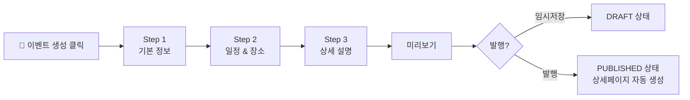
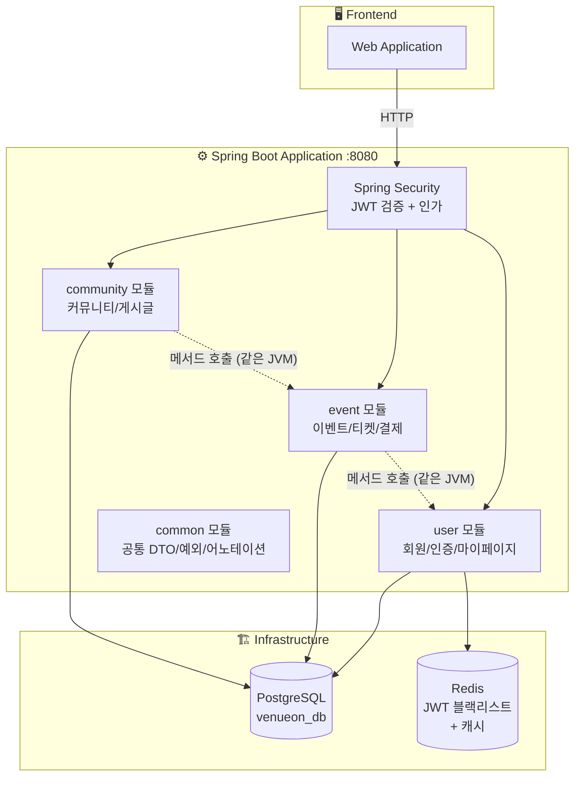
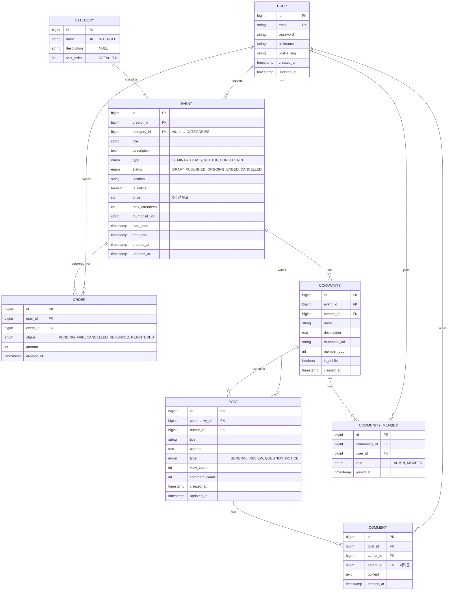
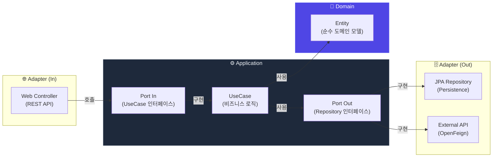
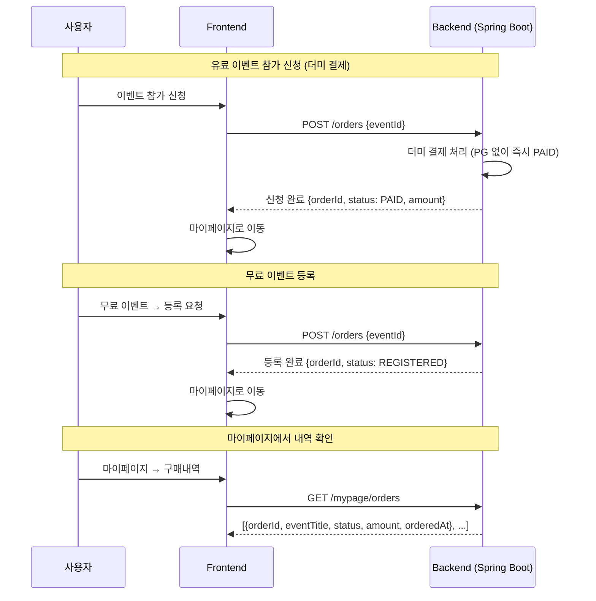
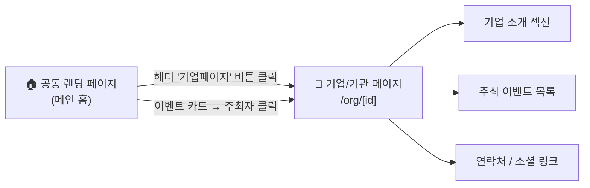
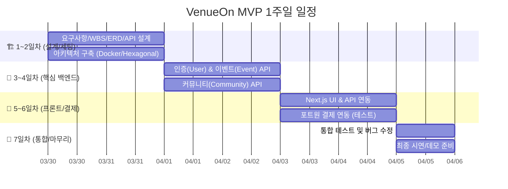
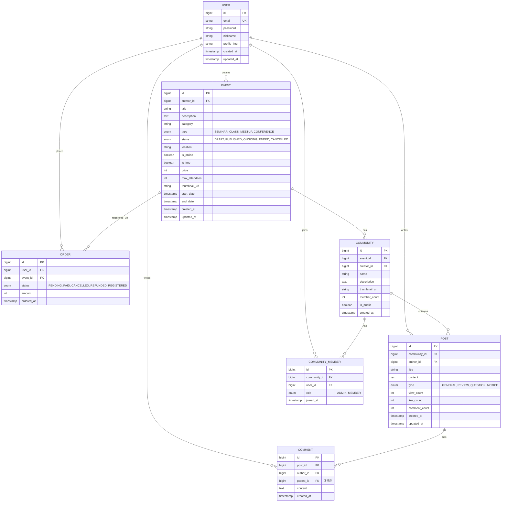

# 🏗️ VenueOn MVP 아키텍처 v3

> **작성일:** 2026-03-25
> **핵심:** 유료·무료 이벤트 중계 + 커뮤니티 연장선
> **기술 스택:** Spring Boot + Next.js + Vanilla CSS Module

---

## 📌 1. MVP 기능 범위

| # | 기능 | 설명 |
|---|------|------|
| 1 | **회원가입/로그인** | JWT 인증, 기업·일반 사용자 구분 가입 |
| 2 | **이벤트 CRUD** | 에디터(폼)로 직접 등록 — 이벤트 생성·조회·수정·삭제, 세션/프로그램 관리 |
| 3 | **마이페이지** | 내 이벤트 관리, 구매내역, 참여 이력 |
| 4 | **이벤트 티켓팅 + 결제** | 유료·무료 티켓 구매, 포트원 결제 연동, 구매 후 마이페이지 반영 |
| 5 | **이벤트 커뮤니티 CRUD** | 이벤트 기반 커뮤니티 생성·조회·수정·삭제 |
| 6 | **커뮤니티 글 CRUD** | 커뮤니티 내 게시글 작성·조회·수정·삭제, 후기 |
| 7 | **기업/기관 페이지** | 기업·공공기관 전용 프로필 페이지 (주최 이벤트 목록, 기관 소개) |

---

## 📌 2. 타겟 사용자 & 사용자 정책

### 타겟 사용자

| 구분 | 대상 | 역할 | 가입 방식 |
|------|------|------|----------|
| **기획자 (HOST)** | 기업 · 공공기관 · 사업자 | 이벤트 생성 · 관리 · 티켓 판매 | 사업자등록번호 또는 기관 인증을 통한 가입 |
| **일반 사용자 (USER)** | 개인 | 이벤트 탐색 · 티켓 구매 · 커뮤니티 참여 | 이메일 기반 일반 가입 |

> **기획자(HOST)** = 기업/공공기관으로, 이벤트를 만들고 관리하는 주체  
> **일반 사용자(USER)** = 이벤트를 탐색하고 참여하는 참가자

### 사용자 정책

| 항목 | 설명 |
|------|------|
| **권한** | HOST(기획자) / USER(일반 사용자) 2단계 권한 |
| **이벤트 생성** | **HOST만** 이벤트 생성 가능 (사업자/기관 인증 필요) |
| **이벤트 참여** | USER는 이벤트 탐색·티켓 구매·참여 |
| **이벤트 관리** | 본인이 만든 이벤트만 수정/삭제 가능 (작성자 검증) |
| **커뮤니티 관리** | 본인이 만든 커뮤니티만 수정/삭제 가능 (작성자 검증) |
| **게시글/댓글** | 본인이 작성한 글만 수정/삭제 가능 (작성자 검증) |
| **기업 페이지** | HOST는 기업/기관 전용 프로필 페이지 보유 |
| **향후 확장** | 관리자(ADMIN) 역할 추가 가능하도록 구조 유지 |

---

## 📌 2-1. 이벤트 등록 방식 (에디터/폼 기반)

> 기획자(HOST)는 **에디터(폼) 기반**으로 이벤트를 직접 등록합니다. 별도의 승인 절차 없이, 입력 폼만으로 상세페이지가 자동 생성됩니다.

### 등록 폼 구성 (Step-by-Step)

| Step | 입력 항목 | 설명 |
|------|-----------|------|
| **Step 1: 기본 정보** | 이벤트명, 카테고리, 유형(세미나/클래스/밋업/컨퍼런스), 썸네일 | 이벤트의 기본 정보 입력 |
| **Step 2: 일정 & 장소** | 시작일, 종료일, 장소(온/오프라인), 최대 참석자 수, 유료/무료, 가격 | 캘린더 UI로 일정 선택 |
| **Step 3: 상세 설명** | 리치 텍스트 에디터 (이미지 삽입, 서식 지원) | 이벤트 상세 페이지 본문 |

> **향후 확장:** 세션/프로그램 관리 (Step 3), 티켓 등급별 가격 설정 (Step 4) 추가 예정

### 등록 흐름도



> **핵심:** 폼에 데이터를 입력하면 **이벤트 상세 페이지, 캘린더, 강의장/일정 정보가 자동으로 구성**되어 별도 디자인 작업 없이 바로 노출됩니다.

---

## 📌 3. 모듈러 모놀리스 (Modular Monolith)

> **왜 MSA가 아닌 모듈러 모놀리스인가?**
> MVP 규모에서 서비스를 물리적으로 분리하면 네트워크 통신, 분산 트랜잭션, 독립 DB 관리 등 불필요한 복잡도가 증가합니다.
> **하나의 Spring Boot 앱** 안에서 **패키지로 도메인을 분리**하면 헥사고날 구조를 유지하면서도 개발 생산성을 극대화할 수 있습니다.
> 향후 트래픽 증가 시 특정 모듈만 별도 서비스로 분리하면 됩니다.



### 모듈별 역할

| 모듈 (패키지) | 담당 |
|--------------|------|
| **com.venueon.user** | 회원가입, 로그인, JWT 발급/갱신, 프로필, 마이페이지 |
| **com.venueon.event** | 이벤트 CRUD, 세션 관리, 티켓 CRUD, 주문/결제, 구매내역 관리 |
| **com.venueon.community** | 커뮤니티 CRUD, 게시글 CRUD, 댓글, 후기 |
| **com.venueon.common** | ApiResponse, 예외 처리, @UseCase 어노테이션 등 공통 |

**도메인 모듈: 3개** → 요구사항 충족 ✅ / **DB: 1개** (테이블로 분리)

### 모듈 간 통신

| 호출 방향 | 방식 | 목적 |
|-----------|------|------|
| event → user | **메서드 호출** (Port 인터페이스) | 주문 시 유저 정보 확인 |
| community → event | **메서드 호출** (Port 인터페이스) | 커뮤니티 생성 시 이벤트 정보 참조 |
| community → user | **메서드 호출** (Port 인터페이스) | 게시글 작성자 정보 조회 |

> **핵심:** 모듈 간 직접 의존 대신 **Port 인터페이스를 통한 호출**로 결합도를 최소화합니다. 같은 JVM이므로 네트워크 오버헤드 없이 단순 메서드 호출로 처리됩니다.

---

## 📌 4. ERD (9개 Entity)



**Entity 수: 9개** → PDF 요구사항(최소 5개) 충족 ✅

> **변경사항:** Category 엔티티 추가, `is_free` 제거(price==0이면 무료 판단), `like_count` 제거(MVP 미구현)  
> **향후 확장:** Session(세션/프로그램), Ticket(티켓 등급별 가격) Entity는 MVP 이후 추가 예정

---

## 📌 5. 기술 스택

| 카테고리 | 기술 | 비고 |
|----------|------|------|
| **프론트엔드** | Next.js 14+ (App Router) | React 18, SSR/SSG |
| **스타일링** | **Vanilla CSS Module** (.module.css) | Tailwind X — 컴포넌트별 스코프 CSS |
| **백엔드** | Spring Boot 3.x, Java 17 | 단일 앱, RESTful API |
| **아키텍처 패턴** | **Hexagonal Architecture** (Ports & Adapters) | 기능별 UseCase 독립 확장 |
| **아키텍처 구조** | **Modular Monolith** | 패키지 기반 도메인 분리, 향후 MSA 전환 용이 |
| **DB** | PostgreSQL 15 | 단일 DB (venueon_db), 테이블로 도메인 분리 |
| **캐시** | Redis 7 | JWT 블랙리스트, 세션 캐시 |
| **인증** | Spring Security + JWT | Access Token + Refresh Token |
| **결제** | **더미 결제** (MVP) | PG 없이 즉시 PAID 처리, 향후 포트원 전환 |
| **파일 저장** | 외부 볼륨 마운트 (MVP) | `dist/upload` 외부 폴더, 향후 S3/MinIO 전환 |
| **컨테이너** | Docker + Docker Compose | 로컬 개발 환경 |
| **CI/CD** | GitHub Actions | 빌드/테스트 자동화 |
| **API 문서** | Swagger (SpringDoc) | 자동 API 문서 생성 |

---

## 📌 6. 헥사고날 아키텍처 (Ports & Adapters)

### 왜 헥사고날인가?

기능이 계속 추가될 예정이므로, **기능별 UseCase를 독립적으로 추가/수정/삭제**할 수 있는 구조가 필요합니다.

| 레이어드 아키텍처 (기존) | 헥사고날 아키텍처 (적용) |
|----------------------|---------------------|
| Controller → Service → Repository | Adapter(in) → Port → UseCase → Port → Adapter(out) |
| 계층 간 강결합 | **도메인이 외부에 의존하지 않음** |
| 기능 추가 시 전 계층 수정 | **UseCase만 추가하면 끝** |
| 테스트 시 DB 필요 | Port를 Mock하여 **단위 테스트 용이** |

### 의존성 방향도



> **핵심 규칙:** 의존성은 항상 **바깥 → 안쪽**으로만 향합니다. Domain은 어떤 외부 기술(JPA, Spring, HTTP)도 모릅니다.

### 프로젝트 구조

```
team_project/
├── frontend/                              # Next.js 14 (App Router)
│   ├── src/
│   │   ├── app/
│   │   │   ├── layout.tsx
│   │   │   ├── page.tsx                   # 메인 홈
│   │   │   ├── page.module.css
│   │   │   ├── (auth)/
│   │   │   │   ├── login/page.tsx
│   │   │   │   ├── signup/page.tsx         # 역할 선택 (기획자/사용자)
│   │   │   │   └── components/
│   │   │   │       ├── LoginForm.tsx
│   │   │   │       ├── SignupForm.tsx
│   │   │   │       └── useAuth.ts          # 인증 Hook
│   │   │   ├── events/
│   │   │   │   ├── page.tsx               # 이벤트 탐색
│   │   │   │   ├── [id]/page.tsx          # 이벤트 상세 + 티켓 구매
│   │   │   │   ├── new/page.tsx           # 이벤트 생성 (기획자)
│   │   │   │   └── components/
│   │   │   │       ├── EventList.tsx       # 이벤트 목록 섹션
│   │   │   │       ├── EventDetail.tsx     # 이벤트 상세 섹션
│   │   │   │       ├── EventForm.tsx       # 이벤트 생성/수정 폼
│   │   │   │       ├── TicketSection.tsx   # 티켓 선택/구매 섹션
│   │   │   │       ├── useEvents.ts       # 이벤트 CRUD Hook
│   │   │   │       └── useOrder.ts        # 주문/결제 Hook
│   │   │   ├── community/
│   │   │   │   ├── page.tsx               # 커뮤니티 목록
│   │   │   │   ├── [id]/page.tsx          # 커뮤니티 상세
│   │   │   │   ├── [id]/posts/new/page.tsx
│   │   │   │   ├── [id]/posts/[postId]/page.tsx
│   │   │   │   └── components/
│   │   │   │       ├── CommunityList.tsx   # 커뮤니티 목록 섹션
│   │   │   │       ├── PostList.tsx        # 게시글 목록 섹션
│   │   │   │       ├── PostForm.tsx        # 게시글 작성 폼
│   │   │   │       ├── CommentList.tsx     # 댓글 섹션
│   │   │   │       ├── useCommunity.ts    # 커뮤니티 CRUD Hook
│   │   │   │       └── usePosts.ts        # 게시글 CRUD Hook
│   │   │   └── mypage/
│   │   │       ├── page.tsx               # 마이페이지
│   │   │       ├── events/page.tsx        # 내 이벤트 (기획자)
│   │   │       ├── tickets/page.tsx       # 구매내역 (사용자)
│   │   │       ├── communities/page.tsx
│   │   │       └── components/
│   │   │           ├── MyEventList.tsx     # 내 이벤트 섹션
│   │   │           ├── OrderHistory.tsx    # 구매내역 섹션
│   │   │           └── useMyPage.ts       # 마이페이지 Hook
│   │   ├── components/                    # 공통 재사용 UI 컴포넌트만
│   │   │   ├── Button.tsx
│   │   │   ├── Card.tsx
│   │   │   ├── Modal.tsx
│   │   │   ├── Header.tsx
│   │   │   ├── Footer.tsx
│   │   │   └── Pagination.tsx
│   │   ├── lib/                           # api.ts, auth.ts, utils.ts
│   │   └── styles/
│   │       ├── globals.css
│   │       └── variables.css              # CSS Custom Properties
│   └── package.json
│
├── backend/                               # 단일 Spring Boot Application (:8080)
│   └── src/main/java/com/venueon/
│       │
│       ├── VenueOnApplication.java        # @SpringBootApplication 메인
│       │
│       ├── common/                        # 🔧 공통 모듈
│       │   ├── dto/ApiResponse.java
│       │   ├── exception/
│       │   │   ├── GlobalExceptionHandler.java
│       │   │   └── ErrorCode.java
│       │   ├── annotation/
│       │   │   └── UseCase.java           # @UseCase 커스텀 어노테이션
│       │   └── config/
│       │       ├── SecurityConfig.java    # Spring Security + JWT 필터
│       │       ├── JwtAuthFilter.java     # JWT 인증 필터
│       │       └── SwaggerConfig.java     # API 문서 설정
│       │
│       ├── user/                          # 👤 User 모듈 (헥사고날)
│       │   ├── domain/                    # 💎 도메인 (순수 비즈니스)
│       │   │   ├── model/
│       │   │   │   ├── User.java          # 도메인 엔티티 (JPA 어노테이션 없음)
│       │   │   │   └── UserRole.java      # enum: ADMIN, HOST, USER
│       │   │   └── exception/
│       │   │       └── UserDomainException.java
│       │   │
│       │   ├── application/               # ⚙️ 유스케이스 + 포트
│       │   │   ├── port/
│       │   │   │   ├── in/                # --- Inbound Port (UseCase 인터페이스) ---
│       │   │   │   │   ├── SignupUseCase.java
│       │   │   │   │   ├── LoginUseCase.java
│       │   │   │   │   ├── LogoutUseCase.java
│       │   │   │   │   ├── GetProfileUseCase.java
│       │   │   │   │   └── UpdateProfileUseCase.java
│       │   │   │   └── out/               # --- Outbound Port (외부 의존 인터페이스) ---
│       │   │   │       ├── LoadUserPort.java
│       │   │   │       ├── SaveUserPort.java
│       │   │   │       ├── TokenPort.java         # JWT 생성/검증
│       │   │   │       └── TokenBlacklistPort.java # Redis 블랙리스트
│       │   │   │
│       │   │   ├── service/               # --- UseCase 구현체 ---
│       │   │   │   ├── SignupService.java
│       │   │   │   ├── LoginService.java
│       │   │   │   ├── LogoutService.java
│       │   │   │   ├── GetProfileService.java
│       │   │   │   └── UpdateProfileService.java
│       │   │   │
│       │   │   └── dto/                   # --- 입출력 DTO ---
│       │   │       ├── SignupCommand.java
│       │   │       ├── LoginCommand.java
│       │   │       └── UserInfo.java
│       │   │
│       │   └── adapter/                   # 🔌 어댑터 (외부 연결)
│       │       ├── in/web/               # --- Inbound Adapter (REST) ---
│       │       │   ├── AuthController.java
│       │       │   ├── UserController.java
│       │       │   └── dto/
│       │       │       ├── request/
│       │       │       │   ├── SignupRequest.java
│       │       │       │   └── LoginRequest.java
│       │       │       └── response/
│       │       │           └── UserProfileResponse.java
│       │       │
│       │       └── out/                   # --- Outbound Adapter ---
│       │           ├── persistence/       # DB 연결
│       │           │   ├── UserJpaEntity.java
│       │           │   ├── UserJpaRepository.java
│       │           │   ├── UserPersistenceAdapter.java
│       │           │   └── UserMapper.java
│       │           └── jwt/               # JWT 연결
│       │               ├── JwtTokenAdapter.java
│       │               └── RedisBlacklistAdapter.java
│       │
│       ├── event/                         # 📅 Event 모듈 (헥사고날)
│       │   ├── domain/
│       │   │   ├── model/
│       │   │   │   ├── Event.java
│       │   │   │   ├── Category.java          # 카테고리 도메인
│       │   │   │   ├── Order.java
│       │   │   │   ├── EventStatus.java   # enum
│       │   │   │   └── OrderStatus.java   # enum
│       │   │   └── exception/
│       │   │       └── EventDomainException.java
│       │   │
│       │   ├── application/
│       │   │   ├── port/
│       │   │   │   ├── in/
│       │   │   │   │   ├── CreateEventUseCase.java
│       │   │   │   │   ├── GetEventUseCase.java
│       │   │   │   │   ├── UpdateEventUseCase.java
│       │   │   │   │   ├── DeleteEventUseCase.java
│       │   │   │   │   ├── SearchEventUseCase.java
│       │   │   │   │   ├── CreateOrderUseCase.java
│       │   │   │   │   ├── CancelOrderUseCase.java
│       │   │   │   │   └── GetMyOrdersUseCase.java
│       │   │   │   └── out/
│       │   │   │       ├── LoadEventPort.java
│       │   │   │       ├── SaveEventPort.java
│       │   │   │       ├── LoadCategoryPort.java     # 카테고리 조회 Port
│       │   │   │       ├── LoadOrderPort.java
│       │   │   │       ├── SaveOrderPort.java
│       │   │   │       └── UserQueryPort.java       # user 모듈 조회용 Port
│       │   │   │
│       │   │   ├── service/
│       │   │   │   ├── CreateEventService.java
│       │   │   │   ├── GetEventService.java
│       │   │   │   ├── UpdateEventService.java
│       │   │   │   ├── DeleteEventService.java
│       │   │   │   ├── SearchEventService.java
│       │   │   │   ├── CreateOrderService.java
│       │   │   │   ├── CancelOrderService.java
│       │   │   │   └── GetMyOrdersService.java
│       │   │   │
│       │   │   └── dto/
│       │   │       ├── CreateEventCommand.java
│       │   │       ├── UpdateEventCommand.java
│       │   │       ├── CreateOrderCommand.java
│       │   │       ├── EventInfo.java
│       │   │       └── OrderInfo.java
│       │   │
│       │   └── adapter/
│       │       ├── in/web/
│       │       │   ├── EventController.java
│       │       │   ├── OrderController.java
│       │       │   └── dto/               # request/ + response/ 분리
│       │       │
│       │       └── out/
│       │           ├── persistence/
│       │           │   ├── entity/
│       │           │   │   ├── EventJpaEntity.java
│       │           │   │   ├── CategoryJpaEntity.java
│       │           │   │   └── OrderJpaEntity.java
│       │           │   ├── repository/
│       │           │   │   ├── EventJpaRepository.java
│       │           │   │   ├── CategoryJpaRepository.java
│       │           │   │   └── OrderJpaRepository.java
│       │           │   ├── EventPersistenceAdapter.java
│       │           │   ├── CategoryPersistenceAdapter.java
│       │           │   ├── OrderPersistenceAdapter.java
│       │           │   └── mapper/
│       │           │       ├── EventMapper.java
│       │           │       ├── CategoryMapper.java
│       │           │       └── OrderMapper.java
│       │           └── internal/          # 모듈 간 통신 어댑터
│       │               └── UserQueryAdapter.java    # implements UserQueryPort (직접 메서드 호출)
│       │
│       └── community/                     # 💬 Community 모듈 (헥사고날)
│           ├── domain/
│           │   ├── model/
│           │   │   ├── Community.java
│           │   │   ├── CommunityMember.java
│           │   │   ├── Post.java
│           │   │   ├── Comment.java
│           │   │   └── PostType.java      # enum
│           │   └── exception/
│           │       └── CommunityDomainException.java
│           │
│           ├── application/
│           │   ├── port/
│           │   │   ├── in/
│           │   │   │   ├── CreateCommunityUseCase.java
│           │   │   │   ├── GetCommunityUseCase.java
│           │   │   │   ├── UpdateCommunityUseCase.java
│           │   │   │   ├── DeleteCommunityUseCase.java
│           │   │   │   ├── JoinCommunityUseCase.java
│           │   │   │   ├── LeaveCommunityUseCase.java
│           │   │   │   ├── CreatePostUseCase.java
│           │   │   │   ├── GetPostUseCase.java
│           │   │   │   ├── UpdatePostUseCase.java
│           │   │   │   ├── DeletePostUseCase.java
│           │   │   │   ├── CreateCommentUseCase.java
│           │   │   │   └── DeleteCommentUseCase.java
│           │   │   └── out/
│           │   │       ├── LoadCommunityPort.java
│           │   │       ├── SaveCommunityPort.java
│           │   │       ├── LoadPostPort.java
│           │   │       ├── SavePostPort.java
│           │   │       ├── LoadCommentPort.java
│           │   │       ├── SaveCommentPort.java
│           │   │       ├── EventQueryPort.java     # event 모듈 조회용 Port
│           │   │       └── UserQueryPort.java       # user 모듈 조회용 Port
│           │   │
│           │   ├── service/
│           │   │   ├── CreateCommunityService.java
│           │   │   ├── GetCommunityService.java
│           │   │   ├── UpdateCommunityService.java
│           │   │   ├── DeleteCommunityService.java
│           │   │   ├── JoinCommunityService.java
│           │   │   ├── LeaveCommunityService.java
│           │   │   ├── CreatePostService.java
│           │   │   ├── GetPostService.java
│           │   │   ├── UpdatePostService.java
│           │   │   ├── DeletePostService.java
│           │   │   ├── CreateCommentService.java
│           │   │   └── DeleteCommentService.java
│           │   │
│           │   └── dto/
│           │       ├── CreateCommunityCommand.java
│           │       ├── CreatePostCommand.java
│           │       ├── CommunityInfo.java
│           │       └── PostInfo.java
│           │
│           └── adapter/
│               ├── in/web/
│               │   ├── CommunityController.java
│               │   ├── PostController.java
│               │   ├── CommentController.java
│               │   └── dto/               # request/ + response/ 분리
│               │
│               └── out/
│                   ├── persistence/
│                   │   ├── entity/
│                   │   ├── repository/
│                   │   ├── CommunityPersistenceAdapter.java
│                   │   ├── PostPersistenceAdapter.java
│                   │   ├── CommentPersistenceAdapter.java
│                   │   └── mapper/
│                   └── internal/          # 모듈 간 통신 어댑터
│                       ├── EventQueryAdapter.java   # implements EventQueryPort (직접 메서드 호출)
│                       └── UserQueryAdapter.java    # implements UserQueryPort (직접 메서드 호출)
│
│       ├── host/                          # 🏢 Host 모듈 (기업 회원 전용)
│       │   ├── domain/model/
│       │   │   └── HostProfile.java       # 기업 프로필 도메인
│       │   ├── application/
│       │   │   ├── port/in/
│       │   │   │   ├── GetHostDashboardUseCase.java
│       │   │   │   ├── GetHostProfileUseCase.java
│       │   │   │   └── UpdateHostProfileUseCase.java
│       │   │   ├── port/out/
│       │   │   ├── service/
│       │   │   └── dto/
│       │   └── adapter/
│       │       ├── in/web/
│       │       │   ├── HostDashboardController.java
│       │       │   ├── HostProfileController.java
│       │       │   ├── HostEventController.java   # /host/events 이벤트 관리
│       │       │   └── dto/
│       │       └── out/persistence/
│       │
│       └── admin/                         # 🔧 Admin 모듈 (관리자)
│           ├── application/
│           │   ├── port/in/
│           │   │   └── GetAllUsersUseCase.java
│           │   └── service/
│           └── adapter/in/web/
│               ├── AdminUserController.java
│               └── dto/
│
├── dist/
│   └── upload/                            # 📁 이미지 저장 (외부 볼륨)
│       └── (Docker 볼륨 마운트 — 백엔드 이미지 외부)
│
├── infra/
│   ├── docker-compose.yml
│   └── .env.example
│
└── .github/
    └── workflows/
        └── ci.yml
```

> **Upload 처리:** 이미지 업로드 API(`POST /upload/image`)는 `common/adapter/in/web/UploadController.java`에서 처리하고, 실제 파일은 `dist/upload/` 외부 볼륨에 저장됩니다. 백엔드 Docker 이미지 안에 파일이 쓰이지 않습니다.

> **핵심 변경:** `external/` (OpenFeign) → `internal/` (같은 JVM 메서드 호출). 모듈 간 통신 어댑터가 네트워크 대신 직접 Port를 호출합니다.

### UseCase 추가 패턴 (기능 확장 시)

새 기능을 추가할 때는 **3단계**만 따르면 됩니다:

```
1️⃣ Port In (인터페이스 정의)  →  application/port/in/XxxUseCase.java
2️⃣ Service (비즈니스 구현)    →  application/service/XxxService.java
3️⃣ 필요 시 Port Out 추가      →  application/port/out/XxxPort.java
                              →  adapter/out/.../XxxAdapter.java
```

**예시: "이벤트 북마크" 기능 추가**

```java
// 1️⃣ Port In — 인터페이스만 정의
public interface BookmarkEventUseCase {
    void bookmark(Long userId, Long eventId);
    void unbookmark(Long userId, Long eventId);
    List<EventInfo> getMyBookmarks(Long userId);
}

// 2️⃣ Service — 비즈니스 로직 구현
@UseCase
@RequiredArgsConstructor
public class BookmarkEventService implements BookmarkEventUseCase {
    private final LoadEventPort loadEventPort;
    private final SaveBookmarkPort saveBookmarkPort;  // 3️⃣ 새 Out Port

    @Override
    public void bookmark(Long userId, Long eventId) {
        Event event = loadEventPort.findById(eventId)
            .orElseThrow(() -> new EventDomainException("이벤트 없음"));
        saveBookmarkPort.save(userId, event.getId());
    }
}

// 3️⃣ Port Out — 필요한 경우만 추가
public interface SaveBookmarkPort {
    void save(Long userId, Long eventId);
}
```

> **기존 코드를 건드리지 않고** UseCase + Port + Adapter만 추가하면 기능이 확장됩니다. (OCP 원칙)

### @UseCase 커스텀 어노테이션

```java
// common 모듈
@Target(ElementType.TYPE)
@Retention(RetentionPolicy.RUNTIME)
@Service  // Spring Bean 등록
public @interface UseCase {
}
```

### Domain Entity vs JPA Entity 분리

```java
// 💎 domain/model/Event.java — 순수 도메인 (Spring/JPA 의존 없음)
public class Event {
    private Long id;
    private String title;
    private Long categoryId;     // Category FK
    private EventStatus status;
    private int price;           // 0이면 무료

    public boolean isFree() {
        return this.price == 0;  // is_free 컬럼 대신 로직으로 판단
    }

    public void publish() {
        if (this.status != EventStatus.DRAFT)
            throw new EventDomainException("DRAFT 상태에서만 공개 가능");
        this.status = EventStatus.PUBLISHED;
    }

    public void end() {
        this.status = EventStatus.ENDED;
    }
}

// 🗄️ adapter/out/persistence/entity/EventJpaEntity.java — JPA
@Entity @Table(name = "events")
public class EventJpaEntity {
    @Id @GeneratedValue
    private Long id;
    private String title;
    @Enumerated(EnumType.STRING)
    private EventStatus status;
    // ... JPA 어노테이션 전용
}

// 🔄 adapter/out/persistence/mapper/EventMapper.java — 변환
public class EventMapper {
    public static Event toDomain(EventJpaEntity jpa) { ... }
    public static EventJpaEntity toJpa(Event domain) { ... }
}
```

---

## 📌 7. API 목록

### Auth (4 APIs)

| Method | Endpoint | 설명 |
|--------|----------|------|
| POST | `/auth/signup` | 회원가입 (role: ADMIN/HOST/USER) |
| POST | `/auth/login` | 로그인 → JWT 발급 |
| POST | `/auth/refresh` | Access Token 갱신 |
| POST | `/auth/logout` | 로그아웃 (토큰 블랙리스트) |

### MyPage (5 APIs)

| Method | Endpoint | 설명 |
|--------|----------|------|
| GET | `/mypage/profile` | 내 프로필 조회 |
| PUT | `/mypage/profile` | 내 프로필 수정 |
| GET | `/mypage/orders` | 내 구매/예약 내역 |
| GET | `/mypage/communities` | 내 커뮤니티 목록 |
| GET | `/mypage/events` | 내 참여 이벤트 목록 |

### Events — 공개 조회 (2 APIs)

| Method | Endpoint | 설명 |
|--------|----------|------|
| GET | `/events` | 이벤트 목록 (검색/필터/페이징) |
| GET | `/events/{id}` | 이벤트 상세 |

### Orders — 참가 신청 (3 APIs)

| Method | Endpoint | 설명 |
|--------|----------|------|
| POST | `/orders` | 참가 신청 (유료: 더미 결제 → PAID / 무료: → REGISTERED) |
| GET | `/orders/{id}` | 주문 상세 (본인만) |
| POST | `/orders/{id}/cancel` | 참가 취소 |

> **MVP 더미 결제:** `POST /orders` 시 PG 연동 없이 즉시 처리. 향후 포트원 연동 전환.

### Communities (8 APIs)

| Method | Endpoint | 설명 |
|--------|----------|------|
| POST | `/communities` | 커뮤니티 생성 (이벤트 연동) |
| GET | `/communities` | 커뮤니티 목록 |
| GET | `/communities/{id}` | 커뮤니티 상세 |
| PUT | `/communities/{id}` | 커뮤니티 수정 (작성자만) |
| DELETE | `/communities/{id}` | 커뮤니티 삭제 (작성자만) |
| POST | `/communities/{id}/join` | 커뮤니티 가입 |
| DELETE | `/communities/{id}/leave` | 커뮤니티 탈퇴 |
| GET | `/communities/{id}/members` | 멤버 목록 |

### Posts (5 APIs)

| Method | Endpoint | 설명 |
|--------|----------|------|
| POST | `/communities/{communityId}/posts` | 게시글 작성 |
| GET | `/communities/{communityId}/posts` | 게시글 목록 (타입별 필터) |
| GET | `/posts/{id}` | 게시글 상세 |
| PUT | `/posts/{id}` | 게시글 수정 (작성자만) |
| DELETE | `/posts/{id}` | 게시글 삭제 (작성자만) |

### Comments (3 APIs)

| Method | Endpoint | 설명 |
|--------|----------|------|
| POST | `/posts/{postId}/comments` | 댓글 작성 (대댓글 지원) |
| GET | `/posts/{postId}/comments` | 댓글 목록 |
| DELETE | `/comments/{id}` | 댓글 삭제 (작성자만) |

### Host — 기업 회원 전용 (8 APIs)

| Method | Endpoint | 설명 |
|--------|----------|------|
| GET | `/host` | Host 대시보드 (요약 정보) |
| GET | `/host/profile` | 기업 프로필 조회 |
| PUT | `/host/profile` | 기업 프로필 수정 |
| GET | `/host/events` | 내가 주최한 이벤트 목록 |
| POST | `/host/events` | 이벤트 생성 |
| PUT | `/host/events/{id}` | 이벤트 수정 (본인만) |
| DELETE | `/host/events/{id}` | 이벤트 삭제 (본인만) |
| PATCH | `/host/events/{id}/status` | 상태 변경 (DRAFT→PUBLISHED) |

### Admin — 관리자 (1 API)

| Method | Endpoint | 설명 |
|--------|----------|------|
| GET | `/admin/users` | 전체 회원 리스트 조회 |

### Upload — 이미지 업로드 (1 API)

| Method | Endpoint | 설명 |
|--------|----------|------|
| POST | `/upload/image` | 이미지 업로드 (외부 볼륨 `dist/upload` 저장) |

**총 API: 40개** → PDF 요구사항(20개 이상) 충족 ✅

---

## 📌 8. 참가 신청 → 마이페이지 내역 흐름



> **MVP 더미 결제:** 실제 PG 연동 없이 즉시 `PAID` 처리됩니다. 향후 포트원(PortOne) 연동 시 `PaymentPort` + `PortOnePaymentAdapter`를 추가하면 됩니다.

---

## 📌 9. 페이지 구성 (8개)

| # | 페이지 | 경로 | 핵심 기능 |
|---|--------|------|----------|
| 1 | 🏠 **메인 홈 (공동 랜딩)** | `/` | 이벤트 목록/검색/필터, 인기 이벤트, **헤더에 기업페이지 바로가기 버튼** |
| 2 | 🔐 **로그인/가입** | `/auth/*` | 회원가입 (기업·일반 구분), 로그인 |
| 3 | 📄 **이벤트 상세** | `/events/[id]` | 이벤트 정보, 세션, 티켓 구매 |
| 4 | ✏️ **이벤트 생성/수정** | `/events/new` | 에디터(폼) 기반 Step-by-Step 이벤트 등록 |
| 5 | 👥 **커뮤니티** | `/community/[id]` | 게시글 목록, 글 작성, 댓글 |
| 6 | 👤 **마이페이지** | `/mypage/*` | 내 이벤트 관리, 구매내역, 참여 이력 |
| 7 | 🏢 **기업/기관 페이지** | `/org/[id]` | 기업 소개, 주최 이벤트 목록, 연락처 |
| 8 | 🏢 **기업 대시보드** | `/org/dashboard` | 이벤트 관리, 티켓 판매 현황, 참석자 관리 |

### 기업/기관 페이지 진입 흐름



> **진입 경로:** 모든 사용자는 **공동 랜딩 페이지(메인 홈)** 에서 시작합니다.  
> 헤더에 있는 **"기업페이지" 바로가기 버튼**을 클릭하면 해당 기업/기관의 전용 페이지로 이동합니다.  
> 이벤트 상세 페이지에서 주최자 이름을 클릭해도 기업 페이지로 이동할 수 있습니다.

---

## 📌 10. CSS Module 컨벤션

```css
/* src/styles/variables.css — 디자인 토큰 */
:root {
  /* Colors */
  --color-primary: #6366f1;
  --color-primary-hover: #4f46e5;
  --color-secondary: #f59e0b;
  --color-bg: #0f172a;
  --color-surface: #1e293b;
  --color-surface-hover: #334155;
  --color-text: #f1f5f9;
  --color-text-muted: #94a3b8;
  --color-border: #334155;
  --color-success: #22c55e;
  --color-error: #ef4444;

  /* Typography */
  --font-sans: 'Pretendard', 'Inter', -apple-system, sans-serif;
  --font-size-xs: 0.75rem;
  --font-size-sm: 0.875rem;
  --font-size-base: 1rem;
  --font-size-lg: 1.125rem;
  --font-size-xl: 1.25rem;
  --font-size-2xl: 1.5rem;
  --font-size-3xl: 1.875rem;

  /* Spacing */
  --space-1: 0.25rem;
  --space-2: 0.5rem;
  --space-3: 0.75rem;
  --space-4: 1rem;
  --space-6: 1.5rem;
  --space-8: 2rem;

  /* Border Radius */
  --radius-sm: 0.375rem;
  --radius-md: 0.5rem;
  --radius-lg: 0.75rem;
  --radius-full: 9999px;

  /* Shadow */
  --shadow-sm: 0 1px 2px rgba(0, 0, 0, 0.3);
  --shadow-md: 0 4px 6px rgba(0, 0, 0, 0.3);
  --shadow-lg: 0 10px 15px rgba(0, 0, 0, 0.3);

  /* Transitions */
  --transition: 150ms ease;
}
```

```css
/* 컴포넌트 예시: EventCard.module.css */
.card {
  background: var(--color-surface);
  border: 1px solid var(--color-border);
  border-radius: var(--radius-lg);
  overflow: hidden;
  transition: transform var(--transition), box-shadow var(--transition);
}
.card:hover {
  transform: translateY(-2px);
  box-shadow: var(--shadow-lg);
}
.thumbnail { ... }
.title { ... }
.price { ... }
```

```tsx
// 사용법: EventCard.tsx
import styles from './EventCard.module.css';

export function EventCard({ event }) {
  return (
    <div className={styles.card}>
      
      <h3 className={styles.title}>{event.title}</h3>
      <span className={styles.price}>
        {event.isFree ? '무료' : `₩${event.price.toLocaleString()}`}
      </span>
    </div>
  );
}
```

---

## 📌 11. Docker Compose

```yaml
version: '3.8'

services:
  # ─── Database (단일 DB) ──────────────
  postgres:
    image: postgres:15
    environment:
      POSTGRES_DB: venueon_db
      POSTGRES_USER: ${DB_USER}
      POSTGRES_PASSWORD: ${DB_PASSWORD}
    ports:
      - "5432:5432"
    volumes:
      - pg-data:/var/lib/postgresql/data

  # ─── Cache ───────────────────────────
  redis:
    image: redis:7-alpine
    ports:
      - "6379:6379"

  # ─── Backend (단일 Spring Boot 앱) ───
  backend:
    build: ../backend
    ports:
      - "8080:8080"
    depends_on:
      - postgres
      - redis
    environment:
      SPRING_DATASOURCE_URL: jdbc:postgresql://postgres:5432/venueon_db
      SPRING_DATASOURCE_USERNAME: ${DB_USER}
      SPRING_DATASOURCE_PASSWORD: ${DB_PASSWORD}
      SPRING_REDIS_HOST: redis
      JWT_SECRET: ${JWT_SECRET}
      UPLOAD_PATH: /app/upload          # 외부 볼륨 경로
    volumes:
      - upload-data:/app/upload         # 이미지 저장용 외부 볼륨

volumes:
  pg-data:
  upload-data:
```

> **컨테이너 3개** (Backend + PostgreSQL + Redis) → MSA 대비 인프라 복잡도 대폭 감소

---

## 📌 12. 프로젝트 일정 (MVP 1주 완성)

> **강조:** 1주일 내 핵심 기능 중심의 단기 MVP 구축 및 검증



---

## 📌 요약

```
┌───────────────────────────────────────────────────────────┐
│              VenueOn MVP v3 (Modular Monolith)            │
│                                                           │
│  ┌─ src/main/java/com/venueon/ ────────────────────────┐  │
│  │                                                     │  │
│  │  user/           event/           community/        │  │
│  │  회원/인증       이벤트 CRUD       커뮤니티 CRUD      │  │
│  │  마이페이지      세션 관리          게시글 CRUD        │  │
│  │  JWT/Redis      티켓/결제          댓글/후기          │  │
│  │                                                     │  │
│  │  common/ (공통 DTO, 예외처리, Security 설정)          │  │
│  └─────────────────────────────────────────────────────┘  │
│                                                           │
│  Frontend: Next.js 14 + Vanilla CSS Module                │
│  Infra: Docker Compose + PostgreSQL×1 + Redis             │
│  통신: 모듈 간 Port 인터페이스 (같은 JVM 메서드 호출)       │
└───────────────────────────────────────────────────────────┘

아키텍처: Modular Monolith + Hexagonal Architecture
타겟: 기업/공공기관(기획자) + 일반 사용자(참여자)
등록: 에디터(폼) 기반 Step-by-Step 이벤트 직접 등록
기능: 이벤트 CRUD → 티켓팅/결제 → 커뮤니티 → 소통
역할: 기획자(HOST) = 기업/공공기관 / 사용자(USER) = 이벤트 참여자
페이지: 공동 랜딩 → 헤더 기업페이지 버튼 → 기업/기관 전용 페이지
```

# 🏗️ VenueOn MVP 아키텍처 v3

> **작성일:** 2026-03-25
> **핵심:** 유료·무료 이벤트 중계 + 커뮤니티 연장선
> **기술 스택:** Spring Boot + Next.js + Vanilla CSS Module

---

## 📌 1. MVP 기능 범위

| # | 기능 | 설명 |
|---|------|------|
| 1 | **회원가입/로그인** | JWT 인증, 기업·일반 사용자 구분 가입 |
| 2 | **이벤트 CRUD** | 에디터(폼)로 직접 등록 — 이벤트 생성·조회·수정·삭제, 세션/프로그램 관리 |
| 3 | **마이페이지** | 내 이벤트 관리, 구매내역, 참여 이력 |
| 4 | **이벤트 티켓팅 + 결제** | 유료·무료 티켓 구매, 포트원 결제 연동, 구매 후 마이페이지 반영 |
| 5 | **이벤트 커뮤니티 CRUD** | 이벤트 기반 커뮤니티 생성·조회·수정·삭제 |
| 6 | **커뮤니티 글 CRUD** | 커뮤니티 내 게시글 작성·조회·수정·삭제, 후기 |
| 7 | **기업/기관 페이지** | 기업·공공기관 전용 프로필 페이지 (주최 이벤트 목록, 기관 소개) |

---

## 📌 2. 타겟 사용자 & 사용자 정책

### 타겟 사용자

| 구분 | 대상 | 역할 | 가입 방식 |
|------|------|------|----------|
| **기획자 (HOST)** | 기업 · 공공기관 · 사업자 | 이벤트 생성 · 관리 · 티켓 판매 | 사업자등록번호 또는 기관 인증을 통한 가입 |
| **일반 사용자 (USER)** | 개인 | 이벤트 탐색 · 티켓 구매 · 커뮤니티 참여 | 이메일 기반 일반 가입 |

> **기획자(HOST)** = 기업/공공기관으로, 이벤트를 만들고 관리하는 주체  
> **일반 사용자(USER)** = 이벤트를 탐색하고 참여하는 참가자

### 사용자 정책

| 항목 | 설명 |
|------|------|
| **권한** | HOST(기획자) / USER(일반 사용자) 2단계 권한 |
| **이벤트 생성** | **HOST만** 이벤트 생성 가능 (사업자/기관 인증 필요) |
| **이벤트 참여** | USER는 이벤트 탐색·티켓 구매·참여 |
| **이벤트 관리** | 본인이 만든 이벤트만 수정/삭제 가능 (작성자 검증) |
| **커뮤니티 관리** | 본인이 만든 커뮤니티만 수정/삭제 가능 (작성자 검증) |
| **게시글/댓글** | 본인이 작성한 글만 수정/삭제 가능 (작성자 검증) |
| **기업 페이지** | HOST는 기업/기관 전용 프로필 페이지 보유 |
| **향후 확장** | 관리자(ADMIN) 역할 추가 가능하도록 구조 유지 |

---

## 📌 2-1. 이벤트 등록 방식 (에디터/폼 기반)

> 기획자(HOST)는 **에디터(폼) 기반**으로 이벤트를 직접 등록합니다. 별도의 승인 절차 없이, 입력 폼만으로 상세페이지가 자동 생성됩니다.

### 등록 폼 구성 (Step-by-Step)

| Step | 입력 항목 | 설명 |
|------|-----------|------|
| **Step 1: 기본 정보** | 이벤트명, 카테고리, 유형(세미나/클래스/밋업/컨퍼런스), 썸네일 | 이벤트의 기본 정보 입력 |
| **Step 2: 일정 & 장소** | 시작일, 종료일, 장소(온/오프라인), 최대 참석자 수, 유료/무료, 가격 | 캘린더 UI로 일정 선택 |
| **Step 3: 상세 설명** | 리치 텍스트 에디터 (이미지 삽입, 서식 지원) | 이벤트 상세 페이지 본문 |

> **향후 확장:** 세션/프로그램 관리 (Step 3), 티켓 등급별 가격 설정 (Step 4) 추가 예정

### 등록 흐름도


> **핵심:** 폼에 데이터를 입력하면 **이벤트 상세 페이지, 캘린더, 강의장/일정 정보가 자동으로 구성**되어 별도 디자인 작업 없이 바로 노출됩니다.

---

## 📌 3. 모듈러 모놀리스 (Modular Monolith)

> **왜 MSA가 아닌 모듈러 모놀리스인가?**
> MVP 규모에서 서비스를 물리적으로 분리하면 네트워크 통신, 분산 트랜잭션, 독립 DB 관리 등 불필요한 복잡도가 증가합니다.
> **하나의 Spring Boot 앱** 안에서 **패키지로 도메인을 분리**하면 헥사고날 구조를 유지하면서도 개발 생산성을 극대화할 수 있습니다.
> 향후 트래픽 증가 시 특정 모듈만 별도 서비스로 분리하면 됩니다.


### 모듈별 역할

| 모듈 (패키지) | 담당 |
|--------------|------|
| **com.venueon.user** | 회원가입, 로그인, JWT 발급/갱신, 프로필, 마이페이지 |
| **com.venueon.event** | 이벤트 CRUD, 세션 관리, 티켓 CRUD, 주문/결제, 구매내역 관리 |
| **com.venueon.community** | 커뮤니티 CRUD, 게시글 CRUD, 댓글, 후기 |
| **com.venueon.common** | ApiResponse, 예외 처리, @UseCase 어노테이션 등 공통 |

**도메인 모듈: 3개** → 요구사항 충족 ✅ / **DB: 1개** (테이블로 분리)

### 모듈 간 통신

| 호출 방향 | 방식 | 목적 |
|-----------|------|------|
| event → user | **메서드 호출** (Port 인터페이스) | 주문 시 유저 정보 확인 |
| community → event | **메서드 호출** (Port 인터페이스) | 커뮤니티 생성 시 이벤트 정보 참조 |
| community → user | **메서드 호출** (Port 인터페이스) | 게시글 작성자 정보 조회 |

> **핵심:** 모듈 간 직접 의존 대신 **Port 인터페이스를 통한 호출**로 결합도를 최소화합니다. 같은 JVM이므로 네트워크 오버헤드 없이 단순 메서드 호출로 처리됩니다.

---

## 📌 4. ERD (8개 Entity)



**Entity 수: 8개** → PDF 요구사항(최소 5개) 충족 ✅

> **향후 확장:** Session(세션/프로그램), Ticket(티켓 등급별 가격) Entity는 MVP 이후 추가 예정

---

## 📌 5. 기술 스택

| 카테고리 | 기술 | 비고 |
|----------|------|------|
| **프론트엔드** | Next.js 14+ (App Router) | React 18, SSR/SSG |
| **스타일링** | **Vanilla CSS Module** (.module.css) | Tailwind X — 컴포넌트별 스코프 CSS |
| **백엔드** | Spring Boot 3.x, Java 17 | 단일 앱, RESTful API |
| **아키텍처 패턴** | **Hexagonal Architecture** (Ports & Adapters) | 기능별 UseCase 독립 확장 |
| **아키텍처 구조** | **Modular Monolith** | 패키지 기반 도메인 분리, 향후 MSA 전환 용이 |
| **DB** | PostgreSQL 15 | 단일 DB (venueon_db), 테이블로 도메인 분리 |
| **캐시** | Redis 7 | JWT 블랙리스트, 세션 캐시 |
| **인증** | Spring Security + JWT | Access Token + Refresh Token |
| **결제** | **더미 결제** (MVP) | PG 없이 즉시 PAID 처리, 향후 포트원 전환 |
| **파일 저장** | 외부 볼륨 마운트 (MVP) | `dist/upload` 외부 폴더, 향후 S3/MinIO 전환 |
| **컨테이너** | Docker + Docker Compose | 로컬 개발 환경 |
| **CI/CD** | GitHub Actions | 빌드/테스트 자동화 |
| **API 문서** | Swagger (SpringDoc) | 자동 API 문서 생성 |

---

## 📌 6. 헥사고날 아키텍처 (Ports & Adapters)

### 왜 헥사고날인가?

기능이 계속 추가될 예정이므로, **기능별 UseCase를 독립적으로 추가/수정/삭제**할 수 있는 구조가 필요합니다.

| 레이어드 아키텍처 (기존) | 헥사고날 아키텍처 (적용) |
|----------------------|---------------------|
| Controller → Service → Repository | Adapter(in) → Port → UseCase → Port → Adapter(out) |
| 계층 간 강결합 | **도메인이 외부에 의존하지 않음** |
| 기능 추가 시 전 계층 수정 | **UseCase만 추가하면 끝** |
| 테스트 시 DB 필요 | Port를 Mock하여 **단위 테스트 용이** |

### 의존성 방향도


> **핵심 규칙:** 의존성은 항상 **바깥 → 안쪽**으로만 향합니다. Domain은 어떤 외부 기술(JPA, Spring, HTTP)도 모릅니다.

### 프로젝트 구조

```
team_project/
├── frontend/                              # Next.js 14 (App Router)
│   ├── src/
│   │   ├── app/
│   │   │   ├── layout.tsx
│   │   │   ├── page.tsx                   # 메인 홈
│   │   │   ├── page.module.css
│   │   │   ├── (auth)/
│   │   │   │   ├── login/page.tsx
│   │   │   │   ├── signup/page.tsx         # 역할 선택 (기획자/사용자)
│   │   │   │   └── components/
│   │   │   │       ├── LoginForm.tsx
│   │   │   │       ├── SignupForm.tsx
│   │   │   │       └── useAuth.ts          # 인증 Hook
│   │   │   ├── events/
│   │   │   │   ├── page.tsx               # 이벤트 탐색
│   │   │   │   ├── [id]/page.tsx          # 이벤트 상세 + 티켓 구매
│   │   │   │   ├── new/page.tsx           # 이벤트 생성 (기획자)
│   │   │   │   └── components/
│   │   │   │       ├── EventList.tsx       # 이벤트 목록 섹션
│   │   │   │       ├── EventDetail.tsx     # 이벤트 상세 섹션
│   │   │   │       ├── EventForm.tsx       # 이벤트 생성/수정 폼
│   │   │   │       ├── TicketSection.tsx   # 티켓 선택/구매 섹션
│   │   │   │       ├── useEvents.ts       # 이벤트 CRUD Hook
│   │   │   │       └── useOrder.ts        # 주문/결제 Hook
│   │   │   ├── community/
│   │   │   │   ├── page.tsx               # 커뮤니티 목록
│   │   │   │   ├── [id]/page.tsx          # 커뮤니티 상세
│   │   │   │   ├── [id]/posts/new/page.tsx
│   │   │   │   ├── [id]/posts/[postId]/page.tsx
│   │   │   │   └── components/
│   │   │   │       ├── CommunityList.tsx   # 커뮤니티 목록 섹션
│   │   │   │       ├── PostList.tsx        # 게시글 목록 섹션
│   │   │   │       ├── PostForm.tsx        # 게시글 작성 폼
│   │   │   │       ├── CommentList.tsx     # 댓글 섹션
│   │   │   │       ├── useCommunity.ts    # 커뮤니티 CRUD Hook
│   │   │   │       └── usePosts.ts        # 게시글 CRUD Hook
│   │   │   └── mypage/
│   │   │       ├── page.tsx               # 마이페이지
│   │   │       ├── events/page.tsx        # 내 이벤트 (기획자)
│   │   │       ├── tickets/page.tsx       # 구매내역 (사용자)
│   │   │       ├── communities/page.tsx
│   │   │       └── components/
│   │   │           ├── MyEventList.tsx     # 내 이벤트 섹션
│   │   │           ├── OrderHistory.tsx    # 구매내역 섹션
│   │   │           └── useMyPage.ts       # 마이페이지 Hook
│   │   ├── components/                    # 공통 재사용 UI 컴포넌트만
│   │   │   ├── Button.tsx
│   │   │   ├── Card.tsx
│   │   │   ├── Modal.tsx
│   │   │   ├── Header.tsx
│   │   │   ├── Footer.tsx
│   │   │   └── Pagination.tsx
│   │   ├── lib/                           # api.ts, auth.ts, utils.ts
│   │   └── styles/
│   │       ├── globals.css
│   │       └── variables.css              # CSS Custom Properties
│   └── package.json
│
├── backend/                               # 단일 Spring Boot Application (:8080)
│   └── src/main/java/com/venueon/
│       │
│       ├── VenueOnApplication.java        # @SpringBootApplication 메인
│       │
│       ├── common/                        # 🔧 공통 모듈
│       │   ├── dto/ApiResponse.java
│       │   ├── exception/
│       │   │   ├── GlobalExceptionHandler.java
│       │   │   └── ErrorCode.java
│       │   ├── annotation/
│       │   │   └── UseCase.java           # @UseCase 커스텀 어노테이션
│       │   └── config/
│       │       ├── SecurityConfig.java    # Spring Security + JWT 필터
│       │       ├── JwtAuthFilter.java     # JWT 인증 필터
│       │       └── SwaggerConfig.java     # API 문서 설정
│       │
│       ├── user/                          # 👤 User 모듈 (헥사고날)
│       │   ├── domain/                    # 💎 도메인 (순수 비즈니스)
│       │   │   ├── model/
│       │   │   │   ├── User.java          # 도메인 엔티티 (JPA 어노테이션 없음)
│       │   │   │   └── UserRole.java      # enum: ADMIN, HOST, USER
│       │   │   └── exception/
│       │   │       └── UserDomainException.java
│       │   │
│       │   ├── application/               # ⚙️ 유스케이스 + 포트
│       │   │   ├── port/
│       │   │   │   ├── in/                # --- Inbound Port (UseCase 인터페이스) ---
│       │   │   │   │   ├── SignupUseCase.java
│       │   │   │   │   ├── LoginUseCase.java
│       │   │   │   │   ├── LogoutUseCase.java
│       │   │   │   │   ├── GetProfileUseCase.java
│       │   │   │   │   └── UpdateProfileUseCase.java
│       │   │   │   └── out/               # --- Outbound Port (외부 의존 인터페이스) ---
│       │   │   │       ├── LoadUserPort.java
│       │   │   │       ├── SaveUserPort.java
│       │   │   │       ├── TokenPort.java         # JWT 생성/검증
│       │   │   │       └── TokenBlacklistPort.java # Redis 블랙리스트
│       │   │   │
│       │   │   ├── service/               # --- UseCase 구현체 ---
│       │   │   │   ├── SignupService.java
│       │   │   │   ├── LoginService.java
│       │   │   │   ├── LogoutService.java
│       │   │   │   ├── GetProfileService.java
│       │   │   │   └── UpdateProfileService.java
│       │   │   │
│       │   │   └── dto/                   # --- 입출력 DTO ---
│       │   │       ├── SignupCommand.java
│       │   │       ├── LoginCommand.java
│       │   │       └── UserInfo.java
│       │   │
│       │   └── adapter/                   # 🔌 어댑터 (외부 연결)
│       │       ├── in/web/               # --- Inbound Adapter (REST) ---
│       │       │   ├── AuthController.java
│       │       │   ├── UserController.java
│       │       │   └── dto/
│       │       │       ├── request/
│       │       │       │   ├── SignupRequest.java
│       │       │       │   └── LoginRequest.java
│       │       │       └── response/
│       │       │           └── UserProfileResponse.java
│       │       │
│       │       └── out/                   # --- Outbound Adapter ---
│       │           ├── persistence/       # DB 연결
│       │           │   ├── UserJpaEntity.java
│       │           │   ├── UserJpaRepository.java
│       │           │   ├── UserPersistenceAdapter.java
│       │           │   └── UserMapper.java
│       │           └── jwt/               # JWT 연결
│       │               ├── JwtTokenAdapter.java
│       │               └── RedisBlacklistAdapter.java
│       │
│       ├── event/                         # 📅 Event 모듈 (헥사고날)
│       │   ├── domain/
│       │   │   ├── model/
│       │   │   │   ├── Event.java
│       │   │   │   ├── Order.java
│       │   │   │   ├── EventStatus.java   # enum
│       │   │   │   └── OrderStatus.java   # enum
│       │   │   └── exception/
│       │   │       └── EventDomainException.java
│       │   │
│       │   ├── application/
│       │   │   ├── port/
│       │   │   │   ├── in/
│       │   │   │   │   ├── CreateEventUseCase.java
│       │   │   │   │   ├── GetEventUseCase.java
│       │   │   │   │   ├── UpdateEventUseCase.java
│       │   │   │   │   ├── DeleteEventUseCase.java
│       │   │   │   │   ├── SearchEventUseCase.java
│       │   │   │   │   ├── CreateOrderUseCase.java
│       │   │   │   │   ├── CancelOrderUseCase.java
│       │   │   │   │   └── GetMyOrdersUseCase.java
│       │   │   │   └── out/
│       │   │   │       ├── LoadEventPort.java
│       │   │   │       ├── SaveEventPort.java
│       │   │   │       ├── LoadOrderPort.java
│       │   │   │       ├── SaveOrderPort.java
│       │   │   │       └── UserQueryPort.java       # user 모듈 조회용 Port
│       │   │   │
│       │   │   ├── service/
│       │   │   │   ├── CreateEventService.java
│       │   │   │   ├── GetEventService.java
│       │   │   │   ├── UpdateEventService.java
│       │   │   │   ├── DeleteEventService.java
│       │   │   │   ├── SearchEventService.java
│       │   │   │   ├── CreateOrderService.java
│       │   │   │   ├── CancelOrderService.java
│       │   │   │   └── GetMyOrdersService.java
│       │   │   │
│       │   │   └── dto/
│       │   │       ├── CreateEventCommand.java
│       │   │       ├── UpdateEventCommand.java
│       │   │       ├── CreateOrderCommand.java
│       │   │       ├── EventInfo.java
│       │   │       └── OrderInfo.java
│       │   │
│       │   └── adapter/
│       │       ├── in/web/
│       │       │   ├── EventController.java
│       │       │   ├── OrderController.java
│       │       │   └── dto/               # request/ + response/ 분리
│       │       │
│       │       └── out/
│       │           ├── persistence/
│       │           │   ├── entity/
│       │           │   │   ├── EventJpaEntity.java
│       │           │   │   └── OrderJpaEntity.java
│       │           │   ├── repository/
│       │           │   │   ├── EventJpaRepository.java
│       │           │   │   └── OrderJpaRepository.java
│       │           │   ├── EventPersistenceAdapter.java
│       │           │   ├── OrderPersistenceAdapter.java
│       │           │   └── mapper/
│       │           │       ├── EventMapper.java
│       │           │       └── OrderMapper.java
│       │           └── internal/          # 모듈 간 통신 어댑터
│       │               └── UserQueryAdapter.java    # implements UserQueryPort (직접 메서드 호출)
│       │
│       └── community/                     # 💬 Community 모듈 (헥사고날)
│           ├── domain/
│           │   ├── model/
│           │   │   ├── Community.java
│           │   │   ├── CommunityMember.java
│           │   │   ├── Post.java
│           │   │   ├── Comment.java
│           │   │   └── PostType.java      # enum
│           │   └── exception/
│           │       └── CommunityDomainException.java
│           │
│           ├── application/
│           │   ├── port/
│           │   │   ├── in/
│           │   │   │   ├── CreateCommunityUseCase.java
│           │   │   │   ├── GetCommunityUseCase.java
│           │   │   │   ├── UpdateCommunityUseCase.java
│           │   │   │   ├── DeleteCommunityUseCase.java
│           │   │   │   ├── JoinCommunityUseCase.java
│           │   │   │   ├── LeaveCommunityUseCase.java
│           │   │   │   ├── CreatePostUseCase.java
│           │   │   │   ├── GetPostUseCase.java
│           │   │   │   ├── UpdatePostUseCase.java
│           │   │   │   ├── DeletePostUseCase.java
│           │   │   │   ├── CreateCommentUseCase.java
│           │   │   │   └── DeleteCommentUseCase.java
│           │   │   └── out/
│           │   │       ├── LoadCommunityPort.java
│           │   │       ├── SaveCommunityPort.java
│           │   │       ├── LoadPostPort.java
│           │   │       ├── SavePostPort.java
│           │   │       ├── LoadCommentPort.java
│           │   │       ├── SaveCommentPort.java
│           │   │       ├── EventQueryPort.java     # event 모듈 조회용 Port
│           │   │       └── UserQueryPort.java       # user 모듈 조회용 Port
│           │   │
│           │   ├── service/
│           │   │   ├── CreateCommunityService.java
│           │   │   ├── GetCommunityService.java
│           │   │   ├── UpdateCommunityService.java
│           │   │   ├── DeleteCommunityService.java
│           │   │   ├── JoinCommunityService.java
│           │   │   ├── LeaveCommunityService.java
│           │   │   ├── CreatePostService.java
│           │   │   ├── GetPostService.java
│           │   │   ├── UpdatePostService.java
│           │   │   ├── DeletePostService.java
│           │   │   ├── CreateCommentService.java
│           │   │   └── DeleteCommentService.java
│           │   │
│           │   └── dto/
│           │       ├── CreateCommunityCommand.java
│           │       ├── CreatePostCommand.java
│           │       ├── CommunityInfo.java
│           │       └── PostInfo.java
│           │
│           └── adapter/
│               ├── in/web/
│               │   ├── CommunityController.java
│               │   ├── PostController.java
│               │   ├── CommentController.java
│               │   └── dto/               # request/ + response/ 분리
│               │
│               └── out/
│                   ├── persistence/
│                   │   ├── entity/
│                   │   ├── repository/
│                   │   ├── CommunityPersistenceAdapter.java
│                   │   ├── PostPersistenceAdapter.java
│                   │   ├── CommentPersistenceAdapter.java
│                   │   └── mapper/
│                   └── internal/          # 모듈 간 통신 어댑터
│                       ├── EventQueryAdapter.java   # implements EventQueryPort (직접 메서드 호출)
│                       └── UserQueryAdapter.java    # implements UserQueryPort (직접 메서드 호출)
│
│       ├── host/                          # 🏢 Host 모듈 (기업 회원 전용)
│       │   ├── domain/model/
│       │   │   └── HostProfile.java       # 기업 프로필 도메인
│       │   ├── application/
│       │   │   ├── port/in/
│       │   │   │   ├── GetHostDashboardUseCase.java
│       │   │   │   ├── GetHostProfileUseCase.java
│       │   │   │   └── UpdateHostProfileUseCase.java
│       │   │   ├── port/out/
│       │   │   ├── service/
│       │   │   └── dto/
│       │   └── adapter/
│       │       ├── in/web/
│       │       │   ├── HostDashboardController.java
│       │       │   ├── HostProfileController.java
│       │       │   ├── HostEventController.java   # /host/events 이벤트 관리
│       │       │   └── dto/
│       │       └── out/persistence/
│       │
│       └── admin/                         # 🔧 Admin 모듈 (관리자)
│           ├── application/
│           │   ├── port/in/
│           │   │   └── GetAllUsersUseCase.java
│           │   └── service/
│           └── adapter/in/web/
│               ├── AdminUserController.java
│               └── dto/
│
├── dist/
│   └── upload/                            # 📁 이미지 저장 (외부 볼륨)
│       └── (Docker 볼륨 마운트 — 백엔드 이미지 외부)
│
├── infra/
│   ├── docker-compose.yml
│   └── .env.example
│
└── .github/
    └── workflows/
        └── ci.yml
```

> **Upload 처리:** 이미지 업로드 API(`POST /upload/image`)는 `common/adapter/in/web/UploadController.java`에서 처리하고, 실제 파일은 `dist/upload/` 외부 볼륨에 저장됩니다. 백엔드 Docker 이미지 안에 파일이 쓰이지 않습니다.

> **핵심 변경:** `external/` (OpenFeign) → `internal/` (같은 JVM 메서드 호출). 모듈 간 통신 어댑터가 네트워크 대신 직접 Port를 호출합니다.

### UseCase 추가 패턴 (기능 확장 시)

새 기능을 추가할 때는 **3단계**만 따르면 됩니다:

```
1️⃣ Port In (인터페이스 정의)  →  application/port/in/XxxUseCase.java
2️⃣ Service (비즈니스 구현)    →  application/service/XxxService.java
3️⃣ 필요 시 Port Out 추가      →  application/port/out/XxxPort.java
                              →  adapter/out/.../XxxAdapter.java
```

**예시: "이벤트 북마크" 기능 추가**

```java
// 1️⃣ Port In — 인터페이스만 정의
public interface BookmarkEventUseCase {
    void bookmark(Long userId, Long eventId);
    void unbookmark(Long userId, Long eventId);
    List<EventInfo> getMyBookmarks(Long userId);
}

// 2️⃣ Service — 비즈니스 로직 구현
@UseCase
@RequiredArgsConstructor
public class BookmarkEventService implements BookmarkEventUseCase {
    private final LoadEventPort loadEventPort;
    private final SaveBookmarkPort saveBookmarkPort;  // 3️⃣ 새 Out Port

    @Override
    public void bookmark(Long userId, Long eventId) {
        Event event = loadEventPort.findById(eventId)
            .orElseThrow(() -> new EventDomainException("이벤트 없음"));
        saveBookmarkPort.save(userId, event.getId());
    }
}

// 3️⃣ Port Out — 필요한 경우만 추가
public interface SaveBookmarkPort {
    void save(Long userId, Long eventId);
}
```

> **기존 코드를 건드리지 않고** UseCase + Port + Adapter만 추가하면 기능이 확장됩니다. (OCP 원칙)

### @UseCase 커스텀 어노테이션

```java
// common 모듈
@Target(ElementType.TYPE)
@Retention(RetentionPolicy.RUNTIME)
@Service  // Spring Bean 등록
public @interface UseCase {
}
```

### Domain Entity vs JPA Entity 분리

```java
// 💎 domain/model/Event.java — 순수 도메인 (Spring/JPA 의존 없음)
public class Event {
    private Long id;
    private String title;
    private EventStatus status;
    private boolean isFree;

    public void publish() {
        if (this.status != EventStatus.DRAFT)
            throw new EventDomainException("DRAFT 상태에서만 공개 가능");
        this.status = EventStatus.PUBLISHED;
    }

    public void end() {
        this.status = EventStatus.ENDED;
    }
}

// 🗄️ adapter/out/persistence/entity/EventJpaEntity.java — JPA
@Entity @Table(name = "events")
public class EventJpaEntity {
    @Id @GeneratedValue
    private Long id;
    private String title;
    @Enumerated(EnumType.STRING)
    private EventStatus status;
    // ... JPA 어노테이션 전용
}

// 🔄 adapter/out/persistence/mapper/EventMapper.java — 변환
public class EventMapper {
    public static Event toDomain(EventJpaEntity jpa) { ... }
    public static EventJpaEntity toJpa(Event domain) { ... }
}
```

---

## 📌 7. API 목록

### Auth (4 APIs)

| Method | Endpoint | 설명 |
|--------|----------|------|
| POST | `/auth/signup` | 회원가입 (role: ADMIN/HOST/USER) |
| POST | `/auth/login` | 로그인 → JWT 발급 |
| POST | `/auth/refresh` | Access Token 갱신 |
| POST | `/auth/logout` | 로그아웃 (토큰 블랙리스트) |

### MyPage (5 APIs)

| Method | Endpoint | 설명 |
|--------|----------|------|
| GET | `/mypage/profile` | 내 프로필 조회 |
| PUT | `/mypage/profile` | 내 프로필 수정 |
| GET | `/mypage/orders` | 내 구매/예약 내역 |
| GET | `/mypage/communities` | 내 커뮤니티 목록 |
| GET | `/mypage/events` | 내 참여 이벤트 목록 |

### Events — 공개 조회 (2 APIs)

| Method | Endpoint | 설명 |
|--------|----------|------|
| GET | `/events` | 이벤트 목록 (검색/필터/페이징) |
| GET | `/events/{id}` | 이벤트 상세 |

### Orders — 참가 신청 (3 APIs)

| Method | Endpoint | 설명 |
|--------|----------|------|
| POST | `/orders` | 참가 신청 (유료: 더미 결제 → PAID / 무료: → REGISTERED) |
| GET | `/orders/{id}` | 주문 상세 (본인만) |
| POST | `/orders/{id}/cancel` | 참가 취소 |

> **MVP 더미 결제:** `POST /orders` 시 PG 연동 없이 즉시 처리. 향후 포트원 연동 전환.

### Communities (8 APIs)

| Method | Endpoint | 설명 |
|--------|----------|------|
| POST | `/communities` | 커뮤니티 생성 (이벤트 연동) |
| GET | `/communities` | 커뮤니티 목록 |
| GET | `/communities/{id}` | 커뮤니티 상세 |
| PUT | `/communities/{id}` | 커뮤니티 수정 (작성자만) |
| DELETE | `/communities/{id}` | 커뮤니티 삭제 (작성자만) |
| POST | `/communities/{id}/join` | 커뮤니티 가입 |
| DELETE | `/communities/{id}/leave` | 커뮤니티 탈퇴 |
| GET | `/communities/{id}/members` | 멤버 목록 |

### Posts (5 APIs)

| Method | Endpoint | 설명 |
|--------|----------|------|
| POST | `/communities/{communityId}/posts` | 게시글 작성 |
| GET | `/communities/{communityId}/posts` | 게시글 목록 (타입별 필터) |
| GET | `/posts/{id}` | 게시글 상세 |
| PUT | `/posts/{id}` | 게시글 수정 (작성자만) |
| DELETE | `/posts/{id}` | 게시글 삭제 (작성자만) |

### Comments (3 APIs)

| Method | Endpoint | 설명 |
|--------|----------|------|
| POST | `/posts/{postId}/comments` | 댓글 작성 (대댓글 지원) |
| GET | `/posts/{postId}/comments` | 댓글 목록 |
| DELETE | `/comments/{id}` | 댓글 삭제 (작성자만) |

### Host — 기업 회원 전용 (8 APIs)

| Method | Endpoint | 설명 |
|--------|----------|------|
| GET | `/host` | Host 대시보드 (요약 정보) |
| GET | `/host/profile` | 기업 프로필 조회 |
| PUT | `/host/profile` | 기업 프로필 수정 |
| GET | `/host/events` | 내가 주최한 이벤트 목록 |
| POST | `/host/events` | 이벤트 생성 |
| PUT | `/host/events/{id}` | 이벤트 수정 (본인만) |
| DELETE | `/host/events/{id}` | 이벤트 삭제 (본인만) |
| PATCH | `/host/events/{id}/status` | 상태 변경 (DRAFT→PUBLISHED) |

### Admin — 관리자 (1 API)

| Method | Endpoint | 설명 |
|--------|----------|------|
| GET | `/admin/users` | 전체 회원 리스트 조회 |

### Upload — 이미지 업로드 (1 API)

| Method | Endpoint | 설명 |
|--------|----------|------|
| POST | `/upload/image` | 이미지 업로드 (외부 볼륨 `dist/upload` 저장) |

**총 API: 40개** → PDF 요구사항(20개 이상) 충족 ✅

---

## 📌 8. 참가 신청 → 마이페이지 내역 흐름


> **MVP 더미 결제:** 실제 PG 연동 없이 즉시 `PAID` 처리됩니다. 향후 포트원(PortOne) 연동 시 `PaymentPort` + `PortOnePaymentAdapter`를 추가하면 됩니다.

---

## 📌 9. 페이지 구성 (8개)

| # | 페이지 | 경로 | 핵심 기능 |
|---|--------|------|----------|
| 1 | 🏠 **메인 홈 (공동 랜딩)** | `/` | 이벤트 목록/검색/필터, 인기 이벤트, **헤더에 기업페이지 바로가기 버튼** |
| 2 | 🔐 **로그인/가입** | `/auth/*` | 회원가입 (기업·일반 구분), 로그인 |
| 3 | 📄 **이벤트 상세** | `/events/[id]` | 이벤트 정보, 세션, 티켓 구매 |
| 4 | ✏️ **이벤트 생성/수정** | `/events/new` | 에디터(폼) 기반 Step-by-Step 이벤트 등록 |
| 5 | 👥 **커뮤니티** | `/community/[id]` | 게시글 목록, 글 작성, 댓글 |
| 6 | 👤 **마이페이지** | `/mypage/*` | 내 이벤트 관리, 구매내역, 참여 이력 |
| 7 | 🏢 **기업/기관 페이지** | `/org/[id]` | 기업 소개, 주최 이벤트 목록, 연락처 |
| 8 | 🏢 **기업 대시보드** | `/org/dashboard` | 이벤트 관리, 티켓 판매 현황, 참석자 관리 |

### 기업/기관 페이지 진입 흐름


> **진입 경로:** 모든 사용자는 **공동 랜딩 페이지(메인 홈)** 에서 시작합니다.  
> 헤더에 있는 **"기업페이지" 바로가기 버튼**을 클릭하면 해당 기업/기관의 전용 페이지로 이동합니다.  
> 이벤트 상세 페이지에서 주최자 이름을 클릭해도 기업 페이지로 이동할 수 있습니다.

---

## 📌 10. CSS Module 컨벤션

```css
/* src/styles/variables.css — 디자인 토큰 */
:root {
  /* Colors */
  --color-primary: #6366f1;
  --color-primary-hover: #4f46e5;
  --color-secondary: #f59e0b;
  --color-bg: #0f172a;
  --color-surface: #1e293b;
  --color-surface-hover: #334155;
  --color-text: #f1f5f9;
  --color-text-muted: #94a3b8;
  --color-border: #334155;
  --color-success: #22c55e;
  --color-error: #ef4444;

  /* Typography */
  --font-sans: 'Pretendard', 'Inter', -apple-system, sans-serif;
  --font-size-xs: 0.75rem;
  --font-size-sm: 0.875rem;
  --font-size-base: 1rem;
  --font-size-lg: 1.125rem;
  --font-size-xl: 1.25rem;
  --font-size-2xl: 1.5rem;
  --font-size-3xl: 1.875rem;

  /* Spacing */
  --space-1: 0.25rem;
  --space-2: 0.5rem;
  --space-3: 0.75rem;
  --space-4: 1rem;
  --space-6: 1.5rem;
  --space-8: 2rem;

  /* Border Radius */
  --radius-sm: 0.375rem;
  --radius-md: 0.5rem;
  --radius-lg: 0.75rem;
  --radius-full: 9999px;

  /* Shadow */
  --shadow-sm: 0 1px 2px rgba(0, 0, 0, 0.3);
  --shadow-md: 0 4px 6px rgba(0, 0, 0, 0.3);
  --shadow-lg: 0 10px 15px rgba(0, 0, 0, 0.3);

  /* Transitions */
  --transition: 150ms ease;
}
```

```css
/* 컴포넌트 예시: EventCard.module.css */
.card {
  background: var(--color-surface);
  border: 1px solid var(--color-border);
  border-radius: var(--radius-lg);
  overflow: hidden;
  transition: transform var(--transition), box-shadow var(--transition);
}
.card:hover {
  transform: translateY(-2px);
  box-shadow: var(--shadow-lg);
}
.thumbnail { ... }
.title { ... }
.price { ... }
```

```tsx
// 사용법: EventCard.tsx
import styles from './EventCard.module.css';

export function EventCard({ event }) {
  return (
    <div className={styles.card}>
      
      <h3 className={styles.title}>{event.title}</h3>
      <span className={styles.price}>
        {event.isFree ? '무료' : `₩${event.price.toLocaleString()}`}
      </span>
    </div>
  );
}
```

---

## 📌 11. Docker Compose

```yaml
version: '3.8'

services:
  # ─── Database (단일 DB) ──────────────
  postgres:
    image: postgres:15
    environment:
      POSTGRES_DB: venueon_db
      POSTGRES_USER: ${DB_USER}
      POSTGRES_PASSWORD: ${DB_PASSWORD}
    ports:
      - "5432:5432"
    volumes:
      - pg-data:/var/lib/postgresql/data

  # ─── Cache ───────────────────────────
  redis:
    image: redis:7-alpine
    ports:
      - "6379:6379"

  # ─── Backend (단일 Spring Boot 앱) ───
  backend:
    build: ../backend
    ports:
      - "8080:8080"
    depends_on:
      - postgres
      - redis
    environment:
      SPRING_DATASOURCE_URL: jdbc:postgresql://postgres:5432/venueon_db
      SPRING_DATASOURCE_USERNAME: ${DB_USER}
      SPRING_DATASOURCE_PASSWORD: ${DB_PASSWORD}
      SPRING_REDIS_HOST: redis
      JWT_SECRET: ${JWT_SECRET}
      UPLOAD_PATH: /app/upload          # 외부 볼륨 경로
    volumes:
      - upload-data:/app/upload         # 이미지 저장용 외부 볼륨

volumes:
  pg-data:
  upload-data:
```

> **컨테이너 3개** (Backend + PostgreSQL + Redis) → MSA 대비 인프라 복잡도 대폭 감소

---

## 📌 12. 프로젝트 일정 (MVP 1주 완성)

> **강조:** 1주일 내 핵심 기능 중심의 단기 MVP 구축 및 검증


---

## 📌 요약

```
┌───────────────────────────────────────────────────────────┐
│              VenueOn MVP v3 (Modular Monolith)            │
│                                                           │
│  ┌─ src/main/java/com/venueon/ ────────────────────────┐  │
│  │                                                     │  │
│  │  user/           event/           community/        │  │
│  │  회원/인증       이벤트 CRUD       커뮤니티 CRUD      │  │
│  │  마이페이지      세션 관리          게시글 CRUD        │  │
│  │  JWT/Redis      티켓/결제          댓글/후기          │  │
│  │                                                     │  │
│  │  common/ (공통 DTO, 예외처리, Security 설정)          │  │
│  └─────────────────────────────────────────────────────┘  │
│                                                           │
│  Frontend: Next.js 14 + Vanilla CSS Module                │
│  Infra: Docker Compose + PostgreSQL×1 + Redis             │
│  통신: 모듈 간 Port 인터페이스 (같은 JVM 메서드 호출)       │
└───────────────────────────────────────────────────────────┘

아키텍처: Modular Monolith + Hexagonal Architecture
타겟: 기업/공공기관(기획자) + 일반 사용자(참여자)
등록: 에디터(폼) 기반 Step-by-Step 이벤트 직접 등록
기능: 이벤트 CRUD → 티켓팅/결제 → 커뮤니티 → 소통
역할: 기획자(HOST) = 기업/공공기관 / 사용자(USER) = 이벤트 참여자
페이지: 공동 랜딩 → 헤더 기업페이지 버튼 → 기업/기관 전용 페이지
```
