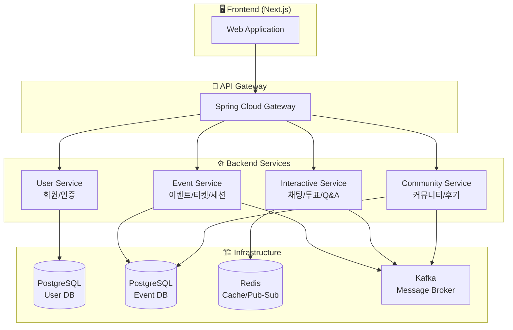
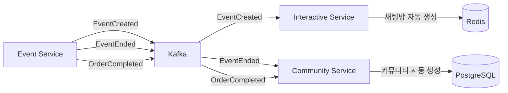
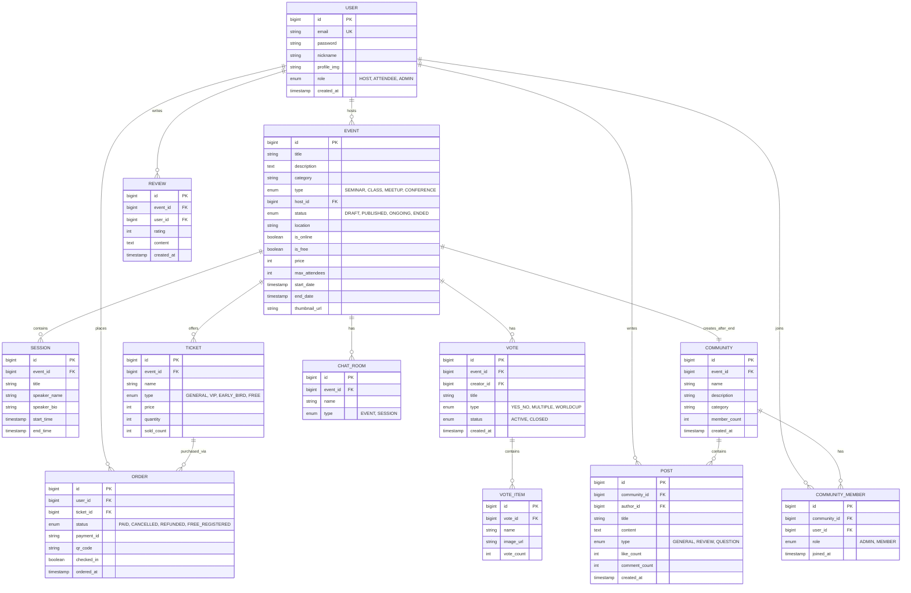
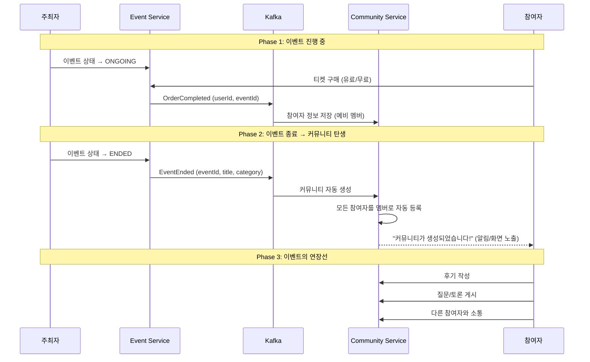
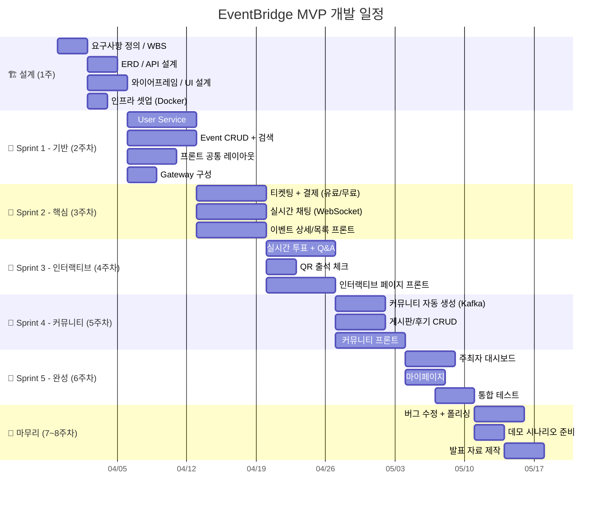
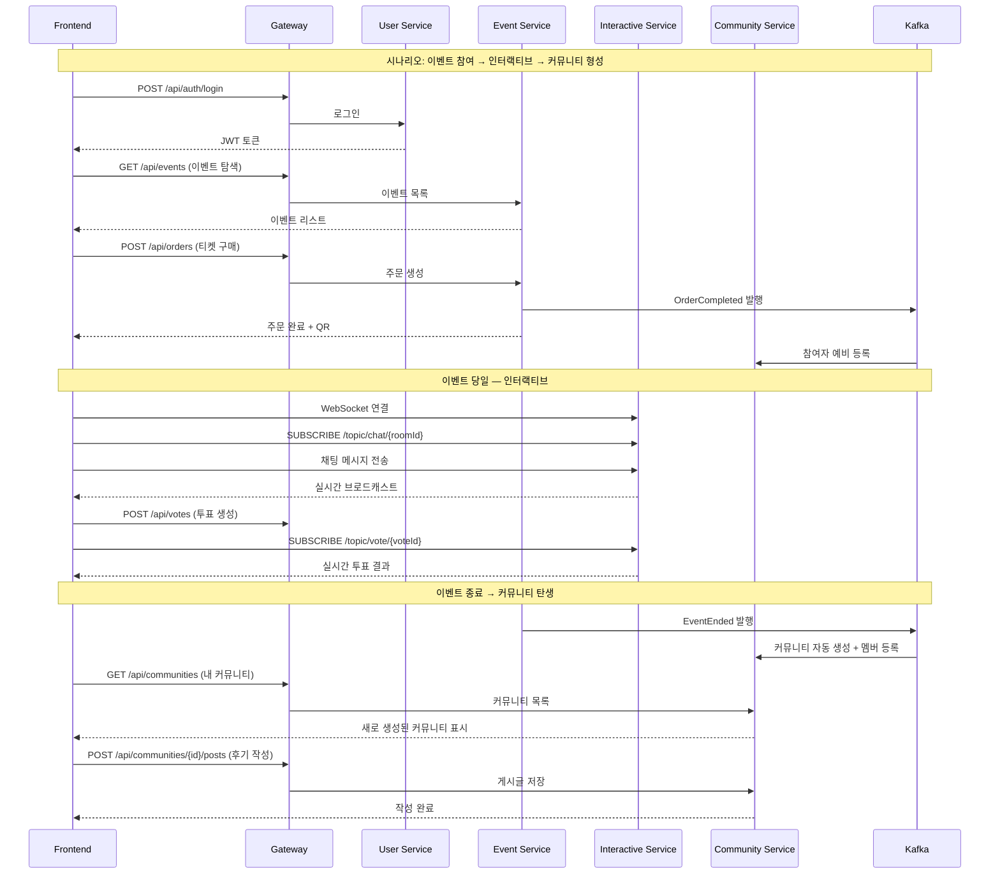

# 🏗️ EventBridge MVP 아키텍처 v2

> **핵심 컨셉:** "유료·무료 이벤트를 중계하고, 참여자 간 커뮤니티를 만들어 이벤트의 연장선을 이어가는 플랫폼"
>
> **제외 범위:** 라이브 스트리밍/웨비나 (영상 중계 기능 없음)

---

## 📌 1. 프로젝트 재정의

### "중계"의 의미

이 플랫폼에서 **중계**는 영상 송출이 아니라, **이벤트 주최자와 참여자를 연결하는 다리** 역할입니다.

```
주최자 ──[이벤트 등록]──▶ EventBridge ◀──[탐색/참여]── 참여자
                              │
                    ┌─────────┴─────────┐
                    │  이벤트 연장선      │
                    │  커뮤니티 자동 형성  │
                    │  참여자 간 소통     │
                    └───────────────────┘
```

### 핵심 가치 2가지

| # | 가치 | 설명 |
|---|------|------|
| 1 | **이벤트 중계** | 오프라인/온라인 이벤트를 한 플랫폼에서 개설·탐색·티켓팅하여 주최자↔참여자를 연결 |
| 2 | **커뮤니티 연장선** | 이벤트가 끝나도 참여자 간 소통이 이어지는 주제 기반 커뮤니티 자동 형성 |

### As-Is → To-Be (재정의)

| 구분 | 내용 |
|------|------|
| **As-Is** | ① 이벤트 개설은 인터파크, 커뮤니티는 네이버 카페, 투표는 구글폼 → **분산** ② 이벤트 끝나면 참여자 간 소통 단절 → **일회성** ③ 소상공인/개인은 이벤트 플랫폼 구축 불가 → **진입장벽** |
| **To-Be** | ① 이벤트 개설~티켓팅~인터랙티브~커뮤니티까지 **원스톱** ② 이벤트 종료 후 커뮤니티 자동 생성 → **지속적 연결** ③ 누구나 간편하게 이벤트 개설 → **접근성** |

---

## 📌 2. MVP 서비스 분리 (4개 서비스)



### 서비스별 역할

| 서비스 | 담당 기능 | DB | 핵심 기술 |
|--------|----------|-----|----------|
| **User Service** | 회원가입, 로그인/JWT, 프로필, 역할(HOST/ATTENDEE) | PostgreSQL (user_db) | Spring Security, JWT |
| **Event Service** | 이벤트 CRUD, 세션/프로그램, 티켓 생성, 주문/결제, 검색, QR 출석 | PostgreSQL (event_db) | JPA, 포트원 API, QR |
| **Interactive Service** | 실시간 채팅, 실시간 투표, 실시간 Q&A | Redis | WebSocket (STOMP), Redis Pub/Sub |
| **Community Service** | 커뮤니티 자동 생성, 게시판, 후기/리뷰, 댓글 | PostgreSQL (event_db 공유) | JPA, Kafka Consumer |

> **서비스 수: 4개** → PDF 요구사항(최소 3개) 충족 ✅

### 서비스 간 이벤트 흐름 (Kafka)



| Kafka Topic | Producer | Consumer | 트리거 |
|-------------|----------|----------|--------|
| `event.created` | Event Service | Interactive Service | 이벤트 생성 시 → 채팅방 자동 생성 |
| `event.ended` | Event Service | Community Service | 이벤트 종료 시 → **커뮤니티 자동 생성** |
| `order.completed` | Event Service | Community Service | 티켓 구매 시 → 커뮤니티 멤버 자동 등록 |

> **핵심:** 이벤트가 끝나면 Community Service가 Kafka 이벤트를 받아 **자동으로 커뮤니티를 생성**합니다. 참여자(티켓 구매자)는 자동 멤버로 등록됩니다. 이것이 "이벤트의 연장선"입니다.

---

## 📌 3. MVP 기능 목록

### 🟢 MVP Core — 이벤트 라이프사이클

```
[이벤트 전]                    [이벤트 중]                    [이벤트 후]
이벤트 개설                    실시간 채팅                    커뮤니티 자동 생성
세션/프로그램 등록              실시간 투표                    후기/리뷰
티켓 설정 (유료/무료)          실시간 Q&A                     참여자 간 소통
이벤트 탐색/검색               QR 출석 체크                   연관 이벤트 탐색
티켓 구매/등록                 참여 현황 모니터링
                                                            ← 이벤트의 연장선 →
```

### 기능 매트릭스

| # | 기능 | 서비스 | 라이프사이클 | 우선순위 | 난이도 |
|---|------|--------|------------|---------|--------|
| 1 | **회원가입/로그인 (JWT)** | User | — | ⭐⭐⭐ | 🟢 중 |
| 2 | **이벤트 CRUD** | Event | Before | ⭐⭐⭐ | 🟢 중 |
| 3 | **세션/프로그램 관리** | Event | Before | ⭐⭐ | 🟢 중 |
| 4 | **이벤트 탐색/검색/필터** | Event | Before | ⭐⭐⭐ | 🟢 중 |
| 5 | **티켓팅 (유료/무료 + 결제)** | Event | Before | ⭐⭐⭐ | 🔴 상 |
| 6 | **실시간 채팅** | Interactive | During | ⭐⭐⭐ | 🔴 상 |
| 7 | **실시간 투표** | Interactive | During | ⭐⭐⭐ | 🟡 중상 |
| 8 | **실시간 Q&A** | Interactive | During | ⭐⭐ | 🟡 중상 |
| 9 | **QR 출석 체크** | Event | During | ⭐⭐ | 🟢 하 |
| 10 | **커뮤니티 자동 생성** | Community | After | ⭐⭐⭐ | 🟡 중상 |
| 11 | **커뮤니티 게시판** | Community | After | ⭐⭐⭐ | 🟢 중 |
| 12 | **후기/리뷰** | Community | After | ⭐⭐ | 🟢 중 |
| 13 | **주최자 대시보드** | Event | — | ⭐⭐ | 🟡 중상 |

**기능 수: 13개** → PDF 요구사항(15개 이상) 근접, 보조 기능 추가로 충족

### 🔵 보조 기능 (여유 시 추가)

| # | 기능 | 서비스 |
|---|------|--------|
| 14 | 참가자 관리/명단 | Event |
| 15 | 댓글/대댓글 | Community |
| 16 | 이벤트 찜하기/북마크 | Event |
| 17 | 커뮤니티 그룹 채팅 | Interactive |
| 18 | 간단 통계 (참여율, 인기 이벤트) | Event |

**보조 포함 기능 수: 18개** → PDF 요구사항(15개 이상) 충족 ✅

---

## 📌 4. MVP ERD (12개 Entity)



**Entity 수: 12개** → PDF 요구사항(최소 5개) 충족 ✅

---

## 📌 5. 기술 스택

| 카테고리 | 기술 | 비고 |
|----------|------|------|
| **프론트엔드** | Next.js 14+ (App Router) | SSR + SEO, React 18 |
| **백엔드** | Spring Boot 3.x, Java 17 | RESTful API |
| **API Gateway** | Spring Cloud Gateway | 라우팅 + JWT 검증 |
| **DB** | PostgreSQL 15 | User DB, Event DB (논리적 분리) |
| **캐시** | Redis 7 | 세션, 캐시, Pub/Sub (실시간 채팅) |
| **메시지 브로커** | Apache Kafka | 서비스 간 비동기 이벤트 통신 |
| **실시간 통신** | WebSocket (STOMP) | 채팅, 투표, Q&A |
| **인증** | Spring Security + JWT | Access/Refresh Token |
| **결제** | 포트원(PortOne) API | 유료 티켓 결제 |
| **컨테이너** | Docker + Docker Compose | 로컬 개발 환경 |
| **CI/CD** | GitHub Actions | 빌드/테스트 자동화 |
| **모니터링** | Prometheus + Grafana | 기본 메트릭 |

---

## 📌 6. 프로젝트 구조 (모노레포)

```
team_project/
├── frontend/                    # Next.js 프론트엔드
│   ├── src/
│   │   ├── app/                 # App Router 페이지
│   │   │   ├── (auth)/          # 로그인/회원가입
│   │   │   ├── events/          # 이벤트 탐색/상세
│   │   │   │   └── [id]/        # 이벤트 상세 + 인터랙티브
│   │   │   ├── community/       # 커뮤니티
│   │   │   │   └── [id]/        # 커뮤니티 상세 (게시판)
│   │   │   ├── host/            # 주최자 대시보드
│   │   │   │   ├── events/new/  # 이벤트 생성
│   │   │   │   └── dashboard/   # 관리 대시보드
│   │   │   └── mypage/          # 마이페이지
│   │   ├── components/
│   │   │   ├── common/          # 공통 UI (Button, Card, Modal)
│   │   │   ├── event/           # 이벤트 관련 컴포넌트
│   │   │   ├── interactive/     # 채팅/투표/Q&A 컴포넌트
│   │   │   └── community/       # 커뮤니티 컴포넌트
│   │   ├── hooks/               # Custom Hooks (useChat, useVote)
│   │   ├── lib/                 # API 클라이언트, 유틸, WebSocket
│   │   └── styles/              # 글로벌 스타일
│   └── package.json
│
├── backend/
│   ├── gateway/                 # API Gateway
│   │   └── src/main/java/
│   │       └── com/eventbridge/gateway/
│   │
│   ├── user-service/            # 회원/인증 서비스
│   │   └── src/main/java/
│   │       └── com/eventbridge/user/
│   │           ├── controller/
│   │           ├── service/
│   │           ├── repository/
│   │           ├── entity/
│   │           ├── dto/
│   │           ├── config/      # Security, JWT Config
│   │           └── exception/
│   │
│   ├── event-service/           # 이벤트/티켓 서비스
│   │   └── src/main/java/
│   │       └── com/eventbridge/event/
│   │           ├── controller/
│   │           │   ├── EventController.java
│   │           │   ├── TicketController.java
│   │           │   ├── OrderController.java
│   │           │   └── SessionController.java
│   │           ├── service/
│   │           ├── repository/
│   │           ├── entity/
│   │           ├── dto/
│   │           └── kafka/       # Kafka Producer (이벤트 발행)
│   │
│   ├── interactive-service/     # 실시간 인터랙티브 서비스
│   │   └── src/main/java/
│   │       └── com/eventbridge/interactive/
│   │           ├── controller/
│   │           ├── websocket/
│   │           │   ├── ChatHandler.java
│   │           │   ├── VoteHandler.java
│   │           │   └── QnaHandler.java
│   │           ├── service/
│   │           ├── config/      # WebSocket, Redis Config
│   │           └── kafka/       # Kafka Consumer (채팅방 자동 생성)
│   │
│   ├── community-service/       # 커뮤니티 서비스
│   │   └── src/main/java/
│   │       └── com/eventbridge/community/
│   │           ├── controller/
│   │           │   ├── CommunityController.java
│   │           │   ├── PostController.java
│   │           │   └── ReviewController.java
│   │           ├── service/
│   │           ├── repository/
│   │           ├── entity/
│   │           ├── dto/
│   │           └── kafka/       # Kafka Consumer (커뮤니티 자동 생성)
│   │
│   └── common/                  # 공통 모듈
│       └── src/main/java/
│           └── com/eventbridge/common/
│               ├── dto/         # 공통 Response DTO
│               ├── exception/   # 공통 예외
│               └── util/        # JWT 유틸 등
│
├── infra/
│   ├── docker-compose.yml
│   ├── .env.example
│   ├── prometheus/
│   └── grafana/
│
├── docs/
│   ├── api/                     # API 명세서
│   ├── erd/                     # ERD
│   └── wireframe/               # 와이어프레임
│
└── .github/
    └── workflows/
        ├── ci.yml
        └── deploy.yml
```

---

## 📌 7. MVP API 목록

### User Service (7 APIs)

| Method | Endpoint | 설명 |
|--------|----------|------|
| POST | `/api/auth/signup` | 회원가입 |
| POST | `/api/auth/login` | 로그인 (JWT 발급) |
| POST | `/api/auth/refresh` | 토큰 갱신 |
| GET | `/api/users/me` | 내 정보 조회 |
| PUT | `/api/users/me` | 내 정보 수정 |
| GET | `/api/users/{id}` | 사용자 프로필 조회 |
| POST | `/api/auth/logout` | 로그아웃 |

### Event Service (20 APIs)

| Method | Endpoint | 설명 |
|--------|----------|------|
| POST | `/api/events` | 이벤트 생성 |
| GET | `/api/events` | 이벤트 목록 (카테고리/날짜/가격/유무료 필터 + 페이징) |
| GET | `/api/events/{id}` | 이벤트 상세 |
| PUT | `/api/events/{id}` | 이벤트 수정 |
| DELETE | `/api/events/{id}` | 이벤트 삭제 |
| PATCH | `/api/events/{id}/status` | 이벤트 상태 변경 (DRAFT→PUBLISHED→ONGOING→ENDED) |
| GET | `/api/events/search` | 이벤트 통합 검색 (키워드) |
| POST | `/api/events/{id}/sessions` | 세션 등록 |
| GET | `/api/events/{id}/sessions` | 세션 목록 |
| PUT | `/api/sessions/{id}` | 세션 수정 |
| DELETE | `/api/sessions/{id}` | 세션 삭제 |
| POST | `/api/events/{id}/tickets` | 티켓 생성 (유료/무료) |
| GET | `/api/events/{id}/tickets` | 티켓 목록 |
| POST | `/api/orders` | 티켓 구매/무료 등록 |
| GET | `/api/orders/my` | 내 주문 목록 |
| POST | `/api/orders/{id}/cancel` | 주문 취소/환불 |
| POST | `/api/payments/confirm` | 결제 승인 콜백 (포트원) |
| GET | `/api/orders/{id}/qr` | QR 코드 조회 |
| POST | `/api/events/{id}/check-in` | QR 출석 체크 |
| GET | `/api/host/events` | 주최자 이벤트 관리 목록 |

### Interactive Service (10 APIs — REST + WebSocket)

| Type | Endpoint | 설명 |
|------|----------|------|
| WS | `/ws/connect` | WebSocket 연결 (STOMP) |
| WS-SUB | `/topic/chat/{roomId}` | 채팅방 구독 |
| WS-PUB | `/app/chat/{roomId}` | 채팅 메시지 전송 |
| WS-SUB | `/topic/vote/{voteId}` | 투표 실시간 구독 |
| WS-PUB | `/app/vote/{voteId}` | 투표 참여 |
| WS-SUB | `/topic/qna/{eventId}` | Q&A 실시간 구독 |
| WS-PUB | `/app/qna/{eventId}` | 질문 등록 |
| POST | `/api/votes` | 투표 생성 (주최자) |
| GET | `/api/events/{id}/votes` | 투표 목록 |
| GET | `/api/votes/{id}/results` | 투표 결과 조회 |

### Community Service (13 APIs)

| Method | Endpoint | 설명 |
|--------|----------|------|
| GET | `/api/communities` | 커뮤니티 목록 (내 커뮤니티 / 전체) |
| GET | `/api/communities/{id}` | 커뮤니티 상세 |
| POST | `/api/communities/{id}/join` | 커뮤니티 가입 |
| DELETE | `/api/communities/{id}/leave` | 커뮤니티 탈퇴 |
| GET | `/api/communities/{id}/members` | 멤버 목록 |
| POST | `/api/communities/{id}/posts` | 게시글 작성 |
| GET | `/api/communities/{id}/posts` | 게시글 목록 (필터: 전체/후기/질문) |
| GET | `/api/posts/{id}` | 게시글 상세 |
| PUT | `/api/posts/{id}` | 게시글 수정 |
| DELETE | `/api/posts/{id}` | 게시글 삭제 |
| POST | `/api/posts/{id}/like` | 게시글 좋아요 |
| POST | `/api/events/{id}/reviews` | 이벤트 후기 작성 |
| GET | `/api/events/{id}/reviews` | 이벤트 후기 목록 |

**총 API 수: 50개** → PDF 요구사항(20개 이상) 충족 ✅

---

## 📌 8. MVP 핵심 페이지 (8개)

| # | 페이지 | 경로 | 핵심 기능 |
|---|--------|------|----------|
| 1 | 🏠 **메인 홈** | `/` | 이벤트 목록, 카테고리 필터, 검색, 인기/추천 |
| 2 | 🔐 **로그인/회원가입** | `/auth/login`, `/auth/signup` | JWT 인증 |
| 3 | 📄 **이벤트 상세** | `/events/[id]` | 이벤트 정보, 세션 타임테이블, 티켓 구매, 후기 |
| 4 | ✏️ **이벤트 생성** | `/host/events/new` | 이벤트 생성 위자드 (정보→세션→티켓→공개) |
| 5 | 💬 **이벤트 인터랙티브** | `/events/[id]/live` | 실시간 채팅 + 투표 + Q&A (좌우 2-사이드) |
| 6 | 👥 **커뮤니티** | `/community/[id]` | 게시판 (일반/후기/질문), 멤버 목록 |
| 7 | 👤 **마이페이지** | `/mypage` | 내 티켓(QR), 참여 이력, 내 커뮤니티 |
| 8 | 📊 **주최자 대시보드** | `/host/dashboard` | 이벤트 관리, 참가자 목록, 기본 통계 |

### 이벤트 인터랙티브 페이지 레이아웃

> `idea note.md`의 아이디어 반영 — **좌우 2-사이드 레이아웃**

```
┌─────────────────────────────────────────────────────┐
│  📄 이벤트 인터랙티브 페이지 (/events/[id]/live)     │
├──────────────────────┬──────────────────────────────┤
│                      │  [채팅] [투표] [Q&A]  ← 탭    │
│   이벤트 정보         │ ┌──────────────────────────┐ │
│   세션 타임테이블      │ │                          │ │
│   연사 소개           │ │   실시간 채팅 / 투표 /     │ │
│   공지사항            │ │   Q&A 영역               │ │
│                      │ │                          │ │
│   (보는 영역)         │ │   (참여하는 영역)          │ │
│                      │ └──────────────────────────┘ │
├──────────────────────┴──────────────────────────────┤
│  📱 모바일: 위(정보) ↕ 아래(채팅/투표/Q&A 스와이프)    │
└─────────────────────────────────────────────────────┘
```

---

## 📌 9. "이벤트 연장선" 커뮤니티 자동 생성 흐름

이 프로젝트의 핵심 차별화 포인트입니다.



### 커뮤니티 자동 생성 규칙

| 규칙 | 설명 |
|------|------|
| **생성 시점** | 이벤트 상태가 `ENDED`로 변경될 때 |
| **커뮤니티 이름** | `[이벤트 제목] 커뮤니티` (자동) |
| **카테고리** | 이벤트 카테고리 상속 |
| **자동 멤버** | 티켓 구매/무료 등록한 모든 참여자 |
| **관리자** | 이벤트 주최자가 커뮤니티 ADMIN |
| **외부 가입** | 이벤트 미참여자도 커뮤니티 가입 가능 (선택) |

---

## 📌 10. 사용자 플로우

### 주최자 플로우
```
이벤트 생성 (위자드) → 세션/프로그램 등록 → 티켓 설정 (유료/무료)
    → 이벤트 공개 (PUBLISHED) → 참가자 접수
    → 당일: 이벤트 시작 (ONGOING) → QR 출석 확인 → 투표/Q&A 관리
    → 이벤트 종료 (ENDED) → 커뮤니티 자동 생성 → 후기 확인
    → 주최자 대시보드에서 통계 확인
```

### 참여자 플로우
```
이벤트 탐색/검색 → 이벤트 상세 확인 → 티켓 구매 (유료) 또는 무료 등록
    → 당일: QR 입장 (오프라인) or 인터랙티브 페이지 접속
    → 실시간 참여 (채팅, 투표, Q&A)
    → 이벤트 종료 → 자동으로 커뮤니티 멤버 등록
    → 후기 작성 → 다른 참여자와 소통 → 관련 이벤트 탐색
```

---

## 📌 11. Docker Compose 구성

```yaml
# infra/docker-compose.yml
version: '3.8'

services:
  # ─── Databases ────────────────────────
  user-db:
    image: postgres:15
    environment:
      POSTGRES_DB: user_db
      POSTGRES_USER: ${DB_USER}
      POSTGRES_PASSWORD: ${DB_PASSWORD}
    ports:
      - "5433:5432"
    volumes:
      - user-db-data:/var/lib/postgresql/data

  event-db:
    image: postgres:15
    environment:
      POSTGRES_DB: event_db
      POSTGRES_USER: ${DB_USER}
      POSTGRES_PASSWORD: ${DB_PASSWORD}
    ports:
      - "5434:5432"
    volumes:
      - event-db-data:/var/lib/postgresql/data

  # ─── Cache / Real-time ────────────────
  redis:
    image: redis:7-alpine
    ports:
      - "6379:6379"
    command: redis-server --maxmemory 256mb --maxmemory-policy allkeys-lru

  # ─── Message Broker ──────────────────
  zookeeper:
    image: confluentinc/cp-zookeeper:7.5.0
    environment:
      ZOOKEEPER_CLIENT_PORT: 2181

  kafka:
    image: confluentinc/cp-kafka:7.5.0
    depends_on:
      - zookeeper
    ports:
      - "9092:9092"
    environment:
      KAFKA_BROKER_ID: 1
      KAFKA_ZOOKEEPER_CONNECT: zookeeper:2181
      KAFKA_ADVERTISED_LISTENERS: PLAINTEXT://kafka:29092,EXTERNAL://localhost:9092
      KAFKA_LISTENER_SECURITY_PROTOCOL_MAP: PLAINTEXT:PLAINTEXT,EXTERNAL:PLAINTEXT
      KAFKA_OFFSETS_TOPIC_REPLICATION_FACTOR: 1

  # ─── Backend Services ────────────────
  gateway:
    build: ../backend/gateway
    ports:
      - "8080:8080"
    depends_on:
      - user-service
      - event-service
      - interactive-service
      - community-service

  user-service:
    build: ../backend/user-service
    ports:
      - "8081:8081"
    depends_on:
      - user-db
      - redis
    environment:
      SPRING_DATASOURCE_URL: jdbc:postgresql://user-db:5432/user_db
      SPRING_REDIS_HOST: redis
      JWT_SECRET: ${JWT_SECRET}

  event-service:
    build: ../backend/event-service
    ports:
      - "8082:8082"
    depends_on:
      - event-db
      - redis
      - kafka
    environment:
      SPRING_DATASOURCE_URL: jdbc:postgresql://event-db:5432/event_db
      SPRING_REDIS_HOST: redis
      SPRING_KAFKA_BOOTSTRAP_SERVERS: kafka:29092
      PORTONE_API_KEY: ${PORTONE_API_KEY}
      PORTONE_API_SECRET: ${PORTONE_API_SECRET}

  interactive-service:
    build: ../backend/interactive-service
    ports:
      - "8083:8083"
    depends_on:
      - redis
      - kafka
    environment:
      SPRING_REDIS_HOST: redis
      SPRING_KAFKA_BOOTSTRAP_SERVERS: kafka:29092

  community-service:
    build: ../backend/community-service
    ports:
      - "8084:8084"
    depends_on:
      - event-db
      - kafka
    environment:
      SPRING_DATASOURCE_URL: jdbc:postgresql://event-db:5432/event_db
      SPRING_KAFKA_BOOTSTRAP_SERVERS: kafka:29092

  # ─── Monitoring (Optional) ───────────
  prometheus:
    image: prom/prometheus
    ports:
      - "9090:9090"
    volumes:
      - ./prometheus/prometheus.yml:/etc/prometheus/prometheus.yml

  grafana:
    image: grafana/grafana
    ports:
      - "3001:3000"
    depends_on:
      - prometheus

volumes:
  user-db-data:
  event-db-data:
```

---

## 📌 12. 개발 스프린트 계획 (8주)



---

## 📌 13. 팀원 역할 분배 (5인 기준)

| 역할 | 인원 | 담당 |
|------|------|------|
| **프론트엔드 A** | 1명 | 메인 홈, 이벤트 상세, 검색/필터, 이벤트 생성 |
| **프론트엔드 B** | 1명 | 인터랙티브 페이지(채팅/투표/Q&A), 커뮤니티, 마이페이지 |
| **백엔드 - User + Gateway** | 1명 | 인증/JWT, API Gateway, 보안 |
| **백엔드 - Event** | 1명 | 이벤트 CRUD, 티켓팅, 결제, QR, 주최자 대시보드 |
| **백엔드 - Interactive + Community** | 1명 | WebSocket 채팅/투표/Q&A, Kafka 연동, 커뮤니티 자동 생성 |

---

## 📌 14. 서비스 간 통신 시퀀스



---

## 📌 15. 데모 시나리오

> **1. 주최자 시나리오** — "소상공인이 원데이 쿠킹 클래스를 개설"
> - 이벤트 생성 → 세션 등록 → 유료 티켓 설정 (₩30,000) + 무료 체험권 → 공개
>
> **2. 참여자 시나리오** — "사용자가 이벤트를 발견하고 참여"
> - 이벤트 탐색 → 상세 확인 → 유료 티켓 구매 (포트원 결제) → QR 입장
>
> **3. 인터랙티브 시나리오** — "이벤트 중 실시간 참여"
> - 실시간 채팅 → 투표 (이상형 월드컵) → Q&A (좋아요 기반 상위 노출)
>
> **4. 커뮤니티 시나리오 (핵심)** — "이벤트 후 연장선"
> - 이벤트 종료 → **커뮤니티 자동 생성** → 참여자 자동 멤버 등록
> - 후기 작성 → 레시피 공유 → 다음 클래스 정보 소통

---

## 📌 요약

| ✅ MVP에 넣는 것 | ❌ 제외 (2차 이후) |
|-----------------|------------------|
| 회원/JWT 인증 | 라이브 스트리밍/웨비나 |
| 이벤트 CRUD + 검색 | 노코드 페이지 에디터 |
| 유료/무료 티켓팅 + 결제 | 정산 시스템 |
| 실시간 채팅 | AI 이벤트 추천 |
| 실시간 투표 + Q&A | 퀴즈쇼/잼라이브 |
| QR 출석 | 이모지 리액션 |
| **커뮤니티 자동 생성** | 포인트/레벨/어치브먼트 |
| 게시판 + 후기 | 설문조사 |
| 주최자 대시보드 | 알림 시스템 (카카오/이메일) |
| Docker Compose | Kubernetes |

---

> **MVP 성공 기준:**
> 데모에서 "주최자가 이벤트를 만들고 → 참여자가 티켓을 구매하고 → 실시간 채팅/투표로 참여하고 → **이벤트 종료 후 커뮤니티가 자동 생성되어 참여자들이 소통을 이어가는**" End-to-End 시나리오를 끊김 없이 시연할 수 있으면 MVP는 성공입니다.
