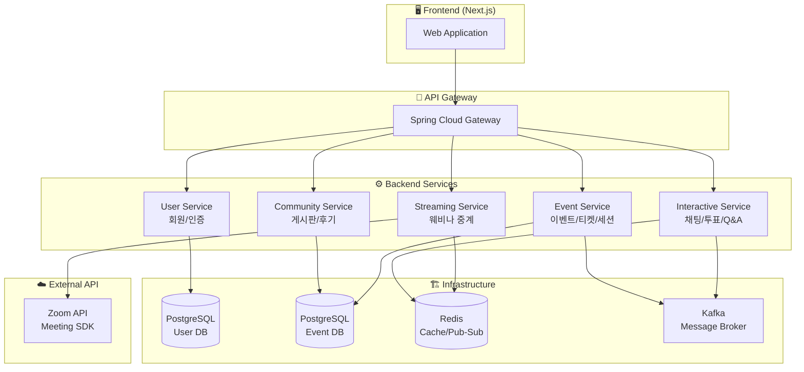
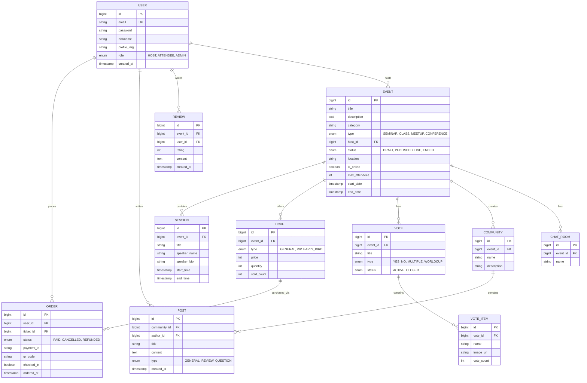
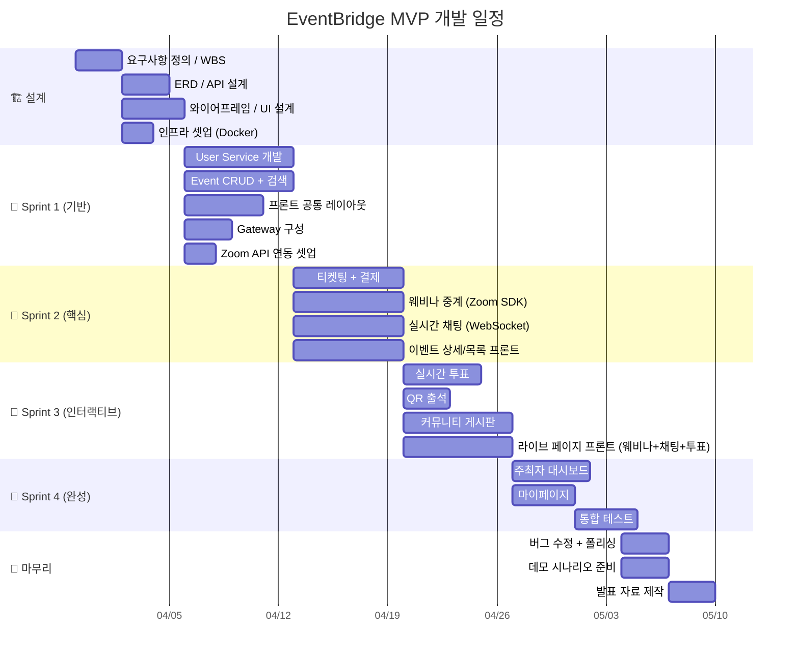
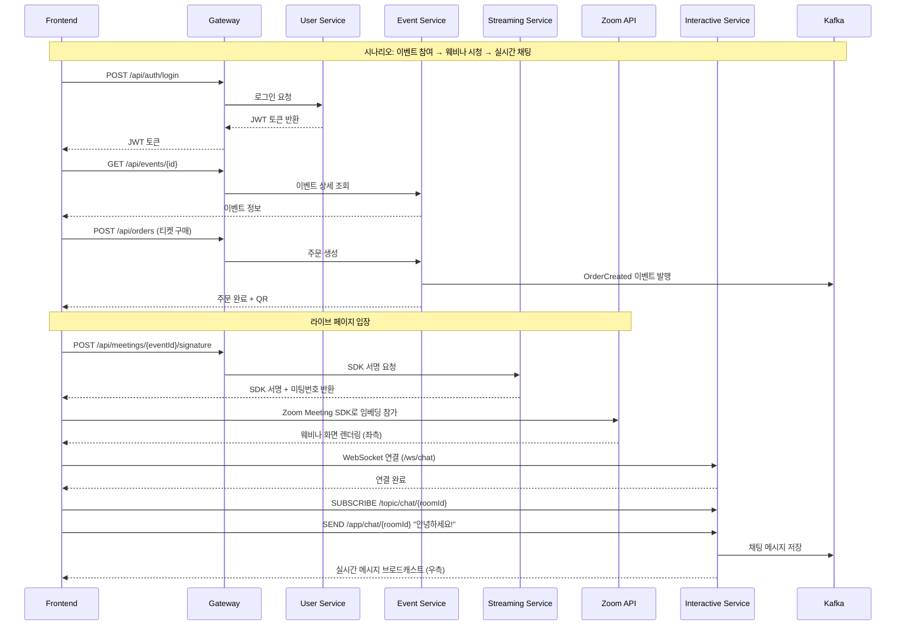

# 🏗️ EventBridge MVP 아키텍처 제안서

> **목표:** 8주 내 데모 가능한 최소 핵심 제품 — "주최자가 이벤트를 만들고, 참여자가 실시간 웨비나와 인터랙티브 기능으로 참여하는" End-to-End 시나리오 완성

---

## 📌 1. MVP 범위 선정 원칙

기획서의 31개 기능 중, **데모 시나리오를 완성**할 수 있는 최소 기능만 선별합니다.

| 원칙 | 설명 |
|------|------|
| 🎯 **E2E 시나리오 우선** | "이벤트 개설 → 티켓 → 실시간 참여 → 커뮤니티"까지 끊김 없는 흐름 |
| 🔥 **차별화 기능 포함** | 실시간 인터랙티브(투표/채팅)를 반드시 포함해야 기존 서비스와 차별화 |
| ⚙️ **MSA 최소 3개** | PDF 요구사항 충족하면서도 과도한 분산 방지 |
| 📦 **복잡도 제어** | 노코드 에디터, AI 추천, 정산 등 고난이도 기능은 2차로 미룸 |

---

## 📌 2. MVP 서비스 분리 (5개 서비스)

> [!IMPORTANT]
> 기획서의 7개에서 **5개로 축소**합니다. 기능이 아니라 "팀원 배분"과 "독립 배포"를 기준으로 나눕니다. **웨비나 중계는 플랫폼의 정체성("이벤트 중계")이므로 MVP 필수입니다.**



### 서비스별 역할

| 서비스 | 담당 기능 | DB | 핵심 기술 |
|--------|----------|-----|----------|
| **User Service** | 회원가입, 로그인/JWT, 프로필, 역할(HOST/ATTENDEE) | PostgreSQL (user_db) | Spring Security, JWT, OAuth2 |
| **Event Service** | 이벤트 CRUD, 세션/프로그램, 티켓 생성, 주문/결제, 이벤트 검색, QR 출석 | PostgreSQL (event_db) | JPA, 포트원 API, QR 생성 |
| **Streaming Service** | 웨비나 중계, Zoom 미팅 생성, 참가 URL/서명 발급 | Redis (세션) | Zoom API, Zoom Meeting SDK |
| **Interactive Service** | 실시간 채팅, 실시간 투표, 실시간 Q&A | Redis + Kafka | WebSocket (STOMP), Redis Pub/Sub |
| **Community Service** | 커뮤니티 게시판, 후기/리뷰, 댓글 | PostgreSQL (event_db 공유) | JPA, 파일 업로드 |

> [!TIP]
> **왜 5개인가?** — 웨비나 중계는 이 플랫폼의 정체성("이벤트 중계")이므로 MVP 필수입니다. **Zoom API**를 활용하면 미디어 서버 인프라 없이 SDK 임베딩만으로 웨비나를 구현할 수 있어 8주 MVP에 최적입니다.

### 💡 웨비나 구현 전략: Zoom API + Meeting SDK

> [!NOTE]
> WebRTC를 직접 구현하거나 미디어 서버를 운영하면 8주 MVP에서 부담이 큽니다. 대신 **Zoom API**를 활용하여 미팅 생성/관리는 백엔드에서, 화면 임베딩은 프론트에서 처리합니다.

| 항목 | 설명 |
|------|------|
| **Zoom API** | Server-to-Server OAuth로 미팅 생성/삭제/조회 (REST API) |
| **Zoom Meeting SDK** | 웹 페이지 내에 Zoom 미팅 화면을 iframe으로 임베딩 |
| **주최자(Host)** | Streaming Service에서 Zoom 미팅 생성 → 호스트 URL로 시작 |
| **참여자(Attendee)** | 라이브 페이지에서 Meeting SDK로 Zoom 화면 임베딩 시청 |
| **Streaming Service 역할** | Zoom API를 래핑하여 미팅 생성, 서명(signature) 발급, 상태 관리 |
| **비용** | Zoom 기본 플랜(무료) — 40분 제한, 100명 / 유료 플랜 시 무제한 |

```
주최자 브라우저                   Zoom Cloud                참여자 브라우저
  (호스트 시작)  ──Zoom SDK──▶  (미디어 중계)  ──Zoom SDK──▶  (임베딩 시청)
       │                            │                          │
       └──── Streaming Service (미팅 생성, SDK 서명 발급) ──────┘
```

> **향후 확장:** MVP 이후 LiveKit(오픈소스 WebRTC) 등으로 자체 미디어 서버로 전환 가능

---

## 📌 3. MVP 기능 목록 (10개 핵심 + 보조)

### 🟢 MVP Core (반드시 구현)

| # | 기능 | 서비스 | 우선순위 | 난이도 |
|---|------|--------|---------|--------|
| 1 | **회원가입/로그인 (JWT)** | User | ⭐⭐⭐ | 🟢 중 |
| 2 | **이벤트 CRUD** | Event | ⭐⭐⭐ | 🟢 중 |
| 3 | **이벤트 목록/검색** | Event | ⭐⭐⭐ | 🟢 중 |
| 4 | **이벤트 상세페이지** | Event | ⭐⭐⭐ | 🟢 중 |
| 5 | **티켓팅 (결제 연동)** | Event | ⭐⭐⭐ | 🔴 상 |
| 6 | **웨비나 중계 (Zoom SDK)** | Streaming | ⭐⭐⭐ | 🟢 중 |
| 7 | **실시간 채팅** | Interactive | ⭐⭐⭐ | 🔴 상 |
| 8 | **실시간 투표** | Interactive | ⭐⭐⭐ | 🟡 중상 |
| 9 | **QR 출석 체크** | Event | ⭐⭐ | 🟢 하 |
| 10 | **커뮤니티 게시판** | Community | ⭐⭐ | 🟢 중 |
| 11 | **주최자 대시보드 (기본)** | Event | ⭐⭐ | 🟡 중상 |

### 🔵 MVP 보조 (여유 시 추가)

| # | 기능 | 서비스 |
|---|------|--------|
| 11 | 실시간 Q&A | Interactive |
| 12 | 후기/리뷰 작성 | Community |
| 13 | 참가자 관리/목록 | Event |

---

## 📌 4. MVP ERD (10개 Entity)

> [!NOTE]
> 기획서의 20개에서 **10개로 축소**합니다. MVP와 무관한 Entity(ACHIEVEMENT, SURVEY, NOTIFICATION 등)는 제외합니다.



---

## 📌 5. MVP 기술 스택 (경량화)

| 카테고리 | MVP 기술 | 비고 |
|----------|---------|------|
| **프론트엔드** | Next.js 14+ (App Router) | SSR + SEO, React 18 |
| **백엔드** | Spring Boot 3.x, Java 17 | RESTful API |
| **API Gateway** | Spring Cloud Gateway | 라우팅 + JWT 검증 |
| **DB** | PostgreSQL 15 | User DB, Event DB (논리적 분리) |
| **캐시/실시간** | Redis 7 | 세션, 캐시, Pub/Sub |
| **메시지 브로커** | Apache Kafka | 서비스 간 비동기 통신 |
| **실시간 통신** | WebSocket (STOMP) | 채팅, 투표, Q&A |
| **웨비나/미디어** | Zoom API + Meeting SDK | Server-to-Server OAuth, 프론트 임베딩 |
| **인증** | Spring Security + JWT | Access/Refresh Token |
| **결제** | 포트원(PortOne) API | 테스트 모드 사용 |
| **컨테이너** | Docker + Docker Compose | 로컬 개발 환경 |
| **CI/CD** | GitHub Actions | 빌드/테스트 자동화 |
| **모니터링** | Prometheus + Grafana | 기본 메트릭만 |

> [!WARNING]
> MVP에서 **제외**하는 기술: Kubernetes(Docker Compose로 대체), Elasticsearch(JPA 쿼리로 대체), MongoDB(Redis로 채팅 캐싱)

---

## 📌 6. 프로젝트 구조 (모노레포)

```
team_project/
├── frontend/                    # Next.js 프론트엔드
│   ├── src/
│   │   ├── app/                 # App Router 페이지
│   │   │   ├── (auth)/          # 로그인/회원가입
│   │   │   ├── events/          # 이벤트 탐색/상세
│   │   │   ├── live/            # 라이브 화면 (채팅/투표)
│   │   │   ├── community/       # 커뮤니티
│   │   │   ├── host/            # 주최자 대시보드
│   │   │   └── mypage/          # 마이페이지
│   │   ├── components/          # 공통 컴포넌트
│   │   ├── hooks/               # Custom Hooks
│   │   ├── lib/                 # API 클라이언트, 유틸
│   │   └── styles/              # 글로벌 스타일
│   └── package.json
│
├── backend/
│   ├── gateway/                 # API Gateway (Spring Cloud Gateway)
│   │   └── src/main/
│   │
│   ├── user-service/            # 회원/인증 서비스
│   │   └── src/main/java/
│   │       └── com/eventbridge/user/
│   │           ├── controller/
│   │           ├── service/
│   │           ├── repository/
│   │           ├── entity/
│   │           ├── dto/
│   │           ├── config/      # Security, JWT Config
│   │           └── exception/
│   │
│   ├── event-service/           # 이벤트/티켓 서비스
│   │   └── src/main/java/
│   │       └── com/eventbridge/event/
│   │           ├── controller/
│   │           │   ├── EventController.java
│   │           │   ├── TicketController.java
│   │           │   ├── OrderController.java
│   │           │   └── SessionController.java
│   │           ├── service/
│   │           ├── repository/
│   │           ├── entity/
│   │           └── dto/
│   │
│   ├── streaming-service/       # 웨비나 중계 서비스
│   │   └── src/main/java/
│   │       └── com/eventbridge/streaming/
│   │           ├── controller/
│   │           │   └── MeetingController.java
│   │           ├── service/
│   │           │   ├── ZoomApiService.java
│   │           │   └── MeetingSignatureService.java
│   │           ├── dto/
│   │           └── config/      # Zoom API Config
│   │
│   ├── interactive-service/     # 실시간 인터랙티브 서비스
│   │   └── src/main/java/
│   │       └── com/eventbridge/interactive/
│   │           ├── controller/
│   │           ├── websocket/   # STOMP 핸들러
│   │           │   ├── ChatWebSocketHandler.java
│   │           │   └── VoteWebSocketHandler.java
│   │           ├── service/
│   │           └── config/      # WebSocket Config
│   │
│   ├── community-service/       # 커뮤니티 서비스
│   │   └── src/main/java/
│   │       └── com/eventbridge/community/
│   │           ├── controller/
│   │           ├── service/
│   │           ├── repository/
│   │           └── entity/
│   │
│   └── common/                  # 공통 모듈 (DTO, Exception, Util)
│       └── src/main/java/
│           └── com/eventbridge/common/
│
├── infra/
│   ├── docker-compose.yml       # 로컬 개발 환경
│   ├── docker-compose.prod.yml  # 프로덕션 환경
│   ├── .env.example
│   ├── prometheus/
│   │   └── prometheus.yml
│   └── grafana/
│       └── dashboards/
│
├── docs/
│   ├── api/                     # API 명세서
│   ├── erd/                     # ERD 다이어그램
│   └── architecture/            # 아키텍처 문서
│
└── .github/
    └── workflows/
        ├── ci.yml               # PR 빌드/테스트
        └── deploy.yml           # 배포
```

---

## 📌 7. MVP 핵심 API 목록

### User Service (8 APIs)

| Method | Endpoint | 설명 |
|--------|----------|------|
| POST | `/api/auth/signup` | 회원가입 |
| POST | `/api/auth/login` | 로그인 (JWT 발급) |
| POST | `/api/auth/refresh` | 토큰 갱신 |
| GET | `/api/users/me` | 내 정보 조회 |
| PUT | `/api/users/me` | 내 정보 수정 |
| GET | `/api/users/{id}` | 사용자 프로필 조회 |
| POST | `/api/auth/oauth/{provider}` | 소셜 로그인 |
| POST | `/api/auth/logout` | 로그아웃 |

### Event Service (18 APIs)

| Method | Endpoint | 설명 |
|--------|----------|------|
| POST | `/api/events` | 이벤트 생성 |
| GET | `/api/events` | 이벤트 목록 (필터/페이징) |
| GET | `/api/events/{id}` | 이벤트 상세 |
| PUT | `/api/events/{id}` | 이벤트 수정 |
| DELETE | `/api/events/{id}` | 이벤트 삭제 |
| PATCH | `/api/events/{id}/status` | 이벤트 상태 변경 |
| POST | `/api/events/{id}/sessions` | 세션 등록 |
| GET | `/api/events/{id}/sessions` | 세션 목록 |
| POST | `/api/events/{id}/tickets` | 티켓 생성 |
| GET | `/api/events/{id}/tickets` | 티켓 목록 |
| POST | `/api/orders` | 티켓 구매 (결제) |
| GET | `/api/orders/my` | 내 주문 목록 |
| POST | `/api/orders/{id}/cancel` | 주문 취소 |
| POST | `/api/payments/confirm` | 결제 승인 콜백 |
| GET | `/api/orders/{id}/qr` | QR 코드 조회 |
| POST | `/api/events/{id}/check-in` | QR 출석 체크 |
| GET | `/api/host/events` | 주최자 이벤트 관리 |
| GET | `/api/host/events/{id}/attendees` | 참가자 목록 |

### Streaming Service (6 APIs)

| Method | Endpoint | 설명 |
|--------|----------|------|
| POST | `/api/meetings` | Zoom 미팅 생성 (이벤트 연동) |
| GET | `/api/meetings/{eventId}` | 미팅 정보 조회 (join URL 포함) |
| POST | `/api/meetings/{eventId}/signature` | Meeting SDK 서명 발급 (프론트 임베딩용) |
| DELETE | `/api/meetings/{eventId}` | 미팅 삭제 |
| PATCH | `/api/meetings/{eventId}/status` | 미팅 상태 변경 (시작/종료) |
| GET | `/api/meetings/{eventId}/participants` | 참여자 현황 조회 (Zoom Dashboard API) |

### Interactive Service (8 APIs + WebSocket)

| Type | Endpoint | 설명 |
|------|----------|------|
| WS | `/ws/chat` | 채팅 WebSocket 연결 |
| WS-SUB | `/topic/chat/{roomId}` | 채팅방 구독 |
| WS-PUB | `/app/chat/{roomId}` | 메시지 전송 |
| POST | `/api/votes` | 투표 생성 |
| GET | `/api/events/{id}/votes` | 투표 목록 |
| WS-SUB | `/topic/vote/{voteId}` | 투표 실시간 구독 |
| WS-PUB | `/app/vote/{voteId}` | 투표 참여 |
| GET | `/api/votes/{id}/results` | 투표 결과 조회 |

### Community Service (8 APIs)

| Method | Endpoint | 설명 |
|--------|----------|------|
| GET | `/api/communities` | 커뮤니티 목록 |
| GET | `/api/communities/{id}` | 커뮤니티 상세 |
| POST | `/api/communities/{id}/posts` | 게시글 작성 |
| GET | `/api/communities/{id}/posts` | 게시글 목록 |
| GET | `/api/posts/{id}` | 게시글 상세 |
| PUT | `/api/posts/{id}` | 게시글 수정 |
| DELETE | `/api/posts/{id}` | 게시글 삭제 |
| POST | `/api/events/{id}/reviews` | 후기 작성 |

**총 API 수: 48개** → PDF 요구사항(20개 이상) 충족 ✅

---

## 📌 8. MVP 개발 스프린트 계획



---

## 📌 9. Docker Compose 구성 (MVP)

```yaml
# infra/docker-compose.yml
version: '3.8'

services:
  # ─── Databases ────────────────────────
  user-db:
    image: postgres:15
    environment:
      POSTGRES_DB: user_db
      POSTGRES_USER: ${DB_USER}
      POSTGRES_PASSWORD: ${DB_PASSWORD}
    ports:
      - "5433:5432"
    volumes:
      - user-db-data:/var/lib/postgresql/data

  event-db:
    image: postgres:15
    environment:
      POSTGRES_DB: event_db
      POSTGRES_USER: ${DB_USER}
      POSTGRES_PASSWORD: ${DB_PASSWORD}
    ports:
      - "5434:5432"
    volumes:
      - event-db-data:/var/lib/postgresql/data

  # ─── Cache / Real-time ────────────────
  redis:
    image: redis:7-alpine
    ports:
      - "6379:6379"
    command: redis-server --maxmemory 256mb --maxmemory-policy allkeys-lru

  # ─── Message Broker ──────────────────
  zookeeper:
    image: confluentinc/cp-zookeeper:7.5.0
    environment:
      ZOOKEEPER_CLIENT_PORT: 2181
  
  kafka:
    image: confluentinc/cp-kafka:7.5.0
    depends_on:
      - zookeeper
    ports:
      - "9092:9092"
    environment:
      KAFKA_BROKER_ID: 1
      KAFKA_ZOOKEEPER_CONNECT: zookeeper:2181
      KAFKA_ADVERTISED_LISTENERS: PLAINTEXT://kafka:29092,EXTERNAL://localhost:9092
      KAFKA_LISTENER_SECURITY_PROTOCOL_MAP: PLAINTEXT:PLAINTEXT,EXTERNAL:PLAINTEXT
      KAFKA_OFFSETS_TOPIC_REPLICATION_FACTOR: 1

  # ─── Backend Services ────────────────
  gateway:
    build: ../backend/gateway
    ports:
      - "8080:8080"
    depends_on:
      - user-service
      - event-service
      - streaming-service
      - interactive-service
      - community-service

  user-service:
    build: ../backend/user-service
    ports:
      - "8081:8081"
    depends_on:
      - user-db
      - redis
    environment:
      SPRING_DATASOURCE_URL: jdbc:postgresql://user-db:5432/user_db
      SPRING_REDIS_HOST: redis

  event-service:
    build: ../backend/event-service
    ports:
      - "8082:8082"
    depends_on:
      - event-db
      - redis
      - kafka
    environment:
      SPRING_DATASOURCE_URL: jdbc:postgresql://event-db:5432/event_db
      SPRING_REDIS_HOST: redis
      SPRING_KAFKA_BOOTSTRAP_SERVERS: kafka:29092

  streaming-service:
    build: ../backend/streaming-service
    ports:
      - "8085:8085"
    depends_on:
      - redis
    environment:
      ZOOM_ACCOUNT_ID: ${ZOOM_ACCOUNT_ID}
      ZOOM_CLIENT_ID: ${ZOOM_CLIENT_ID}
      ZOOM_CLIENT_SECRET: ${ZOOM_CLIENT_SECRET}
      ZOOM_SDK_KEY: ${ZOOM_SDK_KEY}
      ZOOM_SDK_SECRET: ${ZOOM_SDK_SECRET}
      SPRING_REDIS_HOST: redis

  interactive-service:
    build: ../backend/interactive-service
    ports:
      - "8083:8083"
    depends_on:
      - redis
      - kafka
    environment:
      SPRING_REDIS_HOST: redis
      SPRING_KAFKA_BOOTSTRAP_SERVERS: kafka:29092

  community-service:
    build: ../backend/community-service
    ports:
      - "8084:8084"
    depends_on:
      - event-db
    environment:
      SPRING_DATASOURCE_URL: jdbc:postgresql://event-db:5432/event_db

  # ─── Monitoring (Optional) ───────────
  prometheus:
    image: prom/prometheus
    ports:
      - "9090:9090"
    volumes:
      - ./prometheus/prometheus.yml:/etc/prometheus/prometheus.yml

  grafana:
    image: grafana/grafana
    ports:
      - "3001:3000"
    depends_on:
      - prometheus

volumes:
  user-db-data:
  event-db-data:
```

---

## 📌 10. MVP 화면 구성 (최소 페이지)

기획서의 사이트맵에서 MVP에 필요한 **8개 페이지**만 선별합니다.

| # | 페이지 | 경로 | 핵심 기능 |
|---|--------|------|----------|
| 1 | 🏠 **메인 홈** | `/` | 이벤트 목록, 카테고리 필터, 검색 |
| 2 | 🔐 **로그인/회원가입** | `/auth/login`, `/auth/signup` | JWT 인증 |
| 3 | 📄 **이벤트 상세** | `/events/[id]` | 이벤트 정보, 세션, 티켓 구매 |
| 4 | ✏️ **이벤트 생성** | `/host/events/new` | 이벤트 생성 폼 (위자드) |
| 5 | 📺 **라이브 페이지** | `/live/[eventId]` | 좌: 웨비나 중계 화면(Zoom SDK 임베딩) / 우: 채팅+투표+Q&A |
| 6 | 👥 **커뮤니티** | `/community/[id]` | 게시판, 후기 |
| 7 | 👤 **마이페이지** | `/mypage` | 내 티켓(QR), 참여 이력 |
| 8 | 📊 **주최자 대시보드** | `/host/dashboard` | 이벤트 관리, 참가자 목록 |

> [!TIP]
> `idea note.md`의 아이디어 반영 — 라이브 페이지는 **좌우 2-사이드 레이아웃** 적용
> - 🖥️ 데스크톱: 왼쪽(보는 영역) | 오른쪽(참여 영역 - 채팅/투표/Q&A 탭)
> - 📱 모바일: 위(보는 영역) ↕ 아래(참여 영역, 스와이프 전환)

---

## 📌 11. 팀원 역할 분배 (권장)

| 역할 | 인원 | 담당 |
|------|------|------|
| **프론트엔드** | 2명 | A: 메인/이벤트 상세/검색 + B: 라이브(웨비나+채팅+투표) UI |
| **백엔드 - User + Gateway** | 1명 | 인증 체계, API Gateway, 보안 |
| **백엔드 - Event + Community** | 1명 | 이벤트 CRUD, 티켓팅, 결제, 커뮤니티 |
| **백엔드 - Streaming + Interactive** | 1명 | Zoom API 연동, WebSocket, 실시간 채팅/투표, Redis/Kafka |

---

## 📌 12. 서비스 간 통신 패턴



---

## 📌 요약: MVP에서 빼는 것 vs 넣는 것

| ✅ MVP에 넣는 것 | ❌ MVP에서 빼는 것 (2차) |
|-----------------|----------------------|
| 회원/JWT 인증 | OAuth 소셜 로그인 |
| 이벤트 CRUD + 검색 | Elasticsearch (JPA LIKE로 대체) |
| 티켓팅 + 결제 | 정산 시스템 |
| **웨비나 중계 (Zoom SDK)** | 녹화/아카이브 재생 |
| 실시간 채팅 | 퀴즈쇼/잼라이브 |
| 실시간 투표 | 이모지 리액션 |
| QR 출석 | 노코드 페이지 에디터 |
| 커뮤니티 게시판 | AI 추천 |
| 주최자 대시보드 (기본) | 카카오 알림톡/이메일/푸시 |
| Docker Compose | Kubernetes |
| — | 포인트/레벨/어치브먼트 |
| — | 설문조사 |

---

> [!IMPORTANT]
> **MVP 성공 기준:** 데모에서 "주최자가 이벤트를 만들고 → 참여자가 티켓을 구매하고 → **웨비나를 시청하면서** 실시간으로 채팅/투표에 참여하는" **End-to-End 시나리오를 끊김 없이 시연**할 수 있으면 MVP는 성공입니다.
