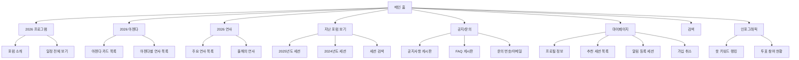
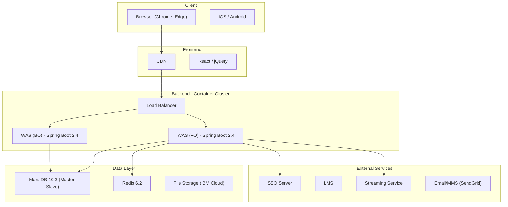
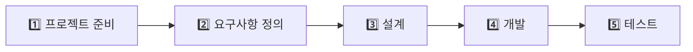
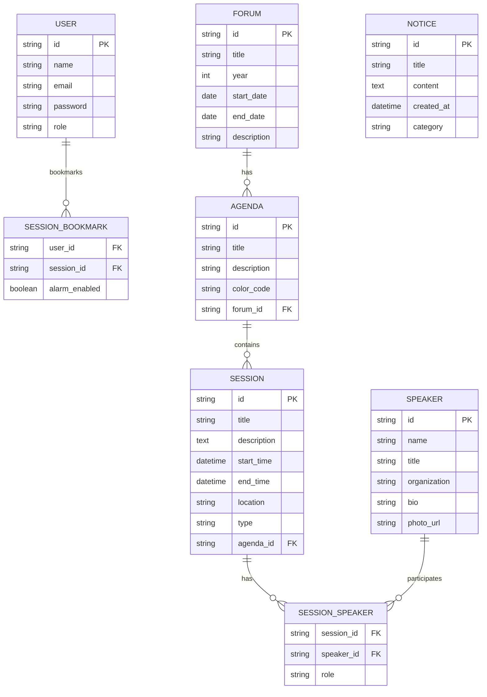

# K-DT 선도기업 아카데미 1차 - PDF 분석 및 포럼 홈페이지 기획 가이드

> [!NOTE]
> 이 문서는 `K-DT 선도기업 아카데미 1차_v0.50.pdf` (IBM Consulting, 2026.2.11) 의 내용을 분석하여,  
> **포럼 홈페이지를 만들기 위해 알아야 할 핵심 내용과 진행 방향**을 정리한 것입니다.

---

## 📋 문서 전체 구조

| 파트 | 내용 | 페이지 |
|------|------|--------|
| **I. 프로젝트 소개** | 두 가지 실제 사례 프로젝트 소개 | 4~31 |
| **II. 프로젝트 수행 방법** | 프로젝트 진행 절차 및 산출물 가이드 | 32~52 |

---

## 🎯 핵심 프로젝트 1: Cloud Native 기반 통합 이벤트 관리 플랫폼 (= 포럼 홈페이지)

> [!IMPORTANT]
> **이 프로젝트가 바로 "포럼 홈페이지"의 핵심 레퍼런스입니다.**  
> B사의 온·오프라인 세미나 및 포럼 관리 시스템을 Cloud Native 기반으로 구축한 실제 사례입니다.  
> 세계경제포럼(다보스 포럼)을 참고 모델로 삼고 있습니다.

### 🔑 프로젝트 핵심 목표

1. **온·오프라인 포럼/세미나 통합 관리 시스템** 구축
2. 행사 안내 → 세션 등록 → 온라인 웨비나 → 사후 분석까지 **전 과정 관리**
3. **대규모 트래픽** 처리가 가능한 MSA(Microservice Architecture) 구조
4. Cloud Native (IBM Cloud & AWS) 기반

### 📱 포럼 홈페이지 주요 기능 (포럼 전 / 중 / 후)

#### 🟢 포럼 전 (사전 준비 단계)
| 기능 | 설명 |
|------|------|
| 통합 로그인 | SSO 기반 통합 인증 |
| 사전 등록 | 세션 사전 등록 및 참가 승인 |
| 참여 안내 | 문자/카카오 알림 공지 |
| 행사 소개 | 포럼 프로그램, 아젠다, 연사 소개 |
| 개인정보 관리 | 회원 프로필 관리 |

#### 🔴 포럼 중 (실시간 운영 단계)
| 기능 | 설명 |
|------|------|
| 웨비나/오디오 | API 기반 화상 솔루션 연동 (Zoom 등) |
| 의견(댓글) 등록 | 익명 설정 가능, 댓글 필터링 |
| 실시간 투표 | WebSocket 활용 실시간 데이터 전송 |
| 온라인 대화/토론 | 실시간 토론 시스템 |
| 참여현황 & 토론현황 | 실시간 모니터링 |

#### 🔵 포럼 후 (사후 분석 단계)
| 기능 | 설명 |
|------|------|
| 설문 | 사후 설문 조사 |
| 사후 성과 분석 | 데이터 분석 리포트 |
| Bar & Pie 차트 인포그래픽 | 데이터 시각화 대시보드 |
| 지난 포럼 보기 | 과거 세션 아카이브 |

### 🗺️ 사이트맵 (페이지 구조)



### 🖥️ 메인 페이지 UI 구성 (다보스 포럼 참고)

````carousel
### 메인 페이지 핵심 요소
| 영역 | 내용 |
|------|------|
| A | **대표 세션** - 현재 Live 세션 혹은 top 세션 |
| B | **Live blog & key moments** - Daily 세션 핵심 내용 요약 |
| C | **연사 및 주제(theme)** - 올해 연사/아젠다 소개 |
| D | **하이라이트 세션 모아보기** - 추천 세션 리스트 |
<!-- slide -->
### 일자별 소개 페이지
| 영역 | 내용 |
|------|------|
| A | **일자별 탭 메뉴** - 날짜별 일정 페이지 이동 |
| B | **관심 주제 필터** - 세션의 일별/시간별 일정 확인 |
| C | **카드형 UI** - 정보 집약적 카드 (시간/세션명/연사/주제) |
<!-- slide -->
### 주제별 소개 페이지
| 영역 | 내용 |
|------|------|
| A | **주제 소개** - 카드형 UI 리스트 모아보기 |
| B | **주제별 설명 & 세션 리스트** - 배경 설명 + 관련 세션 |
| C | **주제별 Color code** - 고유 색상으로 관심 주제 식별 |
````

### 🔧 관리자(Back-Office) 기능

| 메뉴 | 하위 기능 |
|------|-----------|
| **포럼 운영** | 포럼/테마 관리, 아젠다 관리, 세션 관리, 해시태그 관리 |
| **회원 관리** | 강연자 관리, 내부/외부 사용자 관리, 메뉴 권한 관리 |
| **시스템 운영** | 공지사항 관리, 댓글 관리, 교육 시간 관리, 메시지 관리 |
| **시스템 관리** | 관리자 관리, 템플릿 관리, 공통코드 관리 |
| **통계** | 세션 알림등록 현황, 세션 참여 현황, OC 참여 통계, 투표 통계, 키워드 통계, 로그인 통계 |

---

## 🏗️ 기술 스택

### 아키텍처 구성



### 기술 스택 요약

| 카테고리 | 기술 |
|----------|------|
| **백엔드** | Spring Boot, Java (OpenJDK), RESTful API, GraphQL, gRPC |
| **프론트엔드** | React (또는 jQuery), 반응형 웹 (PC & Mobile) |
| **데이터베이스** | PostgreSQL / MariaDB, MongoDB, Redis |
| **인프라** | IBM Cloud, AWS, Docker, OpenShift, Kubernetes |
| **보안** | Spring Security, JWT, OAuth2 |
| **실시간** | WebSocket (투표, 토론, 채팅) |
| **메시징** | Kafka |
| **CI/CD** | Jenkins, ArgoCD |
| **모니터링** | Prometheus, Grafana, Kibana, Elasticsearch |
| **API Gateway** | Kong / Spring Cloud Gateway |

---

## 🏠 핵심 프로젝트 2: Co-Living 프로젝트 (참고용)

> [!TIP]
> 이 프로젝트는 포럼 홈페이지와 직접 관련은 없지만, **MSA 아키텍처, API Gateway, 인프라 구성** 등  
> 프로젝트 설계 방법론을 이해하는 데 참고할 수 있는 사례입니다.

- 공유 주거 플랫폼 (Co-Living) 서비스
- 주거 계약 관리, 공용 시설 예약, 커뮤니티 기능
- Multi-Tenant SaaS 기반, IoT/AI 연동

---

## 📐 프로젝트 진행 방법 (II파트 핵심 요약)

### 전체 프로세스 흐름



### 1️⃣ 프로젝트 준비 단계
| 작업 | 산출물 |
|------|--------|
| 프로젝트 범위 정의 | WBS (Work Breakdown Structure) |
| 팀 구성 및 역할 정의 | |
| 일정 수립 | |
| 수행 환경 구축 | |

### 2️⃣ 요구사항 정의 단계

> [!WARNING]
> **"대부분의 프로젝트 실패 원인은 요구사항 정의가 불명확했기 때문"**  
> 이 단계가 프로젝트의 기준선(Baseline)을 만드는 가장 중요한 단계입니다.

| 작업 | 상세 |
|------|------|
| 이해관계자 식별 및 인터뷰 | Pain points, Needs 추출 |
| 현행 시스템 분석 (As-Is) | 현재 프로세스, 문제점 파악 |
| 목표 모델 정의 (To-Be) | 시스템 범위 명확화 |
| 기능 요구사항 정의 | Feature List, Use Case, User Story |
| 비기능 요구사항 정의 | 성능, 보안, 가용성, 확장성 |
| UI/UX 요구사항 정의 | 와이어프레임, 사용자 흐름 |
| 우선순위 산정 | MoSCoW 분석 (Must/Should/Could/Won't) |
| **산출물** | **요구사항 정의서, 비기능 요구사항 정의서** |

### 3️⃣ 설계 단계

| 작업 | 상세 | 산출물 |
|------|------|--------|
| 시스템 아키텍처 설계 | MSA/Cloud 구조 결정 | 아키텍처 정의서 |
| DB 설계 | ERD, 테이블 정의서 | 테이블 정의서, ERD |
| UI/UX 설계 | 와이어프레임, 화면 설계 | 화면 설계서 |
| API 설계 | Request/Response 구조 | API 정의서 |
| 인터페이스 설계 | 시스템 간 연계 방식 | 인터페이스 설계서 |
| 비기능 설계 | 성능/보안/가용성 | |
| 테스트 설계 | 테스트 범위 및 방식 | |
| 개발환경/배포환경 설계 | CI/CD Pipeline | |

### 4️⃣ 개발 단계

| 작업 | 상세 |
|------|------|
| 기능 개발 | 비즈니스 로직, API, UI, 배치 |
| 프론트엔드 개발 | 화면 UI, UX 동작, API 연동, 상태관리 |
| DB 개발 | 스키마 생성, 테이블, 인덱스, 초기 데이터 |
| API 개발 및 연동 | 인증(JWT, OAuth), 외부 시스템 연동 |
| 코드 리뷰 | 코드 스타일, 보안, 성능 점검 |
| 단위 테스트 | JUnit, Jest 등 자동화 테스트 |

### 5️⃣ 테스트 단계

| 작업 | 상세 |
|------|------|
| 통합 테스트 | 전체 기능 연결 검증, 테스트 결과서 작성 |
| 성능 테스트 | 부하/스트레스 테스트, CPU/Memory 확인 |
| 보안 테스트 | 인증/인가 검증, 보안 취약점 점검 |
| 가용성 테스트 | Failover 테스트 |
| 백업/복구 테스트 | 백업 및 복구 검증 |

---

## 🚀 포럼 홈페이지를 만들기 위한 실전 가이드

> [!IMPORTANT]
> PDF 내용을 바탕으로, 포럼 홈페이지를 실제로 만들려면 아래 순서로 진행하는 것을 권장합니다.

### Step 1: 범위 결정 (어디까지 만들 것인가?)

문서의 전체 기능을 모두 구현하긴 어렵습니다. **우선순위를 정해야 합니다:**

#### 🟢 MVP (최소 기능 제품) - 반드시 필요
- [ ] 메인 페이지 (포럼 소개, 대표 세션 노출)
- [ ] 프로그램/일정 페이지 (일자별/주제별 세션 목록)
- [ ] 연사 소개 페이지
- [ ] 세션 상세 페이지
- [ ] 회원가입/로그인
- [ ] 공지사항/FAQ
- [ ] 반응형 디자인 (PC + Mobile)

#### 🟡 추가 기능 - 있으면 좋은 것
- [ ] 마이페이지 (관심 세션 등록, 알림 설정)
- [ ] 통합 검색
- [ ] 지난 포럼 아카이브
- [ ] 인포그래픽/통계 대시보드

#### 🔴 고급 기능 - 나중에 추가
- [ ] 실시간 투표/토론 (WebSocket)
- [ ] 온라인 웨비나 연동 (Zoom API)
- [ ] 실시간 채팅
- [ ] SNS 연동 알림
- [ ] 관리자 Back-Office 전체

### Step 2: 기술 스택 결정

| 항목 | 추천 (간소화) | 원본 문서 기준 (풀스택) |
|------|--------------|------------------------|
| 프론트엔드 | **Next.js + React** | React |
| 스타일링 | Tailwind CSS 또는 Vanilla CSS | - |
| 백엔드 | Node.js (Express) 또는 Spring Boot | Spring Boot |
| DB | PostgreSQL | MariaDB / PostgreSQL |
| 인프라 | Vercel or Docker | IBM Cloud, Docker, K8s |
| 인증 | NextAuth.js 또는 JWT | Spring Security + JWT |

### Step 3: 페이지별 설계

MVP 기준으로 만들어야 할 **핵심 페이지 6개**:

1. **메인 페이지** - 포럼 소개 + 대표 세션 + 일정 미리보기
2. **프로그램 페이지** - 일자별/주제별 세션 목록 (탭 메뉴 + 카드 UI)
3. **연사 페이지** - 연사 프로필 카드 목록
4. **세션 상세 페이지** - 세션 정보 + 관련 연사 + 관련 세션
5. **공지/FAQ 페이지** - 게시판 형태
6. **마이페이지** - 프로필 + 관심 세션

### Step 4: 데이터 모델링 (핵심 Entity)



---

## 📊 요약 - 한 눈에 보는 핵심

| 항목 | 내용 |
|------|------|
| **프로젝트 성격** | Cloud Native 기반 포럼/이벤트 관리 플랫폼 |
| **참고 모델** | 세계경제포럼(다보스 포럼) 홈페이지 |
| **핵심 기능** | 행사 소개, 세션 관리, 실시간 투표/토론, 인포그래픽, SNS 연동 |
| **아키텍처** | MSA(Microservice Architecture) 기반 |
| **인프라** | Docker + Kubernetes (OpenShift) + Cloud |
| **UI 특징** | 카드형 UI, 주제별 Color coding, 일자별 탭 메뉴, 반응형 |
| **가장 중요한 것** | 요구사항 정의 → 설계 → 개발 순서를 지키는 것 |

> [!CAUTION]
> 문서에서 강조하는 핵심 포인트:
> - "설계가 좋더라도 개발 코드가 나쁘면 프로젝트 실패"
> - "유지보수 비용의 70%가 설계/개발 품질에 의해 결정"
> - "대부분의 프로젝트 실패 원인은 요구사항 정의가 불명확했기 때문"

---

## 🔍 벤치마크 사이트 모음

> [!NOTE]
> PDF에서 직접 참고 모델로 언급한 **세계경제포럼(WEF)**을 중심으로,
> 포럼/컨퍼런스 홈페이지를 만들 때 벤치마크할 만한 사이트들을 정리했습니다.

### ⭐ Tier 1: 핵심 벤치마크 (PDF 직접 레퍼런스)

#### 1. 세계경제포럼 (World Economic Forum / 다보스 포럼)
| 항목 | 내용 |
|------|------|
| **URL** | https://www.weforum.org |
| **연차총회** | https://www.weforum.org/events/world-economic-forum-annual-meeting-2025/ |
| **관련성** | ⭐⭐⭐⭐⭐ PDF에서 직접 참고 모델로 명시 |
| **벤치마크 포인트** | 세션 일정표, 주제별 Color coding, 연사 프로필, 카드형 UI, Live 세션 표시, 아젠다별 세션 분류 |

> [!IMPORTANT]
> **PDF 7~12 페이지의 UI 설계가 이 사이트를 기반으로 만들어졌습니다.**
> 메인 페이지, 일자별 소개, 주제별 소개 구조를 반드시 참고하세요.

**주요 참고 포인트:**
- 메인: 대표 세션 히어로 배너 + Live blog + 추천 세션 리스트
- 일정: 날짜별 탭 + 시간순 카드형 세션 나열
- 주제별: 고유 색상 + 관련 세션/영상/글 모아보기
- 연사: 프로필 카드 (사진, 직함, 소속)
- 반응형: PC + Mobile 완벽 대응

---

### ⭐ Tier 2: 글로벌 대형 컨퍼런스 (기능/디자인 레퍼런스)

#### 2. Google I/O
| 항목 | 내용 |
|------|------|
| **URL** | https://io.google |
| **관련성** | ⭐⭐⭐⭐ |
| **벤치마크 포인트** | 세션 필터링(주제별/날짜별), 키노트 라이브 스트리밍, 모던 디자인, 세션 북마크, 개인화 추천 |

**주요 참고:** 세션 탐색 UX, 카테고리별 필터, 관심 세션 저장, 세션 영상 아카이브

#### 3. Web Summit
| 항목 | 내용 |
|------|------|
| **URL** | https://websummit.com |
| **관련성** | ⭐⭐⭐⭐ |
| **벤치마크 포인트** | 대규모 이벤트 관리, 연사 네트워킹, 티켓/등록 시스템, 비주얼 디자인 |

**주요 참고:** 히어로 섹션 비주얼, 대규모 연사 목록, 스테이지/트랙 세션 분류

#### 4. TED Conference
| 항목 | 내용 |
|------|------|
| **URL** | https://conferences.ted.com |
| **관련성** | ⭐⭐⭐⭐ |
| **벤치마크 포인트** | 콘텐츠 중심 설계, 영상 아카이브, 깔끔한 UI, 브랜드 컬러 일관성 (Red & Black) |

**주요 참고:** 강연 아카이브, 연사 프로필, 미니멀 디자인, 태그/주제별 분류

#### 5. CES (Consumer Electronics Show)
| 항목 | 내용 |
|------|------|
| **URL** | https://www.ces.tech |
| **관련성** | ⭐⭐⭐ |
| **벤치마크 포인트** | 대규모 전시/컨퍼런스 통합 관리, 참가자 등록, 일정 관리, 뉴스/미디어 섹션 |

---

### ⭐ Tier 3: 국내 포럼/컨퍼런스 (한국 사례)

#### 6. 서울포럼 (Seoul Forum)
| 항목 | 내용 |
|------|------|
| **URL** | https://seoulforum.kr |
| **관련성** | ⭐⭐⭐⭐ 국내 대표 비즈니스 포럼 |
| **벤치마크 포인트** | 한국형 포럼 홈페이지 구조, 연사 소개, 프로그램 일정표, 공지사항, 파트너 소개 |

#### 7. i-FORUM (아이뉴스24)
| 항목 | 내용 |
|------|------|
| **URL** | https://iforum.inews24.com |
| **관련성** | ⭐⭐⭐ 국내 IT/AI 컨퍼런스 |
| **벤치마크 포인트** | IT 전문 컨퍼런스 사이트 구조, 연사 정보 배치, 행사 일정 표현 |

#### 8. AI EXPO Korea
| 항목 | 내용 |
|------|------|
| **URL** | https://www.aiexpo.co.kr |
| **관련성** | ⭐⭐⭐ 국내 대형 전시/컨퍼런스 |
| **벤치마크 포인트** | 사전 등록 시스템, e-브로슈어, 참관 안내, 결과 보고서 제공 |

---

### 📋 벤치마크 체크리스트

#### 📱 UI/UX 관점
| 체크 항목 | 설명 |
|-----------|------|
| 메인 히어로 섹션 | 첫 화면에서 어떤 정보를 보여주는가? |
| 네비게이션 구조 | 메뉴 구성, 깊이, 정보 접근성 |
| 카드 UI 디자인 | 세션/연사 카드의 레이아웃과 정보 배치 |
| 색상 체계 | 주요 컬러, 주제별 Color coding 방식 |
| 반응형 디자인 | 모바일에서의 레이아웃 변화 |
| 타이포그래피 | 폰트, 크기, 위계 |

#### 🔧 기능 관점
| 체크 항목 | 설명 |
|-----------|------|
| 세션 필터링 | 날짜/주제/트랙별 필터링 방식 |
| 검색 기능 | 통합 검색의 범위와 UX |
| 등록/로그인 | 사전 등록 플로우, SSO 연동 |
| 개인화 | 관심 세션 저장, 맞춤 추천 |
| 실시간 기능 | Live 표시, 실시간 업데이트 |
| 아카이브 | 지난 행사 영상/자료 보관 방식 |

### 🎯 추천 벤치마크 순서

> [!TIP]
> **가장 효율적인 벤치마크 순서:**
> 1. **WEF (다보스)** → 전체 구조와 사이트맵의 기준 잡기 (PDF의 직접 레퍼런스)
> 2. **Google I/O** → 현대적 세션 탐색 UX 참고
> 3. **서울포럼** → 한국어 포럼 사이트의 표준 패턴 이해
> 4. **Web Summit** → 비주얼 디자인 영감 얻기
