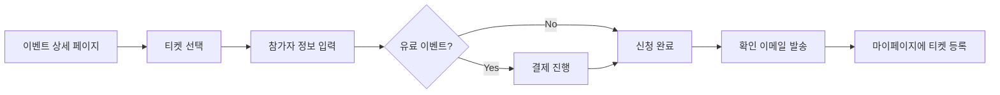
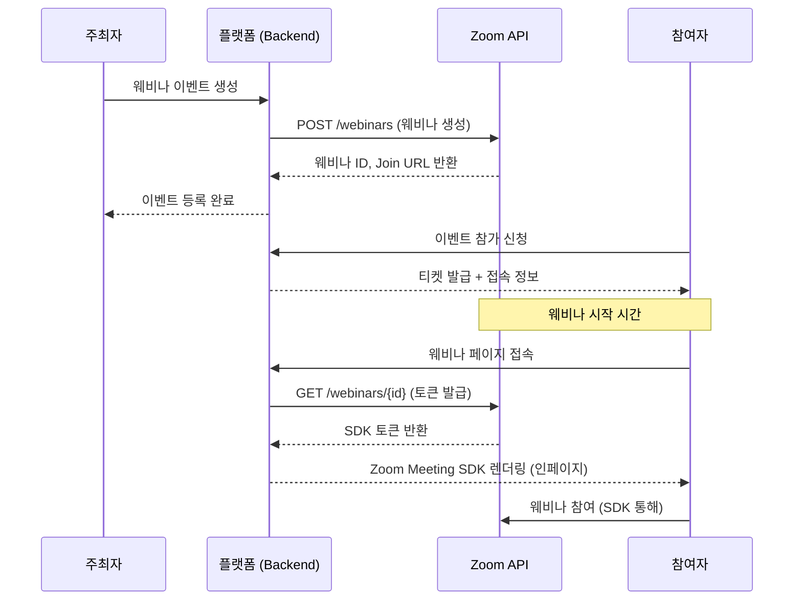
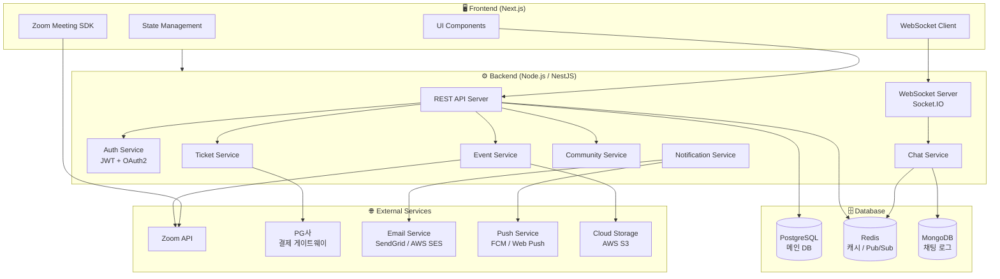
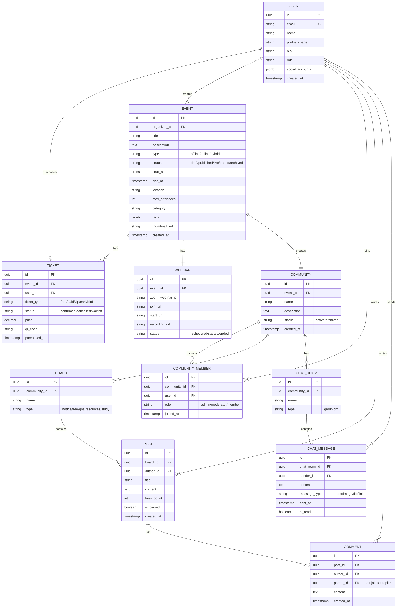
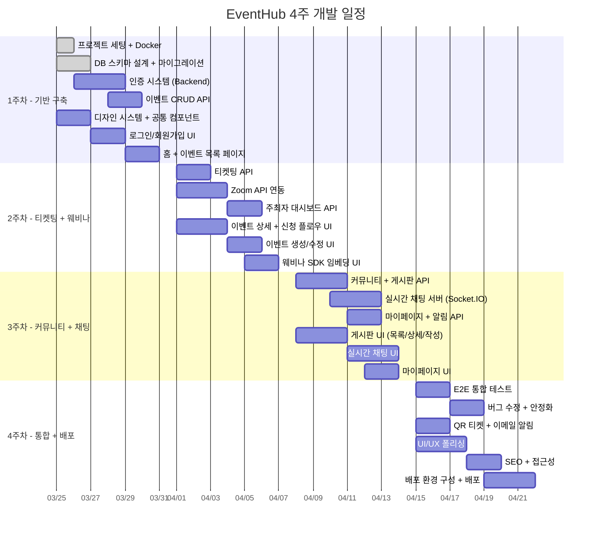

# 📋 강연·세미나 이벤트 관리 플랫폼 기획안

> **프로젝트명**: EventHub (가칭)
> **작성일**: 2026-03-25
> **버전**: v1.0

---

## 1. 프로젝트 개요

### 1.1 비전
강연 및 세미나의 **기획 → 참여 신청(티켓팅) → 온라인 강연(웨비나) → 사후 커뮤니티 활동**까지, 이벤트의 전체 라이프사이클을 **하나의 플랫폼 내**에서 완결하는 올인원 이벤트 관리 서비스

### 1.2 핵심 원칙
| 원칙 | 설명 |
|------|------|
| **올인원 (All-in-One)** | 모든 활동(신청, 강연 시청, 커뮤니티)이 플랫폼 내부에서 수행 |
| **참여자 중심** | 이벤트 종료 후에도 참여자 간 지속적 학습·교류 지원 |
| **실시간 경험** | 웨비나 라이브 스트리밍 및 실시간 채팅 제공 |
| **확장 가능** | 향후 결제, 인증서 발급, AI 추천 등 기능 확장 용이 |

### 1.3 타겟 사용자

| 사용자 유형 | 설명 |
|-------------|------|
| **주최자 (Organizer)** | 강연/세미나를 기획하고 운영하는 개인 또는 단체 |
| **강연자 (Speaker)** | 강연/세미나를 진행하는 발표자 |
| **참여자 (Attendee)** | 이벤트에 참여 신청하고 참석하는 일반 사용자 |
| **관리자 (Admin)** | 플랫폼 전체를 관리하는 시스템 관리자 |

---

## 2. 주요 기능 상세

### 2.1 이벤트 관리 (Event Management)

#### 2.1.1 이벤트 생성 및 등록
- **이벤트 유형**: 오프라인 강연, 온라인 웨비나, 하이브리드(오프라인+온라인)
- **이벤트 정보 입력**
  - 제목, 설명 (리치 텍스트 에디터)
  - 일시 (시작/종료 시간, 타임존 지원)
  - 장소 (오프라인: 주소 + 지도 연동 / 온라인: 웨비나 URL 자동 생성)
  - 카테고리 및 태그 (기술, 비즈니스, 디자인, 마케팅 등)
  - 대표 이미지 및 썸네일
  - 강연자 프로필 연동
- **티켓 설정**
  - 무료/유료 선택
  - 다중 티켓 유형 (일반, VIP, 얼리버드 등)
  - 참가 인원 제한 (정원)
  - 대기자 명단 (Waitlist) 기능
- **이벤트 상태 관리**: 임시저장 → 게시 → 진행중 → 종료 → 아카이브

#### 2.1.2 이벤트 목록 및 탐색
- **홈 피드**: 추천 이벤트, 인기 이벤트, 신규 이벤트
- **검색 기능**: 키워드, 카테고리, 날짜, 유형, 가격대 필터링
- **캘린더 뷰**: 월간/주간 달력으로 이벤트 일정 확인
- **카드형 목록**: 이벤트 카드에 핵심 정보 표시 (제목, 일시, 참가비, 잔여석)

#### 2.1.3 이벤트 상세 페이지
- 이벤트 소개, 커리큘럼/아젠다
- 강연자 프로필 및 이력
- 참가 신청 버튼 (티켓팅)
- 참여자 수 / 정원 표시
- 관련 이벤트 추천
- 리뷰 및 평점 (이벤트 종료 후)

---

### 2.2 티켓팅 시스템 (Ticketing)

#### 2.2.1 참여 신청 플로우



#### 2.2.2 핵심 기능
- **티켓 종류별 관리**: 무료, 유료, 얼리버드, VIP 등 다중 티켓 설정
- **결제 연동** (Phase 2)
  - PG사 연동 (토스페이먼츠, 카카오페이, 네이버페이 등)
  - 영수증 발급
  - 환불 정책 및 처리
- **QR 코드 티켓**: 참가 확인용 QR 코드 자동 생성
- **참가자 관리**: 주최자 대시보드에서 참가자 목록, 출석 체크, 통계 확인
- **대기자 관리**: 정원 초과 시 대기자 등록 → 취소 발생 시 자동 알림
- **참여 취소 및 환불**: 정책에 따른 취소/환불 처리

---

### 2.3 웨비나 시스템 (Zoom API 연동)

> [!IMPORTANT]
> 모든 웨비나 활동은 플랫폼 내부에서 이루어져야 합니다. 외부 Zoom 클라이언트로의 이동 없이, 페이지 내 임베딩 방식으로 작동합니다.

#### 2.3.1 기술 구현 방식

| 구성 요소 | 기술 | 설명 |
|-----------|------|------|
| **Zoom Meeting SDK** | `@zoom/meetingsdk` | 웹 페이지 내에서 Zoom 미팅/웨비나 임베딩 |
| **Zoom Server-to-Server OAuth** | Zoom API v2 | 서버 측에서 미팅 생성/관리 |
| **Component View** | iframe 내 렌더링 | 플랫폼 UI와 자연스러운 통합 |

#### 2.3.2 웨비나 기능 상세

**주최자/강연자 기능**
- 웨비나 자동 생성 (이벤트 등록 시 Zoom 웨비나 자동 스케줄)
- 화면 공유 (PPT, 화면, 특정 앱)
- 참가자 음소거/해제 관리
- 패널리스트(공동 발표자) 초대
- 웨비나 녹화 (클라우드 저장)
- Q&A / 투표(Poll) 기능

**참가자 기능**
- 브라우저 내에서 바로 참여 (별도 설치 불필요)
- 비디오/오디오 On/Off
- 손들기 (Raise Hand)
- 채팅 (웨비나 사이드 패널)
- Q&A 질문 제출
- 투표 참여
- 화면 공유 콘텐츠 시청

**자동화 플로우**


#### 2.3.3 녹화 및 다시보기
- 웨비나 종료 후 Zoom 클라우드 녹화 자동 저장
- 플랫폼 내 VOD 페이지에서 다시보기 제공
- 접근 권한 관리 (참여자만 / 전체 공개)

---

### 2.4 커뮤니티 시스템 (사후 스터디 그룹)

> [!NOTE]
> 이벤트 종료 후 참여자들이 스터디 형식으로 지속적인 학습과 교류를 할 수 있는 공간입니다.

#### 2.4.1 스터디 그룹 생성

**자동 생성 규칙**
- 이벤트 종료 시 해당 이벤트의 참여자들로 구성된 커뮤니티 공간 자동 생성
- 이벤트 참여자는 자동으로 커뮤니티 멤버로 등록
- 주최자/강연자는 커뮤니티 관리자 권한 부여

**수동 생성**
- 참여자 누구든 별도 스터디 그룹 개설 가능
- 기존 커뮤니티 내 분과/소그룹 생성

#### 2.4.2 게시판 (Bulletin Board)

| 게시판 유형 | 설명 | 기능 |
|-------------|------|------|
| **공지사항** | 관리자/강연자 전용 공지 | 상단 고정, 알림 발송 |
| **자유 게시판** | 참여자 자유 토론 | 글쓰기, 댓글, 대댓글 |
| **Q&A 게시판** | 질문·답변 전용 | 질문 등록, 답변, 채택 기능 |
| **자료 공유** | 학습 자료 업로드·공유 | 파일 첨부, 링크 공유 |
| **과제/스터디 노트** | 스터디 진행 기록 | 마크다운 지원, 코드 블록 |

**게시판 핵심 기능**
- 리치 텍스트 에디터 (마크다운 + WYSIWYG)
- 파일 첨부 (이미지, PDF, 문서 등)
- 댓글 및 대댓글 (쓰레드 구조)
- 좋아요 / 북마크
- 멘션 (@사용자명)
- 해시태그 분류
- 검색 (제목, 내용, 작성자)
- 신고 기능

#### 2.4.3 실시간 채팅 (Real-time Chat)

> [!TIP]
> WebSocket 기반의 실시간 채팅으로 즉각적인 소통 환경을 제공합니다.

**기술 스택**

| 구성 요소 | 기술 |
|-----------|------|
| 프로토콜 | WebSocket (Socket.IO) |
| 서버 | Node.js + Socket.IO Server |
| 클라이언트 | Socket.IO Client |
| 메시지 저장 | MongoDB / PostgreSQL |
| 캐싱 | Redis (Pub/Sub, 세션 관리) |

**채팅 기능**
- **그룹 채팅**: 이벤트/스터디 그룹별 채팅방 자동 생성
- **1:1 DM**: 참여자 간 개인 메시지
- **메시지 유형**: 텍스트, 이미지, 파일, 링크 미리보기, 코드 블록
- **실시간 알림**: 새 메시지 알림 (브라우저 Push Notification)
- **메시지 검색**: 채팅 내 키워드 검색
- **읽음 표시**: 메시지 읽음/안읽음 상태
- **고정 메시지**: 중요 메시지 상단 고정
- **이모지 리액션**: 메시지에 이모지 반응
- **온라인 상태**: 접속 중인 멤버 표시

**채팅방 구조**
```
📂 이벤트 커뮤니티
├── 💬 전체 채팅 (기본 채팅방)
├── 💬 Q&A 채팅
├── 💬 스터디 그룹 A
├── 💬 스터디 그룹 B
└── 💬 자유 대화
```

---

### 2.5 사용자 시스템

#### 2.5.1 회원가입 및 로그인
- **소셜 로그인**: Google, Kakao, Naver, GitHub
- **이메일 회원가입**: 이메일 인증 기반
- **프로필 설정**: 이름, 프로필 사진, 소개, 관심 분야, 소속

#### 2.5.2 마이페이지
- **내 이벤트**: 참여 예정 / 참여 완료 / 주최한 이벤트
- **내 티켓**: 발급된 티켓 목록 및 QR 코드
- **내 커뮤니티**: 가입한 스터디 그룹 목록
- **알림 센터**: 이벤트 알림, 커뮤니티 알림, 메시지 알림
- **활동 이력**: 작성한 글, 댓글, 채팅 기록

#### 2.5.3 알림 시스템
| 알림 유형 | 트리거 | 채널 |
|-----------|--------|------|
| 이벤트 신청 확인 | 티켓 발급 시 | 이메일, 인앱 |
| 이벤트 시작 리마인더 | 시작 24시간/1시간 전 | 이메일, Push |
| 커뮤니티 새 글 | 게시글 등록 시 | 인앱, Push |
| 채팅 메시지 | 새 메시지 수신 시 | 인앱, Push |
| 대기자 전환 | 대기 → 참석 가능 | 이메일, 인앱 |

---

## 3. 시스템 아키텍처

### 3.1 전체 구조도



### 3.2 기술 스택 요약

| 영역 | 기술 |
|------|------|
| **Frontend** | Next.js 14+ (App Router), TypeScript, React 18 |
| **상태 관리** | Zustand 또는 React Query (TanStack Query) |
| **스타일링** | Vanilla CSS + CSS Modules (또는 사용자 선호에 따라 변경) |
| **Backend** | Node.js + NestJS (TypeScript) |
| **Database** | PostgreSQL (메인), MongoDB (채팅), Redis (캐싱/세션) |
| **ORM** | Prisma 또는 TypeORM |
| **인증** | JWT + OAuth2 (Passport.js) |
| **실시간 통신** | Socket.IO (WebSocket) |
| **웨비나** | Zoom Meeting SDK + Zoom API v2 |
| **파일 저장소** | AWS S3 또는 Cloudflare R2 |
| **이메일** | SendGrid 또는 AWS SES |
| **배포** | Docker + AWS (ECS/EKS) 또는 Vercel(FE) + AWS(BE) |
| **CI/CD** | GitHub Actions |

---

## 4. 데이터 모델 (ERD 개요)

### 4.1 핵심 엔터티



---

## 5. 페이지 구조 (Sitemap)

```
📂 / (홈)
├── 📄 /events (이벤트 목록)
│   ├── 📄 /events/[id] (이벤트 상세)
│   ├── 📄 /events/[id]/register (참가 신청)
│   └── 📄 /events/[id]/webinar (웨비나 참여)
│
├── 📂 /community (커뮤니티)
│   ├── 📄 /community/[id] (커뮤니티 메인)
│   ├── 📄 /community/[id]/board/[boardId] (게시판)
│   ├── 📄 /community/[id]/board/[boardId]/post/[postId] (게시글)
│   └── 📄 /community/[id]/chat (실시간 채팅)
│
├── 📂 /my (마이페이지)
│   ├── 📄 /my/events (내 이벤트)
│   ├── 📄 /my/tickets (내 티켓)
│   ├── 📄 /my/communities (내 커뮤니티)
│   └── 📄 /my/notifications (알림)
│
├── 📂 /organizer (주최자 대시보드)
│   ├── 📄 /organizer/events/new (이벤트 생성)
│   ├── 📄 /organizer/events/[id]/manage (이벤트 관리)
│   └── 📄 /organizer/events/[id]/attendees (참가자 관리)
│
├── 📄 /auth/login (로그인)
├── 📄 /auth/register (회원가입)
└── 📄 /admin (관리자 페이지)
```

---

## 6. API 엔드포인트 설계 (주요)

### 6.1 인증 API
| Method | Endpoint | 설명 |
|--------|----------|------|
| POST | `/api/auth/register` | 회원가입 |
| POST | `/api/auth/login` | 로그인 |
| POST | `/api/auth/logout` | 로그아웃 |
| GET | `/api/auth/oauth/:provider` | 소셜 로그인 |
| POST | `/api/auth/refresh` | 토큰 갱신 |

### 6.2 이벤트 API
| Method | Endpoint | 설명 |
|--------|----------|------|
| GET | `/api/events` | 이벤트 목록 조회 |
| GET | `/api/events/:id` | 이벤트 상세 조회 |
| POST | `/api/events` | 이벤트 생성 |
| PUT | `/api/events/:id` | 이벤트 수정 |
| DELETE | `/api/events/:id` | 이벤트 삭제 |
| GET | `/api/events/:id/attendees` | 참가자 목록 |

### 6.3 티켓팅 API
| Method | Endpoint | 설명 |
|--------|----------|------|
| POST | `/api/events/:id/tickets` | 티켓 구매(참가 신청) |
| GET | `/api/tickets/:id` | 티켓 상세 조회 |
| DELETE | `/api/tickets/:id` | 티켓 취소 |
| GET | `/api/my/tickets` | 내 티켓 목록 |
| POST | `/api/tickets/:id/checkin` | 출석 체크 (QR) |

### 6.4 웨비나 API
| Method | Endpoint | 설명 |
|--------|----------|------|
| POST | `/api/webinars` | 웨비나 생성 (→ Zoom API) |
| GET | `/api/webinars/:id/token` | SDK 접속 토큰 발급 |
| GET | `/api/webinars/:id/recording` | 녹화 영상 조회 |
| POST | `/api/webinars/:id/start` | 웨비나 시작 |
| POST | `/api/webinars/:id/end` | 웨비나 종료 |

### 6.5 커뮤니티 API
| Method | Endpoint | 설명 |
|--------|----------|------|
| GET | `/api/communities` | 커뮤니티 목록 |
| GET | `/api/communities/:id` | 커뮤니티 상세 |
| POST | `/api/communities/:id/join` | 커뮤니티 가입 |
| GET | `/api/communities/:id/boards` | 게시판 목록 |
| GET | `/api/boards/:id/posts` | 게시글 목록 |
| POST | `/api/boards/:id/posts` | 게시글 작성 |
| GET | `/api/posts/:id` | 게시글 상세 |
| POST | `/api/posts/:id/comments` | 댓글 작성 |
| POST | `/api/posts/:id/like` | 좋아요 |

### 6.6 채팅 API (WebSocket)
| Event | Direction | 설명 |
|-------|-----------|------|
| `connect` | Client → Server | 소켓 연결 |
| `join_room` | Client → Server | 채팅방 입장 |
| `leave_room` | Client → Server | 채팅방 퇴장 |
| `send_message` | Client → Server | 메시지 전송 |
| `new_message` | Server → Client | 새 메시지 수신 |
| `typing` | Client ↔ Server | 타이핑 상태 |
| `read_message` | Client → Server | 메시지 읽음 처리 |
| `online_status` | Server → Client | 온라인 상태 변경 |

---

## 7. Zoom API 연동 상세

### 7.1 필요한 Zoom 구성

| 항목 | 설명 |
|------|------|
| **Zoom App Type** | Server-to-Server OAuth App |
| **필요 Scope** | `webinar:write`, `webinar:read`, `user:read`, `recording:read` |
| **SDK** | Zoom Meeting SDK (Web) |
| **SDK 인증** | JWT 또는 SDK Key/Secret 기반 토큰 생성 |

### 7.2 구현 주의사항

> [!WARNING]
> - Zoom Meeting SDK는 **유료 플랜** (Pro 이상 + Webinar 애드온)이 필요합니다
> - SDK Key/Secret은 서버 측에서만 관리하고, 클라이언트에는 **생성된 토큰**만 전달해야 합니다
> - 웨비나 참가자 수 제한은 Zoom 플랜에 따라 달라집니다 (100/500/1000/3000명)
> - Rate Limit: Zoom API는 분당 요청 수 제한이 있으므로 큐잉 처리 필요

### 7.3 대안 및 폴백

Zoom 외에 고려 가능한 대안:
- **자체 WebRTC 구현**: 소규모 미팅용 (livekit, Janus 등)
- **Agora SDK**: Zoom 대안으로 실시간 영상 통신
- **YouTube Live 임베딩**: 대규모 단방향 스트리밍

---

## 8. 개발 단계 (Roadmap) — 총 4주

> [!IMPORTANT]
> 프로젝트 일정은 **총 4주 (2026-03-25 ~ 2026-04-22)** 입니다. 핵심 기능에 집중하되, 프론트엔드와 백엔드를 병렬로 진행하여 개발 효율을 극대화합니다.

### 8.1 기능 우선순위 (MoSCoW)

| 우선순위 | 기능 | 4주 내 구현 |
|----------|------|:-----------:|
| **Must** | 회원가입/로그인 (이메일 + 소셜) | ✅ |
| **Must** | 이벤트 CRUD (생성/조회/수정/삭제) | ✅ |
| **Must** | 이벤트 목록/상세/검색 | ✅ |
| **Must** | 티켓팅 (무료 참가 신청 + 참가자 관리) | ✅ |
| **Must** | 웨비나 — Zoom API 연동 + SDK 임베딩 | ✅ |
| **Must** | 커뮤니티 게시판 (CRUD + 댓글) | ✅ |
| **Must** | 마이페이지 (내 이벤트/티켓/커뮤니티) | ✅ |
| **Should** | 실시간 채팅 (Socket.IO) | ✅ |
| **Should** | 인앱 알림 시스템 | ✅ |
| **Should** | QR 코드 티켓 | ✅ |
| **Could** | 이메일 알림 (SendGrid) | ⚠️ 간소화 |
| **Could** | 녹화 다시보기 (VOD) | ⚠️ 간소화 |
| **Won't** (후속) | 유료 결제 (PG사 연동) | ❌ |
| **Won't** (후속) | AI 이벤트 추천 | ❌ |
| **Won't** (후속) | 인증서/수료증 발급 | ❌ |
| **Won't** (후속) | 모바일 앱 (React Native) | ❌ |

### 8.2 주차별 상세 일정

---

#### 📅 1주차: 기반 구축 + 인증 + 이벤트 핵심 (3/25 ~ 3/31)

| 영역 | 작업 내용 | 산출물 |
|------|----------|--------|
| **공통** | 프로젝트 초기 세팅 (Next.js + NestJS + Docker + DB) | 개발 환경 완성 |
| **공통** | DB 스키마 설계 및 Prisma 마이그레이션 | DB 테이블 생성 |
| **Backend** | 인증 모듈 (회원가입, 로그인, JWT, 소셜 OAuth) | Auth API 완성 |
| **Backend** | 이벤트 CRUD API | Events API 완성 |
| **Frontend** | 디자인 시스템 구축 (공통 컴포넌트, CSS 변수) | UI Kit 완성 |
| **Frontend** | 로그인/회원가입 페이지 | 인증 플로우 완성 |
| **Frontend** | 홈 페이지, 이벤트 목록 페이지 | 이벤트 탐색 가능 |

> **1주차 목표**: 회원가입 → 로그인 → 이벤트 목록 조회까지 E2E 동작

---

#### 📅 2주차: 티켓팅 + 웨비나 + 이벤트 상세 (4/1 ~ 4/7)

| 영역 | 작업 내용 | 산출물 |
|------|----------|--------|
| **Backend** | 티켓팅 API (참가 신청, 취소, 참가자 관리) | Tickets API 완성 |
| **Backend** | Zoom API 연동 (웨비나 생성, 토큰 발급) | Webinar API 완성 |
| **Backend** | 주최자 대시보드 API (참가자 목록, 통계) | Organizer API 완성 |
| **Frontend** | 이벤트 상세 페이지 | 상세 정보 + 신청 버튼 |
| **Frontend** | 참가 신청 플로우 (티켓 선택 → 정보 입력 → 완료) | 티켓팅 UI 완성 |
| **Frontend** | 이벤트 생성/수정 페이지 (주최자용) | 이벤트 등록 가능 |
| **Frontend** | Zoom Meeting SDK 임베딩 (웨비나 참여 페이지) | 인페이지 웨비나 |

> **2주차 목표**: 이벤트 생성 → 참가 신청 → 웨비나 접속까지 E2E 동작

---

#### 📅 3주차: 커뮤니티 + 실시간 채팅 + 마이페이지 (4/8 ~ 4/14)

| 영역 | 작업 내용 | 산출물 |
|------|----------|--------|
| **Backend** | 커뮤니티 API (그룹 생성, 게시판 CRUD, 댓글) | Community API 완성 |
| **Backend** | 실시간 채팅 서버 (Socket.IO + Redis) | Chat 서버 완성 |
| **Backend** | 마이페이지 API (내 이벤트/티켓/커뮤니티) | My API 완성 |
| **Backend** | 인앱 알림 시스템 (WebSocket 기반) | Notification 동작 |
| **Frontend** | 커뮤니티 메인 + 게시판 목록/상세 | 게시판 사용 가능 |
| **Frontend** | 게시글 작성/수정 + 댓글/대댓글 | 게시판 CRUD 완성 |
| **Frontend** | 실시간 채팅 UI (채팅방 목록, 메시지, 입력) | 실시간 채팅 동작 |
| **Frontend** | 마이페이지 (내 이벤트, 내 티켓, 내 커뮤니티) | 마이페이지 완성 |

> **3주차 목표**: 이벤트 종료 후 커뮤니티 활동 (게시판 + 채팅) 가능

---

#### 📅 4주차: 통합 테스트 + 폴리싱 + 배포 (4/15 ~ 4/22)

| 영역 | 작업 내용 | 산출물 |
|------|----------|--------|
| **공통** | E2E 통합 테스트 (전체 플로우 검증) | 테스트 리포트 |
| **공통** | 버그 수정 및 엣지 케이스 처리 | 안정화 |
| **Backend** | QR 코드 티켓 생성 + 출석 체크 API | QR 기능 완성 |
| **Backend** | 이메일 알림 기본 구현 (가입확인, 이벤트 신청) | 이메일 발송 |
| **Backend** | 녹화 다시보기 API (간소화 버전) | VOD 조회 가능 |
| **Frontend** | UI/UX 폴리싱 (반응형, 애니메이션, 접근성) | 디자인 완성도 ↑ |
| **Frontend** | 알림 센터 UI | 알림 확인 가능 |
| **Frontend** | SEO 최적화 (메타태그, OG, 구조화 데이터) | SEO 적용 |
| **공통** | Docker 기반 배포 환경 구성 + 배포 | 서비스 런칭 |

> **4주차 목표**: 전체 기능 통합 완료, 배포 가능한 상태

---

### 8.3 일정 타임라인 시각화



### 8.4 4주 이후 후속 과제 (Backlog)

> [!NOTE]
> 아래 기능들은 4주 내 구현 범위에서 제외되며, 런칭 이후 순차적으로 추가합니다.

| 우선순위 | 기능 | 예상 소요 |
|----------|------|----------|
| 1순위 | 유료 결제 시스템 (PG사 연동) | 2주 |
| 2순위 | 녹화 VOD 고도화 (챕터, 자막) | 1주 |
| 3순위 | 이메일/Push 알림 고도화 | 1주 |
| 4순위 | 분석 대시보드 (참가율, 만족도) | 2주 |
| 5순위 | AI 기반 이벤트 추천 | 2주 |
| 6순위 | 인증서/수료증 자동 발급 | 1주 |
| 7순위 | 다국어 지원 (i18n) | 1주 |
| 8순위 | 모바일 앱 (React Native) | 4주+ |

---

## 9. 비기능 요구사항

| 항목 | 요구사항 |
|------|----------|
| **성능** | 페이지 로드 < 2초, WebSocket 지연 < 100ms |
| **확장성** | 동시 접속 1,000명 이상 지원 (웨비나 시) |
| **보안** | HTTPS, JWT 토큰 인증, CORS 설정, XSS/CSRF 방어 |
| **가용성** | 99.9% 업타임 목표 |
| **접근성** | WCAG 2.1 AA 수준 준수 |
| **반응형** | 모바일, 태블릿, 데스크톱 완전 대응 |
| **SEO** | SSR/SSG 기반 메타태그, 구조화된 데이터 |
| **모니터링** | 로그 수집 (ELK), 에러 트래킹 (Sentry), APM |

---

## 10. 리스크 및 대응 방안

| 리스크 | 영향도 | 대응 방안 |
|--------|--------|----------|
| Zoom API 변경/제한 | 높음 | 추상화 레이어 구현, 대안 서비스 (Agora) 준비 |
| 대규모 동시 접속 | 중간 | Redis Pub/Sub, 수평 확장, 로드 밸런싱 |
| 실시간 채팅 안정성 | 중간 | Socket.IO 클러스터링, reconnect 로직 |
| 결제 장애 | 높음 | 결제 재시도 로직, 다중 PG사 연동 |
| 개인정보 보호 | 높음 | 암호화 저장, GDPR/개인정보보호법 준수 |

---

## 11. 폴더 구조 (프로젝트)

```
project_3/
├── frontend/                   # Next.js 프론트엔드
│   ├── src/
│   │   ├── app/                # App Router 페이지
│   │   ├── components/         # 재사용 컴포넌트
│   │   │   ├── common/         # 공통 (Button, Modal, Input ...)
│   │   │   ├── events/         # 이벤트 관련 컴포넌트
│   │   │   ├── community/      # 커뮤니티 관련 컴포넌트
│   │   │   ├── webinar/        # 웨비나 관련 컴포넌트
│   │   │   └── chat/           # 채팅 관련 컴포넌트
│   │   ├── hooks/              # 커스텀 훅
│   │   ├── lib/                # 유틸리티, API 클라이언트
│   │   ├── stores/             # 상태 관리 (Zustand)
│   │   ├── styles/             # CSS 스타일
│   │   └── types/              # TypeScript 타입 정의
│   └── public/                 # 정적 파일
│
├── backend/                    # NestJS 백엔드
│   ├── src/
│   │   ├── auth/               # 인증 모듈
│   │   ├── events/             # 이벤트 모듈
│   │   ├── tickets/            # 티켓팅 모듈
│   │   ├── webinars/           # 웨비나 모듈
│   │   ├── communities/        # 커뮤니티 모듈
│   │   ├── chat/               # 채팅 모듈 (Socket.IO)
│   │   ├── notifications/      # 알림 모듈
│   │   ├── users/              # 사용자 모듈
│   │   ├── common/             # 공통 (Guards, Filters, Pipes)
│   │   └── config/             # 설정 관리
│   └── prisma/                 # Prisma 스키마 & 마이그레이션
│
├── docker-compose.yml          # Docker 개발 환경
├── .env.example                # 환경 변수 템플릿
└── README.md
```

---

> [!NOTE]
> 이 기획안은 초기 버전으로, 개발 진행에 따라 세부 사항이 변경될 수 있습니다. 각 Phase 완료 시점에 리뷰 및 업데이트가 필요합니다.
