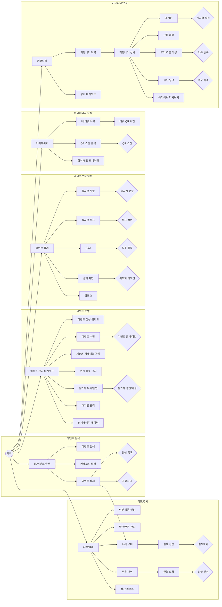

```mermaid
flowchart LR

  subgraph s1 ["이벤트 탐색"]
    n1(("시작"))
    n2["홈/이벤트 탐색"]
    n3["이벤트 검색"]
    n4["카테고리 필터"]
    n5["이벤트 상세"]
    n6{"관심 등록"}
    n7{"공유하기"}
  end

  subgraph s2 ["이벤트 운영"]
    n8["이벤트 관리 대시보드"]
    n9["이벤트 생성 위자드"]
    n10["이벤트 수정"]
    n11["세션/타임테이블 관리"]
    n12["연사 정보 관리"]
    n13["참가자 목록/승인"]
    n14["대기열 관리"]
    n15["상세페이지 에디터"]
    n16{"이벤트 공개/마감"}
    n17{"참가자 승인/거절"}
  end

  subgraph s3 ["티켓/결제"]
    n18["티켓/결제"]
    n19["티켓 상품 설정"]
    n20["할인/쿠폰 관리"]
    n21["티켓 구매"]
    n22["결제 진행"]
    n23["주문 내역"]
    n24["환불 요청"]
    n25["정산 리포트"]
    n26{"결제하기"}
    n27{"환불 신청"}
  end

  subgraph s4 ["라이브 인터랙션"]
    n28["라이브 중계"]
    n29["중계 화면"]
    n30["실시간 채팅"]
    n31["실시간 투표"]
    n32["Q&A"]
    n33["퀴즈쇼"]
    n34{"메시지 전송"}
    n35{"투표 참여"}
    n36{"질문 등록"}
    n37{"이모지 리액션"}
  end

  subgraph s5 ["마이페이지/출석"]
    n38["마이페이지"]
    n39["내 티켓 목록"]
    n40["티켓 QR 확인"]
    n41["QR 스캔 출석"]
    n42["참여 현황 모니터링"]
    n43{"QR 스캔"}
  end

  subgraph s6 ["커뮤니티/분석"]
    n44["커뮤니티"]
    n45["커뮤니티 목록"]
    n46["커뮤니티 상세"]
    n47["게시판"]
    n48["그룹 채팅"]
    n49["후기/리뷰 작성"]
    n50["설문 응답"]
    n51["아카이브 다시보기"]
    n52["성과 대시보드"]
    n53{"게시글 작성"}
    n54{"리뷰 등록"}
    n55{"설문 제출"}
  end

  n1 --> n2
  n2 --> n3
  n2 --> n4
  n2 --> n5
  n5 --> n6
  n5 --> n7
  n5 --> n21
  n1 --> n8
  n8 --> n9
  n8 --> n10
  n8 --> n11
  n8 --> n12
  n8 --> n13
  n8 --> n14
  n8 --> n15
  n10 --> n16
  n13 --> n17
  n1 --> n18
  n18 --> n19
  n18 --> n20
  n18 --> n21
  n21 --> n22
  n22 --> n26
  n18 --> n23
  n23 --> n24
  n24 --> n27
  n18 --> n25
  n1 --> n28
  n28 --> n29
  n28 --> n30
  n28 --> n31
  n28 --> n32
  n28 --> n33
  n30 --> n34
  n31 --> n35
  n32 --> n36
  n29 --> n37
  n1 --> n38
  n38 --> n39
  n39 --> n40
  n38 --> n41
  n41 --> n43
  n38 --> n42
  n1 --> n44
  n44 --> n45
  n45 --> n46
  n46 --> n47
  n46 --> n48
  n46 --> n49
  n46 --> n50
  n46 --> n51
  n44 --> n52
  n47 --> n53
  n49 --> n54
  n50 --> n55
```
