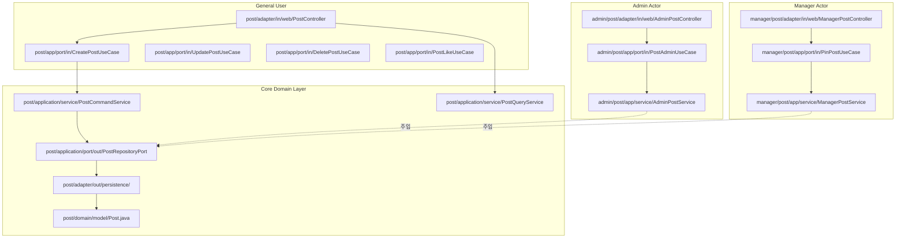

# 🏗️ VenueOn 백엔드 — Actor 중심 헥사고날 아키텍처 리팩토링 설계서

> **작성일:** 2026-04-14  
> **목적:** Actor별 유즈케이스 격리 + 도메인 중심 Deep Hierarchy 구조 전환

---

## 1. AS-IS 구조 분석

### 1-1. 현재 디렉토리 트리

```
com.venueon/
├── admin/                    # ← Actor 폴더 (사이트 관리자)
│   ├── category/             #    Admin > Category (도메인별 분리 ✅)
│   ├── contact/              #    Admin > Contact (도메인별 분리 ✅)
│   ├── report/               #    Admin > Report (도메인별 분리 ✅)
│   └── user/                 #    Admin > User (도메인별 분리 ✅)
│
├── host/                     # ← Actor 폴더 (호스트)
│   ├── adapter/out/          #    ❌ 도메인 없이 바로 adapter
│   ├── application/
│   │   ├── port/in/
│   │   │   ├── GetHostEventsUseCase        # ← Event 도메인
│   │   │   └── GetHostRecentOrdersUseCase  # ← Order 도메인
│   │   └── service/
│   │       ├── HostEventService            # ← Event 도메인
│   │       └── HostOrderService            # ← Order 도메인
│   ├── dto/                  #    ❌ 5개 DTO 혼재
│   ├── presentation/
│   │   ├── HostSeminarController  # /host/events
│   │   └── HostOrderController    # /host/orders
│   └── ticket/               #    Host > Ticket (도메인 분리는 되어있으나 구조 불일치)
│       ├── adapter/in/web/HostTicketController
│       └── application/port/in/ + service/
│
├── event/                    # ← 도메인 폴더 (일반 + 호스트 혼재)
│   ├── adapter/in/web/dto/   #    DTO만 있고 Controller 없음
│   ├── adapter/out/
│   ├── application/port/in/  #    12개 UseCase (Host CUD + General R 혼재)
│   ├── domain/model/
│   └── presentation/         #    ❌ adapter/in/web이 아닌 별도 폴더
│       ├── EventController         # 일반 R
│       ├── HostEventController     # 호스트 CUD
│       ├── HostSessionController   # 호스트 세션 CUD
│       └── SessionController       # 일반 R
│
├── post/                     # ← 도메인 폴더 (일반 + Admin 혼재)
│   ├── adapter/in/web/PostController
│   ├── application/port/in/
│   │   ├── CreatePostUseCase       # 일반 사용자
│   │   ├── PostAdminUseCase        # ❌ Admin 유즈케이스가 도메인 안에 위치
│   │   └── PostLikeUseCase ...     # 일반 사용자
│   └── domain/model/
│
├── comment/                  # ← 도메인 폴더 (일반 + Admin 혼재)
│   ├── application/port/in/
│   │   ├── CreateCommentUseCase    # 일반 사용자
│   │   ├── CommentAdminUseCase     # ❌ Admin 유즈케이스가 도메인 안에 위치
│   │   └── ...
│   └── domain/model/
│
├── community/                # ← 도메인 폴더 (Manager 기능 없음)
├── cart/                     # ← 도메인 폴더 (일반 사용자)
├── category/                 # ← 도메인 폴더 (일반 R)
├── member/                   # ← 도메인 폴더
├── order/                    # ← 도메인 폴더
├── report/                   # ← 도메인 폴더 (일반 사용자 신고)
├── review/                   # ← 도메인 폴더
├── ticket/                   # ← 도메인 폴더 (일반 R)
├── user/                     # ← 도메인 폴더 (인증/프로필)
├── wishlist/                 # ← 도메인 폴더
└── common/                   # ← 공통 인프라
```

### 1-2. 핵심 문제점 요약

| 문제 | 현재 상태 | 영향 |
|------|-----------|------|
| **Host가 도메인처럼 동작** | `host/application/port/in/`에 Event·Order 유즈케이스 혼재 | 도메인 경계 불명확, 확장 시 충돌 |
| **Admin 유즈케이스가 도메인 안에 존재** | `post/.../PostAdminUseCase`, `comment/.../CommentAdminUseCase` | Actor 권한 분리 실패, 의존 방향 역전 |
| **Presentation 계층 불일치** | `event/presentation/` vs `post/adapter/in/web/` | 일관성 부재 |
| **Host 도메인 미분리** | Event·Order·Ticket이 평탄하게 나열 | 기능 추가 시 패키지 비대화 |
| **Manager 부재** | 커뮤니티 관리 기능이 독립 Actor로 분리되지 않음 | 향후 커뮤니티 관리 권한 혼선 |

---

## 2. TO-BE 아키텍처 설계

### 2-1. 설계 원칙

```
┌─────────────────────────────────────────────────────────────┐
│                   Package Structure Rules                    │
├─────────────────────────────────────────────────────────────┤
│ 1. 모든 사용자가 사용하는 공통 기능 → 도메인 최상위 패키지    │
│    com.venueon.{domain}/                                     │
│                                                              │
│ 2. 특정 Actor 전용 기능 → Actor > Domain > Usecase            │
│    com.venueon.{actor}.{domain}/                              │
│                                                              │
│ 3. Actor 유즈케이스는 Core 도메인 엔티티를 주입받아 사용       │
│    Actor 계층에 엔티티/리포지토리 중복 정의 금지               │
│                                                              │
│ 4. 각 모듈은 동일한 헥사고날 레이어를 준수                    │
│    adapter/{in/web, out/persistence}                          │
│    application/{port/{in, out}, service}                      │
│    domain/model                                               │
└─────────────────────────────────────────────────────────────┘
```

### 2-2. TO-BE 전체 디렉토리 트리

```
com.venueon/
│
│  ══════════════════════════════════════════════
│  ▼ CORE DOMAIN LAYER (General User + 공유 엔티티)
│  ══════════════════════════════════════════════
│
├── event/                              # 이벤트 도메인 (공통 R)
│   ├── adapter/
│   │   ├── in/web/
│   │   │   ├── EventController.java           # GET /events, /events/{id}
│   │   │   └── dto/
│   │   │       ├── EventListResponse.java
│   │   │       └── EventDetailResponse.java
│   │   └── out/
│   │       ├── internal/HostInfoAdapter.java
│   │       └── persistence/
│   │           ├── EventPersistenceAdapter.java
│   │           ├── EventMapper.java
│   │           ├── entity/EventJpaEntity.java
│   │           ├── entity/EventStatusJpaEntity.java
│   │           ├── entity/EventTypeJpaEntity.java
│   │           └── repository/EventJpaRepository.java
│   ├── application/
│   │   ├── port/
│   │   │   ├── in/
│   │   │   │   ├── GetEventListUseCase.java
│   │   │   │   └── GetEventDetailUseCase.java
│   │   │   └── out/
│   │   │       └── EventRepositoryPort.java
│   │   └── service/
│   │       └── EventQueryService.java
│   └── domain/model/
│       ├── Event.java
│       ├── EventStatus.java
│       └── EventType.java
│
├── session/                            # 세션 도메인 (공통 R)
│   ├── adapter/
│   │   ├── in/web/
│   │   │   ├── SessionController.java         # GET /events/{id}/sessions
│   │   │   └── dto/SessionResponse.java
│   │   └── out/persistence/
│   │       ├── SessionPersistenceAdapter.java
│   │       ├── SessionMapper.java
│   │       ├── entity/SessionJpaEntity.java
│   │       └── repository/SessionJpaRepository.java
│   ├── application/
│   │   ├── port/
│   │   │   ├── in/GetSessionUseCase.java
│   │   │   └── out/SessionRepositoryPort.java
│   │   └── service/SessionQueryService.java
│   └── domain/model/Session.java
│
├── ticket/                             # 티켓 도메인 (공통 R)
│   ├── adapter/
│   │   ├── in/web/TicketController.java       # GET /events/{id}/tickets
│   │   └── out/persistence/
│   ├── application/
│   │   ├── port/
│   │   │   ├── in/GetTicketUseCase.java
│   │   │   └── out/TicketRepositoryPort.java
│   │   └── service/TicketQueryService.java
│   └── domain/model/Ticket.java
│
├── post/                               # 게시글 도메인 (공통 CRUD)
│   ├── adapter/
│   │   ├── in/web/
│   │   │   ├── PostController.java            # 일반 사용자 CRUD
│   │   │   └── dto/
│   │   └── out/persistence/
│   ├── application/
│   │   ├── port/
│   │   │   ├── in/
│   │   │   │   ├── CreatePostUseCase.java
│   │   │   │   ├── UpdatePostUseCase.java
│   │   │   │   ├── DeletePostUseCase.java
│   │   │   │   ├── GetPostQuery.java
│   │   │   │   ├── PostLikeUseCase.java
│   │   │   │   ├── PostBookmarkUseCase.java
│   │   │   │   └── dto/
│   │   │   └── out/PostRepositoryPort.java
│   │   └── service/
│   │       ├── PostCommandService.java
│   │       └── PostQueryService.java
│   └── domain/model/
│       ├── Post.java
│       └── PostType.java
│
├── comment/                            # 댓글 도메인 (공통 CRUD)
│   ├── adapter/
│   │   ├── in/web/CommentController.java
│   │   └── out/persistence/
│   ├── application/
│   │   ├── port/in/
│   │   │   ├── CreateCommentUseCase.java
│   │   │   ├── UpdateCommentUseCase.java
│   │   │   ├── DeleteCommentUseCase.java
│   │   │   ├── GetCommentQuery.java
│   │   │   ├── CommentLikeUseCase.java
│   │   │   └── dto/
│   │   └── service/
│   │       ├── CommentCommandService.java
│   │       └── CommentQueryService.java
│   └── domain/model/Comment.java
│
├── community/                          # 커뮤니티 도메인 (공통)
│   ├── adapter/
│   │   ├── in/web/CommunityController.java
│   │   └── out/persistence/
│   ├── application/
│   │   ├── port/in/
│   │   │   ├── CreateCommunityUseCase.java
│   │   │   ├── GetCommunityQuery.java
│   │   │   ├── UpdateCommunityUseCase.java
│   │   │   └── dto/
│   │   └── service/
│   └── domain/model/Community.java
│
├── order/                              # 주문 도메인 (공통)
│   ├── adapter/ ... └── domain/model/
│
├── cart/                               # 장바구니 도메인 (공통)
│   ├── adapter/ ... └── domain/model/
│
├── wishlist/                           # 찜 도메인 (공통)
│   ├── adapter/ ... └── domain/model/
│
├── review/                             # 리뷰 도메인 (공통)
│   ├── adapter/ ... └── domain/model/
│
├── report/                             # 신고 도메인 (공통 — 일반 사용자 신고 생성)
│   ├── adapter/ ... └── domain/model/
│
├── category/                           # 카테고리 도메인 (공통 R)
│   ├── adapter/ ... └── domain/model/
│
├── user/                               # 사용자·인증 도메인 (공통)
│   ├── adapter/ ... └── domain/model/
│
├── member/                             # 커뮤니티 멤버 도메인 (공통)
│   ├── adapter/ ... └── domain/model/
│
├── contact/                            # 문의 도메인 (공통 — 사용자 문의 생성)
│   ├── adapter/
│   │   ├── in/web/UserContactController.java   # POST /contacts
│   │   └── out/persistence/
│   ├── application/
│   │   ├── port/in/UserContactUseCase.java
│   │   └── service/ContactUserService.java
│   └── domain/model/
│       ├── Contact.java
│       ├── ContactCategory.java
│       └── ContactStatus.java
│
│
│  ══════════════════════════════════════════════
│  ▼ ACTOR LAYER — Admin (사이트 전체 관리자)
│  ══════════════════════════════════════════════
│
├── admin/
│   │
│   ├── user/                           # Admin > User 관리
│   │   ├── adapter/in/web/
│   │   │   ├── AdminUserController.java       # /admin/users/**
│   │   │   └── dto/{request, response}/
│   │   ├── adapter/out/persistence/
│   │   │   └── AdminUserPersistenceAdapter.java
│   │   ├── application/
│   │   │   ├── port/in/
│   │   │   │   ├── GetAdminUserListUseCase.java
│   │   │   │   ├── GetAdminUserDetailUseCase.java
│   │   │   │   ├── UpdateAdminUserUseCase.java
│   │   │   │   ├── DeleteAdminUserUseCase.java
│   │   │   │   └── ChangeAdminUserStatusUseCase.java
│   │   │   ├── port/out/AdminUserRepositoryPort.java
│   │   │   └── service/AdminUserService.java
│   │   └── (domain 없음 — User 엔티티 주입)
│   │
│   ├── category/                        # Admin > Category 관리
│   │   ├── adapter/in/web/
│   │   │   ├── AdminCategoryController.java   # /admin/categories/**
│   │   │   └── dto/
│   │   └── application/ ...
│   │
│   ├── report/                          # Admin > Report 처리
│   │   ├── adapter/in/web/
│   │   │   ├── AdminReportController.java     # /admin/reports/**
│   │   │   └── dto/
│   │   └── application/
│   │       ├── port/in/AdminReportUseCase.java
│   │       └── service/AdminReportService.java
│   │
│   ├── contact/                         # Admin > Contact 관리
│   │   ├── adapter/in/web/
│   │   │   └── AdminContactController.java    # /admin/contacts/**
│   │   └── application/
│   │       ├── port/in/
│   │       │   ├── GetContactsUseCase.java
│   │       │   ├── ApproveContactUseCase.java
│   │       │   └── RejectContactUseCase.java
│   │       └── service/AdminContactService.java
│   │
│   ├── post/                            # ⭐ Admin > Post 관리 (NEW)
│   │   ├── adapter/in/web/
│   │   │   └── AdminPostController.java       # /admin/posts/**
│   │   └── application/
│   │       ├── port/in/PostAdminUseCase.java   # ← post 도메인에서 이동
│   │       └── service/AdminPostService.java
│   │
│   ├── comment/                         # ⭐ Admin > Comment 관리 (NEW)
│   │   ├── adapter/in/web/
│   │   │   └── AdminCommentController.java    # /admin/comments/**
│   │   └── application/
│   │       ├── port/in/CommentAdminUseCase.java  # ← comment 도메인에서 이동
│   │       └── service/AdminCommentService.java
│   │
│   └── event/                           # ⭐ Admin > Event 관리 (NEW)
│       ├── adapter/in/web/
│       │   └── AdminEventController.java      # /admin/events/**
│       └── application/
│           ├── port/in/
│           │   ├── GetAllEventsAdminUseCase.java
│           │   ├── ForceEventStatusUseCase.java
│           │   └── DeleteEventAdminUseCase.java
│           └── service/AdminEventService.java
│
│
│  ══════════════════════════════════════════════
│  ▼ ACTOR LAYER — Manager (커뮤니티 관리자)
│  ══════════════════════════════════════════════
│
├── manager/
│   │
│   ├── post/                            # ⭐ Manager > Post 관리 (NEW)
│   │   ├── adapter/in/web/
│   │   │   └── ManagerPostController.java     # /manager/communities/{cid}/posts/**
│   │   └── application/
│   │       ├── port/in/
│   │       │   ├── PinPostUseCase.java        # communityId 범위 내 고정
│   │       │   ├── HidePostUseCase.java       # communityId 범위 내 숨김
│   │       │   └── DeletePostManagerUseCase.java
│   │       └── service/ManagerPostService.java
│   │
│   ├── comment/                         # ⭐ Manager > Comment 관리 (NEW)
│   │   ├── adapter/in/web/
│   │   │   └── ManagerCommentController.java  # /manager/communities/{cid}/comments/**
│   │   └── application/
│   │       ├── port/in/
│   │       │   ├── HideCommentManagerUseCase.java
│   │       │   └── DeleteCommentManagerUseCase.java
│   │       └── service/ManagerCommentService.java
│   │
│   ├── community/                       # ⭐ Manager > Community 설정 (NEW)
│   │   ├── adapter/in/web/
│   │   │   └── ManagerCommunityController.java # /manager/communities/{cid}/settings
│   │   └── application/
│   │       ├── port/in/
│   │       │   ├── UpdateCommunitySettingsUseCase.java
│   │       │   └── ManageMemberUseCase.java   # 멤버 강퇴, 역할 변경 등
│   │       └── service/ManagerCommunityService.java
│   │
│   └── member/                          # ⭐ Manager > Member 관리 (NEW)
│       ├── adapter/in/web/
│       │   └── ManagerMemberController.java   # /manager/communities/{cid}/members/**
│       └── application/
│           ├── port/in/
│           │   ├── BanMemberUseCase.java
│           │   └── ChangeMemberRoleUseCase.java
│           └── service/ManagerMemberService.java
│
│
│  ══════════════════════════════════════════════
│  ▼ ACTOR LAYER — Host (이벤트 호스트)
│  ══════════════════════════════════════════════
│
├── host/
│   │
│   ├── event/                           # ⭐ Host > Event 관리 (REFACTORED)
│   │   ├── adapter/in/web/
│   │   │   ├── HostEventController.java       # /host/events/**
│   │   │   └── dto/
│   │   │       ├── HostEventResponse.java     # ← host/dto에서 이동
│   │   │       └── EventCreateRequest.java    # ← event/adapter에서 이동
│   │   ├── adapter/out/persistence/
│   │   │   └── HostEventPersistenceAdapter.java  # ← host/adapter/out에서 이동
│   │   ├── application/
│   │   │   ├── port/in/
│   │   │   │   ├── GetHostEventsUseCase.java      # ← host/app/port/in에서 이동
│   │   │   │   ├── CreateEventUseCase.java        # ← event/app/port/in에서 이동
│   │   │   │   ├── UpdateEventUseCase.java        # ← event/app/port/in에서 이동
│   │   │   │   ├── DeleteEventUseCase.java        # ← event/app/port/in에서 이동
│   │   │   │   └── UpdateEventStatusUseCase.java  # ← event/app/port/in에서 이동
│   │   │   └── service/
│   │   │       ├── HostEventCommandService.java   # ← event/app/service에서 이동
│   │   │       └── HostEventQueryService.java     # ← host/app/service에서 이동
│   │   └── (domain 없음 — Event 엔티티 주입)
│   │
│   ├── session/                         # ⭐ Host > Session 관리 (REFACTORED)
│   │   ├── adapter/in/web/
│   │   │   ├── HostSessionController.java     # /host/events/{id}/sessions/**
│   │   │   └── dto/
│   │   ├── application/
│   │   │   ├── port/in/
│   │   │   │   ├── CreateSessionUseCase.java
│   │   │   │   ├── UpdateSessionUseCase.java
│   │   │   │   ├── DeleteSessionUseCase.java
│   │   │   │   ├── ReorderSessionUseCase.java
│   │   │   │   └── ManageRecruitmentUseCase.java
│   │   │   └── service/HostSessionService.java
│   │   └── (domain 없음 — Session 엔티티 주입)
│   │
│   ├── ticket/                          # Host > Ticket 관리 (구조 정리)
│   │   ├── adapter/in/web/
│   │   │   ├── HostTicketController.java      # /host/events/{id}/tickets/**
│   │   │   └── dto/
│   │   ├── application/
│   │   │   ├── port/in/
│   │   │   │   ├── CreateTicketUseCase.java
│   │   │   │   ├── UpdateTicketUseCase.java
│   │   │   │   └── DeleteTicketUseCase.java
│   │   │   └── service/TicketCommandService.java
│   │   └── (domain 없음 — Ticket 엔티티 주입)
│   │
│   └── order/                           # ⭐ Host > Order 대시보드 (REFACTORED)
│       ├── adapter/in/web/
│       │   ├── HostOrderController.java       # /host/orders/**
│       │   └── dto/
│       │       ├── HostOrderSummaryResponse.java
│       │       ├── HostOrderDetailResponse.java
│       │       ├── HostRecentOrderResponse.java
│       │       └── HostAttendeeResponse.java
│       ├── application/
│       │   ├── port/in/
│       │   │   └── GetHostRecentOrdersUseCase.java
│       │   └── service/HostOrderService.java
│       └── (domain 없음 — Order 엔티티 주입)
│
│
│  ══════════════════════════════════════════════
│  ▼ SHARED INFRASTRUCTURE
│  ══════════════════════════════════════════════
│
└── common/
    ├── config/
    │   ├── DataInitializer.java
    │   ├── SecurityConfig.java
    │   └── WebMvcConfig.java
    ├── dto/
    │   ├── ApiResponse.java
    │   └── CodeDto.java
    ├── exception/
    └── util/
```

---

## 3. Post 도메인 사례 — 3 Actor 경로 차별화

### 3-1. 의존 관계도



### 3-2. 세 경로의 상세 비교

| 구분 | General (일반 사용자) | Admin (사이트 관리자) | Manager (커뮤니티 관리자) |
|------|----------------------|----------------------|--------------------------|
| **패키지 위치** | `com.venueon.post/` | `com.venueon.admin.post/` | `com.venueon.manager.post/` |
| **Controller** | `PostController` | `AdminPostController` | `ManagerPostController` |
| **API 경로** | `/communities/{cid}/posts/**` | `/admin/posts/**` | `/manager/communities/{cid}/posts/**` |
| **인증 조건** | `@AuthUser` (본인 글만 수정/삭제) | `@Admin` (사이트 전체 권한) | `@Manager` (해당 커뮤니티 한정) |
| **기능 범위** | CRUD + 좋아요 + 북마크 | togglePin, toggleNotice, hide, 강제삭제 | pin, hide, 삭제 (해당 커뮤니티만) |
| **스코프** | 본인 글 | **사이트 전체** 모든 게시글 | **특정 커뮤니티** 내 게시글 |
| **도메인 모델** | `Post.java` 직접 사용 | `Post.java` 주입 (엔티티 중복 ❌) | `Post.java` 주입 (엔티티 중복 ❌) |
| **Repository** | `PostRepositoryPort` 직접 사용 | 동일 Port 주입 | 동일 Port 주입, communityId 필터 추가 |

### 3-3. 코드 예시

#### General: `post/application/port/in/CreatePostUseCase.java`
```java
package com.venueon.post.application.port.in;

public interface CreatePostUseCase {
    Long createPost(Long userId, Long communityId, CreatePostRequest request);
}
```

#### Admin: `admin/post/application/port/in/PostAdminUseCase.java`
```java
package com.venueon.admin.post.application.port.in;

// ← post 패키지가 아닌 admin.post 패키지에 위치
public interface PostAdminUseCase {
    void togglePin(Long postId);       // 사이트 전체 범위
    void toggleNotice(Long postId);    // 공지 전환
    void hidePost(Long postId);        // 숨김 처리
    void deletePost(Long postId);      // 강제 삭제
}
```

#### Admin: `admin/post/application/service/AdminPostService.java`
```java
package com.venueon.admin.post.application.service;

import com.venueon.post.application.port.out.PostRepositoryPort;  // Core 주입
import com.venueon.admin.post.application.port.in.PostAdminUseCase;

@Service
@RequiredArgsConstructor
public class AdminPostService implements PostAdminUseCase {

    private final PostRepositoryPort postRepositoryPort;  // ← Core 도메인 Port 주입

    @Override
    public void togglePin(Long postId) {
        Post post = postRepositoryPort.findById(postId)
            .orElseThrow(() -> new NotFoundException("Post not found"));
        post.togglePin();
        postRepositoryPort.save(post);
    }
    // ...
}
```

#### Manager: `manager/post/application/port/in/PinPostUseCase.java`
```java
package com.venueon.manager.post.application.port.in;

// Manager는 반드시 communityId 스코프 내에서만 작동
public interface PinPostUseCase {
    void pinPost(Long managerId, Long communityId, Long postId);
}
```

#### Manager: `manager/post/application/service/ManagerPostService.java`
```java
package com.venueon.manager.post.application.service;

import com.venueon.post.application.port.out.PostRepositoryPort;
import com.venueon.community.application.port.out.CommunityRepositoryPort;

@Service
@RequiredArgsConstructor
public class ManagerPostService implements PinPostUseCase, HidePostUseCase, DeletePostManagerUseCase {

    private final PostRepositoryPort postRepositoryPort;
    private final CommunityRepositoryPort communityRepositoryPort;

    @Override
    public void pinPost(Long managerId, Long communityId, Long postId) {
        // 1. 매니저 권한 확인 (해당 커뮤니티의 관리자인지)
        Community community = communityRepositoryPort.findById(communityId)
            .orElseThrow(() -> new NotFoundException("Community not found"));
        community.validateManager(managerId);

        // 2. 게시글이 해당 커뮤니티에 속하는지 확인
        Post post = postRepositoryPort.findByIdAndCommunityId(postId, communityId)
            .orElseThrow(() -> new NotFoundException("Post not found in this community"));

        post.togglePin();
        postRepositoryPort.save(post);
    }
}
```

> **핵심 차이점**: Admin은 `postId`만으로 사이트 전체 범위에서 작동하지만, Manager는 반드시 `communityId` 스코프 내에서만 작동합니다. 이 차이가 별도 Actor 패키지로 분리되어야 하는 이유입니다.

---

## 4. Host 폴더 리팩토링 상세

### 4-1. AS-IS → TO-BE 파일 이동 매핑

| AS-IS 위치 | TO-BE 위치 | 비고 |
|-----------|-----------|------|
| `host/application/port/in/GetHostEventsUseCase` | `host/event/application/port/in/` | Event 도메인으로 이동 |
| `host/application/port/in/GetHostRecentOrdersUseCase` | `host/order/application/port/in/` | Order 도메인으로 이동 |
| `host/application/service/HostEventService` | `host/event/application/service/` | Event 도메인으로 이동 |
| `host/application/service/HostOrderService` | `host/order/application/service/` | Order 도메인으로 이동 |
| `host/dto/HostEventResponse` | `host/event/adapter/in/web/dto/` | Event DTO로 이동 |
| `host/dto/HostOrderDetailResponse` | `host/order/adapter/in/web/dto/` | Order DTO로 이동 |
| `host/dto/HostOrderSummaryResponse` | `host/order/adapter/in/web/dto/` | Order DTO로 이동 |
| `host/dto/HostRecentOrderResponse` | `host/order/adapter/in/web/dto/` | Order DTO로 이동 |
| `host/dto/HostAttendeeResponse` | `host/order/adapter/in/web/dto/` | Order DTO로 이동 |
| `host/presentation/HostSeminarController` | `host/event/adapter/in/web/HostEventController` | 이름 정규화 + 이동 |
| `host/presentation/HostOrderController` | `host/order/adapter/in/web/HostOrderController` | 구조 정규화 |
| `host/presentation/HostAuthSupport` | `host/common/HostAuthSupport` | 공통 유틸로 이동 |
| `host/adapter/out/persistence/` | `host/event/adapter/out/persistence/` | Event 아웃바운드로 이동 |
| `host/ticket/` (전체) | `host/ticket/` | 이미 도메인 분리됨 (그대로 유지) |
| `event/application/port/in/CreateEventUseCase` | `host/event/application/port/in/` | Host CUD 이동 |
| `event/application/port/in/UpdateEventUseCase` | `host/event/application/port/in/` | Host CUD 이동 |
| `event/application/port/in/DeleteEventUseCase` | `host/event/application/port/in/` | Host CUD 이동 |
| `event/application/port/in/UpdateEventStatusUseCase` | `host/event/application/port/in/` | Host CUD 이동 |
| `event/application/port/in/CreateSessionUseCase` | `host/session/application/port/in/` | Host CUD 이동 |
| `event/application/port/in/UpdateSessionUseCase` | `host/session/application/port/in/` | Host CUD 이동 |
| `event/application/port/in/DeleteSessionUseCase` | `host/session/application/port/in/` | Host CUD 이동 |
| `event/application/port/in/ReorderSessionUseCase` | `host/session/application/port/in/` | Host CUD 이동 |
| `event/application/port/in/ManageRecruitmentUseCase` | `host/session/application/port/in/` | Host CUD 이동 |
| `event/application/service/EventCommandService` | `host/event/application/service/` | Host 전용 Command |
| `event/application/service/EventSessionService` | `host/session/application/service/` | Host 세션 Command |
| `event/presentation/HostEventController` | `host/event/adapter/in/web/` | 삭제 후 통합 |
| `event/presentation/HostSessionController` | `host/session/adapter/in/web/` | 이동 |
| `event/presentation/EventController` | `event/adapter/in/web/EventController` | Core 도메인으로 이동 |
| `event/presentation/SessionController` | `session/adapter/in/web/SessionController` | Core 도메인으로 이동 |

### 4-2. Host 리팩토링 후 구조 요약

```
host/
├── common/
│   └── HostAuthSupport.java           # 호스트 인증 유틸리티
│
├── event/                              # Host > Event (이벤트 CRUD + 조회)
│   ├── adapter/
│   │   ├── in/web/
│   │   │   ├── HostEventController.java
│   │   │   └── dto/
│   │   └── out/persistence/
│   │       └── HostEventPersistenceAdapter.java
│   └── application/
│       ├── port/in/
│       │   ├── GetHostEventsUseCase.java
│       │   ├── CreateEventUseCase.java
│       │   ├── UpdateEventUseCase.java
│       │   ├── DeleteEventUseCase.java
│       │   └── UpdateEventStatusUseCase.java
│       └── service/
│           ├── HostEventCommandService.java
│           └── HostEventQueryService.java
│
├── session/                            # Host > Session (세션 CRUD + 모집관리)
│   ├── adapter/in/web/
│   │   ├── HostSessionController.java
│   │   └── dto/
│   └── application/
│       ├── port/in/
│       │   ├── CreateSessionUseCase.java
│       │   ├── UpdateSessionUseCase.java
│       │   ├── DeleteSessionUseCase.java
│       │   ├── ReorderSessionUseCase.java
│       │   └── ManageRecruitmentUseCase.java
│       └── service/HostSessionService.java
│
├── ticket/                             # Host > Ticket (티켓 CRUD)
│   ├── adapter/in/web/
│   │   ├── HostTicketController.java
│   │   └── dto/
│   └── application/
│       ├── port/in/
│       │   ├── CreateTicketUseCase.java
│       │   ├── UpdateTicketUseCase.java
│       │   └── DeleteTicketUseCase.java
│       └── service/TicketCommandService.java
│
└── order/                              # Host > Order (주문 대시보드)
    ├── adapter/in/web/
    │   ├── HostOrderController.java
    │   └── dto/
    │       ├── HostOrderSummaryResponse.java
    │       ├── HostOrderDetailResponse.java
    │       ├── HostRecentOrderResponse.java
    │       └── HostAttendeeResponse.java
    └── application/
        ├── port/in/GetHostRecentOrdersUseCase.java
        └── service/HostOrderService.java
```

---

## 5. User Review Required

> [!IMPORTANT]
> ### Contact 도메인 분리
> 현재 `admin/contact/`에 **사용자 문의 생성 기능**(UserContactController, UserContactUseCase)과 **관리자 처리 기능**이 함께 있습니다. TO-BE에서는 사용자 문의 생성을 Core 도메인 `contact/`으로 분리하고, Admin은 관리 기능만 보유하는 것을 제안합니다.

> [!WARNING]
> ### Session 도메인 분리
> 현재 Session은 Event의 하위 엔티티로 `event/domain/model/Session.java`에 위치합니다. TO-BE에서는 Session을 독립 도메인(`session/`)으로 승격할지, 아니면 Event 내부에 두고 Host CUD만 `host/session/`으로 이동할지 결정이 필요합니다. 위 설계서에서는 **Session을 독립 도메인으로 승격**하는 방안을 제안했습니다.

> [!IMPORTANT]
> ### event/presentation 폴더 정리
> 현재 `event/presentation/`에 Controller가 위치하는 비표준 구조입니다. 리팩토링 시 `adapter/in/web/` 표준 구조로 통일됩니다. 기존 HostEventController와 HostSeminarController의 역할이 중복되는 부분이 있어 통합이 필요합니다.

---

## 6. 마이그레이션 단계별 계획

### Phase 1: Admin Actor 정리 (저위험)
1. `post/app/port/in/PostAdminUseCase` → `admin/post/app/port/in/` 이동
2. `comment/app/port/in/CommentAdminUseCase` → `admin/comment/app/port/in/` 이동
3. `admin/contact/` 중 UserContact 부분 → `contact/` Core 도메인 분리
4. Admin 전용 Service 생성 및 Core Port 주입 연결

### Phase 2: Host Actor 도메인화 (중위험)
1. `host/application/port/in/` 유즈케이스 → `host/event/`, `host/order/` 분배
2. `host/dto/` → 각 도메인별 dto 폴더로 분배
3. `host/presentation/` → `host/{domain}/adapter/in/web/` 이동
4. `event/presentation/HostEventController` → `host/event/adapter/in/web/` 이동
5. `event/presentation/HostSessionController` → `host/session/adapter/in/web/` 이동
6. Event CUD UseCase(`Create/Update/Delete/StatusEvent`) → `host/event/` 이동
7. Session CUD UseCase → `host/session/` 이동
8. `event/presentation/EventController` → `event/adapter/in/web/EventController` 이동

### Phase 3: Manager Actor 신설 (신규)
1. `manager/` 패키지 생성
2. `manager/post/`, `manager/comment/`, `manager/community/`, `manager/member/` 구조 생성
3. communityId 스코프 기반 Manager 전용 UseCase 및 Service 구현

### Phase 4: 검증 및 정리
1. 패키지 간 순환 의존 검사
2. 모든 Controller `@RequestMapping` 경로 정합성 확인
3. Spring Security 설정 Actor별 URL 패턴 분리 확인
4. 기존 테스트 코드 import 경로 수정

---

## 7. Verification Plan

### Automated Tests
```bash
# 1. 컴파일 검증
./gradlew compileJava

# 2. 기존 테스트 통과 확인
./gradlew test

# 3. 순환 의존 검사 (ArchUnit 활용)
# ArchUnit 테스트로 actor → core 방향 의존만 허용되는지 검증
```

### Manual Verification
- Spring Boot 기동 후 Swagger/API 호출 테스트
- 각 Actor별 Security 권한 분리 동작 확인
- Frontend API 호출 경로 정합성 검증 (기존 URL 유지 여부)
