# ERD 설계서 v6 — VenueOn Event Platform

> **작성일:** 2026-04-10  
> **기술 스택:** PostgreSQL 15 · JPA · Hibernate  
> **아키텍처:** Hexagonal (Domain Entity ↔ JPA Entity 분리)  
> **테이블 수:** 23개 (v5 21개 → +tickets, ticket_sessions)

---

## ERD 다이어그램

```mermaid
erDiagram
    USER ||--o{ EVENT : "creates"
    USER ||--o{ ORDER_TABLE : "places"
    USER ||--o{ POST : "writes"
    USER ||--o{ COMMENT : "writes"
    USER ||--o{ COMMUNITY_MEMBER : "joins"
    USER ||--o{ REPORT : "reports"
    USER ||--o{ REVIEW : "writes"
    USER ||--o{ BADGE : "earns"
    USER ||--o{ WISHLIST : "saves"
    USER ||--o{ CART : "adds"
    USER ||--o{ NOTIFICATION : "receives"
    USER ||--o{ USER_INTEREST_CATEGORY : "selects"
    USER ||--o{ POST_BOOKMARK : "bookmarks"

    CATEGORY ||--o{ EVENT : "classifies"
    CATEGORY ||--o{ USER_INTEREST_CATEGORY : "selected_by"

    EVENT ||--o{ EVENT_SESSION : "has_sessions"
    EVENT ||--o{ TICKET : "has_tickets"
    EVENT ||--o{ COMMUNITY : "has"
    EVENT ||--o{ REPORT : "reported"
    EVENT ||--o{ REVIEW : "reviewed"
    EVENT ||--o{ BADGE : "issued_from"
    EVENT ||--o{ WISHLIST : "wishlisted"

    TICKET ||--o{ TICKET_SESSION : "includes"
    TICKET_SESSION }o--|| EVENT_SESSION : "references"
    ORDER_TABLE }o--|| TICKET : "purchases"
    CART }o--|| TICKET : "added_to_cart"

    COMMUNITY ||--o{ COMMUNITY_MEMBER : "has"
    COMMUNITY ||--o{ POST : "contains"
    POST ||--o{ COMMENT : "has"
    POST ||--o{ REPORT : "reported"
    POST ||--o{ POST_LIKE : "liked"
    POST ||--o{ POST_BOOKMARK : "bookmarked"
    COMMENT ||--o{ REPORT : "reported"
    COMMENT ||--o{ COMMENT_LIKE : "liked"
    COMMENT ||--o{ COMMENT : "parent"

    ORDER_TABLE ||--o| REFUND : "refund_request"

    USER {
        bigint id PK
        varchar email UK
        varchar password
        varchar nickname
        varchar profile_img
        varchar role "ADMIN/HOST/USER"
        boolean is_active
        varchar suspension_status "NONE/TEMP/PERMANENT"
        timestamp suspension_until
        boolean email_verified
        varchar oauth_provider
        varchar oauth_id
        timestamp created_at
        timestamp updated_at
    }

    CATEGORY {
        bigint id PK
        varchar name UK
        varchar description
        int sort_order
    }

    EVENT {
        bigint id PK
        bigint creator_id FK
        bigint category_id FK
        varchar title
        text description
        varchar type "SEMINAR/CLASS/MEETUP/CONFERENCE"
        varchar status "DRAFT/PUBLISHED/ENDED/CANCELLED"
        varchar thumbnail_url
        boolean has_session
        boolean is_hidden
        timestamp created_at
        timestamp updated_at
    }

    EVENT_SESSION["event_sessions"] {
        bigint id PK
        bigint event_id FK
        varchar title
        text description
        int sort_order
        timestamp start_time "nullable"
        timestamp end_time "nullable"
        varchar location
        varchar region_sido
        varchar region_sigungu
        boolean is_online
        varchar online_link
        int max_attendees "0=무제한"
        int current_attendees
        timestamp recruit_start_date "nullable"
        timestamp recruit_end_date "nullable"
        boolean is_recruitment_closed
        boolean is_default
        timestamp created_at
        timestamp updated_at
    }

    TICKET {
        bigint id PK
        bigint event_id FK
        varchar name "전체 패키지 / Day1 입장권"
        text description
        int price "판매가"
        int original_price "정가"
        int max_quantity "NULL=무제한"
        int sold_count
        boolean is_all_sessions
        int sort_order
        boolean is_active
        timestamp sales_start "nullable"
        timestamp sales_end "nullable"
        timestamp created_at
        timestamp updated_at
    }

    TICKET_SESSION {
        bigint ticket_id FK
        bigint session_id FK
    }

    ORDER_TABLE {
        bigint id PK
        bigint user_id FK
        bigint event_id FK
        bigint ticket_id FK "구매한 티켓"
        varchar status "PENDING/PAID/REGISTERED/CANCELLED/REFUND_REQUESTED/REFUNDED"
        int quantity
        int amount
        varchar payment_method
        varchar toss_payment_key
        varchar toss_order_id
        timestamp ordered_at
        timestamp paid_at
    }

    CART {
        bigint id PK
        bigint user_id FK
        bigint ticket_id FK "담은 티켓"
        int quantity
        timestamp created_at
    }

    COMMUNITY {
        bigint id PK
        bigint event_id FK
        bigint creator_id FK
        varchar name
        text description
        varchar thumbnail_url
        int member_count
        boolean is_public
        varchar approval_status "APPROVED/PENDING/REJECTED"
        text purpose
        text rules
        int popular_threshold_likes
        int popular_threshold_comments
        int popular_threshold_views
        timestamp created_at
    }

    COMMUNITY_MEMBER {
        bigint id PK
        bigint community_id FK
        bigint user_id FK
        varchar role "ADMIN/SUB_ADMIN/READ_WRITE/READ_ONLY/BLOCKED"
        timestamp joined_at
    }

    POST {
        bigint id PK
        bigint community_id FK
        bigint author_id FK
        varchar title
        text content
        varchar type "GENERAL/REVIEW/QUESTION/NOTICE"
        int view_count
        int comment_count
        int like_count
        boolean is_pinned
        boolean is_hidden
        timestamp created_at
        timestamp updated_at
    }

    COMMENT {
        bigint id PK
        bigint post_id FK
        bigint author_id FK
        bigint parent_id FK
        text content
        int like_count
        boolean is_hidden
        timestamp created_at
    }

    POST_LIKE {
        bigint id PK
        bigint post_id FK
        bigint user_id FK
        timestamp created_at
    }

    COMMENT_LIKE {
        bigint id PK
        bigint comment_id FK
        bigint user_id FK
        timestamp created_at
    }

    POST_BOOKMARK {
        bigint id PK
        bigint post_id FK
        bigint user_id FK
        timestamp created_at
    }

    REVIEW {
        bigint id PK
        bigint event_id FK
        bigint user_id FK
        int rating
        text content
        boolean is_hidden
        timestamp created_at
        timestamp updated_at
    }

    REPORT {
        bigint id PK
        bigint reporter_id FK
        varchar target_type "EVENT/POST/COMMENT/USER/REVIEW"
        bigint target_id
        varchar reason
        text detail
        varchar status "RECEIVED/REVIEWING/ACTIONED/COMPLETED/REJECTED"
        varchar admin_action
        varchar sanction_type "NONE/WARNING/TEMP_SUSPEND/PERM_SUSPEND"
        timestamp created_at
        timestamp resolved_at
    }

    REFUND {
        bigint id PK
        bigint order_id FK
        bigint user_id FK
        bigint processed_by FK
        int amount
        varchar status "PENDING/APPROVED/REJECTED"
        varchar reason
        varchar refund_source "USER/HOST/ADMIN"
        timestamp requested_at
        timestamp processed_at
    }

    BADGE {
        bigint id PK
        bigint user_id FK
        bigint event_id FK
        varchar badge_name
        varchar badge_image_url
        boolean is_visible
        timestamp earned_at
    }

    WISHLIST {
        bigint id PK
        bigint user_id FK
        bigint event_id FK
        timestamp created_at
    }

    NOTIFICATION {
        bigint id PK
        bigint user_id FK
        varchar type "COMMENT/LECTURE/SANCTION/PAYMENT/REPORT"
        varchar title
        text message
        varchar link_url
        boolean is_read
        timestamp created_at
    }

    USER_INTEREST_CATEGORY {
        bigint id PK
        bigint user_id FK
        bigint category_id FK
        timestamp created_at
    }

    NOTICE {
        bigint id PK
        bigint author_id FK
        varchar title
        text content
        varchar type "GUIDE/ANNOUNCEMENT/QNA/OBJECTION"
        varchar target_role "ALL/USER/HOST"
        boolean is_pinned
        int view_count
        timestamp created_at
        timestamp updated_at
    }
```



---

## 테이블 상세 정의

### 1. USER

| 컬럼 | 타입 | 제약조건 | 설명 |
|------|------|----------|------|
| id | BIGINT | PK | AUTO INCREMENT |
| email | VARCHAR(255) | UK | 이메일 (로그인 ID) |
| password | VARCHAR(255) | | BCrypt 해싱 |
| nickname | VARCHAR(50) | | 닉네임 |
| profile_img | VARCHAR(500) | | 프로필 이미지 경로 |
| role | VARCHAR(20) | | ADMIN / HOST / USER |
| is_active | BOOLEAN | | DEFAULT true |
| suspension_status | VARCHAR(20) | | NONE / TEMP / PERMANENT |
| suspension_until | TIMESTAMP | nullable | 정지 해제일 |
| email_verified | BOOLEAN | | 이메일 인증 여부 |
| oauth_provider | VARCHAR(20) | nullable | GOOGLE 등 |
| oauth_id | VARCHAR(255) | nullable | 소셜 로그인 ID |
| created_at | TIMESTAMP | | 가입일 |
| updated_at | TIMESTAMP | | 수정일 |

---

### 2. CATEGORY

| 컬럼 | 타입 | 제약조건 | 설명 |
|------|------|----------|------|
| id | BIGINT | PK | AUTO INCREMENT |
| name | VARCHAR(50) | UK | 카테고리명 |
| description | VARCHAR(255) | nullable | 설명 |
| sort_order | INT | | DEFAULT 0 |

---

### 3. EVENT

> **v6 핵심 변경:** price, maxAttendees, purchaseType, startDate, endDate, location, region 등 **제거**됨.  
> 가격 → Ticket, 일정/장소/정원 → Session에서 관리. 이벤트 기간은 세션에서 도출.

| 컬럼 | 타입 | 제약조건 | 설명 |
|------|------|----------|------|
| id | BIGINT | PK | AUTO INCREMENT |
| creator_id | BIGINT | FK | → USER.id |
| category_id | BIGINT | FK | → CATEGORY.id |
| title | VARCHAR(200) | | 이벤트 제목 |
| description | TEXT | | Rich Text 설명 |
| type | VARCHAR(20) | | SEMINAR / CLASS / MEETUP / CONFERENCE |
| status | VARCHAR(20) | | DRAFT / PUBLISHED / ENDED / CANCELLED |
| thumbnail_url | VARCHAR(500) | nullable | 썸네일 이미지 |
| has_session | BOOLEAN | | 세션 구분 여부 (false면 기본 세션 1개 자동 생성) |
| is_hidden | BOOLEAN | | DEFAULT false |
| created_at | TIMESTAMP | | 생성일 |
| updated_at | TIMESTAMP | nullable | 수정일 |

> [!NOTE]
> `status`에 ONGOING은 DB에 저장하지 않음. 세션의 startTime/endTime을 기반으로 조회 시 Computed.  
> 이벤트 시작일 = `min(세션.startTime)`, 종료일 = `max(세션.endTime)` — API 응답에서 도출.

---

### 4. EVENT_SESSION

> **테이블명:** `event_sessions` (유지) / **클래스명:** `Session.java`, `SessionJpaEntity.java`  
> **v6 변경:** price 제거, location/region/maxAttendees Event에서 이동, 모집 필드 3개 추가

| 컬럼 | 타입 | 제약조건 | 설명 |
|------|------|----------|------|
| id | BIGINT | PK | AUTO INCREMENT |
| event_id | BIGINT | FK | → EVENT.id |
| title | VARCHAR(200) | | 세션 제목 |
| description | TEXT | nullable | 세션 설명 |
| sort_order | INT | | DEFAULT 0 |
| start_time | TIMESTAMP | nullable | 세션 시작 시각 |
| end_time | TIMESTAMP | nullable | 세션 종료 시각 |
| location | VARCHAR(255) | nullable | 오프라인 장소 |
| region_sido | VARCHAR(20) | nullable | 시/도 |
| region_sigungu | VARCHAR(30) | nullable | 시/군/구 |
| is_online | BOOLEAN | | DEFAULT false |
| online_link | VARCHAR(500) | nullable | 온라인 세션 URL |
| max_attendees | INT | | 정원 (0=무제한, DEFAULT 0) |
| current_attendees | INT | | 현재 등록 인원 (DEFAULT 0) |
| recruit_start_date | TIMESTAMP | nullable | 모집 시작일 |
| recruit_end_date | TIMESTAMP | nullable | 모집 마감일 |
| is_recruitment_closed | BOOLEAN | | 호스트 수동 마감 (DEFAULT false) |
| is_default | BOOLEAN | | 기본 세션 여부 (DEFAULT false) |
| created_at | TIMESTAMP | | 생성일 |
| updated_at | TIMESTAMP | nullable | 수정일 |

---

### 5. TICKET (신규)

> **모듈:** `ticket/` (독립 도메인)  
> 호스트가 자유롭게 구성하는 판매 단위. 하나 이상의 세션에 대한 입장권 역할.

| 컬럼 | 타입 | 제약조건 | 설명 |
|------|------|----------|------|
| id | BIGINT | PK | AUTO INCREMENT |
| event_id | BIGINT | FK | → EVENT.id (ON DELETE CASCADE) |
| name | VARCHAR(100) | NOT NULL | "전체 패키지", "Day 1 입장권" 등 |
| description | TEXT | nullable | 티켓 설명 |
| price | INT | NOT NULL | 실제 판매가 (DEFAULT 0) |
| original_price | INT | NOT NULL | 정가/할인 전 가격 (DEFAULT 0) |
| max_quantity | INT | nullable | 판매 수량 제한 (NULL=무제한) |
| sold_count | INT | NOT NULL | 판매된 수량 (DEFAULT 0) |
| is_all_sessions | BOOLEAN | NOT NULL | 전체 세션 자동 포함 (DEFAULT false) |
| sort_order | INT | NOT NULL | 표시 순서 (DEFAULT 0) |
| is_active | BOOLEAN | NOT NULL | 판매 활성화 (DEFAULT true) |
| sales_start | TIMESTAMP | nullable | 판매 시작 (NULL=이벤트 공개 즉시) |
| sales_end | TIMESTAMP | nullable | 판매 종료 (NULL=이벤트 종료까지) |
| created_at | TIMESTAMP | NOT NULL | DEFAULT now() |
| updated_at | TIMESTAMP | nullable | |

```sql
CREATE TABLE tickets (
    id              BIGSERIAL PRIMARY KEY,
    event_id        BIGINT NOT NULL REFERENCES events(id) ON DELETE CASCADE,
    name            VARCHAR(100) NOT NULL,
    description     TEXT,
    price           INT NOT NULL DEFAULT 0,
    original_price  INT NOT NULL DEFAULT 0,
    max_quantity    INT,
    sold_count      INT NOT NULL DEFAULT 0,
    is_all_sessions BOOLEAN NOT NULL DEFAULT false,
    sort_order      INT NOT NULL DEFAULT 0,
    is_active       BOOLEAN NOT NULL DEFAULT true,
    sales_start     TIMESTAMP,
    sales_end       TIMESTAMP,
    created_at      TIMESTAMP NOT NULL DEFAULT now(),
    updated_at      TIMESTAMP
);
```

---

### 6. TICKET_SESSION (신규 — 매핑 테이블)

> `is_all_sessions = true`인 티켓은 이 테이블에 데이터 없이도 동작. 백엔드에서 전체 세션 자동 조회.

| 컬럼 | 타입 | 제약조건 | 설명 |
|------|------|----------|------|
| ticket_id | BIGINT | FK, PK | → tickets.id (ON DELETE CASCADE) |
| session_id | BIGINT | FK, PK | → event_sessions.id (ON DELETE CASCADE) |

```sql
CREATE TABLE ticket_sessions (
    ticket_id  BIGINT NOT NULL REFERENCES tickets(id) ON DELETE CASCADE,
    session_id BIGINT NOT NULL REFERENCES event_sessions(id) ON DELETE CASCADE,
    PRIMARY KEY (ticket_id, session_id)
);
```

---

### 7. ORDER

> **v6 변경:** `session_id` → `ticket_id`, `paid_at` 추가

| 컬럼 | 타입 | 제약조건 | 설명 |
|------|------|----------|------|
| id | BIGINT | PK | AUTO INCREMENT |
| user_id | BIGINT | FK | → USER.id |
| event_id | BIGINT | FK | → EVENT.id |
| ticket_id | BIGINT | FK | → TICKET.id (구매한 티켓) |
| status | VARCHAR(20) | | PENDING / PAID / REGISTERED / CANCELLED / REFUND_REQUESTED / REFUNDED |
| quantity | INT | | DEFAULT 1 |
| amount | INT | | 결제 금액 |
| payment_method | VARCHAR(20) | nullable | CARD / KAKAO_PAY / TOSS_PAY |
| toss_payment_key | VARCHAR(255) | nullable | 토스 결제 키 |
| toss_order_id | VARCHAR(255) | nullable | 토스 주문 ID |
| ordered_at | TIMESTAMP | | 주문일 |
| paid_at | TIMESTAMP | nullable | 결제 완료 시각 |

---

### 8. CART

> **v6 변경:** `event_id` → `ticket_id`

| 컬럼 | 타입 | 제약조건 | 설명 |
|------|------|----------|------|
| id | BIGINT | PK | AUTO INCREMENT |
| user_id | BIGINT | FK | → USER.id |
| ticket_id | BIGINT | FK | → TICKET.id (담은 티켓) |
| quantity | INT | | DEFAULT 1 |
| created_at | TIMESTAMP | | 생성일 |

---

### 9. COMMUNITY

| 컬럼 | 타입 | 제약조건 | 설명 |
|------|------|----------|------|
| id | BIGINT | PK | AUTO INCREMENT |
| event_id | BIGINT | FK | → EVENT.id |
| creator_id | BIGINT | FK | → USER.id |
| name | VARCHAR(100) | | 커뮤니티명 |
| description | TEXT | | 설명 |
| thumbnail_url | VARCHAR(500) | nullable | 썸네일 |
| member_count | INT | | DEFAULT 0 |
| is_public | BOOLEAN | | 공개 여부 |
| approval_status | VARCHAR(20) | | APPROVED / PENDING / REJECTED |
| purpose | TEXT | nullable | 커뮤니티 목적 |
| rules | TEXT | nullable | 운영 규칙 |
| popular_threshold_likes | INT | | DEFAULT 10 |
| popular_threshold_comments | INT | | DEFAULT 5 |
| popular_threshold_views | INT | | DEFAULT 100 |
| created_at | TIMESTAMP | | 생성일 |

---

### 10. COMMUNITY_MEMBER

| 컬럼 | 타입 | 제약조건 | 설명 |
|------|------|----------|------|
| id | BIGINT | PK | AUTO INCREMENT |
| community_id | BIGINT | FK | → COMMUNITY.id |
| user_id | BIGINT | FK | → USER.id |
| role | VARCHAR(20) | | ADMIN / SUB_ADMIN / READ_WRITE / READ_ONLY / BLOCKED |
| joined_at | TIMESTAMP | | 가입일 |

---

### 11. POST

| 컬럼 | 타입 | 제약조건 | 설명 |
|------|------|----------|------|
| id | BIGINT | PK | |
| community_id | BIGINT | FK | → COMMUNITY.id |
| author_id | BIGINT | FK | → USER.id |
| title | VARCHAR(200) | | 제목 |
| content | TEXT | | 본문 |
| type | VARCHAR(20) | | GENERAL / REVIEW / QUESTION / NOTICE |
| view_count | INT | | DEFAULT 0 |
| comment_count | INT | | DEFAULT 0 |
| like_count | INT | | DEFAULT 0 |
| is_pinned | BOOLEAN | | DEFAULT false |
| is_hidden | BOOLEAN | | DEFAULT false |
| created_at | TIMESTAMP | | 생성일 |
| updated_at | TIMESTAMP | | 수정일 |

---

### 12. COMMENT

| 컬럼 | 타입 | 제약조건 | 설명 |
|------|------|----------|------|
| id | BIGINT | PK | |
| post_id | BIGINT | FK | → POST.id |
| author_id | BIGINT | FK | → USER.id |
| parent_id | BIGINT | FK, nullable | → COMMENT.id (대댓글) |
| content | TEXT | | 내용 |
| like_count | INT | | DEFAULT 0 |
| is_hidden | BOOLEAN | | DEFAULT false |
| created_at | TIMESTAMP | | 생성일 |

---

### 13. POST_LIKE

| 컬럼 | 타입 | 제약조건 | 설명 |
|------|------|----------|------|
| id | BIGINT | PK | |
| post_id | BIGINT | FK | → POST.id |
| user_id | BIGINT | FK | → USER.id |
| created_at | TIMESTAMP | | |

---

### 14. COMMENT_LIKE

| 컬럼 | 타입 | 제약조건 | 설명 |
|------|------|----------|------|
| id | BIGINT | PK | |
| comment_id | BIGINT | FK | → COMMENT.id |
| user_id | BIGINT | FK | → USER.id |
| created_at | TIMESTAMP | | |

---

### 15. POST_BOOKMARK

| 컬럼 | 타입 | 제약조건 | 설명 |
|------|------|----------|------|
| id | BIGINT | PK | |
| post_id | BIGINT | FK | → POST.id |
| user_id | BIGINT | FK | → USER.id |
| created_at | TIMESTAMP | | |

---

### 16. REVIEW

| 컬럼 | 타입 | 제약조건 | 설명 |
|------|------|----------|------|
| id | BIGINT | PK | |
| event_id | BIGINT | FK | → EVENT.id |
| user_id | BIGINT | FK | → USER.id |
| rating | INT | | 별점 1~5 |
| content | TEXT | | 리뷰 내용 |
| is_hidden | BOOLEAN | | DEFAULT false |
| created_at | TIMESTAMP | | |
| updated_at | TIMESTAMP | | |

---

### 17. REPORT

| 컬럼 | 타입 | 제약조건 | 설명 |
|------|------|----------|------|
| id | BIGINT | PK | |
| reporter_id | BIGINT | FK | → USER.id |
| target_type | VARCHAR(20) | | EVENT / POST / COMMENT / USER / REVIEW |
| target_id | BIGINT | | 신고 대상 ID |
| reason | VARCHAR(100) | | 사유 |
| detail | TEXT | | 상세 (max 300) |
| status | VARCHAR(20) | | RECEIVED → REVIEWING → ACTIONED → COMPLETED / REJECTED |
| admin_action | VARCHAR(20) | nullable | DELETE / HIDE / WARN / SUSPEND / DISMISS |
| sanction_type | VARCHAR(20) | | NONE / WARNING / TEMP_SUSPEND / PERM_SUSPEND |
| created_at | TIMESTAMP | | 신고일 |
| resolved_at | TIMESTAMP | nullable | 처리일 |

---

### 18. REFUND

| 컬럼 | 타입 | 제약조건 | 설명 |
|------|------|----------|------|
| id | BIGINT | PK | |
| order_id | BIGINT | FK | → ORDER.id |
| user_id | BIGINT | FK | → USER.id |
| processed_by | BIGINT | FK, nullable | 처리자 (Admin/Host) |
| amount | INT | | 환불 금액 |
| status | VARCHAR(20) | | PENDING / APPROVED / REJECTED |
| reason | VARCHAR(255) | | 사유 |
| refund_source | VARCHAR(20) | | USER / HOST / ADMIN |
| requested_at | TIMESTAMP | | 요청일 |
| processed_at | TIMESTAMP | nullable | 처리일 |

---

### 19. BADGE

| 컬럼 | 타입 | 제약조건 | 설명 |
|------|------|----------|------|
| id | BIGINT | PK | |
| user_id | BIGINT | FK | → USER.id |
| event_id | BIGINT | FK | → EVENT.id |
| badge_name | VARCHAR(100) | | 뱃지명 |
| badge_image_url | VARCHAR(500) | | 뱃지 이미지 |
| is_visible | BOOLEAN | | DEFAULT true |
| earned_at | TIMESTAMP | | 획득일 |

---

### 20. WISHLIST

| 컬럼 | 타입 | 제약조건 | 설명 |
|------|------|----------|------|
| id | BIGINT | PK | |
| user_id | BIGINT | FK | → USER.id |
| event_id | BIGINT | FK | → EVENT.id |
| created_at | TIMESTAMP | | |

---

### 21. NOTIFICATION

| 컬럼 | 타입 | 제약조건 | 설명 |
|------|------|----------|------|
| id | BIGINT | PK | |
| user_id | BIGINT | FK | → USER.id |
| type | VARCHAR(20) | | COMMENT / LECTURE / SANCTION / PAYMENT / REPORT |
| title | VARCHAR(200) | | 알림 제목 |
| message | TEXT | | 알림 내용 |
| link_url | VARCHAR(500) | nullable | 클릭 시 이동 URL |
| is_read | BOOLEAN | | DEFAULT false |
| created_at | TIMESTAMP | | |

---

### 22. USER_INTEREST_CATEGORY

| 컬럼 | 타입 | 제약조건 | 설명 |
|------|------|----------|------|
| id | BIGINT | PK | |
| user_id | BIGINT | FK | → USER.id |
| category_id | BIGINT | FK | → CATEGORY.id |
| created_at | TIMESTAMP | | |

---

### 23. NOTICE

| 컬럼 | 타입 | 제약조건 | 설명 |
|------|------|----------|------|
| id | BIGINT | PK | |
| author_id | BIGINT | FK | → USER.id |
| title | VARCHAR(200) | | 제목 |
| content | TEXT | | 본문 |
| type | VARCHAR(20) | | GUIDE / ANNOUNCEMENT / QNA / OBJECTION |
| target_role | VARCHAR(10) | | ALL / USER / HOST |
| is_pinned | BOOLEAN | | DEFAULT false |
| view_count | INT | | DEFAULT 0 |
| created_at | TIMESTAMP | | |
| updated_at | TIMESTAMP | | |

---

## 헥사고날 아키텍처 매핑

| 테이블 | Domain Entity | JPA Entity | 모듈 |
|--------|--------------|------------|------|
| USER | `User.java` | `UserJpaEntity.java` | `user/` |
| CATEGORY | `Category.java` | `CategoryJpaEntity.java` | `category/` |
| EVENT | `Event.java` | `EventJpaEntity.java` | `event/` |
| EVENT_SESSION | `Session.java` | `SessionJpaEntity.java` | `event/` |
| TICKET | `Ticket.java` | `TicketJpaEntity.java` | `ticket/` |
| TICKET_SESSION | — | `@JoinTable` 또는 별도 Entity | `ticket/` |
| ORDER_TABLE | `Order.java` | `OrderJpaEntity.java` | `order/` |
| CART | `Cart.java` | `CartJpaEntity.java` | `cart/` |
| COMMUNITY | `Community.java` | `CommunityJpaEntity.java` | `community/` |
| COMMUNITY_MEMBER | `CommunityMember.java` | `CommunityMemberJpaEntity.java` | `community/` |
| POST | `Post.java` | `PostJpaEntity.java` | `post/` |
| COMMENT | `Comment.java` | `CommentJpaEntity.java` | `comment/` |
| POST_LIKE | `PostLike.java` | `PostLikeJpaEntity.java` | `post/` |
| COMMENT_LIKE | `CommentLike.java` | `CommentLikeJpaEntity.java` | `comment/` |
| POST_BOOKMARK | `PostBookmark.java` | `PostBookmarkJpaEntity.java` | `post/` |
| REVIEW | `Review.java` | `ReviewJpaEntity.java` | `event/` |
| REPORT | `Report.java` | `ReportJpaEntity.java` | `report/` |
| REFUND | `Refund.java` | `RefundJpaEntity.java` | `order/` |
| BADGE | `Badge.java` | `BadgeJpaEntity.java` | `badge/` |
| WISHLIST | `Wishlist.java` | `WishlistJpaEntity.java` | `wishlist/` |
| NOTIFICATION | `Notification.java` | `NotificationJpaEntity.java` | `notification/` |
| USER_INTEREST_CATEGORY | — | `UserInterestCategoryJpaEntity.java` | `user/` |
| NOTICE | `Notice.java` | `NoticeJpaEntity.java` | `notice/` |

---

## 관계 요약

| 관계 | 유형 | 설명 |
|------|------|------|
| USER → EVENT | 1:N | creates |
| USER → ORDER | 1:N | places |
| USER → POST | 1:N | writes |
| USER → COMMENT | 1:N | writes |
| USER → COMMUNITY_MEMBER | 1:N | joins |
| USER → REPORT | 1:N | reports |
| USER → REVIEW | 1:N | writes |
| USER → BADGE | 1:N | earns |
| USER → WISHLIST | 1:N | saves |
| USER → CART | 1:N | adds |
| USER → NOTIFICATION | 1:N | receives |
| USER → USER_INTEREST_CATEGORY | 1:N | selects |
| USER → POST_BOOKMARK | 1:N | bookmarks |
| CATEGORY → EVENT | 1:N | classifies |
| CATEGORY → USER_INTEREST_CATEGORY | 1:N | selected_by |
| EVENT → EVENT_SESSION | 1:N | has_sessions |
| EVENT → TICKET | 1:N | has_tickets |
| EVENT → COMMUNITY | 1:N | has |
| EVENT → REPORT | 1:N | reported |
| EVENT → REVIEW | 1:N | reviewed |
| EVENT → BADGE | 1:N | issued_from |
| EVENT → WISHLIST | 1:N | wishlisted |
| TICKET → TICKET_SESSION | 1:N | includes |
| TICKET_SESSION → EVENT_SESSION | N:1 | references |
| ORDER → TICKET | N:1 | purchases |
| CART → TICKET | N:1 | added_to_cart |
| COMMUNITY → COMMUNITY_MEMBER | 1:N | has |
| COMMUNITY → POST | 1:N | contains |
| POST → COMMENT | 1:N | has |
| POST → REPORT | 1:N | reported |
| POST → POST_LIKE | 1:N | liked |
| POST → POST_BOOKMARK | 1:N | bookmarked |
| COMMENT → REPORT | 1:N | reported |
| COMMENT → COMMENT_LIKE | 1:N | liked |
| COMMENT → COMMENT | 1:N | parent (대댓글) |
| ORDER → REFUND | 1:1 | refund_request |
