# ERD 설계서 v7 — VenueOn Event Platform

> **작성일:** 2026-04-13  
> **기술 스택:** PostgreSQL 15 · JPA · Hibernate  
> **아키텍처:** Hexagonal (Domain Entity ↔ JPA Entity 분리)  
> **v7 핵심 변경:** VARCHAR enum → 정규화된 코드 테이블 (Lookup Table) FK 참조  
> **테이블 수:** 27개 (v6 23개 → +event_statuses, event_types, recruitment_statuses, user_roles)

---

## v6 → v7 주요 변경사항

| 항목 | v6 | v7 |
|------|----|----|
| **이벤트 상태** | `VARCHAR status` ("DRAFT", "PUBLISHED" 등) | `BIGINT status_id` FK → `event_statuses` |
| **이벤트 유형** | `VARCHAR type` ("SEMINAR", "CLASS" 등) | `BIGINT type_id` FK → `event_types` |
| **사용자 역할** | `VARCHAR role` ("ADMIN", "HOST", "USER") | `BIGINT role_id` FK → `user_roles` |
| **세션 강제 상태** | 미존재 | `BIGINT forced_recruitment_status_id` FK → `recruitment_statuses` |
| | | `BIGINT forced_session_status_id` FK → `event_statuses` |
| **모집 상태** | Computed only | Computed 유지 + `recruitment_statuses` 코드 테이블 추가 (강제 상태용) |
| **도메인 모델** | 문자열 enum | `DomainCode(Long id, String label)` record |
| **API 응답** | `"status": "PUBLISHED"` | `"status": {"id": 2, "label": "발행됨"}` |
| **세션 주소 필드** | 미존재 | `address_road`, `address_detail` 추가 |

---

## ERD 다이어그램

```mermaid
erDiagram
    USER_ROLE ||--o{ USER : "has_role"
    USER ||--o{ EVENT : "creates"
    USER ||--o{ ORDER_TABLE : "places"
    USER ||--o{ POST : "writes"
    USER ||--o{ COMMENT : "writes"
    USER ||--o{ COMMUNITY_MEMBER : "joins"
    USER ||--o{ REPORT : "reports"
    USER ||--o{ REVIEW : "writes"
    USER ||--o{ BADGE : "earns"
    USER ||--o{ WISHLIST : "saves"
    USER ||--o{ CART : "adds"
    USER ||--o{ NOTIFICATION : "receives"
    USER ||--o{ USER_INTEREST_CATEGORY : "selects"
    USER ||--o{ POST_BOOKMARK : "bookmarks"

    CATEGORY ||--o{ EVENT : "classifies"
    CATEGORY ||--o{ USER_INTEREST_CATEGORY : "selected_by"

    EVENT_TYPE ||--o{ EVENT : "type_of"
    EVENT_STATUS ||--o{ EVENT : "status_of"
    EVENT_STATUS ||--o{ EVENT_SESSION : "forced_session_status"

    EVENT ||--o{ EVENT_SESSION : "has_sessions"
    EVENT ||--o{ TICKET : "has_tickets"
    EVENT ||--o{ COMMUNITY : "has"
    EVENT ||--o{ REPORT : "reported"
    EVENT ||--o{ REVIEW : "reviewed"
    EVENT ||--o{ BADGE : "issued_from"
    EVENT ||--o{ WISHLIST : "wishlisted"

    RECRUITMENT_STATUS ||--o{ EVENT_SESSION : "forced_recruitment_status"

    TICKET ||--o{ TICKET_SESSION : "includes"
    TICKET_SESSION }o--|| EVENT_SESSION : "references"
    ORDER_TABLE }o--|| TICKET : "purchases"
    CART }o--|| TICKET : "added_to_cart"

    COMMUNITY ||--o{ COMMUNITY_MEMBER : "has"
    COMMUNITY ||--o{ POST : "contains"
    POST ||--o{ COMMENT : "has"
    POST ||--o{ REPORT : "reported"
    POST ||--o{ POST_LIKE : "liked"
    POST ||--o{ POST_BOOKMARK : "bookmarked"
    COMMENT ||--o{ REPORT : "reported"
    COMMENT ||--o{ COMMENT_LIKE : "liked"
    COMMENT ||--o{ COMMENT : "parent"

    ORDER_TABLE ||--o| REFUND : "refund_request"

    USER_ROLE {
        bigint id PK
        varchar code UK "ADMIN/USER/HOST"
        varchar name "관리자/일반사용자/호스트"
        varchar description "nullable"
    }

    EVENT_STATUS {
        bigint id PK
        varchar code UK "DRAFT/PUBLISHED/ONGOING/ENDED/CANCELLED"
        varchar label "임시저장/발행됨/진행중/종료됨/취소됨"
        varchar description "nullable"
    }

    EVENT_TYPE {
        bigint id PK
        varchar code UK "SEMINAR/CLASS/MEETUP/CONFERENCE"
        varchar name "세미나/클래스/밋업/컨퍼런스"
        varchar description "nullable"
    }

    RECRUITMENT_STATUS {
        bigint id PK
        varchar code UK "PENDING/OPEN/CLOSED"
        varchar label "모집예정/모집중/모집마감"
        varchar description "nullable"
    }

    USER {
        bigint id PK
        varchar email UK
        varchar password
        varchar nickname
        varchar profile_img
        bigint role_id FK "→ user_roles.id"
        varchar provider "LOCAL/GOOGLE"
        boolean is_active
        boolean is_badge_visible
        varchar phone
        timestamp created_at
        timestamp updated_at
    }

    CATEGORY {
        bigint id PK
        varchar name UK
        varchar description
        int sort_order
        int event_count
    }

    EVENT {
        bigint id PK
        bigint creator_id FK
        bigint category_id FK
        varchar title
        text description
        bigint type_id FK "→ event_types.id"
        bigint status_id FK "→ event_statuses.id"
        varchar thumbnail_url
        boolean has_session
        boolean is_hidden
        timestamp created_at
        timestamp updated_at
    }

    EVENT_SESSION["event_sessions"] {
        bigint id PK
        bigint event_id FK
        varchar title
        text description
        int sort_order
        timestamp start_time "nullable"
        timestamp end_time "nullable"
        varchar location "nullable"
        varchar region_sido "nullable"
        varchar region_sigungu "nullable"
        varchar address_road "nullable"
        varchar address_detail "nullable"
        boolean is_online
        varchar online_link "nullable"
        int max_attendees "0=무제한"
        int current_attendees
        timestamp recruit_start_date "nullable"
        timestamp recruit_end_date "nullable"
        boolean is_recruitment_closed
        bigint forced_recruitment_status_id FK "nullable → recruitment_statuses.id"
        bigint forced_session_status_id FK "nullable → event_statuses.id"
        boolean is_default
        timestamp created_at
        timestamp updated_at
    }

    TICKET {
        bigint id PK
        bigint event_id FK
        varchar name
        text description
        int price
        int original_price
        int max_quantity "NULL=무제한"
        int sold_count
        boolean is_all_sessions
        int sort_order
        boolean is_active
        timestamp sales_start "nullable"
        timestamp sales_end "nullable"
        timestamp created_at
        timestamp updated_at
    }

    TICKET_SESSION {
        bigint ticket_id FK
        bigint session_id FK
    }

    ORDER_TABLE {
        bigint id PK
        bigint user_id FK
        bigint event_id FK
        bigint ticket_id FK
        varchar status "PENDING/PAID/REGISTERED/CANCELLED/REFUND_REQUESTED/REFUNDED"
        int quantity
        int amount
        varchar payment_method
        varchar toss_payment_key
        varchar toss_order_id
        timestamp ordered_at
        timestamp paid_at
    }

    CART {
        bigint id PK
        bigint user_id FK
        bigint ticket_id FK
        int quantity
        timestamp created_at
    }

    COMMUNITY {
        bigint id PK
        bigint event_id FK
        bigint creator_id FK
        varchar name
        text description
        varchar thumbnail_url
        int member_count
        boolean is_public
        varchar approval_status
        text purpose
        text rules
        int popular_threshold_likes
        int popular_threshold_comments
        int popular_threshold_views
        timestamp created_at
    }

    COMMUNITY_MEMBER {
        bigint id PK
        bigint community_id FK
        bigint user_id FK
        varchar role "ADMIN/SUB_ADMIN/READ_WRITE/READ_ONLY/BLOCKED"
        timestamp joined_at
    }

    POST {
        bigint id PK
        bigint community_id FK
        bigint author_id FK
        varchar title
        text content
        varchar type "GENERAL/REVIEW/QUESTION/NOTICE"
        int view_count
        int comment_count
        int like_count
        boolean is_pinned
        boolean is_hidden
        timestamp created_at
        timestamp updated_at
    }

    COMMENT {
        bigint id PK
        bigint post_id FK
        bigint author_id FK
        bigint parent_id FK
        text content
        int like_count
        boolean is_hidden
        timestamp created_at
    }

    POST_LIKE {
        bigint id PK
        bigint post_id FK
        bigint user_id FK
        timestamp created_at
    }

    COMMENT_LIKE {
        bigint id PK
        bigint comment_id FK
        bigint user_id FK
        timestamp created_at
    }

    POST_BOOKMARK {
        bigint id PK
        bigint post_id FK
        bigint user_id FK
        timestamp created_at
    }

    REVIEW {
        bigint id PK
        bigint event_id FK
        bigint user_id FK
        int rating
        text content
        boolean is_hidden
        timestamp created_at
        timestamp updated_at
    }

    REPORT {
        bigint id PK
        bigint reporter_id FK
        varchar target_type
        bigint target_id
        varchar reason
        text detail
        varchar status
        varchar admin_action
        varchar sanction_type
        timestamp created_at
        timestamp resolved_at
    }

    REFUND {
        bigint id PK
        bigint order_id FK
        bigint user_id FK
        bigint processed_by FK
        int amount
        varchar status
        varchar reason
        varchar refund_source
        timestamp requested_at
        timestamp processed_at
    }

    BADGE {
        bigint id PK
        bigint user_id FK
        bigint event_id FK
        varchar badge_name
        varchar badge_image_url
        boolean is_visible
        timestamp earned_at
    }

    WISHLIST {
        bigint id PK
        bigint user_id FK
        bigint event_id FK
        timestamp created_at
    }

    NOTIFICATION {
        bigint id PK
        bigint user_id FK
        varchar type
        varchar title
        text message
        varchar link_url
        boolean is_read
        timestamp created_at
    }

    USER_INTEREST_CATEGORY {
        bigint id PK
        bigint user_id FK
        bigint category_id FK
        timestamp created_at
    }

    NOTICE {
        bigint id PK
        bigint author_id FK
        varchar title
        text content
        varchar type
        varchar target_role
        boolean is_pinned
        int view_count
        timestamp created_at
        timestamp updated_at
    }
```



---

## 테이블 상세 정의

### 1. USER_ROLES (신규 — 코드 테이블)

> **v7 신규.** 사용자 역할을 정규화된 룩업 테이블로 관리.  
> `USER.role_id` FK로 참조.

| 컬럼 | 타입 | 제약조건 | 설명 |
|------|------|----------|------|
| id | BIGINT | PK | 수동 지정 (IDENTITY 아님) |
| code | VARCHAR(50) | UK, NOT NULL | ADMIN / USER / HOST |
| name | VARCHAR(100) | NOT NULL | 관리자 / 일반사용자 / 호스트 |
| description | VARCHAR(255) | nullable | 설명 |

**고정 데이터 (seed):**

| ID | code | name |
|----|------|------|
| 1 | ADMIN | 관리자 |
| 2 | USER | 일반사용자 |
| 3 | HOST | 호스트 |

---

### 2. EVENT_STATUSES (신규 — 코드 테이블)

> **v7 신규.** 이벤트 진행 상태를 정규화된 룩업 테이블로 관리.  
> `EVENT.status_id`, `EVENT_SESSION.forced_session_status_id` FK로 참조.

| 컬럼 | 타입 | 제약조건 | 설명 |
|------|------|----------|------|
| id | BIGINT | PK | 수동 지정 |
| code | VARCHAR(50) | UK, NOT NULL | DRAFT / PUBLISHED / ONGOING / ENDED / CANCELLED |
| label | VARCHAR(100) | NOT NULL | 임시저장 / 발행됨 / 진행중 / 종료됨 / 취소됨 |
| description | VARCHAR(255) | nullable | 설명 |

**고정 데이터 (seed):**

| ID | code | label |
|----|------|-------|
| 1 | DRAFT | 임시저장 |
| 2 | PUBLISHED | 발행됨 |
| 3 | ONGOING | 진행중 |
| 4 | ENDED | 종료됨 |
| 5 | CANCELLED | 취소됨 |

---

### 3. EVENT_TYPES (신규 — 코드 테이블)

> **v7 신규.** 이벤트 유형을 정규화된 룩업 테이블로 관리.  
> `EVENT.type_id` FK로 참조.

| 컬럼 | 타입 | 제약조건 | 설명 |
|------|------|----------|------|
| id | BIGINT | PK | 수동 지정 |
| code | VARCHAR(50) | UK, NOT NULL | SEMINAR / CLASS / MEETUP / CONFERENCE |
| name | VARCHAR(100) | NOT NULL | 세미나 / 클래스 / 밋업 / 컨퍼런스 |
| description | VARCHAR(255) | nullable | 설명 |

**고정 데이터 (seed):**

| ID | code | name |
|----|------|------|
| 1 | CLASS | 클래스 |
| 2 | SEMINAR | 세미나 |
| 3 | CONFERENCE | 컨퍼런스 |
| 4 | MEETUP | 밋업 |

---

### 4. RECRUITMENT_STATUSES (신규 — 코드 테이블)

> **v7 신규.** 모집 상태를 정규화된 룩업 테이블로 관리.  
> `EVENT_SESSION.forced_recruitment_status_id` FK로 참조.  
> 기본 모집 상태는 여전히 Computed (날짜/정원/마감 기반). 이 테이블은 호스트가 **수동으로 강제 상태를 지정**할 때 사용.

| 컬럼 | 타입 | 제약조건 | 설명 |
|------|------|----------|------|
| id | BIGINT | PK | 수동 지정 |
| code | VARCHAR(50) | UK, NOT NULL | PENDING / OPEN / CLOSED |
| label | VARCHAR(100) | NOT NULL | 모집 예정 / 모집중 / 모집 마감 |
| description | VARCHAR(255) | nullable | 설명 |

**고정 데이터 (seed):**

| ID | code | label |
|----|------|-------|
| 1 | PENDING | 모집 예정 |
| 2 | OPEN | 모집중 |
| 3 | CLOSED | 모집 마감 |

---

### 5. USER

> **v7 변경:** `role VARCHAR` → `role_id BIGINT FK`, `provider` Enum 추가, `suspension_*` 제거 (미사용), `phone` 추가

| 컬럼 | 타입 | 제약조건 | 설명 |
|------|------|----------|------|
| id | BIGINT | PK | AUTO INCREMENT |
| email | VARCHAR(255) | UK | 이메일 (로그인 ID) |
| password | VARCHAR(255) | | BCrypt 해싱 |
| nickname | VARCHAR(50) | | 닉네임 |
| profile_img | VARCHAR(500) | nullable | 프로필 이미지 경로 |
| role_id | BIGINT | FK, NOT NULL | → user_roles.id |
| provider | VARCHAR(20) | NOT NULL | LOCAL / GOOGLE (AuthProvider enum) |
| phone | VARCHAR(20) | nullable | 연락처 |
| is_active | BOOLEAN | | DEFAULT true |
| is_badge_visible | BOOLEAN | | DEFAULT true |
| created_at | TIMESTAMP | | 가입일 |
| updated_at | TIMESTAMP | | 수정일 |

---

### 6. CATEGORY

| 컬럼 | 타입 | 제약조건 | 설명 |
|------|------|----------|------|
| id | BIGINT | PK | AUTO INCREMENT |
| name | VARCHAR(50) | UK | 카테고리명 |
| description | VARCHAR(255) | nullable | 설명 |
| sort_order | INT | | DEFAULT 0 |
| event_count | INT | | DEFAULT 0 (비정규화 카운트) |

---

### 7. EVENT

> **v7 변경:** `type VARCHAR` → `type_id BIGINT FK`, `status VARCHAR` → `status_id BIGINT FK`

| 컬럼 | 타입 | 제약조건 | 설명 |
|------|------|----------|------|
| id | BIGINT | PK | AUTO INCREMENT |
| creator_id | BIGINT | FK, NOT NULL | → users.id |
| category_id | BIGINT | FK | → categories.id |
| title | VARCHAR(200) | NOT NULL | 이벤트 제목 |
| description | TEXT | | Rich Text 설명 |
| type_id | BIGINT | FK, NOT NULL | → event_types.id |
| status_id | BIGINT | FK, NOT NULL | → event_statuses.id |
| thumbnail_url | VARCHAR(500) | nullable | 썸네일 이미지 |
| has_session | BOOLEAN | | 세션 구분 여부 |
| is_hidden | BOOLEAN | | DEFAULT false |
| created_at | TIMESTAMP | | 생성일 |
| updated_at | TIMESTAMP | nullable | 수정일 |

> [!NOTE]
> API 응답에서 `status`와 `type`은 `{"id": 2, "label": "발행됨"}` 객체로 반환됨.  
> 프론트엔드에서 상태 비교 시 `status.id === 2` 와 같이 **숫자 ID 기반**으로 판별.

---

### 8. EVENT_SESSION

> **v7 변경:** `forced_recruitment_status_id`, `forced_session_status_id` FK 추가, `address_road`, `address_detail` 추가

| 컬럼 | 타입 | 제약조건 | 설명 |
|------|------|----------|------|
| id | BIGINT | PK | AUTO INCREMENT |
| event_id | BIGINT | FK, NOT NULL | → events.id |
| title | VARCHAR(200) | NOT NULL | 세션 제목 |
| description | TEXT | nullable | 세션 설명 |
| sort_order | INT | | DEFAULT 0 |
| start_time | TIMESTAMP | nullable | 세션 시작 시각 |
| end_time | TIMESTAMP | nullable | 세션 종료 시각 |
| location | VARCHAR(255) | nullable | 오프라인 장소명 |
| region_sido | VARCHAR(20) | nullable | 시/도 |
| region_sigungu | VARCHAR(30) | nullable | 시/군/구 |
| address_road | VARCHAR(200) | nullable | 도로명 주소 |
| address_detail | VARCHAR(100) | nullable | 상세 주소 |
| is_online | BOOLEAN | | DEFAULT false |
| online_link | VARCHAR(500) | nullable | 온라인 세션 URL |
| max_attendees | INT | | 정원 (0=무제한, DEFAULT 0) |
| current_attendees | INT | | 현재 등록 인원 (DEFAULT 0) |
| recruit_start_date | TIMESTAMP | nullable | 모집 시작일 |
| recruit_end_date | TIMESTAMP | nullable | 모집 마감일 |
| is_recruitment_closed | BOOLEAN | | 호스트 수동 마감 (DEFAULT false) |
| forced_recruitment_status_id | BIGINT | FK, nullable | → recruitment_statuses.id (수동 강제) |
| forced_session_status_id | BIGINT | FK, nullable | → event_statuses.id (수동 강제) |
| is_default | BOOLEAN | | 기본 세션 여부 (DEFAULT false) |
| created_at | TIMESTAMP | | 생성일 |
| updated_at | TIMESTAMP | nullable | 수정일 |

> [!IMPORTANT]
> **강제 상태 (Forced Status) 동작 원리**  
> - `forced_session_status_id` / `forced_recruitment_status_id`가 **NULL**이면 → 기존 Computed 로직 (날짜/정원 기반 자동 계산)
> - **NOT NULL**이면 → 해당 상태를 Computed 결과보다 우선 적용 (호스트가 수동 지정)
> - API 응답에서 `forcedSessionStatus`, `forcedRecruitmentStatus` 객체로 함께 반환

---

### 9. TICKET (v6과 동일)

| 컬럼 | 타입 | 제약조건 | 설명 |
|------|------|----------|------|
| id | BIGINT | PK | AUTO INCREMENT |
| event_id | BIGINT | FK | → events.id (ON DELETE CASCADE) |
| name | VARCHAR(100) | NOT NULL | 티켓명 |
| description | TEXT | nullable | 티켓 설명 |
| price | INT | NOT NULL | 실제 판매가 (DEFAULT 0) |
| original_price | INT | NOT NULL | 정가 (DEFAULT 0) |
| max_quantity | INT | nullable | 판매 수량 제한 (NULL=무제한) |
| sold_count | INT | NOT NULL | 판매된 수량 (DEFAULT 0) |
| is_all_sessions | BOOLEAN | NOT NULL | 전체 세션 포함 (DEFAULT false) |
| sort_order | INT | NOT NULL | 표시 순서 (DEFAULT 0) |
| is_active | BOOLEAN | NOT NULL | 판매 활성화 (DEFAULT true) |
| sales_start | TIMESTAMP | nullable | 판매 시작 |
| sales_end | TIMESTAMP | nullable | 판매 종료 |
| created_at | TIMESTAMP | NOT NULL | DEFAULT now() |
| updated_at | TIMESTAMP | nullable | |

---

### 10. TICKET_SESSION (v6과 동일)

| 컬럼 | 타입 | 제약조건 | 설명 |
|------|------|----------|------|
| ticket_id | BIGINT | FK, PK | → tickets.id |
| session_id | BIGINT | FK, PK | → event_sessions.id |

---

### 11~23. 나머지 테이블 (v6과 동일)

ORDER, CART, COMMUNITY, COMMUNITY_MEMBER, POST, COMMENT, POST_LIKE, COMMENT_LIKE, POST_BOOKMARK, REVIEW, REPORT, REFUND, BADGE, WISHLIST, NOTIFICATION, USER_INTEREST_CATEGORY, NOTICE는 v6과 동일합니다.

---

## 헥사고날 아키텍처 매핑

| 테이블 | Domain Entity | JPA Entity | 모듈 |
|--------|--------------|------------|------|
| USER_ROLES | — | `UserRoleJpaEntity.java` | `user/` |
| EVENT_STATUSES | — | `EventStatusJpaEntity.java` | `event/` |
| EVENT_TYPES | — | `EventTypeJpaEntity.java` | `event/` |
| RECRUITMENT_STATUSES | — | `RecruitmentStatusJpaEntity.java` | `ticket/` |
| USER | `User.java` | `UserJpaEntity.java` | `user/` |
| CATEGORY | `Category.java` | `CategoryJpaEntity.java` | `category/` |
| EVENT | `Event.java` | `EventJpaEntity.java` | `event/` |
| EVENT_SESSION | `Session.java` | `SessionJpaEntity.java` | `session/` |
| TICKET | `Ticket.java` | `TicketJpaEntity.java` | `ticket/` |
| TICKET_SESSION | — | `@JoinTable` 또는 별도 Entity | `ticket/` |
| ORDER_TABLE | `Order.java` | `OrderJpaEntity.java` | `order/` |
| CART | `Cart.java` | `CartJpaEntity.java` | `cart/` |
| COMMUNITY | `Community.java` | `CommunityJpaEntity.java` | `community/` |
| COMMUNITY_MEMBER | `CommunityMember.java` | `CommunityMemberJpaEntity.java` | `community/` |
| POST | `Post.java` | `PostJpaEntity.java` | `post/` |
| COMMENT | `Comment.java` | `CommentJpaEntity.java` | `comment/` |
| POST_LIKE | `PostLike.java` | `PostLikeJpaEntity.java` | `post/` |
| COMMENT_LIKE | `CommentLike.java` | `CommentLikeJpaEntity.java` | `comment/` |
| POST_BOOKMARK | `PostBookmark.java` | `PostBookmarkJpaEntity.java` | `post/` |
| REVIEW | `Review.java` | `ReviewJpaEntity.java` | `event/` |
| REPORT | `Report.java` | `ReportJpaEntity.java` | `report/` |
| REFUND | `Refund.java` | `RefundJpaEntity.java` | `order/` |
| BADGE | `Badge.java` | `BadgeJpaEntity.java` | `badge/` |
| WISHLIST | `Wishlist.java` | `WishlistJpaEntity.java` | `wishlist/` |
| NOTIFICATION | `Notification.java` | `NotificationJpaEntity.java` | `notification/` |
| USER_INTEREST_CATEGORY | — | `UserInterestCategoryJpaEntity.java` | `user/` |
| NOTICE | `Notice.java` | `NoticeJpaEntity.java` | `notice/` |

---

## 도메인 모델 코드 구조 (v7 신규)

### DomainCode — 공통 코드 값 객체

```java
public record DomainCode(Long id, String label) {
    public static DomainCode of(Long id, String label) {
        if (id == null) return null;
        return new DomainCode(id, label);
    }
}
```

> 모든 도메인 모델(Event, Session, User)에서 `status`, `type`, `role` 필드를 `DomainCode`로 변경.  
> JPA → Domain 변환 시 `DomainCode.of(entity.getStatus().getId(), entity.getStatus().getLabel())` 패턴.

### CodeConstants — ID 상수 정의

```java
public class CodeConstants {
    // User Role IDs
    public static final Long ROLE_ADMIN_ID = 1L;
    public static final Long ROLE_USER_ID = 2L;
    public static final Long ROLE_HOST_ID = 3L;

    // Event Status IDs
    public static final Long EVENT_STATUS_DRAFT_ID = 1L;
    public static final Long EVENT_STATUS_PUBLISHED_ID = 2L;
    public static final Long EVENT_STATUS_ONGOING_ID = 3L;
    public static final Long EVENT_STATUS_ENDED_ID = 4L;
    public static final Long EVENT_STATUS_CANCELLED_ID = 5L;

    // Recruitment Status IDs
    public static final Long RECRUIT_STATUS_PENDING_ID = 1L;
    public static final Long RECRUIT_STATUS_OPEN_ID = 2L;
    public static final Long RECRUIT_STATUS_CLOSED_ID = 3L;
}
```

---

## 관계 요약

| 관계 | 유형 | 설명 |
|------|------|------|
| USER_ROLE → USER | 1:N | has_role |
| EVENT_TYPE → EVENT | 1:N | type_of |
| EVENT_STATUS → EVENT | 1:N | status_of |
| EVENT_STATUS → EVENT_SESSION | 1:N | forced_session_status |
| RECRUITMENT_STATUS → EVENT_SESSION | 1:N | forced_recruitment_status |
| USER → EVENT | 1:N | creates |
| USER → ORDER | 1:N | places |
| USER → POST | 1:N | writes |
| USER → COMMENT | 1:N | writes |
| USER → COMMUNITY_MEMBER | 1:N | joins |
| USER → REPORT | 1:N | reports |
| USER → REVIEW | 1:N | writes |
| USER → BADGE | 1:N | earns |
| USER → WISHLIST | 1:N | saves |
| USER → CART | 1:N | adds |
| USER → NOTIFICATION | 1:N | receives |
| USER → USER_INTEREST_CATEGORY | 1:N | selects |
| USER → POST_BOOKMARK | 1:N | bookmarks |
| CATEGORY → EVENT | 1:N | classifies |
| CATEGORY → USER_INTEREST_CATEGORY | 1:N | selected_by |
| EVENT → EVENT_SESSION | 1:N | has_sessions |
| EVENT → TICKET | 1:N | has_tickets |
| EVENT → COMMUNITY | 1:N | has |
| EVENT → REPORT | 1:N | reported |
| EVENT → REVIEW | 1:N | reviewed |
| EVENT → BADGE | 1:N | issued_from |
| EVENT → WISHLIST | 1:N | wishlisted |
| TICKET → TICKET_SESSION | 1:N | includes |
| TICKET_SESSION → EVENT_SESSION | N:1 | references |
| ORDER → TICKET | N:1 | purchases |
| CART → TICKET | N:1 | added_to_cart |
| COMMUNITY → COMMUNITY_MEMBER | 1:N | has |
| COMMUNITY → POST | 1:N | contains |
| POST → COMMENT | 1:N | has |
| POST → REPORT | 1:N | reported |
| POST → POST_LIKE | 1:N | liked |
| POST → POST_BOOKMARK | 1:N | bookmarked |
| COMMENT → REPORT | 1:N | reported |
| COMMENT → COMMENT_LIKE | 1:N | liked |
| COMMENT → COMMENT | 1:N | parent (대댓글) |
| ORDER → REFUND | 1:1 | refund_request |
