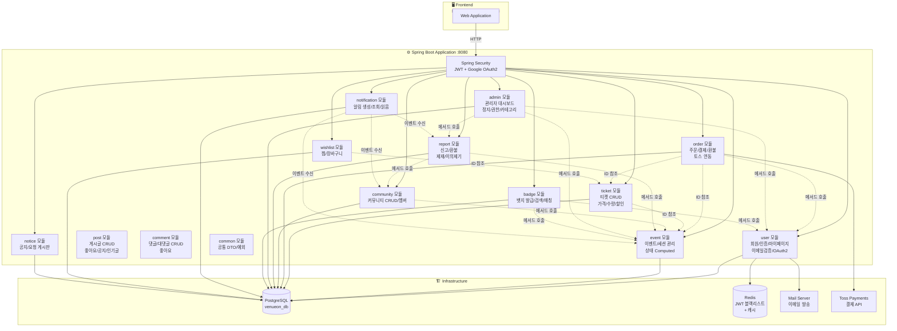

# 🏗️ VenueOn 최종 아키텍처 v6

> **작성일:** 2026-04-10  
> **기술 스택:** Spring Boot 3.x + Next.js 14 + Vanilla CSS Module  
> **핵심:** 티켓 중심 판매 + 세션 기반 상태 Computed + 토스 결제 + 뱃지 커뮤니티  
> **ERD:** [ERD_v6.md](./ERD_v6.md) (23개 테이블)

---

## 📌 1. 기능 범위

| # | 기능 | 설명 |
|---|------|------|
| 1 | **회원가입/로그인** | 이메일 인증 + Google OAuth2, JWT |
| 2 | **이벤트 CRUD** | Step 1~4 플로우, Rich Editor, 세션 구성 |
| 3 | **티켓 관리** | 호스트 자유 구성, 가격/할인/수량/판매기간 |
| 4 | **이벤트 검색/필터** | 지역별 + 날짜별 + 카테고리 + 페이지네이션 |
| 5 | **이벤트 상태 관리** | EventStatus (Computed) + RecruitmentStatus (세션 OR 종합) |
| 6 | **리뷰 시스템** | 수강 후 별점 리뷰 + 어드민 관리 |
| 7 | **결제** | 토스 페이먼츠 테스트 모드 + 환불 체계 |
| 8 | **찜/장바구니** | 찜 목록 + 수강 바구니 (티켓 단위) |
| 9 | **커뮤니티** | 좋아요, 대댓글, 공지 고정, 인기글, 권한 체계 |
| 10 | **마이페이지** | 탭 통합, 관심 카테고리, 알림 센터 |
| 11 | **알림 시스템** | 쌓이는 알림 5종 + 읽음 처리 + 헤더 배지 |
| 12 | **호스트 센터** | 결제 내역 관리 + 직접 환불 + 요청 게시판 |
| 13 | **신고 시스템** | 처리 단계 + 제재 상태 + 이의 제기 + 이력 추적 |
| 14 | **환불 관리** | 사용자 환불 요청 + 호스트/어드민 승인/거절 |
| 15 | **어드민 대시보드** | 회원 정지/권한 + 카테고리 + 제재 관리 |
| 16 | **뱃지 시스템** | 자동 발급 + 노출 설정 + 보유자 검색/초대 + 커뮤니티 매칭 |
| 17 | **사용자 공개 프로필** | 보유 뱃지 + 활동 내역 |
| 18 | **공지/게시판** | 통합 공지 + 요청 게시판 + 이의 제기 |

---

## 📌 2. 타겟 사용자 & 권한 정책

| 구분 | 대상 | 역할 | 가입 방식 |
|------|------|------|----------|
| **관리자 (ADMIN)** | 서비스 운영팀 | 시스템 전체 관리 | 사전 등록 |
| **기획자 (HOST)** | 기업·공공기관·사업자 | 이벤트 생성·관리·환불 | 사업자 인증 + 이메일 검증 |
| **일반 사용자 (USER)** | 개인 | 이벤트 탐색·구매·커뮤니티 | 이메일 검증 / Google OAuth2 |

---

## 📌 3. 모듈러 모놀리스 (13개 도메인 모듈)



### 모듈별 역할

| 모듈 (패키지) | 담당 |
|--------------|------|
| **com.venueon.user** | 회원가입, 로그인, JWT, 프로필, 마이페이지, 이메일 검증, Google OAuth2, 관심 카테고리 |
| **com.venueon.event** | 이벤트/세션 공개 조회 (R), 도메인 모델, 상태 Computed, 리뷰 |
| **com.venueon.host.event** | 호스트 이벤트/세션 CUD, 상태 변경, 모집 마감/재개 |
| **com.venueon.ticket** | 티켓 공개 조회 (R), 도메인 모델, 세션 매핑 |
| **com.venueon.host.ticket** | 호스트 티켓 CUD, 가격/수량/판매기간 설정 |
| **com.venueon.order** | 주문/결제 (ticketId 참조), 토스 연동, 정원 확인 + 차감 |
| **com.venueon.cart** | 장바구니 (ticketId 참조), 일괄 결제 |
| **com.venueon.community** | 커뮤니티 CRUD, 멤버 관리, 권한 체계 |
| **com.venueon.post** | 게시글 CRUD, 좋아요, 공지 고정, 인기글, 북마크 |
| **com.venueon.comment** | 댓글/대댓글 CRUD, 좋아요 |
| **com.venueon.report** | 신고 CRUD, 환불 관리, 처리 단계, 제재 상태, 이의 제기 |
| **com.venueon.admin.user** | 관리자 회원 정지/권한 관리 |
| **com.venueon.admin.notice** | 관리자 공지 CUD |
| **com.venueon.admin.category** | 관리자 카테고리 CUD |
| **com.venueon.badge** | 뱃지 자동 발급, 노출 설정, 보유자 검색/초대, 커뮤니티 매칭 |
| **com.venueon.notification** | 알림 생성 (5종), 알림 조회, 읽음 처리, 미확인 카운트 |
| **com.venueon.wishlist** | 찜 목록 관리 |
| **com.venueon.notice** | 공지 공개 조회 (R), 도메인 모델 |
| **com.venueon.host.request** | 호스트 요청 게시판 |
| **com.venueon.category** | 카테고리 공개 조회 (R), 도메인 모델 |
| **com.venueon.common** | ApiResponse, 예외 처리, @UseCase 등 공통 |

### 도메인 간 의존 방향

```
event  ←─(ID)─  ticket  ←─(ID)─  order
  ↑                                 ↑
  └──────────  cart ─────(ID)───────┘
                 
wishlist ─(ID)── event
badge    ─(ID)── event, user
```

- 모든 도메인 간 **ID 기반 느슨한 결합** (직접 클래스 참조 없음)
- 알림은 **이벤트 수신** 방식 (event, community, report 모듈에서 트리거)

---

## 📌 4. 티켓 중심 판매 모델

### 핵심 원칙

```
세션(Session) = 이벤트 일정 / 시간표  →  "언제, 어디서, 무슨 내용인가"
티켓(Ticket)  = 판매 상품           →  "얼마에, 어떤 세션에 입장할 수 있는가"
```

- 세션에서 **가격 제거**. 가격은 티켓의 속성
- 세션에 **정원 유지**. 물리적 장소 제약이므로 세션의 속성
- `SalesMode` / `PurchaseType` **제거**. 호스트가 티켓을 어떻게 구성하느냐에 따라 판매 전략이 결정
- `is_all_sessions` 플래그로 전체 패키지 자동 포함

### 티켓 구성 예시 (3일 AI 세미나)

| 티켓 | 가격 | 정가 | is_all_sessions | 매핑 세션 |
|------|------|------|----------------|----------|
| 🏆 전체 패키지 | ₩85,000 | ₩100,000 | `true` | — (전체 자동) |
| 📦 Day 1+2 세트 | ₩70,000 | ₩80,000 | `false` | Day 1, Day 2 |
| 🎫 Day 1 입장권 | ₩30,000 | ₩30,000 | `false` | Day 1 |
| 🎫 Day 2 입장권 | ₩50,000 | ₩50,000 | `false` | Day 2 |
| 🎫 Day 3 입장권 | ₩20,000 | ₩20,000 | `false` | Day 3 |

→ **호스트가 만드는 그대로가 판매 전략**. `SalesMode` enum 불필요.

### hasSession=false (단일 이벤트)

```
1. 기본 세션 1개 자동 생성 (이벤트와 동일 일정/장소)
2. 기본 티켓 1개 자동 생성 (is_all_sessions=true)
3. 호스트는 가격만 입력 → 기존 단일 이벤트 UX 유지
```

---

## 📌 5. 이벤트 상태 모델

### EventStatus (진행 상태)

| 값 | 설명 | 전이 방식 |
|---|---|---|
| `DRAFT` | 임시저장 | 생성 시 "임시저장" 버튼 |
| `PUBLISHED` | 공개(준비중) | 생성/수정 시 "게시" 버튼 |
| `ONGOING` | 진행중 | 세션 중 1개라도 진행중이면 **자동 Computed** |
| `ENDED` | 종료 | 모든 세션 종료 시 **자동** or 호스트 수동 |
| `CANCELLED` | 취소 | 호스트 수동 |

> DB에는 DRAFT, PUBLISHED, ENDED, CANCELLED만 저장.  
> ONGOING은 세션의 startTime/endTime 기반으로 **조회 시 계산**.

### RecruitmentStatus (모집 상태)

> DB에 저장하지 않음. 세션 단위에서 조회 시 계산 → 이벤트 레벨로 OR 종합.

| 값 | 설명 | 판단 기준 |
|---|---|---|
| `PENDING` | 모집대기 | `recruitStartDate` 이전 |
| `OPEN` | 모집중 | 기간 내 + 잔여석 + 수동 마감 아님 |
| `CLOSED` | 마감 | 기한 초과 / 정원 초과 / 호스트 수동 마감 |

### 이벤트 레벨 = 세션 OR 종합

```
이벤트 시작일     = min(세션들의 startTime)
이벤트 종료일     = max(세션들의 endTime)
이벤트 모집 시작  = min(세션들의 recruitStartDate)
이벤트 모집 마감  = max(세션들의 recruitEndDate)
이벤트 진행 상태  = 세션들의 status OR 종합
이벤트 모집 상태  = 1개라도 OPEN → OPEN
```

> [!IMPORTANT]
> **Nullable 필드 & 게시 시 검증 전략**  
> 세션의 날짜 필드(`start_time`, `end_time`, `recruit_start_date`, `recruit_end_date`)는 DB에서 nullable이다.  
> 이는 DRAFT 상태에서 호스트가 미완성 세션을 임시저장할 수 있도록 하기 위함이다.  
> **DRAFT → PUBLISHED 전환 시점에 비즈니스 레이어에서 필수 검증을 수행한다:**
>
> ```java
> // Event.validateForPublish(sessions) — 게시 전 필수 검증
> 1. 세션 1개 이상 존재
> 2. 모든 세션의 start_time, end_time NOT NULL
> 3. end_time > start_time
> 4. is_online=false인 세션의 location NOT NULL
> 5. recruit_start_date = null → 즉시 모집 시작으로 처리
> 6. recruit_end_date = null → 세션 start_time까지 모집으로 처리
> ```
>
> → **PUBLISHED된 이벤트는 항상 완전한 세션 데이터를 보장** → Computed 상태 계산이 안전.

---

## 📌 6. 헥사고날 아키텍처 — 모듈 내부 구조

### ticket 모듈 — 공개 조회 (R)

```
com.venueon.ticket/
├── domain/model/
│   └── Ticket.java
├── application/
│   ├── port/in/
│   │   └── GetTicketUseCase.java
│   ├── port/out/
│   │   └── TicketRepositoryPort.java
│   └── service/
│       └── TicketQueryService.java
├── adapter/
│   ├── in/web/
│   │   ├── TicketController.java        ← GET /events/{id}/tickets
│   │   └── dto/
│   │       └── response/
│   │           └── TicketResponse.java
│   └── out/persistence/
│       ├── entity/
│       │   ├── TicketJpaEntity.java
│       │   └── TicketSessionJpaEntity.java
│       ├── repository/
│       │   ├── TicketJpaRepository.java
│       │   └── TicketSessionJpaRepository.java
│       ├── TicketPersistenceAdapter.java
│       └── TicketMapper.java
```

### host/ticket 모듈 — 호스트 CUD

```
com.venueon.host.ticket/
├── application/
│   ├── port/in/
│   │   ├── CreateTicketUseCase.java
│   │   ├── UpdateTicketUseCase.java
│   │   └── DeleteTicketUseCase.java
│   └── service/
│       └── TicketCommandService.java
├── adapter/
│   └── in/web/
│       ├── TicketController.java        ← POST/PUT/DELETE /host/events/{id}/tickets
│       └── dto/
│           └── request/
│               ├── TicketCreateRequest.java
│               └── TicketUpdateRequest.java
```

### event 모듈 — 공개 조회 (R)

```
com.venueon.event/
├── domain/model/
│   ├── Event.java
│   ├── Session.java              ← EventSession에서 리네이밍
│   ├── EventStatus.java          ← DRAFT, PUBLISHED, ONGOING, ENDED, CANCELLED
│   └── RecruitmentStatus.java    ← PENDING, OPEN, CLOSED
├── application/
│   ├── port/in/
│   │   ├── GetEventUseCase.java
│   │   └── GetSessionUseCase.java
│   ├── port/out/
│   │   ├── EventRepositoryPort.java
│   │   └── SessionRepositoryPort.java
│   └── service/
│       └── EventQueryService.java
├── adapter/
│   ├── in/web/
│   │   ├── EventController.java         ← GET /events, GET /events/{id}
│   │   ├── SessionController.java       ← GET /events/{id}/sessions
│   │   └── dto/
│   │       └── response/
│   │           ├── EventDetailResponse.java
│   │           ├── EventListResponse.java
│   │           └── SessionResponse.java
│   └── out/persistence/
│       ├── entity/
│       │   ├── EventJpaEntity.java
│       │   └── SessionJpaEntity.java    ← @Table("event_sessions")
│       ├── repository/
│       │   ├── EventJpaRepository.java
│       │   └── SessionJpaRepository.java
│       ├── EventPersistenceAdapter.java
│       ├── SessionPersistenceAdapter.java
│       ├── EventMapper.java
│       └── SessionMapper.java
```

### host/event 모듈 — 호스트 CUD

```
com.venueon.host.event/
├── application/
│   ├── port/in/
│   │   ├── CreateEventUseCase.java
│   │   ├── UpdateEventUseCase.java
│   │   ├── DeleteEventUseCase.java
│   │   ├── ManageEventStatusUseCase.java
│   │   ├── CreateSessionUseCase.java
│   │   ├── UpdateSessionUseCase.java
│   │   ├── DeleteSessionUseCase.java
│   │   └── ManageRecruitmentUseCase.java
│   └── service/
│       ├── EventCommandService.java
│       └── SessionCommandService.java
├── adapter/
│   └── in/web/
│       ├── EventController.java         ← POST/PUT/DELETE /events, PATCH /events/{id}/status
│       ├── SessionController.java       ← POST/PUT/DELETE /events/{id}/sessions, 모집 관리
│       └── dto/
│           └── request/
│               ├── EventCreateRequest.java
│               ├── EventUpdateRequest.java
│               ├── SessionCreateRequest.java
│               └── SessionUpdateRequest.java
```

> [!NOTE]
> **컨트롤러 분리 원칙 (PROJECT_ARCHITECTURE_REFERENCE 교훈 3)**  
> 같은 도메인이라도 CRUD 주체가 다르면 **패키지 자체를 분리**한다.  
> 호스트 패키지(`host/event/`) 안에 있으므로 클래스명에 `Host` 접두사가 불필요.
>
> | 패키지 | 컨트롤러 | 역할 | 인증 |
> |--------|---------|------|------|
> | `event/` | `EventController` | 공개 조회 (R) | ❌ |
> | `event/` | `SessionController` | 공개 세션 조회 (R) | ❌ |
> | `host/event/` | `EventController` | 호스트 CUD + 상태 변경 | 🔑 HOST |
> | `host/event/` | `SessionController` | 호스트 세션 CUD + 모집 관리 | 🔑 HOST |
>
> `host/event/`는 도메인 모델/JPA를 직접 갖지 않고, `event/`의 Port(Out)을 참조하여 DB 접근.

### badge 모듈

```
com.venueon.badge/
├── domain/model/
│   └── Badge.java
├── application/
│   ├── port/in/
│   │   ├── IssueBadgeUseCase.java
│   │   ├── GetMyBadgesUseCase.java
│   │   ├── ToggleBadgeVisibilityUseCase.java
│   │   ├── SearchBadgeHoldersUseCase.java
│   │   └── InviteBadgeHolderUseCase.java
│   ├── port/out/
│   │   ├── LoadBadgePort.java
│   │   └── SaveBadgePort.java
│   └── service/
├── adapter/
│   ├── in/web/BadgeController.java
│   └── out/persistence/
```

### notification 모듈

```
com.venueon.notification/
├── domain/model/
│   ├── Notification.java
│   └── NotificationType.java    ← COMMENT, LECTURE, SANCTION, PAYMENT, REPORT
├── application/
│   ├── port/in/
│   │   ├── CreateNotificationUseCase.java
│   │   ├── GetNotificationsUseCase.java
│   │   ├── MarkAsReadUseCase.java
│   │   └── GetUnreadCountUseCase.java
│   ├── port/out/
│   └── service/
├── adapter/
│   ├── in/web/NotificationController.java
│   └── out/persistence/
```

### wishlist / cart 모듈

```
com.venueon.wishlist/
├── domain/model/
│   └── WishlistItem.java
├── application/
│   ├── port/in/
│   │   ├── AddToWishlistUseCase.java
│   │   ├── RemoveFromWishlistUseCase.java
│   │   └── GetWishlistUseCase.java
│   └── port/out/
├── adapter/
│   ├── in/web/WishlistController.java
│   └── out/persistence/

com.venueon.cart/
├── domain/model/
│   └── CartItem.java
├── application/
│   ├── port/in/
│   │   ├── AddToCartUseCase.java
│   │   ├── UpdateCartUseCase.java
│   │   ├── RemoveFromCartUseCase.java
│   │   ├── GetCartUseCase.java
│   │   └── CheckoutCartUseCase.java
│   └── port/out/
├── adapter/
│   ├── in/web/CartController.java
│   └── out/persistence/
```

### notice 모듈 — 공개 조회 (R)

```
com.venueon.notice/
├── domain/model/
│   ├── Notice.java
│   ├── NoticeType.java      ← GUIDE, ANNOUNCEMENT, QNA, OBJECTION
│   └── Request.java
├── application/
│   ├── port/in/
│   │   └── GetNoticesUseCase.java
│   ├── port/out/
│   │   └── NoticeRepositoryPort.java
│   └── service/
│       └── NoticeQueryService.java
├── adapter/
│   ├── in/web/
│   │   └── NoticeController.java        ← GET /notices
│   └── out/persistence/
```

### admin/notice 모듈 — 어드민 CUD

```
com.venueon.admin.notice/
├── application/
│   ├── port/in/
│   │   ├── CreateNoticeUseCase.java
│   │   ├── UpdateNoticeUseCase.java
│   │   └── DeleteNoticeUseCase.java
│   └── service/
│       └── NoticeCommandService.java
├── adapter/
│   └── in/web/
│       └── NoticeController.java        ← POST/PUT/DELETE /notices (🔑 ADMIN)
```

### host/request 모듈 — 호스트 요청 게시판

```
com.venueon.host.request/
├── application/
│   ├── port/in/
│   │   ├── CreateRequestUseCase.java
│   │   └── GetRequestsUseCase.java
│   └── service/
│       └── RequestService.java
├── adapter/
│   └── in/web/
│       └── RequestController.java       ← GET/POST /host/requests (🔑 HOST)
```

### category 모듈 — 공개 조회 + admin/category 분리

```
com.venueon.category/                    ← 공개 조회 (R)
├── domain/model/
│   └── Category.java
├── adapter/in/web/
│   └── CategoryController.java          ← GET /categories
├── adapter/out/persistence/
│   └── ...

com.venueon.admin.category/              ← 어드민 CUD
├── adapter/in/web/
│   └── CategoryController.java          ← POST/PUT/DELETE /admin/categories (🔑 ADMIN)
```

---

## 📌 7. 기술 스택

| 카테고리 | 기술 | 비고 |
|----------|------|------|
| **프론트엔드** | Next.js 14+ (App Router) | React 18, SSR/SSG |
| **스타일링** | Vanilla CSS Module | 컴포넌트별 스코프 CSS |
| **백엔드** | Spring Boot 3.x, Java 17 | RESTful API |
| **아키텍처 패턴** | Hexagonal Architecture | Ports & Adapters |
| **아키텍처 구조** | Modular Monolith | 13개 도메인 모듈 |
| **DB** | PostgreSQL 15 | 단일 DB, 23개 테이블 |
| **캐시** | Redis 7 | JWT 블랙리스트, 캐시 |
| **인증** | Spring Security + JWT | Access + Refresh Token |
| **소셜 인증** | Google OAuth2 | Spring Security OAuth2 Client |
| **이메일** | Spring Mail (SMTP) | 인증 코드, 임시 비밀번호 |
| **결제** | Toss Payments (테스트 모드) | 토스 SDK + Webhook 검증 |
| **에디터** | Rich Text Editor (WYSIWYG) | 이벤트/커뮤니티 글 |
| **파일 저장** | 외부 볼륨 마운트 + Nginx | `dist/upload` |
| **컨테이너** | Docker + Docker Compose | 로컬 개발 환경 |
| **CI/CD** | GitHub Actions | 빌드/테스트 자동화 |
| **API 문서** | Swagger (SpringDoc) | 자동 API 문서 |

---

## 📌 8. 페이지 구성 (~46개)

### 공통 / 인증 (4)

| # | 페이지 | 경로 |
|---|--------|------|
| 1 | 메인 홈 | `/` |
| 2 | 수강생 로그인 | `/auth/login` |
| 3 | 수강생 회원가입 | `/auth/signup` |
| 4 | 호스트 로그인/회원가입 | `/host/login`, `/host/signup` |

### 이벤트 (5)

| # | 페이지 | 경로 |
|---|--------|------|
| 5 | 이벤트 리스트 | `/events` |
| 6 | 이벤트 상세 | `/events/[id]` |
| 7 | 이벤트 생성 | `/events/new` |
| 8 | 이벤트 수정 | `/events/[id]/edit` |
| 9 | 리뷰 (이벤트 상세 내 섹션) | `/events/[id]#reviews` |

### 커뮤니티 (4)

| # | 페이지 | 경로 |
|---|--------|------|
| 10 | 커뮤니티 목록 | `/community` |
| 11 | 커뮤니티 상세 | `/community/[id]` |
| 12 | 커뮤니티 생성/수정 | `/community/new`, `/community/[id]/edit` |
| 13 | 멤버 관리 | `/community/[id]/members` |

### 결제 / 장바구니 (3)

| # | 페이지 | 경로 |
|---|--------|------|
| 14 | 수강 바구니 | `/cart` |
| 15 | 결제 (토스 위젯) | `/orders/checkout` |
| 16 | 결제 완료 | `/orders/[id]/complete` |

### 마이페이지 (8)

| # | 페이지 | 경로 |
|---|--------|------|
| 17 | 마이페이지 메인 | `/mypage` |
| 18 | 결제 내역 | `/mypage/orders` |
| 19 | 내 이벤트 (수강중/완료 탭) | `/mypage/events` |
| 20 | 찜 목록 | `/mypage/wishlist` |
| 21 | 내 커뮤니티 (4탭) | `/mypage/communities` |
| 22 | 프로필 설정 | `/mypage/profile` |
| 23 | 알림 센터 | `/mypage/notifications` |
| 24 | 뱃지 목록 | `/mypage/badges` |

### 호스트 (6)

| # | 페이지 | 경로 |
|---|--------|------|
| 25 | 호스트 센터 (랜딩) | `/host` |
| 26 | 호스트 대시보드 | `/host/dashboard` |
| 27 | 내가 등록한 이벤트 | `/host/events` |
| 28 | 호스트 결제 내역/환불 | `/host/payments` |
| 29 | 호스트 요청 게시판 | `/host/requests` |
| 30 | 호스트 프로필 설정 | `/host/profile` |

### 어드민 (10)

| # | 페이지 | 경로 |
|---|--------|------|
| 31 | 어드민 대시보드 | `/admin` |
| 32 | 회원 관리 | `/admin/users` |
| 33 | 카테고리 관리 | `/admin/categories` |
| 34 | 관심 카테고리 관리 | `/admin/interest-categories` |
| 35 | 신고 관리 | `/admin/reports` |
| 36 | 커뮤니티 요청 관리 | `/admin/community-requests` |
| 37 | 요청 처리 | `/admin/requests` |
| 38 | 리뷰 관리 | `/admin/reviews` |
| 39 | 환불 관리 | `/admin/refunds` |
| 40 | 커뮤니티 제재 관리 | `/admin/communities/sanctions` |

### 뱃지 / 프로필 (3)

| # | 페이지 | 경로 |
|---|--------|------|
| 41 | 뱃지 보유자 검색 | `/badges/search` |
| 42 | 사용자 공개 프로필 | `/users/[id]/profile` |
| 43 | 뱃지 기반 커뮤니티 개설 | `/community/new` (연동) |

### 공지 / 게시판 (3)

| # | 페이지 | 경로 |
|---|--------|------|
| 44 | 통합 공지 게시판 | `/notice` |
| 45 | 요청 게시판 (호스트용) | `/requests` |
| 46 | 커뮤니티 관리자 요청 | `/community/[id]/requests` |

---

## 📌 9. Docker Compose

```yaml
version: '3.8'

services:
  postgres:
    image: postgres:15
    environment:
      POSTGRES_DB: venueon_db
      POSTGRES_USER: ${DB_USER}
      POSTGRES_PASSWORD: ${DB_PASSWORD}
    ports:
      - "5432:5432"
    volumes:
      - pg-data:/var/lib/postgresql/data

  redis:
    image: redis:7-alpine
    ports:
      - "6379:6379"

  mailhog:
    image: mailhog/mailhog
    ports:
      - "1025:1025"
      - "8025:8025"
    profiles:
      - dev

  backend:
    build: ../backend
    ports:
      - "8080:8080"
    depends_on:
      - postgres
      - redis
    environment:
      SPRING_DATASOURCE_URL: jdbc:postgresql://postgres:5432/venueon_db
      SPRING_DATASOURCE_USERNAME: ${DB_USER}
      SPRING_DATASOURCE_PASSWORD: ${DB_PASSWORD}
      SPRING_REDIS_HOST: redis
      JWT_SECRET: ${JWT_SECRET}
      UPLOAD_PATH: /app/upload
      GOOGLE_CLIENT_ID: ${GOOGLE_CLIENT_ID}
      GOOGLE_CLIENT_SECRET: ${GOOGLE_CLIENT_SECRET}
      TOSS_SECRET_KEY: ${TOSS_SECRET_KEY}
      TOSS_CLIENT_KEY: ${TOSS_CLIENT_KEY}
      SPRING_MAIL_HOST: mailhog
      SPRING_MAIL_PORT: 1025
    volumes:
      - upload-data:/app/upload

  nginx:
    image: nginx:alpine
    ports:
      - "80:80"
    volumes:
      - upload-data:/usr/share/nginx/html/upload:ro
      - ./nginx.conf:/etc/nginx/conf.d/default.conf:ro
    depends_on:
      - backend

volumes:
  pg-data:
  upload-data:
```

---

> 📌 **작성일:** 2026-04-10  
> 📌 **ERD:** [ERD_v6.md](./ERD_v6.md)  
> 📌 **API 스펙:** [API_스펙_v6.md](./API_스펙_v6.md)  
> 📌 **설계 기반:** [티켓_중심_설계서.md](../티켓_중심_설계서.md), [이벤트_상태관리_설계서.md](../이벤트_상태관리_설계서.md)
