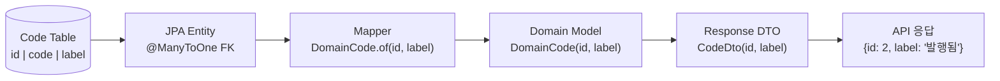
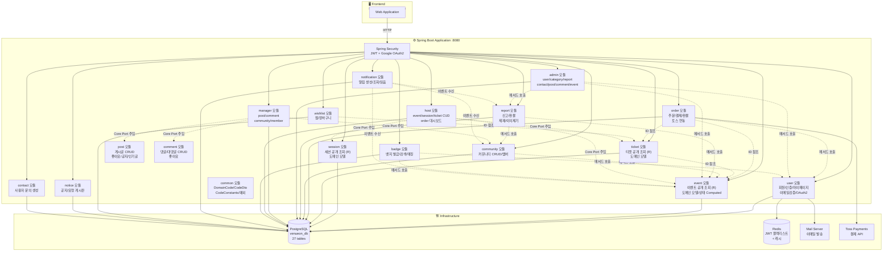

# 🏗️ VenueOn 최종 아키텍처 v7

> **작성일:** 2026-04-13  
> **기술 스택:** Spring Boot 3.x + Next.js 16 + Vanilla CSS Module  
> **핵심:** 티켓 중심 판매 + 세션 기반 상태 Computed + 코드 테이블 정규화 + 토스 결제 + 뱃지 커뮤니티  
> **ERD:** [ERD_v7.md](./ERD_v7.md) (27개 테이블)  
> **API:** [API_스펙_v7.md](./API_스펙_v7.md) (176개)

---

## 📌 v6 → v7 핵심 변경 요약

| 영역 | v6 | v7 |
|------|----|----|
| **상태/유형 저장** | VARCHAR enum 직접 저장 | 정규화된 코드 테이블 FK 참조 |
| **도메인 모델** | 문자열 enum (EventStatus, UserRole 등) | `DomainCode(Long id, String label)` record |
| **API 응답** | `"status": "PUBLISHED"` | `"status": {"id": 2, "label": "발행됨"}` |
| **DB 테이블** | 23개 | 27개 (+event_statuses, event_types, recruitment_statuses, user_roles) |
| **세션 상태 관리** | Computed only | Computed + 호스트 수동 강제 (forced_*_status_id FK) |
| **세션 주소** | 장소명만 | address_road, address_detail 추가 |
| **Next.js** | 14 | 16.2 |

---

## 📌 1. 기능 범위

| # | 기능 | 설명 |
|---|------|------|
| 1 | **회원가입/로그인** | 이메일 인증 + Google OAuth2, JWT |
| 2 | **이벤트 CRUD** | Step 1~4 플로우, Rich Editor, 세션 구성 |
| 3 | **티켓 관리** | 호스트 자유 구성, 가격/할인/수량/판매기간 |
| 4 | **이벤트 검색/필터** | 지역별 + 날짜별 + 카테고리 + 페이지네이션 |
| 5 | **이벤트 상태 관리** | EventStatus (Computed + **수동 강제**) + RecruitmentStatus |
| 6 | **리뷰 시스템** | 수강 후 별점 리뷰 + 어드민 관리 |
| 7 | **결제** | 토스 페이먼츠 테스트 모드 + 환불 체계 |
| 8 | **찜/장바구니** | 찜 목록 + 수강 바구니 (티켓 단위) |
| 9 | **커뮤니티** | 좋아요, 대댓글, 공지 고정, 인기글, 권한 체계 |
| 10 | **마이페이지** | 탭 통합, 관심 카테고리, 알림 센터 |
| 11 | **알림 시스템** | 쌓이는 알림 5종 + 읽음 처리 + 헤더 배지 |
| 12 | **호스트 센터** | 결제 내역 관리 + 직접 환불 + 요청 게시판 |
| 13 | **신고 시스템** | 처리 단계 + 제재 상태 + 이의 제기 + 이력 추적 |
| 14 | **환불 관리** | 사용자 환불 요청 + 호스트/어드민 승인/거절 |
| 15 | **어드민 대시보드** | 회원 정지/권한 + 카테고리 + 제재 관리 |
| 16 | **뱃지 시스템** | 자동 발급 + 노출 설정 + 보유자 검색/초대 + 커뮤니티 매칭 |
| 17 | **사용자 공개 프로필** | 보유 뱃지 + 활동 내역 |
| 18 | **공지/게시판** | 통합 공지 + 요청 게시판 + 이의 제기 |

---

## 📌 2. 타겟 사용자 & 권한 정책

| 구분 | 대상 | 역할 ID | 가입 방식 |
|------|------|---------|----------|
| **관리자 (ADMIN)** | 서비스 운영팀 | `1` | 사전 등록 |
| **일반 사용자 (USER)** | 개인 | `2` | 이메일 검증 / Google OAuth2 |
| **기획자 (HOST)** | 기업·공공기관·사업자 | `3` | 사업자 인증 + 이메일 검증 / USER→HOST 전환 |

> v7에서 역할은 `user_roles` 테이블의 FK로 관리됨.  
> `CodeConstants.ROLE_ADMIN_ID = 1`, `ROLE_USER_ID = 2`, `ROLE_HOST_ID = 3`
> **※ 주의:** 커뮤니티 관리자의 경우 시스템 `user_roles`가 아닌 커뮤니티 내부의 `MemberRole.MANAGER`로 권한이 부여됩니다.

---

## 📌 3. 코드 테이블 아키텍처 (v7 신규)

### 설계 원칙

```
코드 테이블 (Lookup Table)
= 도메인의 상태/유형/역할을 별도 테이블로 정규화
= ID + code(영문) + label(한글) 구조
= FK로 참조 → 무결성 보장 + 다국어 확장 기반
```

### 코드 흐름



### 도메인 모델 변환

```java
// Domain Model
public record DomainCode(Long id, String label) {}

// Mapper: JPA → Domain
DomainCode.of(entity.getStatus().getId(), entity.getStatus().getLabel())

// DTO: Domain → API Response
CodeDto.of(domain.getStatus().id(), domain.getStatus().label())
```

### CodeConstants

```java
public class CodeConstants {
    // User Role IDs
    public static final Long ROLE_ADMIN_ID = 1L;
    public static final Long ROLE_USER_ID = 2L;
    public static final Long ROLE_HOST_ID = 3L;

    // Event Status IDs
    public static final Long EVENT_STATUS_DRAFT_ID = 1L;
    public static final Long EVENT_STATUS_PUBLISHED_ID = 2L;
    public static final Long EVENT_STATUS_ONGOING_ID = 3L;
    public static final Long EVENT_STATUS_ENDED_ID = 4L;
    public static final Long EVENT_STATUS_CANCELLED_ID = 5L;

    // Recruitment Status IDs
    public static final Long RECRUIT_STATUS_PENDING_ID = 1L;
    public static final Long RECRUIT_STATUS_OPEN_ID = 2L;
    public static final Long RECRUIT_STATUS_CLOSED_ID = 3L;
}
```

---

## 📌 4. 모듈러 모놀리스 (Actor 중심 헥사고날 아키텍처)



### 모듈별 역할

| 모듈 (패키지) | 담당 |
|--------------|------|
| **com.venueon.user** | 회원가입, 로그인, JWT, 프로필, 마이페이지, 이메일 검증, Google OAuth2, 관심 카테고리 |
| **com.venueon.event** | 이벤트 공개 조회 (R), 도메인 모델 (Event), 상태 Computed, 리뷰 |
| **com.venueon.session** | 세션 공개 조회 (R), 도메인 모델 (Session) |
| **com.venueon.ticket** | 티켓 공개 조회 (R), 도메인 모델, 세션 매핑, **RecruitmentStatusJpaEntity** |
| **com.venueon.order** | 주문/결제 (ticketId 참조), 토스 연동, 정원 확인 + 차감 |
| **com.venueon.cart** | 장바구니 (ticketId 참조), 일괄 결제 |
| **com.venueon.community** | 커뮤니티 CRUD, 멤버 관리, 권한 체계 |
| **com.venueon.post** | 게시글 CRUD, 좋아요, 공지 고정, 인기글, 북마크 |
| **com.venueon.comment** | 댓글/대댓글 CRUD, 좋아요 |
| **com.venueon.report** | 신고 CRUD, 환불 관리, 처리 단계, 제재 상태, 이의 제기 |
| **com.venueon.contact** | 사용자 문의 생성 (Core 도메인), Contact/ContactCategory/ContactStatus 모델 |
| **com.venueon.wishlist** | 찜 목록 관리 |
| **com.venueon.category** | 카테고리 공개 조회 (R), 도메인 모델 |
| **com.venueon.member** | 커뮤니티 멤버 도메인 |
| **com.venueon.badge** | 뱃지 자동 발급, 노출 설정, 보유자 검색/초대, 커뮤니티 매칭 |
| **com.venueon.notification** | 알림 생성 (5종), 알림 조회, 읽음 처리, 미확인 카운트 |
| **com.venueon.notice** | 공지 공개 조회 (R), 도메인 모델 |
| **com.venueon.review** | 리뷰 도메인 |
| | |
| **com.venueon.host.event** | 호스트 이벤트 CUD, 상태 변경 |
| **com.venueon.host.session** | 호스트 세션 CUD, 모집관리, **세션 강제 상태 관리** |
| **com.venueon.host.ticket** | 호스트 티켓 CUD, 가격/수량/판매기간 설정 |
| **com.venueon.host.order** | 호스트 주문 대시보드 |
| **com.venueon.host.request** | 호스트 요청 게시판 |
| | |
| **com.venueon.admin.user** | 관리자 회원 관리 (정지/권한 변경/삭제) |
| **com.venueon.admin.category** | 관리자 카테고리 CUD |
| **com.venueon.admin.report** | 관리자 신고 처리 |
| **com.venueon.admin.contact** | 관리자 문의 관리 (승인/거절) |
| **com.venueon.admin.post** | 관리자 게시글 관리 (togglePin, toggleNotice, hide, 강제삭제) |
| **com.venueon.admin.comment** | 관리자 댓글 관리 (hide, 강제삭제) |
| **com.venueon.admin.event** | 관리자 이벤트 관리 (전체 조회, 강제 상태 변경, 삭제) |
| | |
| **com.venueon.manager.post** | 커뮤니티 관리자 게시글 관리 (pin, hide, 삭제 — communityId 범위) |
| **com.venueon.manager.comment** | 커뮤니티 관리자 댓글 관리 (hide, 삭제 — communityId 범위) |
| **com.venueon.manager.community** | 커뮤니티 설정 관리, 멤버 역할 변경 |
| **com.venueon.manager.member** | 커뮤니티 멤버 관리 (강퇴, 역할 변경) |
| | |
| **com.venueon.common** | `DomainCode`, `CodeDto`, `CodeConstants`, ApiResponse, 예외 처리 |

### 도메인 간 의존 방향

```
event  ←─(ID)─  ticket  ←─(ID)─  order
  ↑                                 ↑
  └──────────  cart ─────(ID)───────┘
                 
wishlist ─(ID)── event
badge    ─(ID)── event, user

host.*     ─(Core Port 주입)── event, session, ticket (엔티티 중복 ❌)
admin.*    ─(Core Port 주입)── user, post, comment, event, report, contact
manager.*  ─(Core Port 주입)── post, comment, community, member
```

- 모든 도메인 간 **ID 기반 느슨한 결합** (직접 클래스 참조 없음)
- Actor 계층(host/admin/manager)은 **Core 도메인의 Port를 주입받아 사용** (엔티티/리포지토리 중복 금지)
- 알림은 **이벤트 수신** 방식 (event, community, report 모듈에서 트리거)
- **코드 테이블은 모듈을 넘어 공유**: `EventStatusJpaEntity`는 `event/` 모듈, `RecruitmentStatusJpaEntity`는 `ticket/` 모듈에 위치

---

## 📌 5. 이벤트 상태 모델 (v7 확장)

### EventStatus (진행 상태)

| ID | code | label | 전이 방식 |
|----|------|-------|-----------|
| 1 | `DRAFT` | 임시저장 | 생성 시 "임시저장" 버튼 |
| 2 | `PUBLISHED` | 발행됨 | 생성/수정 시 "게시" 버튼 |
| 3 | `ONGOING` | 진행중 | 세션 startTime 도래 **자동 Computed** |
| 4 | `ENDED` | 종료됨 | 모든 세션 종료 시 **자동** or 호스트 수동 |
| 5 | `CANCELLED` | 취소됨 | 호스트 수동 |

> DB에는 1(DRAFT), 2(PUBLISHED), 4(ENDED), 5(CANCELLED)만 직접 저장.  
> 3(ONGOING)은 세션 startTime/endTime 기반 **조회 시 계산**.  
> **v7 추가:** 호스트가 `forced_session_status_id`를 지정하면 Computed 결과 대신 강제 적용.

### RecruitmentStatus (모집 상태)

| ID | code | label | 판단 기준 |
|----|------|-------|-----------|
| 1 | `PENDING` | 모집 예정 | `recruitStartDate` 이전 |
| 2 | `OPEN` | 모집중 | 기간 내 + 잔여석 + 수동 마감 아님 |
| 3 | `CLOSED` | 모집 마감 | 기한 초과 / 정원 초과 / 호스트 수동 마감 |

> 기본적으로 DB에 저장하지 않고 Computed.  
> **v7 추가:** 호스트가 `forced_recruitment_status_id`를 지정하면 Computed 결과 대신 강제 적용.  
> `statusId: null` 전송 → 강제 해제 → 자동 모드 복귀.

### 세션 상태 판별 우선순위

```
1. forced_session_status_id (NOT NULL이면 해당 값 사용)
2. Computed (start_time/end_time 기반)
   └ 현재 < start_time → PUBLISHED
   └ start_time ≤ 현재 ≤ end_time → ONGOING
   └ end_time < 현재 → ENDED

1. forced_recruitment_status_id (NOT NULL이면 해당 값 사용)
2. is_recruitment_closed (true면 CLOSED)
3. current_attendees >= max_attendees (정원 초과 → CLOSED)
4. 날짜 기반 (recruit_start_date, recruit_end_date)
5. 기본 → OPEN
```

### 이벤트 레벨 = 세션 OR 종합

```
이벤트 시작일     = min(세션들의 startTime)
이벤트 종료일     = max(세션들의 endTime)
이벤트 모집 시작  = min(세션들의 recruitStartDate)
이벤트 모집 마감  = max(세션들의 recruitEndDate)
이벤트 진행 상태  = 세션들의 status OR 종합
이벤트 모집 상태  = 1개라도 OPEN → OPEN
```

---

## 📌 6. 티켓 중심 판매 모델 (v6과 동일)

### 핵심 원칙

```
세션(Session) = 이벤트 일정 / 시간표  →  "언제, 어디서, 무슨 내용인가"
티켓(Ticket)  = 판매 상품           →  "얼마에, 어떤 세션에 입장할 수 있는가"
```

- 세션에서 **가격 제거**. 가격은 티켓의 속성
- 세션에 **정원 유지**. 물리적 장소 제약이므로 세션의 속성
- `SalesMode` / `PurchaseType` **제거**. 호스트가 티켓을 어떻게 구성하느냐에 따라 판매 전략이 결정
- `is_all_sessions` 플래그로 전체 패키지 자동 포함

---

## 📌 7. 헥사고날 아키텍처 — 모듈 내부 구조

### event 모듈 — 공개 조회 (R)

```
com.venueon.event/
├── domain/model/
│   ├── Event.java              ← DomainCode type, status
│   ├── EventStatus.java        ← (deprecated: 도메인 enum → CodeConstants로 대체)
│   └── RecruitmentStatus.java  ← (deprecated: 도메인 enum → CodeConstants로 대체)
├── application/
│   ├── port/in/
│   │   ├── GetEventListUseCase.java
│   │   └── GetEventDetailUseCase.java
│   ├── port/out/
│   │   └── EventRepositoryPort.java
│   └── service/
│       └── EventQueryService.java
├── adapter/
│   ├── in/web/
│   │   ├── EventController.java       ← GET /events, GET /events/{id}
│   │   └── dto/
│   │       └── response/
│   │           ├── EventDetailResponse.java  ← CodeDto status, type
│   │           └── EventListResponse.java
│   └── out/persistence/
│       ├── entity/
│       │   ├── EventJpaEntity.java       ← FK: type_id, status_id
│       │   ├── EventStatusJpaEntity.java ← Lookup: id, code, label
│       │   └── EventTypeJpaEntity.java   ← Lookup: id, code, name
│       ├── repository/
│       │   ├── EventJpaRepository.java
│       │   ├── EventStatusJpaRepository.java
│       │   └── EventTypeJpaRepository.javaㅡ
│       ├── EventPersistenceAdapter.java
│       └── EventMapper.java    ← DomainCode.of(entity.getStatus().getId(), ...)
```

### session 모듈 — 공개 조회 (R) ※ 독립 도메인

```
com.venueon.session/
├── domain/model/
│   └── Session.java            ← DomainCode forcedRecruitmentStatus, forcedSessionStatus
├── application/
│   ├── port/in/
│   │   └── GetSessionUseCase.java
│   ├── port/out/
│   │   └── SessionRepositoryPort.java
│   └── service/
│       └── SessionQueryService.java
├── adapter/
│   ├── in/web/
│   │   ├── SessionController.java     ← GET /events/{id}/sessions
│   │   └── dto/
│   │       └── response/
│   │           └── SessionResponse.java      ← CodeDto sessionStatus, recruitmentStatus
│   └── out/persistence/
│       ├── entity/
│       │   └── SessionJpaEntity.java     ← FK: forced_*_status_id
│       ├── repository/
│       │   └── SessionJpaRepository.java
│       ├── SessionPersistenceAdapter.java
│       └── SessionMapper.java  ← DomainCode.of(entity.getForcedSessionStatus().getId(), ...)
```

### user 모듈 — 인증/프로필

```
com.venueon.user/
├── domain/model/
│   ├── User.java                     ← DomainCode role
│   └── AuthProvider.java             ← LOCAL, GOOGLE
├── adapter/
│   ├── in/web/
│   │   └── dto/
│   │       ├── LoginResponse.java    ← CodeDto role
│   │       └── UserInfoResponse.java ← CodeDto role
│   └── out/persistence/
│       ├── entity/
│       │   ├── UserJpaEntity.java     ← FK: role_id → user_roles
│       │   └── UserRoleJpaEntity.java ← Lookup: id, code, name
│       └── repository/
│           ├── UserJpaRepository.java
│           └── UserRoleJpaRepository.java
```

### ticket 모듈

```
com.venueon.ticket/
├── adapter/
│   └── out/persistence/
│       ├── entity/
│       │   ├── TicketJpaEntity.java
│       │   ├── TicketSessionJpaEntity.java
│       │   └── RecruitmentStatusJpaEntity.java  ← Lookup: id, code, label
│       └── repository/
│           ├── TicketJpaRepository.java
│           ├── TicketSessionJpaRepository.java
│           └── RecruitmentStatusJpaRepository.java
```

### common 모듈 (v7 신규 주요 파일)

```
com.venueon.common/
├── model/
│   ├── DomainCode.java       ← record(Long id, String label)
│   └── CodeConstants.java    ← ROLE_*_ID, EVENT_STATUS_*_ID, RECRUIT_STATUS_*_ID
├── dto/
│   └── CodeDto.java          ← record(Long id, String label) — API 응답용
├── config/
│   └── DataInitializer.java  ← 코드 테이블 seed 데이터 초기화
└── ...
```

---

## 📌 8. 기술 스택

| 카테고리 | 기술 | 비고 |
|----------|------|------|
| **프론트엔드** | Next.js 16+ (App Router) | React 19, SSR/SSG |
| **스타일링** | Vanilla CSS Module | 컴포넌트별 스코프 CSS |
| **백엔드** | Spring Boot 3.x, Java 17 | RESTful API |
| **아키텍처 패턴** | Hexagonal Architecture | Ports & Adapters |
| **아키텍처 구조** | Modular Monolith | 13개 도메인 모듈 |
| **DB** | PostgreSQL 15 | 단일 DB, **27개** 테이블 |
| **캐시** | Redis 7 | JWT 블랙리스트, 캐시 |
| **인증** | Spring Security + JWT | Access + Refresh Token |
| **소셜 인증** | Google OAuth2 | Spring Security OAuth2 Client |
| **이메일** | Spring Mail (SMTP) | 인증 코드, 임시 비밀번호 |
| **결제** | Toss Payments (테스트 모드) | 토스 SDK + Webhook 검증 |
| **에디터** | Rich Text Editor (WYSIWYG) | 이벤트/커뮤니티 글 |
| **파일 저장** | 외부 볼륨 마운트 + Nginx | `dist/upload` |
| **컨테이너** | Docker + Docker Compose | 로컬 개발 환경 |
| **CI/CD** | GitHub Actions | 빌드/테스트 자동화 |
| **API 문서** | Swagger (SpringDoc) | 자동 API 문서 |
| **BFF** | iron-session + Next.js Route Handler | JWT 프록시 |

---

## 📌 9. 페이지 구성 (~46개)

### 공통 / 인증 (4)

| # | 페이지 | 경로 |
|---|--------|------|
| 1 | 메인 홈 | `/` |
| 2 | 로그인 | `/login` |
| 3 | 회원가입 | `/signup` |
| 4 | 호스트 로그인/회원가입 | `/host/login`, `/host/signup` |

### 이벤트 (5)

| # | 페이지 | 경로 |
|---|--------|------|
| 5 | 이벤트 리스트 | `/events` |
| 6 | 이벤트 상세 | `/events/[id]` |
| 7 | 이벤트 생성 | `/events/new` |
| 8 | 이벤트 수정 | `/events/[id]/edit` |
| 9 | 리뷰 (이벤트 상세 내 섹션) | `/events/[id]#reviews` |

### 커뮤니티 (4)

| # | 페이지 | 경로 |
|---|--------|------|
| 10 | 커뮤니티 목록 | `/community` |
| 11 | 커뮤니티 상세 | `/community/[id]` |
| 12 | 커뮤니티 생성/수정 | `/community/new`, `/community/[id]/edit` |
| 13 | 멤버 관리 | `/community/[id]/members` |

### 결제 / 장바구니 (3)

| # | 페이지 | 경로 |
|---|--------|------|
| 14 | 수강 바구니 | `/cart` |
| 15 | 결제 (토스 위젯) | `/orders/checkout` |
| 16 | 결제 완료 | `/orders/[id]/complete` |

### 마이페이지 (8)

| # | 페이지 | 경로 |
|---|--------|------|
| 17 | 마이페이지 메인 | `/mypage` |
| 18 | 결제 내역 | `/mypage/orders` |
| 19 | 내 이벤트 (수강중/완료 탭) | `/mypage/events` |
| 20 | 찜 목록 | `/mypage/wishlist` |
| 21 | 내 커뮤니티 (4탭) | `/mypage/communities` |
| 22 | 프로필 설정 | `/mypage/profile` |
| 23 | 알림 센터 | `/mypage/notifications` |
| 24 | 뱃지 목록 | `/mypage/badges` |

### 호스트 (6)

| # | 페이지 | 경로 |
|---|--------|------|
| 25 | 호스트 센터 (랜딩) | `/host` |
| 26 | 호스트 대시보드 | `/host/dashboard` |
| 27 | 내가 등록한 이벤트 | `/host/events` |
| 28 | 호스트 결제 내역/환불 | `/host/payments` |
| 29 | 호스트 요청 게시판 | `/host/requests` |
| 30 | 호스트 프로필 설정 | `/host/profile` |

### 어드민 (10)

| # | 페이지 | 경로 |
|---|--------|------|
| 31 | 어드민 대시보드 | `/admin` |
| 32 | 회원 관리 | `/admin/users` |
| 33 | 카테고리 관리 | `/admin/categories` |
| 34 | 관심 카테고리 관리 | `/admin/interest-categories` |
| 35 | 신고 관리 | `/admin/reports` |
| 36 | 커뮤니티 요청 관리 | `/admin/community-requests` |
| 37 | 요청 처리 | `/admin/requests` |
| 38 | 리뷰 관리 | `/admin/reviews` |
| 39 | 환불 관리 | `/admin/refunds` |
| 40 | 커뮤니티 제재 관리 | `/admin/communities/sanctions` |

### 뱃지 / 프로필 (3)

| # | 페이지 | 경로 |
|---|--------|------|
| 41 | 뱃지 보유자 검색 | `/badges/search` |
| 42 | 사용자 공개 프로필 | `/users/[id]/profile` |
| 43 | 뱃지 기반 커뮤니티 개설 | `/community/new` (연동) |

### 공지 / 게시판 (3)

| # | 페이지 | 경로 |
|---|--------|------|
| 44 | 통합 공지 게시판 | `/notice` |
| 45 | 요청 게시판 (호스트용) | `/requests` |
| 46 | 커뮤니티 관리자 요청 | `/community/[id]/requests` |

---

## 📌 10. Docker Compose

```yaml
version: '3.8'

services:
  postgres:
    image: postgres:15
    environment:
      POSTGRES_DB: venueon_db
      POSTGRES_USER: ${DB_USER}
      POSTGRES_PASSWORD: ${DB_PASSWORD}
    ports:
      - "5432:5432"
    volumes:
      - pg-data:/var/lib/postgresql/data

  redis:
    image: redis:7-alpine
    ports:
      - "6379:6379"

  mailhog:
    image: mailhog/mailhog
    ports:
      - "1025:1025"
      - "8025:8025"
    profiles:
      - dev

  backend:
    build: ../backend
    ports:
      - "8080:8080"
    depends_on:
      - postgres
      - redis
    environment:
      SPRING_DATASOURCE_URL: jdbc:postgresql://postgres:5432/venueon_db
      SPRING_DATASOURCE_USERNAME: ${DB_USER}
      SPRING_DATASOURCE_PASSWORD: ${DB_PASSWORD}
      SPRING_REDIS_HOST: redis
      JWT_SECRET: ${JWT_SECRET}
      UPLOAD_PATH: /app/upload
      GOOGLE_CLIENT_ID: ${GOOGLE_CLIENT_ID}
      GOOGLE_CLIENT_SECRET: ${GOOGLE_CLIENT_SECRET}
      TOSS_SECRET_KEY: ${TOSS_SECRET_KEY}
      TOSS_CLIENT_KEY: ${TOSS_CLIENT_KEY}
      SPRING_MAIL_HOST: mailhog
      SPRING_MAIL_PORT: 1025
    volumes:
      - upload-data:/app/upload

  nginx:
    image: nginx:alpine
    ports:
      - "80:80"
    volumes:
      - upload-data:/usr/share/nginx/html/upload:ro
      - ./nginx.conf:/etc/nginx/conf.d/default.conf:ro
    depends_on:
      - backend

volumes:
  pg-data:
  upload-data:
```

---

> 📌 **작성일:** 2026-04-13  
> 📌 **ERD:** [ERD_v7.md](./ERD_v7.md)  
> 📌 **API 스펙:** [API_스펙_v7.md](./API_스펙_v7.md)  
> 📌 **설계 기반:** [티켓_중심_설계서.md](../티켓_중심_설계서.md), [이벤트_상태관리_설계서.md](../이벤트_상태관리_설계서.md)
