# ERD 설계서 v5 - VenueOn Event Platform

## 개요

이벤트 플랫폼 VenueOn의 데이터베이스 설계 문서입니다.  
아키텍처 v5 기반으로 설계되었으며, 9개 도메인 모듈과 총 **21개 테이블**, 3정규화(3NF) 기반으로 구성됩니다.  

> **기술 스택:** PostgreSQL 15  
> **ORM:** JPA · Hibernate  
> **아키텍처:** Hexagonal (Domain Entity ↔ JPA Entity 분리)

---

## ERD 다이어그램

```mermaid
erDiagram
    USER ||--o{ EVENT : "creates"
    USER ||--o{ ORDER_TABLE : "places"
    USER ||--o{ POST : "writes"
    USER ||--o{ COMMENT : "writes"
    USER ||--o{ COMMUNITY_MEMBER : "joins"
    USER ||--o{ REPORT : "reports"
    USER ||--o{ REVIEW : "writes"
    USER ||--o{ BADGE : "earns"
    USER ||--o{ WISHLIST : "saves"
    USER ||--o{ CART : "adds"
    USER ||--o{ NOTIFICATION : "receives"
    USER ||--o{ USER_INTEREST_CATEGORY : "selects"
    USER ||--o{ POST_BOOKMARK : "bookmarks"

    CATEGORY ||--o{ EVENT : "classifies"
    CATEGORY ||--o{ USER_INTEREST_CATEGORY : "selected_by"
    EVENT ||--o{ ORDER_TABLE : "registered_via"
    EVENT ||--o{ COMMUNITY : "has"
    EVENT ||--o{ REPORT : "reported"
    EVENT ||--o{ REVIEW : "reviewed"
    EVENT ||--o{ BADGE : "issued_from"
    EVENT ||--o{ EVENT_SESSION : "has_sessions"
    EVENT ||--o{ WISHLIST : "wishlisted"
    EVENT ||--o{ CART : "carted"

    COMMUNITY ||--o{ COMMUNITY_MEMBER : "has"
    COMMUNITY ||--o{ POST : "contains"
    POST ||--o{ COMMENT : "has"
    POST ||--o{ REPORT : "reported"
    POST ||--o{ POST_LIKE : "liked"
    POST ||--o{ POST_BOOKMARK : "bookmarked"
    COMMENT ||--o{ REPORT : "reported"
    COMMENT ||--o{ COMMENT_LIKE : "liked"
    COMMENT ||--o{ COMMENT : "parent"

    ORDER_TABLE ||--o| REFUND : "refund_request"

    USER {
        bigint id PK
        varchar email UK
        varchar password
        varchar nickname
        varchar profile_img
        varchar role "ADMIN/HOST/USER"
        boolean is_active
        varchar suspension_status "NONE/TEMP/PERMANENT"
        timestamp suspension_until
        boolean email_verified
        varchar oauth_provider
        varchar oauth_id
        timestamp created_at
        timestamp updated_at
    }

    CATEGORY {
        bigint id PK
        varchar name UK
        varchar description
        int sort_order
    }

    EVENT {
        bigint id PK
        bigint creator_id FK
        bigint category_id FK
        varchar title
        text description
        varchar type "SEMINAR/CLASS/MEETUP/CONFERENCE"
        varchar status "DRAFT/PUBLISHED/ONGOING/ENDED/CANCELLED"
        varchar location
        varchar region_sido
        varchar region_sigungu
        boolean is_online
        int price
        int discount_rate
        int discounted_price
        timestamp discount_start
        timestamp discount_end
        int max_attendees
        varchar thumbnail_url
        varchar session_link
        boolean is_hidden
        timestamp start_date
        timestamp end_date
        timestamp created_at
        timestamp updated_at
    }

    EVENT_SESSION {
        bigint id PK
        bigint event_id FK
        varchar title
        text description
        int sort_order
        timestamp start_time
        timestamp end_time
    }

    ORDER_TABLE {
        bigint id PK
        bigint user_id FK
        bigint event_id FK
        varchar status "PENDING/PAID/CANCELLED/REFUNDED/REGISTERED"
        int quantity
        int amount
        varchar payment_method
        varchar toss_payment_key
        varchar toss_order_id
        timestamp ordered_at
    }

    COMMUNITY {
        bigint id PK
        bigint event_id FK
        bigint creator_id FK
        varchar name
        text description
        varchar thumbnail_url
        int member_count
        boolean is_public
        varchar approval_status "APPROVED/PENDING/REJECTED"
        text purpose
        text rules
        int popular_threshold_likes
        int popular_threshold_comments
        int popular_threshold_views
        timestamp created_at
    }

    COMMUNITY_MEMBER {
        bigint id PK
        bigint community_id FK
        bigint user_id FK
        varchar role "ADMIN/SUB_ADMIN/READ_WRITE/READ_ONLY/BLOCKED"
        timestamp joined_at
    }

    POST {
        bigint id PK
        bigint community_id FK
        bigint author_id FK
        varchar title
        text content
        varchar type "GENERAL/REVIEW/QUESTION/NOTICE"
        int view_count
        int comment_count
        int like_count
        boolean is_pinned
        boolean is_hidden
        timestamp created_at
        timestamp updated_at
    }

    COMMENT {
        bigint id PK
        bigint post_id FK
        bigint author_id FK
        bigint parent_id FK
        text content
        int like_count
        boolean is_hidden
        timestamp created_at
    }

    POST_LIKE {
        bigint id PK
        bigint post_id FK
        bigint user_id FK
        timestamp created_at
    }

    COMMENT_LIKE {
        bigint id PK
        bigint comment_id FK
        bigint user_id FK
        timestamp created_at
    }

    POST_BOOKMARK {
        bigint id PK
        bigint post_id FK
        bigint user_id FK
        timestamp created_at
    }

    REVIEW {
        bigint id PK
        bigint event_id FK
        bigint user_id FK
        int rating
        text content
        boolean is_hidden
        timestamp created_at
        timestamp updated_at
    }

    REPORT {
        bigint id PK
        bigint reporter_id FK
        varchar target_type "EVENT/POST/COMMENT/USER/REVIEW"
        bigint target_id
        varchar reason
        text detail
        varchar status "RECEIVED/REVIEWING/ACTIONED/COMPLETED/REJECTED"
        varchar admin_action
        varchar sanction_type "NONE/WARNING/TEMP_SUSPEND/PERM_SUSPEND"
        timestamp created_at
        timestamp resolved_at
    }

    REFUND {
        bigint id PK
        bigint order_id FK
        bigint user_id FK
        bigint processed_by FK
        int amount
        varchar status "PENDING/APPROVED/REJECTED"
        varchar reason
        varchar refund_source "USER/HOST/ADMIN"
        timestamp requested_at
        timestamp processed_at
    }

    BADGE {
        bigint id PK
        bigint user_id FK
        bigint event_id FK
        varchar badge_name
        varchar badge_image_url
        boolean is_visible
        timestamp earned_at
    }

    WISHLIST {
        bigint id PK
        bigint user_id FK
        bigint event_id FK
        timestamp created_at
    }

    CART {
        bigint id PK
        bigint user_id FK
        bigint event_id FK
        int quantity
        timestamp created_at
    }

    NOTIFICATION {
        bigint id PK
        bigint user_id FK
        varchar type "COMMENT/LECTURE/SANCTION/PAYMENT/REPORT"
        varchar title
        text message
        varchar link_url
        boolean is_read
        timestamp created_at
    }

    USER_INTEREST_CATEGORY {
        bigint id PK
        bigint user_id FK
        bigint category_id FK
        timestamp created_at
    }

    NOTICE {
        bigint id PK
        bigint author_id FK
        varchar title
        text content
        varchar type "GUIDE/ANNOUNCEMENT/QNA/OBJECTION"
        varchar target_role "ALL/USER/HOST"
        boolean is_pinned
        int view_count
        timestamp created_at
        timestamp updated_at
    }
```

---

## 테이블 상세 정의

---

### 1. USER

| 컬럼 | 타입 | 제약조건 | 비고 | 설명 |
|------|------|----------|------|------|
| id | BIGINT | PK | | AUTO INCREMENT |
| email | VARCHAR(255) | UK | | 이메일 (로그인 ID) |
| password | VARCHAR(255) | | | BCrypt 해싱 |
| nickname | VARCHAR(50) | | | 닉네임 |
| profile_img | VARCHAR(500) | | | 프로필 이미지 경로 |
| role | VARCHAR(20) | | | ADMIN / HOST / USER |
| is_active | BOOLEAN | | | DEFAULT true |
| suspension_status | VARCHAR(20) | | 🆕 | NONE / TEMP / PERMANENT |
| suspension_until | TIMESTAMP | | 🆕 | 정지 해제일 |
| email_verified | BOOLEAN | | 🆕 | 이메일 인증 여부 |
| oauth_provider | VARCHAR(20) | | 🆕 | GOOGLE 등 |
| oauth_id | VARCHAR(255) | | 🆕 | 소셜 로그인 ID |
| created_at | TIMESTAMP | | | 가입일 |
| updated_at | TIMESTAMP | | | 수정일 |

---

### 2. CATEGORY

| 컬럼 | 타입 | 제약조건 | 비고 | 설명 |
|------|------|----------|------|------|
| id | BIGINT | PK | | AUTO INCREMENT |
| name | VARCHAR(50) | UK | | 카테고리명 |
| description | VARCHAR(255) | | | 설명 |
| sort_order | INT | | | 정렬 순서 |

---

### 3. EVENT

| 컬럼 | 타입 | 제약조건 | 비고 | 설명 |
|------|------|----------|------|------|
| id | BIGINT | PK | | AUTO INCREMENT |
| creator_id | BIGINT | FK | | → USER.id |
| category_id | BIGINT | FK | | → CATEGORY.id |
| title | VARCHAR(200) | | | 제목 |
| description | TEXT | | | Rich Text 설명 |
| type | VARCHAR(20) | | | SEMINAR/CLASS/MEETUP/CONFERENCE |
| status | VARCHAR(20) | | | DRAFT~CANCELLED |
| location | VARCHAR(255) | | | 장소 |
| region_sido | VARCHAR(20) | | 🆕 | 시/도 |
| region_sigungu | VARCHAR(30) | | 🆕 | 시/군/구 |
| is_online | BOOLEAN | | | 온라인 여부 |
| price | INT | | | 0이면 무료 |
| discount_rate | INT | | 🆕 | 할인율 0~100 |
| discounted_price | INT | | 🆕 | 할인 적용가 |
| discount_start | TIMESTAMP | | 🆕 | 할인 시작일 |
| discount_end | TIMESTAMP | | 🆕 | 할인 종료일 |
| max_attendees | INT | | | 최대 참석자 |
| thumbnail_url | VARCHAR(500) | | | 썸네일 |
| session_link | VARCHAR(500) | | 🆕 | 온라인 세션 URL |
| is_hidden | BOOLEAN | | | 숨김 여부 |
| start_date | TIMESTAMP | | | 시작일 |
| end_date | TIMESTAMP | | | 종료일 |
| created_at | TIMESTAMP | | | 생성일 |
| updated_at | TIMESTAMP | | | 수정일 |

---

### 4. EVENT_SESSION (🆕 신규)

| 컬럼 | 타입 | 제약조건 | 비고 | 설명 |
|------|------|----------|------|------|
| id | BIGINT | PK | | AUTO INCREMENT |
| event_id | BIGINT | FK | | → EVENT.id |
| title | VARCHAR(200) | | | 세션 제목 |
| description | TEXT | | | 세션 설명 |
| sort_order | INT | | | 정렬 순서 |
| start_time | TIMESTAMP | | | 시작 시간 |
| end_time | TIMESTAMP | | | 종료 시간 |

---

### 5. ORDER

| 컬럼 | 타입 | 제약조건 | 비고 | 설명 |
|------|------|----------|------|------|
| id | BIGINT | PK | | AUTO INCREMENT |
| user_id | BIGINT | FK | | → USER.id |
| event_id | BIGINT | FK | | → EVENT.id |
| status | VARCHAR(20) | | | PENDING/PAID/CANCELLED/REFUNDED/REGISTERED |
| quantity | INT | | | 수량 DEFAULT 1 |
| amount | INT | | | 결제 금액 |
| payment_method | VARCHAR(20) | | | CARD/KAKAO_PAY/TOSS_PAY |
| toss_payment_key | VARCHAR(255) | | 🆕 | 토스 결제 키 |
| toss_order_id | VARCHAR(255) | | 🆕 | 토스 주문 ID |
| ordered_at | TIMESTAMP | | | 주문일 |

---

### 6. COMMUNITY

| 컬럼 | 타입 | 제약조건 | 비고 | 설명 |
|------|------|----------|------|------|
| id | BIGINT | PK | | AUTO INCREMENT |
| event_id | BIGINT | FK | | → EVENT.id |
| creator_id | BIGINT | FK | | → USER.id |
| name | VARCHAR(100) | | | 커뮤니티명 |
| description | TEXT | | | 설명 |
| thumbnail_url | VARCHAR(500) | | | 썸네일 |
| member_count | INT | | | 멤버 수 |
| is_public | BOOLEAN | | | 공개 여부 |
| approval_status | VARCHAR(20) | | 🆕 | APPROVED/PENDING/REJECTED |
| purpose | TEXT | | 🆕 | 커뮤니티 목적 |
| rules | TEXT | | 🆕 | 운영 규칙 |
| popular_threshold_likes | INT | | 🆕 | 인기글 좋아요 기준 |
| popular_threshold_comments | INT | | 🆕 | 인기글 댓글 기준 |
| popular_threshold_views | INT | | 🆕 | 인기글 조회 기준 |
| created_at | TIMESTAMP | | | 생성일 |

---

### 7. COMMUNITY_MEMBER

| 컬럼 | 타입 | 제약조건 | 비고 | 설명 |
|------|------|----------|------|------|
| id | BIGINT | PK | | AUTO INCREMENT |
| community_id | BIGINT | FK | | → COMMUNITY.id |
| user_id | BIGINT | FK | | → USER.id |
| role | VARCHAR(20) | | 🆕 | ADMIN~BLOCKED (5단계) |
| joined_at | TIMESTAMP | | | 가입일 |

---

### 8. POST

| 컬럼 | 타입 | 제약조건 | 비고 | 설명 |
|------|------|----------|------|------|
| id | BIGINT | PK | | AUTO INCREMENT |
| community_id | BIGINT | FK | | → COMMUNITY.id |
| author_id | BIGINT | FK | | → USER.id |
| title | VARCHAR(200) | | | 제목 |
| content | TEXT | | | 본문 |
| type | VARCHAR(20) | | | GENERAL/REVIEW/QUESTION/NOTICE |
| view_count | INT | | | 조회수 |
| comment_count | INT | | | 댓글수 |
| like_count | INT | | 🆕 | 좋아요수 |
| is_pinned | BOOLEAN | | 🆕 | 공지 고정 |
| is_hidden | BOOLEAN | | | 숨김 |
| created_at | TIMESTAMP | | | 생성일 |
| updated_at | TIMESTAMP | | | 수정일 |

---

### 9. COMMENT

| 컬럼 | 타입 | 제약조건 | 비고 | 설명 |
|------|------|----------|------|------|
| id | BIGINT | PK | | AUTO INCREMENT |
| post_id | BIGINT | FK | | → POST.id |
| author_id | BIGINT | FK | | → USER.id |
| parent_id | BIGINT | FK | | → COMMENT.id (대댓글) |
| content | TEXT | | | 내용 |
| like_count | INT | | 🆕 | 좋아요수 |
| is_hidden | BOOLEAN | | | 숨김 |
| created_at | TIMESTAMP | | | 생성일 |

---

### 10. POST_LIKE (🆕 신규)

| 컬럼 | 타입 | 제약조건 | 비고 | 설명 |
|------|------|----------|------|------|
| id | BIGINT | PK | | AUTO INCREMENT |
| post_id | BIGINT | FK | | → POST.id |
| user_id | BIGINT | FK | | → USER.id |
| created_at | TIMESTAMP | | | 생성일 |

---

### 11. COMMENT_LIKE (🆕 신규)

| 컬럼 | 타입 | 제약조건 | 비고 | 설명 |
|------|------|----------|------|------|
| id | BIGINT | PK | | AUTO INCREMENT |
| comment_id | BIGINT | FK | | → COMMENT.id |
| user_id | BIGINT | FK | | → USER.id |
| created_at | TIMESTAMP | | | 생성일 |

---

### 12. POST_BOOKMARK (🆕 신규)

| 컬럼 | 타입 | 제약조건 | 비고 | 설명 |
|------|------|----------|------|------|
| id | BIGINT | PK | | AUTO INCREMENT |
| post_id | BIGINT | FK | | → POST.id |
| user_id | BIGINT | FK | | → USER.id |
| created_at | TIMESTAMP | | | 생성일 |

---

### 13. REVIEW (🆕 신규)

| 컬럼 | 타입 | 제약조건 | 비고 | 설명 |
|------|------|----------|------|------|
| id | BIGINT | PK | | AUTO INCREMENT |
| event_id | BIGINT | FK | | → EVENT.id |
| user_id | BIGINT | FK | | → USER.id |
| rating | INT | | | 별점 1~5 |
| content | TEXT | | | 리뷰 내용 |
| is_hidden | BOOLEAN | | | 숨김 |
| created_at | TIMESTAMP | | | 생성일 |
| updated_at | TIMESTAMP | | | 수정일 |

---

### 14. REPORT

| 컬럼 | 타입 | 제약조건 | 비고 | 설명 |
|------|------|----------|------|------|
| id | BIGINT | PK | | AUTO INCREMENT |
| reporter_id | BIGINT | FK | | → USER.id |
| target_type | VARCHAR(20) | | | EVENT/POST/COMMENT/USER/REVIEW |
| target_id | BIGINT | | | 신고 대상 ID |
| reason | VARCHAR(100) | | | 사유 |
| detail | TEXT | | | 상세 (max 300) |
| status | VARCHAR(20) | | 🆕 | RECEIVED~REJECTED (5단계) |
| admin_action | VARCHAR(20) | | | DELETE/HIDE/WARN/SUSPEND/DISMISS |
| sanction_type | VARCHAR(20) | | 🆕 | NONE~PERM_SUSPEND |
| created_at | TIMESTAMP | | | 신고일 |
| resolved_at | TIMESTAMP | | | 처리일 |

---

### 15. REFUND

| 컬럼 | 타입 | 제약조건 | 비고 | 설명 |
|------|------|----------|------|------|
| id | BIGINT | PK | | AUTO INCREMENT |
| order_id | BIGINT | FK | | → ORDER.id |
| user_id | BIGINT | FK | | → USER.id |
| processed_by | BIGINT | FK | 🆕 | 처리자 (Admin/Host) |
| amount | INT | | | 환불 금액 |
| status | VARCHAR(20) | | | PENDING/APPROVED/REJECTED |
| reason | VARCHAR(255) | | | 사유 |
| refund_source | VARCHAR(20) | | 🆕 | USER/HOST/ADMIN |
| requested_at | TIMESTAMP | | | 요청일 |
| processed_at | TIMESTAMP | | | 처리일 |

---

### 16. BADGE (🆕 신규)

| 컬럼 | 타입 | 제약조건 | 비고 | 설명 |
|------|------|----------|------|------|
| id | BIGINT | PK | | AUTO INCREMENT |
| user_id | BIGINT | FK | | → USER.id |
| event_id | BIGINT | FK | | → EVENT.id |
| badge_name | VARCHAR(100) | | | 뱃지명 |
| badge_image_url | VARCHAR(500) | | | 뱃지 이미지 |
| is_visible | BOOLEAN | | | 공개 여부 |
| earned_at | TIMESTAMP | | | 획득일 |

---

### 17. WISHLIST (🆕 신규)

| 컬럼 | 타입 | 제약조건 | 비고 | 설명 |
|------|------|----------|------|------|
| id | BIGINT | PK | | AUTO INCREMENT |
| user_id | BIGINT | FK | | → USER.id |
| event_id | BIGINT | FK | | → EVENT.id |
| created_at | TIMESTAMP | | | 생성일 |

---

### 18. CART (🆕 신규)

| 컬럼 | 타입 | 제약조건 | 비고 | 설명 |
|------|------|----------|------|------|
| id | BIGINT | PK | | AUTO INCREMENT |
| user_id | BIGINT | FK | | → USER.id |
| event_id | BIGINT | FK | | → EVENT.id |
| quantity | INT | | | 수량 DEFAULT 1 |
| created_at | TIMESTAMP | | | 생성일 |

---

### 19. NOTIFICATION (🆕 신규)

| 컬럼 | 타입 | 제약조건 | 비고 | 설명 |
|------|------|----------|------|------|
| id | BIGINT | PK | | AUTO INCREMENT |
| user_id | BIGINT | FK | | → USER.id |
| type | VARCHAR(20) | | | COMMENT/LECTURE/SANCTION/PAYMENT/REPORT |
| title | VARCHAR(200) | | | 알림 제목 |
| message | TEXT | | | 알림 내용 |
| link_url | VARCHAR(500) | | | 클릭 시 이동 URL |
| is_read | BOOLEAN | | | 읽음 여부 |
| created_at | TIMESTAMP | | | 생성일 |

---

### 20. USER_INTEREST_CATEGORY (🆕 신규)

| 컬럼 | 타입 | 제약조건 | 비고 | 설명 |
|------|------|----------|------|------|
| id | BIGINT | PK | | AUTO INCREMENT |
| user_id | BIGINT | FK | | → USER.id |
| category_id | BIGINT | FK | | → CATEGORY.id |
| created_at | TIMESTAMP | | | 생성일 |

---

### 21. NOTICE (🆕 신규)

| 컬럼 | 타입 | 제약조건 | 비고 | 설명 |
|------|------|----------|------|------|
| id | BIGINT | PK | | AUTO INCREMENT |
| author_id | BIGINT | FK | | → USER.id |
| title | VARCHAR(200) | | | 제목 |
| content | TEXT | | | 본문 |
| type | VARCHAR(20) | | | GUIDE/ANNOUNCEMENT/QNA/OBJECTION |
| target_role | VARCHAR(10) | | | ALL/USER/HOST |
| is_pinned | BOOLEAN | | | 고정 여부 |
| view_count | INT | | | 조회수 |
| created_at | TIMESTAMP | | | 생성일 |
| updated_at | TIMESTAMP | | | 수정일 |

---

## 관계 요약

| 관계 | 유형 | 설명 |
|------|------|------|
| USER → EVENT | 1:N | creates |
| USER → ORDER_TABLE | 1:N | places |
| USER → POST | 1:N | writes |
| USER → COMMENT | 1:N | writes |
| USER → COMMUNITY_MEMBER | 1:N | joins |
| USER → REPORT | 1:N | reports |
| USER → REVIEW | 1:N | writes |
| USER → BADGE | 1:N | earns |
| USER → WISHLIST | 1:N | saves |
| USER → CART | 1:N | adds |
| USER → NOTIFICATION | 1:N | receives |
| USER → USER_INTEREST_CATEGORY | 1:N | selects |
| USER → POST_BOOKMARK | 1:N | bookmarks |
| CATEGORY → EVENT | 1:N | classifies |
| CATEGORY → USER_INTEREST_CATEGORY | 1:N | selected_by |
| EVENT → ORDER_TABLE | 1:N | registered_via |
| EVENT → COMMUNITY | 1:N | has |
| EVENT → REPORT | 1:N | reported |
| EVENT → REVIEW | 1:N | reviewed |
| EVENT → BADGE | 1:N | issued_from |
| EVENT → EVENT_SESSION | 1:N | has_sessions |
| EVENT → WISHLIST | 1:N | wishlisted |
| EVENT → CART | 1:N | carted |
| COMMUNITY → COMMUNITY_MEMBER | 1:N | has |
| COMMUNITY → POST | 1:N | contains |
| POST → COMMENT | 1:N | has |
| POST → REPORT | 1:N | reported |
| POST → POST_LIKE | 1:N | liked |
| POST → POST_BOOKMARK | 1:N | bookmarked |
| COMMENT → REPORT | 1:N | reported |
| COMMENT → COMMENT_LIKE | 1:N | liked |
| COMMENT → COMMENT | 1:N | parent |
| ORDER_TABLE → REFUND | 1:1 | refund_request |

---

## 헥사고날 아키텍처 매핑

> Domain Entity (순수 비즈니스) ↔ JPA Entity (DB 매핑) 분리

| 테이블 | Domain Entity | JPA Entity | 모듈 |
|--------|--------------|------------|------|
| USER | `User.java` | `UserJpaEntity.java` | `user/` |
| CATEGORY | `Category.java` | `CategoryJpaEntity.java` | `event/` |
| EVENT | `Event.java` | `EventJpaEntity.java` | `event/` |
| EVENT_SESSION | `EventSession.java` | `EventSessionJpaEntity.java` | `event/` |
| ORDER_TABLE | `Order.java` | `OrderJpaEntity.java` | `event/` |
| COMMUNITY | `Community.java` | `CommunityJpaEntity.java` | `community/` |
| COMMUNITY_MEMBER | `CommunityMember.java` | `CommunityMemberJpaEntity.java` | `community/` |
| POST | `Post.java` | `PostJpaEntity.java` | `community/` |
| COMMENT | `Comment.java` | `CommentJpaEntity.java` | `community/` |
| POST_LIKE | `PostLike.java` | `PostLikeJpaEntity.java` | `community/` |
| COMMENT_LIKE | `CommentLike.java` | `CommentLikeJpaEntity.java` | `community/` |
| POST_BOOKMARK | `PostBookmark.java` | `PostBookmarkJpaEntity.java` | `community/` |
| REVIEW | `Review.java` | `ReviewJpaEntity.java` | `event/` |
| REPORT | `Report.java` | `ReportJpaEntity.java` | `report/` |
| REFUND | `Refund.java` | `RefundJpaEntity.java` | `report/` |
| BADGE | `Badge.java` | `BadgeJpaEntity.java` | `badge/` |
| WISHLIST | `Wishlist.java` | `WishlistJpaEntity.java` | `wishlist/` |
| CART | `Cart.java` | `CartJpaEntity.java` | `wishlist/` |
| NOTIFICATION | `Notification.java` | `NotificationJpaEntity.java` | `notification/` |
| USER_INTEREST_CATEGORY | `UserInterestCategory.java` | `UserInterestCategoryJpaEntity.java` | `user/` |
| NOTICE | `Notice.java` | `NoticeJpaEntity.java` | `notice/` |
