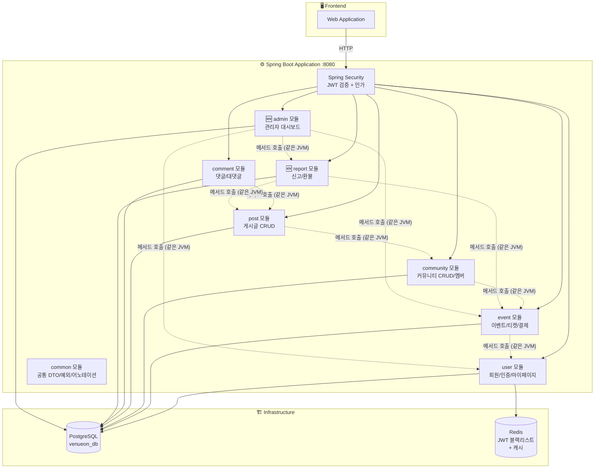
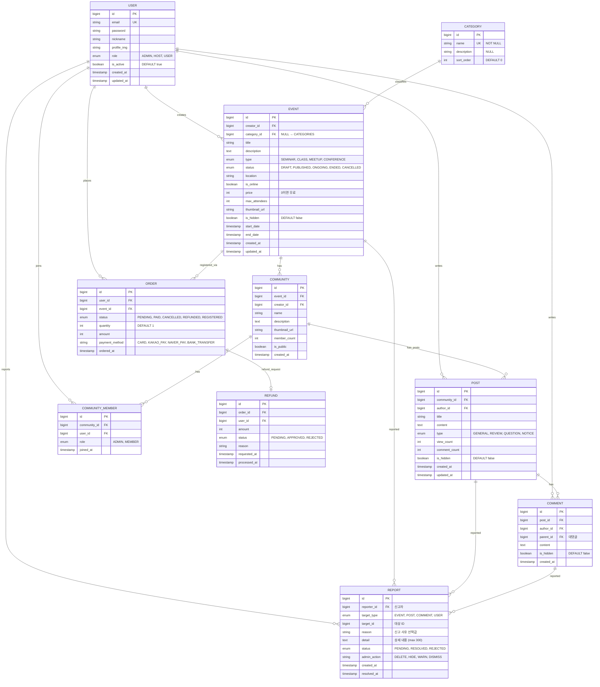
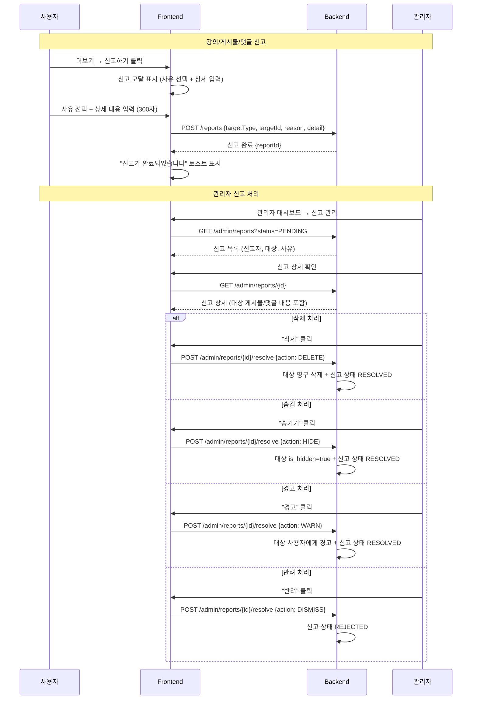
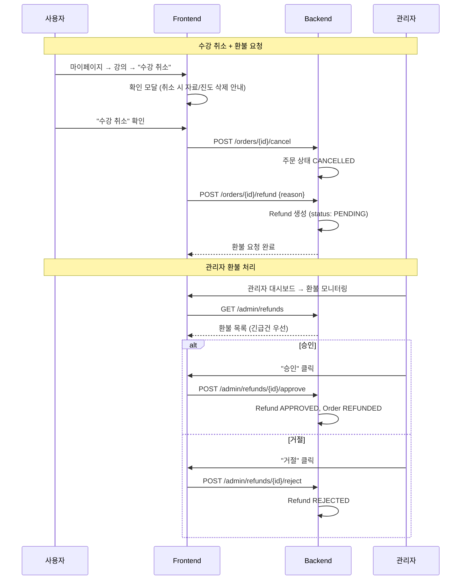
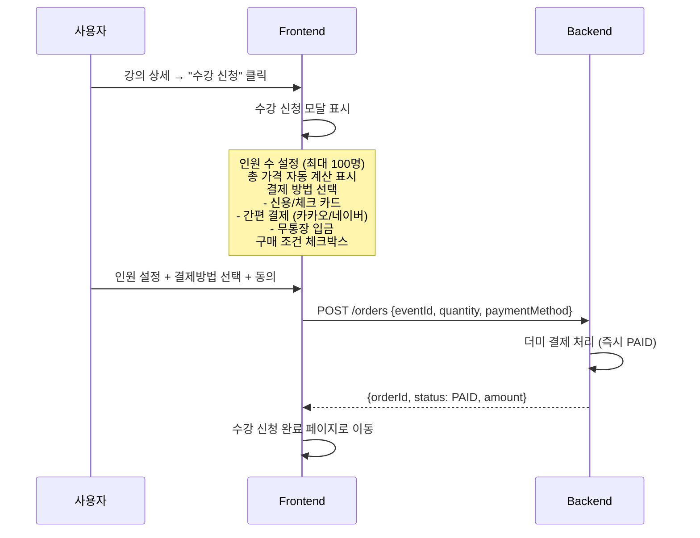

# 🏗️ VenueOn MVP 아키텍처 v4

> **작성일:** 2026-04-01  
> **기반:** Figma 화면 설계서 분석 + MVP 아키텍처 v3  
> **핵심:** 유료·무료 이벤트 중계 + 커뮤니티 연장선 + **신고·환불·관리자 기능 확장**  
> **기술 스택:** Spring Boot + Next.js + Vanilla CSS Module

---

## 📌 v3 → v4 변경 요약

> Figma 화면 설계서(`기능별 수정` 페이지 + `플로우` 페이지) 분석 결과, 아래 기능들이 **v3에 없거나 불충분**하여 추가/확장됩니다.

| 구분 | v3 상태 | v4 추가/변경 |
|------|---------|-------------|
| **신고(Report) 시스템** | ❌ 없음 | ✅ 강의·게시물·댓글·수강생 신고 CRUD (사유 선택 + 상세 입력) |
| **환불 관리** | ❌ 없음 | ✅ 환불 신청/승인/거절 + 관리자 환불 모니터링 |
| **관리자(Admin) 대시보드** | 🟡 회원 조회 1개 API | ✅ 대시보드 + 사용자 관리 + 강의 관리 + 신고 관리 + 환불 관리 + 스터디룸 관리 |
| **관리자 콘텐츠 숨김/삭제** | ❌ 없음 | ✅ 강의·게시글·댓글 숨김 처리 및 영구 삭제 |
| **호스트 센터(About Page)** | 🟡 기업 페이지만 | ✅ 호스트 전용 랜딩 (서비스 소개 + 가입 유도) |
| **수강 취소** | 🟡 주문 취소만 | ✅ 수강 취소 확인 모달 + 환불 연계 |
| **프로필 설정** | 🟡 프로필 수정만 | ✅ 프로필 사진 변경/삭제 + 비밀번호 변경 |
| **수강 신청 결제 모달** | 🟡 더미 결제 | ✅ 인원 수 설정 + 결제 방법 선택 (카드/간편결제) UI |
| **강의 상세 (관리자 뷰)** | ❌ 없음 | ✅ 관리자/호스트 전용 강의 상세보기 + 상태 변경 |
| **사용자 프로필 팝업** | ❌ 없음 | ✅ 관리자 → 사용자 프로필 조회 + 회원 삭제/경고 |
| **호스트 수강생 관리** | ❌ 없음 | ✅ 수강생 목록 + 상세 정보 모달 + 수강생 신고 |

---

## 📌 1. MVP 기능 범위 (v4 업데이트)

| # | 기능 | 설명 | v4 변경 |
|---|------|------|---------|
| 1 | **회원가입/로그인** | JWT 인증, 기업·일반 사용자 구분 가입 | 호스트 전용 로그인/회원가입 페이지 분리 |
| 2 | **이벤트 CRUD** | 에디터(폼)로 직접 등록 — 이벤트 생성·조회·수정·삭제 | 관리자 강의 관리(숨김/삭제) 추가 |
| 3 | **마이페이지** | 내 이벤트 관리, 구매내역, 참여 이력 | 프로필 사진 변경/삭제, 스터디룸 입장 버튼 |
| 4 | **이벤트 티켓팅 + 결제** | 유료·무료 티켓 구매, 결제 연동 | 인원 수 설정 + 결제 방법 선택 UI + 수강 취소/환불 |
| 5 | **이벤트 커뮤니티 CRUD** | 이벤트 기반 커뮤니티 생성·조회·수정·삭제 | 변경 없음 |
| 6 | **커뮤니티 글 CRUD** | 커뮤니티 내 게시글 작성·조회·수정·삭제, 후기 | 변경 없음 |
| 7 | **기업/기관 페이지** | 기업·공공기관 전용 프로필 페이지 | 변경 없음 |
| 8 | **🆕 신고(Report) 시스템** | 강의·게시물·댓글·수강생 신고 (사유 선택 + 상세 입력) | **신규** |
| 9 | **🆕 환불 관리** | 수강 취소 → 환불 신청 → 관리자 승인/거절 | **신규** |
| 10 | **🆕 관리자 대시보드** | 사용자·강의·신고·환불·스터디룸 통합 관리 | **대폭 확장** |
| 11 | **🆕 호스트 센터** | 호스트 전용 랜딩 페이지 (서비스 소개 + 가입 유도) | **신규** |

---

## 📌 2. 타겟 사용자 & 사용자 정책

### 타겟 사용자

| 구분 | 대상 | 역할 | 가입 방식 |
|------|------|------|----------|
| **관리자 (ADMIN)** | 서비스 운영팀 | 시스템 전체 관리, 사용자·콘텐츠 관리 | 사전 등록 (별도 관리자 로그인) |
| **기획자 (HOST)** | 기업 · 공공기관 · 사업자 | 이벤트 생성 · 관리 · 티켓 판매 | 사업자등록번호 또는 기관 인증을 통한 가입 |
| **일반 사용자 (USER)** | 개인 | 이벤트 탐색 · 티켓 구매 · 커뮤니티 참여 | 이메일 기반 일반 가입 |

### 사용자 정책

| 항목 | 설명 |
|------|------|
| **권한** | ADMIN(관리자) / HOST(기획자) / USER(일반 사용자) **3단계 권한** |
| **이벤트 생성** | **HOST만** 이벤트 생성 가능 |
| **이벤트 참여** | USER는 이벤트 탐색·티켓 구매·참여 |
| **이벤트 관리** | 본인 이벤트만 수정/삭제 + ADMIN 강제 숨김/삭제 |
| **커뮤니티 관리** | 본인 커뮤니티만 수정/삭제 |
| **게시글/댓글** | 본인 글만 수정/삭제 + ADMIN 숨김/삭제 |
| **🆕 신고** | USER/HOST → 강의·게시물·댓글·수강생 신고 가능 |
| **🆕 신고 처리** | ADMIN → 신고 목록 조회, 삭제/숨김/경고/반려 처리 |
| **🆕 환불** | USER → 수강 취소 시 환불 신청, ADMIN → 승인/거절 |
| **🆕 회원 관리** | ADMIN → 주최자/수강생 목록 조회, 프로필 열람, 회원 삭제 |

---

## 📌 3. 모듈러 모놀리스 (Modular Monolith)



### 모듈별 역할 (v4 업데이트)

| 모듈 (패키지) | 담당 | v4 변경 |
|--------------|------|---------|
| **com.venueon.user** | 회원가입, 로그인, JWT, 프로필, 마이페이지 | 프로필 사진 변경/삭제 추가 |
| **com.venueon.event** | 이벤트 CRUD, 티켓, 주문/결제, 구매내역 | 수강 취소 + 환불 신청 연계 |
| **com.venueon.community** | 커뮤니티 CRUD, 멤버 관리 | 변경 없음 |
| **com.venueon.post** | 게시글 CRUD (communityId FK로 연결) | 독립 모듈로 분리 |
| **com.venueon.comment** | 댓글/대댓글 CRUD (postId FK로 연결) | 독립 모듈로 분리 |
| **🆕 com.venueon.report** | **신고 CRUD, 환불 관리** | **신규 모듈** |
| **🆕 com.venueon.admin** | **관리자 대시보드, 사용자·강의·신고·환불 관리** | **대폭 확장** |
| **com.venueon.common** | ApiResponse, 예외 처리, @UseCase 등 공통 | 변경 없음 |

**도메인 모듈: 7개** (user, event, community, post, comment, report, admin) / **DB: 1개** (테이블로 분리)

### 모듈 간 통신

| 호출 방향 | 방식 | 목적 |
|-----------|------|------|
| event → user | 메서드 호출 (Port) | 주문 시 유저 정보 확인 |
| community → event | 메서드 호출 (Port) | 커뮤니티 생성 시 이벤트 참조 |
| post → community | 메서드 호출 (Port) | 게시글 작성 시 커뮤니티 존재 확인 |
| comment → post | 메서드 호출 (Port) | 댓글 작성 시 게시글 존재 확인 |
| **report → event** | 메서드 호출 (Port) | 강의 신고 시 이벤트 정보 참조 |
| **report → post** | 메서드 호출 (Port) | 게시물 신고 시 해당 정보 참조 |
| **report → comment** | 메서드 호출 (Port) | 댓글 신고 시 해당 정보 참조 |
| **admin → user** | 메서드 호출 (Port) | 회원 관리 (목록/삭제/경고) |
| **admin → event** | 메서드 호출 (Port) | 강의 관리 (숨김/삭제/상세) |
| **admin → report** | 메서드 호출 (Port) | 신고 처리, 환불 승인/거절 |

---

## 📌 4. ERD (12개 Entity)



**Entity 수: 10개** (v3 8개 → v4 +2: Report, Refund)

> **v4 변경사항:**
> - `REPORT` 엔티티 추가: 강의·게시물·댓글·수강생 신고 통합 관리
> - `REFUND` 엔티티 추가: 환불 요청/승인/거절 관리
> - `EVENT`: `is_hidden` 필드 추가 (관리자 숨김 처리)
> - `POST`, `COMMENT`: `is_hidden` 필드 추가 (관리자 숨김 처리)
> - `ORDER`: `quantity`, `payment_method` 필드 추가
> - `USER`: `role` 필드 명시, `is_active` 필드 추가 (관리자 회원 비활성화)

---

## 📌 5. 기술 스택

| 카테고리 | 기술 | 비고 |
|----------|------|------|
| **프론트엔드** | Next.js 14+ (App Router) | React 18, SSR/SSG |
| **스타일링** | **Vanilla CSS Module** (.module.css) | 컴포넌트별 스코프 CSS |
| **백엔드** | Spring Boot 3.x, Java 17 | 단일 앱, RESTful API |
| **아키텍처 패턴** | **Hexagonal Architecture** (Ports & Adapters) | 기능별 UseCase 독립 확장 |
| **아키텍처 구조** | **Modular Monolith** | 패키지 기반 도메인 분리, 향후 MSA 전환 용이 |
| **DB** | PostgreSQL 15 | 단일 DB (venueon_db), 테이블로 도메인 분리 |
| **캐시** | Redis 7 | JWT 블랙리스트, 세션 캐시 |
| **인증** | Spring Security + JWT | Access Token + Refresh Token |
| **결제** | **더미 결제** (MVP) | PG 없이 즉시 PAID 처리, 향후 포트원 전환 |
| **파일 저장** | 외부 볼륨 마운트 (MVP) | `dist/upload` 외부 폴더, 향후 S3/MinIO 전환 |
| **컨테이너** | Docker + Docker Compose | 로컬 개발 환경 |
| **CI/CD** | GitHub Actions | 빌드/테스트 자동화 |
| **API 문서** | Swagger (SpringDoc) | 자동 API 문서 생성 |

---

## 📌 6. 헥사고날 아키텍처 — 신규 모듈 구조

### 6-1. Report 모듈 (신고/환불)

```
backend/src/main/java/com/venueon/
└── report/                            # 🚨 Report 모듈 (헥사고날)
    ├── domain/
    │   ├── model/
    │   │   ├── Report.java            # 신고 도메인 엔티티
    │   │   ├── ReportTargetType.java  # enum: EVENT, POST, COMMENT, USER
    │   │   ├── ReportStatus.java      # enum: PENDING, RESOLVED, REJECTED
    │   │   ├── AdminAction.java       # enum: DELETE, HIDE, WARN, DISMISS
    │   │   ├── Refund.java            # 환불 도메인 엔티티
    │   │   └── RefundStatus.java      # enum: PENDING, APPROVED, REJECTED
    │   └── exception/
    │       └── ReportDomainException.java
    │
    ├── application/
    │   ├── port/
    │   │   ├── in/
    │   │   │   ├── CreateReportUseCase.java       # 신고 생성
    │   │   │   ├── GetReportUseCase.java           # 신고 조회 (관리자)
    │   │   │   ├── ResolveReportUseCase.java       # 신고 처리 (삭제/숨김/경고/반려)
    │   │   │   ├── RequestRefundUseCase.java       # 환불 요청 (사용자)
    │   │   │   ├── GetRefundUseCase.java           # 환불 조회 (관리자)
    │   │   │   └── ProcessRefundUseCase.java       # 환불 승인/거절 (관리자)
    │   │   └── out/
    │   │       ├── LoadReportPort.java
    │   │       ├── SaveReportPort.java
    │   │       ├── LoadRefundPort.java
    │   │       ├── SaveRefundPort.java
    │   │       ├── EventCommandPort.java           # 이벤트 숨김/삭제 처리
    │   │       ├── PostCommandPort.java            # 게시글 숨김/삭제 처리
    │   │       └── CommentCommandPort.java         # 댓글 숨김/삭제 처리
    │   │
    │   ├── service/
    │   │   ├── CreateReportService.java
    │   │   ├── GetReportService.java
    │   │   ├── ResolveReportService.java
    │   │   ├── RequestRefundService.java
    │   │   ├── GetRefundService.java
    │   │   └── ProcessRefundService.java
    │   │
    │   └── dto/
    │       ├── CreateReportCommand.java
    │       ├── ResolveReportCommand.java
    │       ├── ReportInfo.java
    │       ├── RefundRequestCommand.java
    │       └── RefundInfo.java
    │
    └── adapter/
        ├── in/web/
        │   ├── ReportController.java
        │   ├── RefundController.java
        │   └── dto/
        │       ├── request/
        │       │   ├── CreateReportRequest.java
        │       │   ├── ResolveReportRequest.java
        │       │   └── RefundRequest.java
        │       └── response/
        │           ├── ReportResponse.java
        │           └── RefundResponse.java
        │
        └── out/
            ├── persistence/
            │   ├── entity/
            │   │   ├── ReportJpaEntity.java
            │   │   └── RefundJpaEntity.java
            │   ├── repository/
            │   │   ├── ReportJpaRepository.java
            │   │   └── RefundJpaRepository.java
            │   ├── ReportPersistenceAdapter.java
            │   ├── RefundPersistenceAdapter.java
            │   └── mapper/
            │       ├── ReportMapper.java
            │       └── RefundMapper.java
            └── internal/
                ├── EventCommandAdapter.java       # implements EventCommandPort
                ├── PostCommandAdapter.java        # implements PostCommandPort
                └── CommentCommandAdapter.java     # implements CommentCommandPort
```

### 6-2. Admin 모듈 (관리자 대시보드 — 확장)

```
backend/src/main/java/com/venueon/
└── admin/                             # 🔧 Admin 모듈 (헥사고날)
    ├── application/
    │   ├── port/in/
    │   │   ├── GetDashboardUseCase.java           # 대시보드 요약 데이터
    │   │   ├── GetAllUsersUseCase.java            # 전체 회원 리스트 (주최자/수강생 분리)
    │   │   ├── GetUserDetailUseCase.java          # 회원 상세 프로필
    │   │   ├── DeleteUserUseCase.java             # 회원 삭제
    │   │   ├── WarnUserUseCase.java               # 회원 경고
    │   │   ├── GetAllEventsUseCase.java           # 전체 강의 리스트 (관리자)
    │   │   ├── GetEventDetailAdminUseCase.java    # 강의 상세 (관리자 뷰)
    │   │   ├── HideEventUseCase.java              # 강의 숨김 처리
    │   │   ├── DeleteEventAdminUseCase.java       # 강의 강제 삭제
    │   │   ├── HidePostUseCase.java               # 게시글 숨김
    │   │   ├── DeletePostAdminUseCase.java        # 게시글 삭제
    │   │   ├── HideCommentUseCase.java            # 댓글 숨김
    │   │   ├── DeleteCommentAdminUseCase.java     # 댓글 삭제
    │   │   └── GetStudyRoomListUseCase.java       # 스터디룸 관리
    │   ├── port/out/
    │   │   ├── UserManagePort.java
    │   │   ├── EventManagePort.java
    │   │   ├── ReportManagePort.java
    │   │   └── RefundManagePort.java
    │   ├── service/
    │   │   ├── DashboardService.java
    │   │   ├── AdminUserService.java
    │   │   ├── AdminEventService.java
    │   │   ├── AdminContentService.java
    │   │   └── AdminStudyRoomService.java
    │   └── dto/
    │       ├── DashboardSummary.java
    │       └── AdminUserInfo.java
    │
    └── adapter/
        ├── in/web/
        │   ├── AdminDashboardController.java
        │   ├── AdminUserController.java
        │   ├── AdminEventController.java
        │   ├── AdminReportController.java
        │   ├── AdminRefundController.java
        │   ├── AdminContentController.java
        │   └── dto/
        │
        └── out/
            └── internal/
                ├── UserManageAdapter.java
                ├── EventManageAdapter.java
                ├── ReportManageAdapter.java
                └── RefundManageAdapter.java
```

---

## 📌 7. API 목록 (v4 — 총 66개)

### Auth (4 APIs) — 변경 없음

| Method | Endpoint | 설명 |
|--------|----------|------|
| POST | `/auth/signup` | 회원가입 (role: ADMIN/HOST/USER) |
| POST | `/auth/login` | 로그인 → JWT 발급 |
| POST | `/auth/refresh` | Access Token 갱신 |
| POST | `/auth/logout` | 로그아웃 (토큰 블랙리스트) |

### MyPage (7 APIs) — 🆕 2개 추가

| Method | Endpoint | 설명 | v4 |
|--------|----------|------|-----|
| GET | `/mypage/profile` | 내 프로필 조회 | |
| PUT | `/mypage/profile` | 내 프로필 수정 | |
| GET | `/mypage/orders` | 내 구매/예약 내역 | |
| GET | `/mypage/communities` | 내 커뮤니티 목록 | |
| GET | `/mypage/events` | 내 참여 이벤트 목록 | |
| 🆕 PUT | `/mypage/profile/image` | 프로필 사진 변경 | **신규** |
| 🆕 DELETE | `/mypage/profile/image` | 프로필 사진 삭제 (기본으로 변경) | **신규** |

### Events — 공개 조회 (2 APIs) — 변경 없음

| Method | Endpoint | 설명 |
|--------|----------|------|
| GET | `/events` | 이벤트 목록 (검색/필터/페이징) |
| GET | `/events/{id}` | 이벤트 상세 |

### Orders — 참가 신청 (4 APIs) — 🆕 1개 추가

| Method | Endpoint | 설명 | v4 |
|--------|----------|------|-----|
| POST | `/orders` | 참가 신청 (인원 수 + 결제 방법 포함) | 필드 추가 |
| GET | `/orders/{id}` | 주문 상세 (본인만) | |
| POST | `/orders/{id}/cancel` | 참가 취소 | |
| 🆕 POST | `/orders/{id}/refund` | 환불 요청 (취소 후 환불 신청) | **신규** |

### Communities (8 APIs) — 변경 없음

| Method | Endpoint | 설명 |
|--------|----------|------|
| POST | `/communities` | 커뮤니티 생성 (이벤트 연동) |
| GET | `/communities` | 커뮤니티 목록 |
| GET | `/communities/{id}` | 커뮤니티 상세 |
| PUT | `/communities/{id}` | 커뮤니티 수정 (작성자만) |
| DELETE | `/communities/{id}` | 커뮤니티 삭제 (작성자만) |
| POST | `/communities/{id}/join` | 커뮤니티 가입 |
| DELETE | `/communities/{id}/leave` | 커뮤니티 탈퇴 |
| GET | `/communities/{id}/members` | 멤버 목록 |

### Posts (5 APIs) — 변경 없음

| Method | Endpoint | 설명 |
|--------|----------|------|
| POST | `/communities/{communityId}/posts` | 게시글 작성 |
| GET | `/communities/{communityId}/posts` | 게시글 목록 (타입별 필터) |
| GET | `/posts/{id}` | 게시글 상세 |
| PUT | `/posts/{id}` | 게시글 수정 (작성자만) |
| DELETE | `/posts/{id}` | 게시글 삭제 (작성자만) |

### Comments (3 APIs) — 변경 없음

| Method | Endpoint | 설명 |
|--------|----------|------|
| POST | `/posts/{postId}/comments` | 댓글 작성 (대댓글 지원) |
| GET | `/posts/{postId}/comments` | 댓글 목록 |
| DELETE | `/comments/{id}` | 댓글 삭제 (작성자만) |

### 🆕 Reports — 신고 시스템 (3 APIs)

| Method | Endpoint | 설명 |
|--------|----------|------|
| 🆕 POST | `/reports` | 신고 생성 (targetType: EVENT/POST/COMMENT/USER, reason, detail) |
| 🆕 GET | `/reports/mine` | 내 신고 내역 조회 |
| 🆕 GET | `/reports/{id}` | 신고 상세 조회 |

### Host — 기업 회원 전용 (9 APIs) — 🆕 1개 추가

| Method | Endpoint | 설명 | v4 |
|--------|----------|------|-----|
| GET | `/host` | Host 대시보드 (요약 정보) | |
| GET | `/host/profile` | 기업 프로필 조회 | |
| PUT | `/host/profile` | 기업 프로필 수정 | |
| GET | `/host/events` | 내가 주최한 이벤트 목록 | |
| POST | `/host/events` | 이벤트 생성 | |
| PUT | `/host/events/{id}` | 이벤트 수정 (본인만) | |
| DELETE | `/host/events/{id}` | 이벤트 삭제 (본인만) | |
| PATCH | `/host/events/{id}/status` | 상태 변경 (DRAFT→PUBLISHED) | |
| 🆕 GET | `/host/events/{id}/attendees` | 수강생 목록 조회 | **신규** |

### 🆕 Admin — 관리자 (20 APIs) — **대폭 확장**

| Method | Endpoint | 설명 |
|--------|----------|------|
| 🆕 GET | `/admin/dashboard` | 관리자 대시보드 요약 (총 회원 수, 강의 수, 신고 대기, 환불 대기) |
| 🆕 GET | `/admin/dashboard/urgent` | 긴급 처리 항목 (환불 대기 + 긴급 신고) |
| GET | `/admin/users` | 전체 회원 리스트 조회 |
| 🆕 GET | `/admin/users/hosts` | 주최자(HOST) 목록 조회 |
| 🆕 GET | `/admin/users/students` | 수강생(USER) 목록 조회 |
| 🆕 GET | `/admin/users/{id}` | 회원 상세 프로필 조회 |
| 🆕 DELETE | `/admin/users/{id}` | 회원 삭제 |
| 🆕 POST | `/admin/users/{id}/warn` | 회원 경고 |
| 🆕 GET | `/admin/events` | 전체 강의 리스트 조회 (관리자) |
| 🆕 GET | `/admin/events/{id}` | 강의 상세 (관리자 뷰 — 주최자 정보 포함) |
| 🆕 PATCH | `/admin/events/{id}/hide` | 강의 숨김/공개 토글 |
| 🆕 DELETE | `/admin/events/{id}` | 강의 강제 삭제 |
| 🆕 GET | `/admin/reports` | 신고 목록 (필터: targetType, status) |
| 🆕 GET | `/admin/reports/{id}` | 신고 상세 (신고자·대상 정보 포함) |
| 🆕 POST | `/admin/reports/{id}/resolve` | 신고 처리 (action: DELETE/HIDE/WARN/DISMISS) |
| 🆕 GET | `/admin/refunds` | 환불 목록 (긴급건 우선 정렬) |
| 🆕 POST | `/admin/refunds/{id}/approve` | 환불 승인 |
| 🆕 POST | `/admin/refunds/{id}/reject` | 환불 거절 |
| 🆕 PATCH | `/admin/posts/{id}/hide` | 게시글 숨김/공개 토글 |
| 🆕 PATCH | `/admin/comments/{id}/hide` | 댓글 숨김/공개 토글 |

### Upload — 이미지 업로드 (1 API) — 변경 없음

| Method | Endpoint | 설명 |
|--------|----------|------|
| POST | `/upload/image` | 이미지 업로드 (외부 볼륨 `dist/upload` 저장) |

**총 API: 66개** (v3 40개 → v4 +26개)

---

## 📌 8. 페이지 구성 (v4 — 15개)

| # | 페이지 | 경로 | 핵심 기능 | v4 |
|---|--------|------|----------|-----|
| 1 | 🏠 메인 홈 | `/` | 이벤트 목록/검색/필터, 인기 이벤트 | |
| 2 | 🔐 수강생 로그인 | `/auth/login` | 로그인 | |
| 3 | 🔐 수강생 회원가입 | `/auth/signup` | 회원가입 (다단계 폼) | |
| 4 | 📄 강의 상세 | `/events/[id]` | 이벤트 정보, 수강 신청 모달, 신고 기능 | 🆕 신고 |
| 5 | 📋 강의 리스트 | `/events` | 카테고리 필터, 검색, 페이징 | |
| 6 | ✏️ 이벤트 생성/수정 | `/events/new`, `/events/[id]/edit` | Step-by-Step 이벤트 등록/수정 | |
| 7 | 👥 스터디룸 | `/community/[id]` | 게시글 목록, 글 작성, 댓글, 신고 기능 | 🆕 신고 |
| 8 | 👤 마이페이지 | `/mypage/*` | 내 강의 관리, 구매내역, 스터디룸 입장 | 🆕 프로필 사진 |
| 9 | 🆕 프로필 설정 | `/mypage/profile` | 프로필 사진 변경/삭제, 정보 수정 | **신규** |
| 10 | 📝 수강 신청 완료 | `/orders/[id]/complete` | 신청 완료 안내, 커뮤니티 바로가기 | |
| 11 | 🏢 호스트 센터 | `/host` | 서비스 소개, 호스트 가입/로그인 유도 | 🆕 확장 |
| 12 | 🏢 호스트 대시보드 | `/host/dashboard` | 이벤트 관리, 수강생 관리 | 🆕 수강생 관리 |
| 13 | 🆕 관리자 로그인 | `/admin/login` | 관리자 전용 로그인 | **신규** |
| 14 | 🆕 관리자 대시보드 | `/admin/*` | 대시보드, 사용자·강의·신고·환불 관리 | **대폭 확장** |
| 15 | 🏢 주최사 프로필 설정 | `/host/profile` | 기업 프로필 편집 | |

### 관리자 대시보드 서브 페이지

| 서브 경로 | 기능 | Figma 매핑 |
|----------|------|-----------|
| `/admin` | 대시보드 요약 (환불 대기 + 긴급 신고) | 관리자 대시보드 × 3 프레임 |
| `/admin/users/hosts` | 주최자 관리 | 주최자 관리 프레임 |
| `/admin/users/students` | 수강생 관리 | 수강생 관리 프레임 |
| `/admin/events` | 강의 관리 (목록 + 상세/숨김/삭제) | 강의 관리, 강의 상세보기 × 2 |
| `/admin/reports` | 신고 관리 (목록 + 상세/처리) | 신고 관리 × 5 프레임 |
| `/admin/refunds` | 환불 모니터링 | 환불 관리 프레임 |
| `/admin/studyrooms` | 스터디룸 관리 | 스터디룸 프레임 |

---

## 📌 9. 신고 처리 흐름도 (🆕)



---

## 📌 10. 환불 관리 흐름도 (🆕)



---

## 📌 11. 수강 신청 + 결제 모달 흐름 (v4 업데이트)



---

## 📌 12. Figma → 코드 매핑 (주요 모달/컴포넌트)

| Figma 컴포넌트 | 프론트엔드 매핑 | 용도 |
|---------------|---------------|------|
| `Modal` | `components/Modal.tsx` | 확인/취소 공통 모달 |
| `ModalInput` | `components/ModalInput.tsx` | 입력 필드 포함 모달 (신고 사유 입력) |
| `ModalEnrollment` | `events/components/EnrollmentModal.tsx` | 수강 신청 + 결제 모달 |
| `ModalUser` | `admin/components/UserDetailModal.tsx` | 사용자 프로필 상세 모달 (관리자) |
| `Toast` | `components/Toast.tsx` | 성공/에러 토스트 메시지 |
| `Profile` | `admin/components/UserProfile.tsx` | 사용자 프로필 카드 (관리자) |
| `tableRow` | `admin/components/TableRow.tsx` | 관리자 테이블 행 컴포넌트 |
| `dropdownList` | `components/DropdownList.tsx` | 더보기 드롭다운 (신고/숨김/삭제) |
| `Header` (variant) | `components/Header.tsx` | Role별 헤더 (public/user/host/admin) |
| `seminarDetail` | `events/components/EventDetail.tsx` | 강의 상세 정보 카드 |

---

## 📌 13. 프론트엔드 추가 구조 (v4)

```
frontend/src/app/
├── (auth)/
│   ├── login/page.tsx              # 수강생 로그인
│   ├── signup/page.tsx             # 수강생 회원가입 (다단계)
│   └── components/
├── events/
│   ├── [id]/page.tsx               # 강의 상세 + 🆕 신고모달 + 수강신청모달
│   └── components/
│       ├── EnrollmentModal.tsx      # 🆕 수강 신청 결제 모달
│       └── ReportModal.tsx          # 🆕 강의 신고 모달
├── community/
│   └── [id]/
│       └── components/
│           ├── ReportPostModal.tsx   # 🆕 게시물 신고 모달
│           └── ReportCommentModal.tsx# 🆕 댓글 신고 모달
├── mypage/
│   ├── profile/page.tsx            # 🆕 프로필 설정 (사진 변경/삭제)
│   └── components/
│       └── ProfileImageEditor.tsx   # 🆕 프로필 사진 편집
├── host/
│   ├── page.tsx                    # 호스트 센터 (서비스 소개 + 가입 유도)
│   ├── login/page.tsx              # 호스트 로그인
│   ├── signup/page.tsx             # 호스트 회원가입
│   ├── dashboard/page.tsx          # 호스트 대시보드
│   ├── events/[id]/attendees/page.tsx # 🆕 수강생 관리
│   ├── profile/page.tsx            # 주최사 프로필 설정
│   └── components/
│       ├── AttendeeList.tsx         # 🆕 수강생 목록
│       └── AttendeeDetailModal.tsx  # 🆕 수강생 상세 모달
└── 🆕 admin/
    ├── login/page.tsx               # 관리자 로그인
    ├── page.tsx                     # 관리자 대시보드
    ├── users/
    │   ├── hosts/page.tsx           # 주최자 관리
    │   └── students/page.tsx        # 수강생 관리
    ├── events/
    │   ├── page.tsx                 # 강의 관리
    │   └── [id]/page.tsx            # 강의 상세 (관리자 뷰)
    ├── reports/
    │   ├── page.tsx                 # 신고 관리
    │   └── [id]/page.tsx            # 신고 상세
    ├── refunds/page.tsx             # 환불 모니터링
    ├── studyrooms/page.tsx          # 스터디룸 관리
    └── components/
        ├── AdminSidebar.tsx         # 관리자 사이드바 네비게이션
        ├── DashboardSummary.tsx     # 대시보드 요약 카드
        ├── UserTable.tsx            # 사용자 테이블
        ├── EventTable.tsx           # 강의 테이블
        ├── ReportTable.tsx          # 신고 테이블
        ├── RefundTable.tsx          # 환불 테이블
        ├── UserProfileModal.tsx     # 사용자 프로필 모달
        ├── ResolveReportModal.tsx   # 신고 처리 모달
        └── ConfirmModal.tsx         # 삭제/경고 확인 모달
```

---

## 📌 14. Docker Compose — 변경 없음

```yaml
version: '3.8'

services:
  postgres:
    image: postgres:15
    environment:
      POSTGRES_DB: venueon_db
      POSTGRES_USER: ${DB_USER}
      POSTGRES_PASSWORD: ${DB_PASSWORD}
    ports:
      - "5432:5432"
    volumes:
      - pg-data:/var/lib/postgresql/data

  redis:
    image: redis:7-alpine
    ports:
      - "6379:6379"

  backend:
    build: ../backend
    ports:
      - "8080:8080"
    depends_on:
      - postgres
      - redis
    environment:
      SPRING_DATASOURCE_URL: jdbc:postgresql://postgres:5432/venueon_db
      SPRING_DATASOURCE_USERNAME: ${DB_USER}
      SPRING_DATASOURCE_PASSWORD: ${DB_PASSWORD}
      SPRING_REDIS_HOST: redis
      JWT_SECRET: ${JWT_SECRET}
      UPLOAD_PATH: /app/upload
    volumes:
      - upload-data:/app/upload

volumes:
  pg-data:
  upload-data:
```

---

## 📌 15. 요약 (v4 vs v3)

```
┌───────────────────────────────────────────────────────────┐
│              VenueOn MVP v4 (Modular Monolith)            │
│                                                           │
│  ┌─ src/main/java/com/venueon/ ────────────────────────┐  │
│  │                                                     │  │
│  │  user/           event/           community/        │  │
│  │  회원/인증       이벤트 CRUD       커뮤니티 CRUD      │  │
│  │  마이페이지      세션 관리          게시글 CRUD        │  │
│  │  JWT/Redis      티켓/결제          댓글/후기          │  │
│  │  🆕 프로필사진   🆕 수강 취소/환불                    │  │
│  │                                                     │  │
│  │  🆕 report/      🆕 admin/         common/          │  │
│  │  신고 시스템      관리자 대시보드    공통 DTO          │  │
│  │  환불 관리        사용자 관리        예외 처리          │  │
│  │                   강의/신고 관리     Security 설정     │  │
│  │                   환불 모니터링                       │  │
│  └─────────────────────────────────────────────────────┘  │
│                                                           │
│  Frontend: Next.js 14 + Vanilla CSS Module                │
│  Infra: Docker Compose + PostgreSQL×1 + Redis             │
│  통신: 모듈 간 Port 인터페이스 (같은 JVM 메서드 호출)       │
│                                                           │
│  📊 v3 → v4 변경 요약:                                    │
│  ├── 모듈: 3개 → 5개 (+report, admin 확장)                │
│  ├── 엔티티: 8개 → 10개 (+Report, Refund)                 │
│  ├── API: 40개 → 66개 (+26개)                             │
│  ├── 페이지: 8개 → 15개 (+7개)                            │
│  └── 역할: 2단계 → 3단계 (ADMIN 추가)                     │
└───────────────────────────────────────────────────────────┘
```

---

> 📌 **Figma 원본**: [VenueOn 기능별 수정](https://www.figma.com/design/OK0hiqZrWNSpOQn8XpdyAp/VenueOn?node-id=97-18)  
> 📌 **이전 버전**: [MVP_아키텍처_v3.md](./MVP_아키텍처_v3.md)  
> 📌 **작성일**: 2026-04-01
