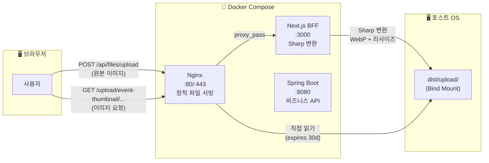
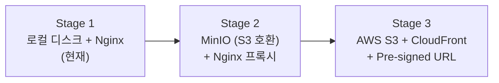

# 🖼️ VenueOn 이미지 업로드 관리 전략

> **작성일:** 2026-04-06  
> **목적:** 파일 업로드의 변환 · 저장 · 서빙 · 캐싱 전략을 정의한다  
> **핵심 스택:** Sharp (Node.js) + Docker Volume + Nginx

---

## 📌 1. 아키텍처 개요



### 흐름 요약

| 단계 | 담당 | 처리 내용 |
|------|------|----------|
| **업로드** | Next.js BFF | 원본 수신 → Sharp로 WebP 변환 + 리사이즈 → Volume에 저장 |
| **저장** | Docker Volume | 호스트 OS `dist/upload/`에 바인드 마운트, 컨테이너 재배포 시에도 보존 |
| **서빙** | Nginx | `/upload/**` 경로를 Volume에서 직접 읽어 정적 서빙 (Spring 거치지 않음) |
| **캐싱** | Nginx | `Cache-Control: public, immutable, max-age=2592000` (30일) |

---

## 📌 2. 폴더 구조

카테고리 1차 분류 + 연/월 2차 분류 + UUID 파일명으로 관리한다.

```
dist/upload/
├── event-thumbnail/            # 이벤트 대표 이미지
│   └── 2026/04/
│       ├── a1b2c3d4.webp
│       └── e5f6g7h8.webp
├── event-content/              # 이벤트 본문 에디터 이미지
│   └── 2026/04/
│       └── ...
├── profile/                    # 사용자 프로필 이미지
│   └── 2026/04/
│       └── {userId}_{uuid}.webp
├── community/                  # 커뮤니티 게시글 첨부 이미지
│   └── 2026/04/
│       └── ...
├── badge/                      # 뱃지 이미지
│   └── ...
└── temp/                       # 임시 업로드 (미사용 파일 24시간 후 정리)
    └── ...
```

### 네이밍 규칙

| 항목 | 규칙 | 예시 |
|------|------|------|
| **카테고리** | 케밥케이스, 용도 명시 | `event-thumbnail`, `event-content`, `profile` |
| **날짜 폴더** | `yyyy/MM` | `2026/04` |
| **파일명** | UUID v4 (원본명 사용 금지) | `a1b2c3d4-e5f6-7890-abcd-ef1234567890.webp` |
| **확장자** | 항상 `.webp` (원본 포맷 무관) | `.webp` |
| **프로필** | `{userId}_{uuid}.webp` | `42_a1b2c3d4.webp` |

### 왜 이 구조인가?

- **카테고리 분리:** 용도별 정리, 보존 정책 다르게 적용 가능 (temp는 자동 삭제)
- **연/월 분류:** 한 디렉토리에 만 개 이상 파일이 쌓이는 것을 방지 (파일시스템 성능)
- **UUID 파일명:** 충돌 불가, 캐시 무효화 불필요 (내용 변경 = 새 UUID 발급)
- **원본명 미사용:** 한글 파일명, 공백, 특수문자로 인한 URL 인코딩 이슈 원천 방지

---

## 📌 3. 변환 전략 — Sharp (Node.js)

### 선택 이유

| 대안 | 불채택 사유 |
|------|-----------|
| 브라우저 Canvas API | 품질 불일치 (브라우저마다 다름), EXIF 회전 미처리 |
| Java ImageIO | WebP 미지원, 별도 라이브러리 필요, 속도 느림 |
| cwebp CLI | 서버 바이너리 설치 필요, 프로세스 포크 오버헤드 |
| **Sharp (libvips)** ✅ | **10배 빠름, 품질 최상, EXIF 자동 처리, npm 한 줄 설치** |

### 변환 사양

| 항목 | 설정 값 | 이유 |
|------|---------|------|
| **출력 포맷** | WebP | 원본 대비 50% 용량 절감, 브라우저 지원 97%+ |
| **품질** | 85 | 육안 구분 불가 수준에서 최적 용량 |
| **최대 너비** | 1200px | 데스크탑 표시 크기 충분, 모바일에선 과잉 |
| **확대 방지** | `withoutEnlargement: true` | 작은 원본을 강제 확대하지 않음 |
| **EXIF** | 자동 회전 후 메타데이터 제거 | 개인정보(GPS 좌표 등) 삭제 |

### 구현 코드

```typescript
// frontend/src/app/api/files/upload/route.ts
import sharp from 'sharp';
import { writeFile, mkdir } from 'fs/promises';
import path from 'path';
import { v4 as uuid } from 'uuid';
import { NextRequest, NextResponse } from 'next/server';

const UPLOAD_DIR = process.env.UPLOAD_DIR || './upload';

export async function POST(request: NextRequest) {
  try {
    const formData = await request.formData();
    const file = formData.get('file') as File;
    const category = (formData.get('category') as string) || 'event-thumbnail';

    // ── 검증 ──
    if (!file || !file.type.startsWith('image/')) {
      return NextResponse.json(
        { success: false, message: '이미지 파일만 업로드 가능합니다.' },
        { status: 400 }
      );
    }
    if (file.size > 5 * 1024 * 1024) {
      return NextResponse.json(
        { success: false, message: '파일 크기는 5MB 이하여야 합니다.' },
        { status: 400 }
      );
    }

    // ── 경로 생성 ──
    const now = new Date();
    const yearMonth = `${now.getFullYear()}/${String(now.getMonth() + 1).padStart(2, '0')}`;
    const dir = path.join(UPLOAD_DIR, category, yearMonth);
    await mkdir(dir, { recursive: true });

    // ── Sharp 변환 ──
    const buffer = Buffer.from(await file.arrayBuffer());
    const id = uuid();
    const fileName = `${id}.webp`;

    const webpBuffer = await sharp(buffer)
      .rotate()                                        // EXIF 기반 자동 회전
      .resize(1200, null, { withoutEnlargement: true }) // 최대 1200px
      .webp({ quality: 85 })                           // WebP 85%
      .toBuffer();

    await writeFile(path.join(dir, fileName), webpBuffer);

    // ── 응답 ──
    const filePath = `${category}/${yearMonth}/${fileName}`;
    return NextResponse.json({
      success: true,
      data: {
        filePath,
        originalName: file.name,
      },
    });
  } catch (error) {
    console.error('파일 업로드 실패:', error);
    return NextResponse.json(
      { success: false, message: '파일 업로드에 실패했습니다.' },
      { status: 500 }
    );
  }
}
```

---

## 📌 4. 저장 전략 — Docker Volume Bind Mount

### 환경별 저장 경로

| 환경 | 경로 | 설정 방식 |
|------|------|----------|
| **로컬 개발** | `./upload` (프로젝트 루트) | `UPLOAD_DIR=./upload` |
| **배포 서버** | `/home/venueon/dist/upload` | Docker Volume Bind Mount |

### Docker Compose 설정

```yaml
# docker-compose.yml
services:
  nginx:
    image: nginx:alpine
    ports:
      - "80:80"
    volumes:
      - ./nginx.conf:/etc/nginx/conf.d/default.conf:ro
      - upload-data:/data/upload:ro         # 읽기 전용 마운트
    depends_on:
      - frontend
      - backend

  frontend:
    build: ./frontend
    volumes:
      - upload-data:/app/upload             # 쓰기 가능 마운트
    environment:
      - UPLOAD_DIR=/app/upload

  backend:
    build: ./backend
    # 파일 서빙 책임 없음 — Nginx가 처리

volumes:
  upload-data:
    driver: local
    driver_opts:
      type: none
      o: bind
      device: ${UPLOAD_HOST_PATH:-/home/venueon/dist/upload}
```

### Git 관리 정책

> `upload/` 폴더는 `.gitignore`에 추가하지 않는다.  
> 로컬 개발 시 업로드한 이미지를 팀원 간 확인할 수 있도록 Git 추적 대상에 포함한다.  
> 배포 서버에서는 Docker Volume이 별도로 관리하므로 Git 추적 여부와 무관하다.

---

## 📌 5. 서빙 전략 — Nginx 정적 파일 서빙

### 왜 Nginx인가? (Spring 서빙과 비교)

| 항목 | Spring ResourceHandler | Nginx |
|------|----------------------|-------|
| 동시 연결 처리 | ~200 (Tomcat 스레드풀) | **10,000+** (비동기 이벤트) |
| 이미지 1개 응답 속도 | ~5ms | **~0.5ms** |
| 메모리 사용 | JVM 힙 사용 | 커널 sendfile() — 메모리 복사 없음 |
| 앱 영향 | 스레드 점유 → API 응답 지연 가능 | **앱과 완전 분리** |

### Nginx 설정

```nginx
# nginx.conf
server {
    listen 80;
    server_name _;

    # ── 이미지 정적 서빙 (Nginx 직접 처리) ──
    location /upload/ {
        alias /data/upload/;

        # 캐싱: 30일 + 변경 불가(immutable)
        expires 30d;
        add_header Cache-Control "public, immutable";

        # 로그 끄기 (이미지 요청은 로그 불필요)
        access_log off;

        # 없는 파일 요청 시 404
        try_files $uri =404;
    }

    # ── Next.js BFF (API + 페이지) ──
    location / {
        proxy_pass http://frontend:3000;
        proxy_set_header Host $host;
        proxy_set_header X-Real-IP $remote_addr;
        proxy_set_header X-Forwarded-For $proxy_add_x_forwarded_for;
        proxy_set_header X-Forwarded-Proto $scheme;
    }

    # ── Spring Boot API (직접 호출이 필요한 경우) ──
    location /host/ {
        proxy_pass http://backend:8080;
    }
    location /events {
        proxy_pass http://backend:8080;
    }
}
```

---

## 📌 6. 프론트엔드 이미지 URL 규칙

### URL 패턴

```
/upload/{category}/{yyyy}/{MM}/{uuid}.webp
```

### 예시

| 용도 | URL |
|------|-----|
| 이벤트 썸네일 | `/upload/event-thumbnail/2026/04/a1b2c3d4.webp` |
| 프로필 이미지 | `/upload/profile/2026/04/42_e5f6g7h8.webp` |
| 커뮤니티 첨부 | `/upload/community/2026/04/i9j0k1l2.webp` |

### 프론트엔드 사용

```tsx
// 이벤트 카드


// 향후 Next.js Image 컴포넌트 전환 시
<Image src={`/upload/${event.thumbnailUrl}`} alt={event.title} width={400} height={300} />
```

> `loading="lazy"`를 추가하면 뷰포트 밖의 이미지는 스크롤 시점에 로드됩니다.

---

## 📌 7. 보안 및 제한

| 항목 | 정책 |
|------|------|
| **허용 포맷** | `image/jpeg`, `image/png`, `image/gif`, `image/webp` |
| **최대 용량** | 5MB (프론트 + BFF 양쪽에서 검증) |
| **파일명 위조** | UUID 강제 부여, 원본 파일명은 DB에만 기록 |
| **디렉토리 순회** | `category` 파라미터에 `..` 포함 시 거부 |
| **실행 파일 차단** | Sharp를 거치므로 이미지가 아닌 파일은 자동 거부 (파싱 실패) |

---

## 📌 8. 향후 확장 경로



| 단계 | 변경 사항 | 코드 변경 범위 |
|------|----------|--------------|
| **Stage 1 (현재)** | 로컬 Volume + Nginx | 없음 |
| **Stage 2** | MinIO Docker 추가, Sharp 저장 대상을 S3 SDK로 교체 | BFF 업로드 코드만 |
| **Stage 3** | AWS S3 + CloudFront, 클라이언트 직접 업로드 | BFF + 프론트 |

> 폴더 구조(`category/yyyy/MM/uuid.webp`)는 모든 Stage에서 동일하게 유지된다.

---

## 📌 9. 체크리스트

- [ ] Sharp 설치 (`npm install sharp uuid`)
- [ ] BFF 업로드 API 리팩토링 (Spring 프록시 → Sharp 직접 처리)
- [ ] `nginx.conf`에 `/upload/` location 블록 추가
- [ ] `docker-compose.yml`에 upload-data 볼륨 정의
- [ ] Spring `WebMvcConfig`의 `/upload/**` 리소스 핸들러 제거
- [ ] Spring `FileUploadController` 제거 (BFF가 대체)
- [ ] 프론트엔드 이미지 경로를 `/upload/...` 패턴으로 통일
