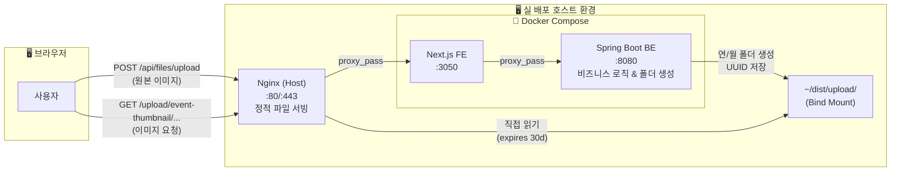

# 🖼️ VenueOn 이미지 업로드 관리 전략

> **최종 수정일:** 2026-04-09
> **목적:** 파일 업로드의 수신 · 저장 · 서빙 · 구조화 전략을 정의한다.
> **핵심 스택:** Spring Boot + Docker Volume + Host Nginx

---

## 📌 1. 아키텍처 개요



### 흐름 요약

| 단계 | 담당 | 처리 내용 |
|------|------|----------|
| **업로드** | Spring Boot | 파일 수신 → 디렉토리 순회 차단 검증 → 연/월 분류 폴더 동적 생성 → Volume에 저장 |
| **저장** | Docker Volume | 컨테이너 내부 `/home/upload`를 호스트 OS `~/dist/upload/`에 바인드 마운트 |
| **서빙(로컬)** | Spring Boot | 개발 편의를 위해 `WebMvcConfig`를 통해 정적 파일 서빙 지원 (프론트 `next.config.ts` rewrite 연동) |
| **서빙(운영)** | Host Nginx | `/upload/**` 경로를 호스트 Volume에서 직접 읽어 서빙 (Backend 스레드 점유 방지 및 고속 응답 `0.5ms`) |

---

## 📌 2. 폴더 관리 구조 (스케일 업 대응)

카테고리 1차 분류 + 연/월 2차 분류 + UUID 파일명으로 관리하여 파일 시스템 부하를 방지한다.

```
upload/
├── event-thumbnail/            # 이벤트 대표 이미지
│   └── 2026/04/
│       ├── a1b2c3d4.webp
│       └── e5f6g7h8.jpg
├── event-content/              # 이벤트 본문 에디터 이미지
│   └── 2026/04/
│       └── ...
├── profile/                    # 사용자(호스트) 프로필 이미지
│   └── 2026/04/
│       └── ...
└── temp/                       # 임시 업로드
    └── ...
```

### 네이밍 규칙 및 이점

- **카테고리 분리:** 용도별 명시, 보존 정책 다르게 적용 가능
- **날짜 폴더 (`yyyy/MM` 또는 `yyyy/MM/dd`):** 단일 디렉토리에 수만 개의 파일이 쌓여 파일 시스템 성능이 저하되는 것을 방지.
- **파일명 (UUID v4):** 한글/특수문자 파일명 깨짐 방지 및 캐시 제어 용이 (파일 변경 = UUID 변경).

---

## 📌 3. 업로드 처리 로직 (Spring Boot)

기존 설계(Next.js BFF + Sharp)와 달리 현재는 **Spring Boot 중심의 처리(안정성 및 로컬 편의성 우선)**를 채택한다.

### 구현 코드 요약 (`FileUploadController.java`)

```java
@PostMapping("/upload")
public CommonResponse<?> uploadFile(
        @RequestParam("file") MultipartFile file,
        @RequestParam(value = "category", defaultValue = "event-thumbnail") String category) {
    
    // 1. 디렉토리 순회(Directory Traversal) 보안 검증
    if (category.contains("..") || category.contains("/") || category.contains("\\")) {
        throw new IllegalArgumentException("Invalid category name");
    }

    // 2. 연/월 폴더 동적 생성
    LocalDateTime now = LocalDateTime.now();
    String yearMonth = now.getYear() + "/" + String.format("%02d", now.getMonthValue());
    String extension = getExtension(file.getOriginalFilename());
    String savedFileName = UUID.randomUUID() + extension;

    // 3. 파일 저장 (호스트 볼륨 마운트 경로)
    String relativePath = category + "/" + yearMonth + "/";
    Path dirPath = Paths.get(uploadDir, relativePath);
    Files.createDirectories(dirPath);
    file.transferTo(new File(dirPath.toFile(), savedFileName));

    // 4. 프론트엔드 반환 URL (상대경로)
    return CommonResponse.success(Map.of("filePath", relativePath + savedFileName));
}
```

---

## 📌 4. 서빙 전략 — Nginx 정적 파일 서빙

배포 환경에서는 Spring Boot의 자원 낭비를 막고 고속 서빙을 달성하기 위해 **호스트 Nginx 설정( `/etc/nginx/sites-available/...` )**을 이용한다.

```nginx
# docs/nginx-venueon.conf 참조
server {
    listen 80;
    server_name venueon.newlecture.com;

    # ── 이미지 정적 서빙 (Spring 스레드를 거치지 않음) ──
    location /upload/ {
        alias /home/venueon/dist/upload/;
        expires 30d;
        add_header Cache-Control "public, immutable";
        access_log off;
        try_files $uri =404;
    }

    # ── Next.js Frontend 컨테이너 ──
    location / {
        proxy_pass http://127.0.0.1:3050;
        ...
    }
}
```

---

## 📌 5. 프론트엔드 이미지 URL 규칙

모든 이미지 소스는 `/upload/...` 상대 경로로 호출하여 **환경(로컬/배포) 독립성**을 보장한다.

### 프론트엔드 사용
```tsx
// ❌ 기존 잘못된 방식 (이전):


// ✅ 올바른 방식 (현재):

```

### 각 환경별 라우팅 결과
- **로컬 개발 시:** `/upload/...` → `next.config.ts (rewrites)`가 `localhost:8080` (Spring BE)로 프록시
- **배포 운영 시:** `/upload/...` → **Host Nginx**가 잡아 채어 `~/dist/upload/`에서 직접 반환

---

## 📌 6. 향후 확장 경로 로드맵

현재 MVP는 안정성과 구현 속도를 위해 Spring + 원본 저장을 채택했다. 기능 개발 완료 후 최적화 단계에서 다음 Stage를 도입할 수 있다.

| 단계 | 변경 사항 | 이점 |
|------|----------|-----|
| **Stage 1 (현재)** | Spring Boot 기반 구조화 저장 + Nginx 직접 서빙 | 빠른 구현, 높은 개발 안정성, DB 오류 롤백 용이 |
| **Stage 2** | Next.js BFF에 `Sharp` 도입 및 압축 | 이미지 용량 80% 절감 (WebP 변환/리사이징)을 통합 구현 |
| **Stage 3** | AWS S3 + CloudFront로 인프라 분리 | 서버 용량 완전 독립 및 글로벌 캐싱 확보 |

---

## 📌 7. 작업 체크리스트 현황

### ✅ 완료 (진행한 내용)
- [x] **[Spring]** `FileUploadController` 카테고리/연/월 폴더 계층 자동 생성 로직 구현
- [x] **[Spring]** 디렉토리 순회(`../`) 공격 방지 검증 로직 적용
- [x] **[Spring]** `DataInitializer` 시드 데이터 썸네일 경로를 새 계층 구조에 맞게 마이그레이션 적용
- [x] **[Nginx]** 배포 서버 호스트 Nginx용 정적 서빙 설정 파일 가이드 작성 (`docs/nginx-venueon.conf`)
- [x] **[Next.js]** 프론트엔드의 환경변수(`BACKEND_URL`) 종속성 제거 및 모든 이미지 상대경로(`/upload/`) 통일
- [x] **[Next.js]** 로컬 개발 환경용 `next.config.ts` rewrite(`/upload` → `localhost:8080`) 적용
- [x] **[CI/CD]** `deploy.yml` 에서 서버 볼륨 마운팅 전 `~/dist/upload/` 폴더 보장 로직 추가

### 🏁 보류/추후 과제 (진행하지 않은 내용)
- [ ] **Sharp (BFF) 압축 도입:** 기획에 있었으나 단기간 내 복잡도 상승 방지 및 백엔드 개발 편의를 위해(Stage 2로) 보류
- [ ] **Spring 정적 서빙 제거:** 로컬 개발(`/upload` 우회) 편의성을 위해 Spring `WebMvcConfig` 자원 핸들러 기능 유지
- [ ] AWS S3 이관 (인프라 고도화 시 필요)
