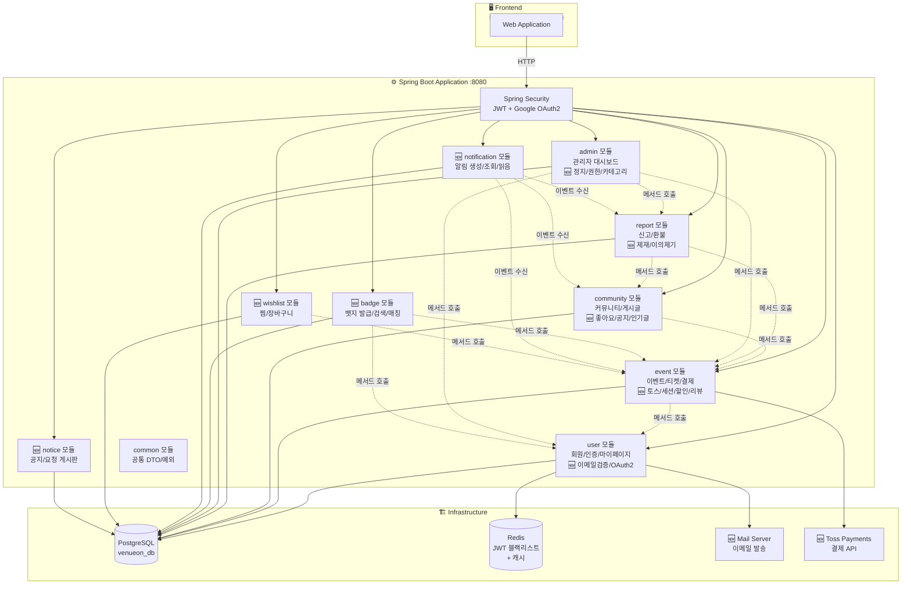

# 🏗️ VenueOn 목표 아키텍처 v5

> **작성일:** 2026-04-02  
> **기반:** MVP 아키텍처 v4 + 최종 기능·페이지 정의서 v2  
> **핵심:** 유료·무료 이벤트 중계 + 뱃지 기반 커뮤니티 매칭 + 토스 결제 + 관리 체계 고도화  
> **기술 스택:** Spring Boot + Next.js + Vanilla CSS Module  
> **범례:**  
> - ✅ `MVP 구현 완료` — v4에서 이미 구현/정의된 항목  
> - 🆕 `신규 추가` — v5에서 새로 추가되는 항목

---

## 📌 v4 → v5 변경 요약

| 구분 | v4 상태 | v5 추가/변경 |
|------|---------|-------------|
| **인증 체계** | JWT 기본 인증 | 🆕 이메일 검증 + 임시 비밀번호 + Google OAuth2 |
| **결제 시스템** | 더미 결제 (즉시 PAID) | 🆕 토스 페이먼츠 테스트 모드 연동 |
| **이벤트 필터** | 카테고리/타입 기본 필터 | 🆕 지역별 + 캘린더 날짜별 + 페이지네이션 |
| **이벤트 생성** | 기본 폼 등록 | 🆕 Step 1~4 플로우 + Rich Editor + 세션 구성 + 패키지 등록 |
| **리뷰 시스템** | ❌ 없음 | 🆕 수강 후 리뷰 CRUD + 별점 + 어드민 리뷰 관리 |
| **찜/장바구니** | ❌ 없음 | 🆕 찜 목록 + 수강 바구니 + 일괄 결제 |
| **커뮤니티 고도화** | 기본 CRUD | 🆕 좋아요 + 대댓글 + 공지 고정 + 인기글 + 게시물 북마크 + 권한 체계 |
| **마이페이지** | 기본 프로필 + 목록 | 🆕 탭 기반 통합 (강의/커뮤니티) + 알림 센터 + 관심 카테고리 |
| **호스트 고도화** | 이벤트 관리 기본 | 🆕 결제 내역 관리 + 직접 환불 + 요청 게시판 |
| **어드민 고도화** | 🟡 기본 대시보드 | 🆕 회원 정지/권한 + 카테고리 관리 + 관심 카테고리 + 커뮤니티 제재 |
| **뱃지 시스템** | ❌ 없음 | 🆕 자동 발급 + 노출 설정 + 보유자 검색/초대 + 커뮤니티 매칭 |
| **사용자 공개 프로필** | ❌ 없음 | 🆕 공개 프로필 + 활동 내역 탭 (글/댓글/리뷰/커뮤니티) |
| **알림 시스템** | ❌ 없음 | 🆕 쌓이는 알림 5종 + 읽음 처리 + 헤더 알림 아이콘 |
| **공지/게시판** | ❌ 없음 | 🆕 통합 공지 + 요청 게시판 + 이의 제기 |
| **신고 고도화** | 기본 신고 CRUD | 🆕 처리 단계 + 제재 상태 + 이의 제기 + 이력 추적 |
| **할인/세션** | ❌ 없음 | 🆕 할인 기능 + 세션 구성 + 패키지 강의 |

---

## 📌 1. 기능 범위 (v5 전체)

| # | 기능 | 설명 | 상태 |
|---|------|------|------|
| 1 | **회원가입/로그인** | 이메일 인증 + Google OAuth2, JWT | ✅ 기본 → 🆕 고도화 |
| 2 | **이벤트 CRUD** | Step 1~4 플로우, Rich Editor, 세션 구성 | ✅ 기본 → 🆕 고도화 |
| 3 | **이벤트 검색/필터** | 지역별 + 날짜별 + 카테고리 + 페이지네이션 | ✅ 기본 → 🆕 고도화 |
| 4 | **리뷰 시스템** | 수강 후 별점 리뷰 + 어드민 관리 | 🆕 신규 |
| 5 | **결제** | 토스 페이먼츠 테스트 모드 + 환불 체계 | ✅ 더미 → 🆕 토스 |
| 6 | **찜/장바구니** | 찜 목록 + 수강 바구니 + 일괄 결제 | 🆕 신규 |
| 7 | **할인/패키지** | 할인 설정 + 패키지 강의 묶기 | 🆕 신규 |
| 8 | **커뮤니티** | 좋아요, 대댓글, 공지 고정, 인기글, 권한 체계 | ✅ 기본 → 🆕 대폭 고도화 |
| 9 | **마이페이지** | 탭 통합 (강의/커뮤니티), 관심 카테고리, 알림 센터 | ✅ 기본 → 🆕 대폭 고도화 |
| 10 | **알림 시스템** | 쌓이는 알림 5종 + 읽음 처리 + 헤더 배지 | 🆕 신규 |
| 11 | **호스트 센터** | 결제 내역 관리 + 직접 환불 + 요청 게시판 | ✅ 기본 → 🆕 고도화 |
| 12 | **신고 시스템** | 처리 단계 + 제재 상태 + 이의 제기 + 이력 추적 | ✅ 기본 → 🆕 고도화 |
| 13 | **환불 관리** | 사용자 환불 요청 + 호스트/어드민 승인/거절 | ✅ 기본 → 🆕 고도화 |
| 14 | **어드민 대시보드** | 회원 정지/권한 + 카테고리 + 관심 카테고리 + 제재 관리 | ✅ 기본 → 🆕 대폭 고도화 |
| 15 | **뱃지 시스템** | 자동 발급 + 노출 설정 + 보유자 검색/초대 + 커뮤니티 매칭 | 🆕 신규 |
| 16 | **사용자 공개 프로필** | 보유 뱃지 + 활동 내역 (글/댓글/리뷰/커뮤니티) | 🆕 신규 |
| 17 | **공지/게시판** | 통합 공지 + 요청 게시판 + 이의 제기 | 🆕 신규 |

---

## 📌 2. 타겟 사용자 & 권한 정책 (v5)

### 사용자 역할

| 구분 | 대상 | 역할 | 가입 방식 | v5 변경 |
|------|------|------|----------|---------|
| **관리자 (ADMIN)** | 서비스 운영팀 | 시스템 전체 관리 | 사전 등록 | 🆕 권한 수정 가능 |
| **기획자 (HOST)** | 기업·공공기관·사업자 | 이벤트 생성·관리·환불 | 사업자 인증 + 이메일 검증 | 🆕 직접 환불 |
| **일반 사용자 (USER)** | 개인 | 이벤트 탐색·구매·커뮤니티 | 이메일 검증 / Google OAuth2 | 🆕 뱃지, 알림 |

### 권한 정책 (v5 확장)

| 항목 | 설명 | 상태 |
|------|------|------|
| **권한** | ADMIN / HOST / USER 3단계 | ✅ |
| **이벤트 생성** | HOST만 이벤트 생성 | ✅ |
| **이벤트 참여** | USER 이벤트 탐색·티켓 구매·참여 | ✅ |
| **이벤트 관리** | 본인 이벤트만 수정/삭제 + ADMIN 숨김/삭제 | ✅ |
| **리뷰 작성** | 수강 완료 USER만 (1인 1리뷰) | 🆕 |
| **커뮤니티 관리** | 관리자/부관리자/읽기쓰기/읽기/접근제한 5단계 | 🆕 확장 |
| **커뮤니티 개설** | 뱃지 기반 개설 → 어드민 승인 | 🆕 |
| **뱃지 기반 권한** | 관리자가 뱃지 보유 여부로 읽기/쓰기 권한 설정 | 🆕 |
| **신고** | USER/HOST → 이벤트·게시물·댓글·사용자 신고 | ✅ |
| **신고 처리** | ADMIN → 접수→검토→조치→완료 4단계 | 🆕 확장 |
| **환불** | USER 환불 요청, HOST 직접 환불, ADMIN 승인/거절 | 🆕 확장 |
| **회원 관리** | ADMIN → 정지(일시/영구), 권한 수정, 경고 | 🆕 확장 |
| **알림** | 댓글·강의·제재·결제·신고처리 5종 알림 | 🆕 |

---

## 📌 3. 모듈러 모놀리스 (v5)



### 모듈별 역할 (v5)

| 모듈 (패키지) | 담당 | 상태 |
|--------------|------|------|
| **com.venueon.user** | 회원가입, 로그인, JWT, 프로필, 마이페이지, 🆕 이메일 검증, Google OAuth2, 임시 비밀번호, 관심 카테고리 | ✅ → 🆕 확장 |
| **com.venueon.event** | 이벤트 CRUD, 티켓, 주문/결제, 🆕 토스 연동, 세션 구성, 할인, 리뷰 | ✅ → 🆕 확장 |
| **com.venueon.community** | 커뮤니티 CRUD, 게시글, 댓글, 🆕 좋아요, 대댓글, 공지 고정, 인기글, 권한 체계 | ✅ → 🆕 확장 |
| **com.venueon.report** | 신고 CRUD, 환불 관리, 🆕 처리 단계, 제재 상태, 이의 제기 | ✅ → 🆕 확장 |
| **com.venueon.admin** | 관리자 대시보드, 🆕 회원 정지/권한, 카테고리 관리, 관심 카테고리, 리뷰 관리, 커뮤니티 제재 | ✅ → 🆕 대폭 확장 |
| **🆕 com.venueon.badge** | 뱃지 자동 발급, 노출 설정, 보유자 검색/초대, 커뮤니티 매칭 | 🆕 신규 |
| **🆕 com.venueon.notification** | 알림 생성 (5종), 알림 조회, 읽음 처리, 미확인 카운트 | 🆕 신규 |
| **🆕 com.venueon.wishlist** | 찜 목록, 수강 바구니, 장바구니 관리 | 🆕 신규 |
| **🆕 com.venueon.notice** | 통합 공지, 요청 게시판, 이의 제기 게시판 | 🆕 신규 |
| **com.venueon.common** | ApiResponse, 예외 처리, @UseCase 등 공통 | ✅ 변경 없음 |

**도메인 모듈: 9개** (v4 5개 → v5 +4: badge, notification, wishlist, notice) / **DB: 1개**

### 모듈 간 통신 (v5)

| 호출 방향 | 방식 | 목적 | 상태 |
|-----------|------|------|------|
| event → user | 메서드 호출 (Port) | 주문 시 유저 정보 확인 | ✅ |
| community → event | 메서드 호출 (Port) | 커뮤니티 생성 시 이벤트 참조 | ✅ |
| community → user | 메서드 호출 (Port) | 게시글 작성자 정보 조회 | ✅ |
| report → event | 메서드 호출 (Port) | 강의 신고 시 이벤트 정보 참조 | ✅ |
| report → community | 메서드 호출 (Port) | 게시물/댓글 신고 시 해당 정보 | ✅ |
| admin → user | 메서드 호출 (Port) | 회원 관리 (목록/삭제/정지/권한) | ✅ → 🆕 확장 |
| admin → event | 메서드 호출 (Port) | 강의 관리 (숨김/삭제/상세) | ✅ |
| admin → report | 메서드 호출 (Port) | 신고 처리, 환불 승인/거절 | ✅ |
| 🆕 badge → event | 메서드 호출 (Port) | 수강 완료 이벤트 정보로 뱃지 생성 | 🆕 |
| 🆕 badge → user | 메서드 호출 (Port) | 뱃지 보유자 프로필 정보 | 🆕 |
| 🆕 notification → event | 이벤트 수신 | 강의 관련 알림 트리거 | 🆕 |
| 🆕 notification → community | 이벤트 수신 | 댓글/좋아요 알림 트리거 | 🆕 |
| 🆕 notification → report | 이벤트 수신 | 신고 처리/제재 알림 트리거 | 🆕 |
| 🆕 wishlist → event | 메서드 호출 (Port) | 찜/장바구니 이벤트 정보 | 🆕 |
| 🆕 event → toss | HTTP 호출 | 토스 페이먼츠 결제 API | 🆕 |
| 🆕 user → mail | SMTP | 이메일 인증/임시 비밀번호 발송 | 🆕 |

---

## 📌 4. ERD (v5 — 20개 Entity)

```mermaid
erDiagram
    USER ||--o{ EVENT : "creates"
    USER ||--o{ ORDER : "places"
    USER ||--o{ POST : "writes"
    USER ||--o{ COMMENT : "writes"
    USER ||--o{ COMMUNITY_MEMBER : "joins"
    USER ||--o{ REPORT : "reports"
    USER ||--o{ REVIEW : "writes"
    USER ||--o{ BADGE : "earns"
    USER ||--o{ WISHLIST : "saves"
    USER ||--o{ CART : "adds"
    USER ||--o{ NOTIFICATION : "receives"
    USER ||--o{ USER_INTEREST_CATEGORY : "selects"
    USER ||--o{ POST_BOOKMARK : "bookmarks"

    CATEGORY ||--o{ EVENT : "classifies"
    EVENT ||--o{ ORDER : "registered_via"
    EVENT ||--o{ COMMUNITY : "has"
    EVENT ||--o{ REPORT : "reported"
    EVENT ||--o{ REVIEW : "reviewed"
    EVENT ||--o{ BADGE : "issued_from"
    EVENT ||--o{ EVENT_SESSION : "has_sessions"

    COMMUNITY ||--o{ COMMUNITY_MEMBER : "has"
    COMMUNITY ||--o{ POST : "contains"
    POST ||--o{ COMMENT : "has"
    POST ||--o{ REPORT : "reported"
    POST ||--o{ POST_LIKE : "liked"
    POST ||--o{ POST_BOOKMARK : "bookmarked"
    COMMENT ||--o{ REPORT : "reported"
    COMMENT ||--o{ COMMENT_LIKE : "liked"

    ORDER ||--o| REFUND : "refund_request"

    USER {
        bigint id PK
        string email UK
        string password
        string nickname
        string profile_img
        enum role "ADMIN, HOST, USER"
        boolean is_active "DEFAULT true"
        enum suspension_status "NONE, TEMP, PERMANENT"
        timestamp suspension_until "NULL"
        boolean email_verified "DEFAULT false"
        string oauth_provider "NULL (GOOGLE)"
        string oauth_id "NULL"
        timestamp created_at
        timestamp updated_at
    }

    CATEGORY {
        bigint id PK
        string name UK
        string description "NULL"
        int sort_order "DEFAULT 0"
    }

    EVENT {
        bigint id PK
        bigint creator_id FK
        bigint category_id FK
        string title
        text description
        enum type "SEMINAR, CLASS, MEETUP, CONFERENCE"
        enum status "DRAFT, PUBLISHED, ONGOING, ENDED, CANCELLED"
        string location
        string region_sido "시/도"
        string region_sigungu "시/군/구"
        boolean is_online
        int price "0이면 무료"
        int discount_rate "할인율 0~100"
        int discounted_price "할인 적용 가격"
        timestamp discount_start "할인 시작일"
        timestamp discount_end "할인 종료일"
        int max_attendees
        string thumbnail_url
        string session_link "온라인 세션 URL"
        boolean is_hidden "DEFAULT false"
        timestamp start_date
        timestamp end_date
        timestamp created_at
        timestamp updated_at
    }

    EVENT_SESSION {
        bigint id PK
        bigint event_id FK
        string title
        text description
        int sort_order
        timestamp start_time
        timestamp end_time
    }

    ORDER {
        bigint id PK
        bigint user_id FK
        bigint event_id FK
        enum status "PENDING, PAID, CANCELLED, REFUNDED, REGISTERED"
        int quantity "DEFAULT 1"
        int amount
        string payment_method "CARD, KAKAO_PAY, TOSS_PAY"
        string toss_payment_key "토스 결제 키"
        string toss_order_id "토스 주문 ID"
        timestamp ordered_at
    }

    COMMUNITY {
        bigint id PK
        bigint event_id FK
        bigint creator_id FK
        string name
        text description
        string thumbnail_url
        int member_count
        boolean is_public
        enum approval_status "APPROVED, PENDING, REJECTED"
        text purpose "커뮤니티 목적"
        text rules "운영 규칙"
        int popular_threshold_likes "인기글 좋아요 기준"
        int popular_threshold_comments "인기글 댓글 기준"
        int popular_threshold_views "인기글 조회 기준"
        timestamp created_at
    }

    COMMUNITY_MEMBER {
        bigint id PK
        bigint community_id FK
        bigint user_id FK
        enum role "ADMIN, SUB_ADMIN, READ_WRITE, READ_ONLY, BLOCKED"
        timestamp joined_at
    }

    POST {
        bigint id PK
        bigint community_id FK
        bigint author_id FK
        string title
        text content
        enum type "GENERAL, REVIEW, QUESTION, NOTICE"
        int view_count
        int comment_count
        int like_count "DEFAULT 0"
        boolean is_pinned "DEFAULT false"
        boolean is_hidden "DEFAULT false"
        timestamp created_at
        timestamp updated_at
    }

    COMMENT {
        bigint id PK
        bigint post_id FK
        bigint author_id FK
        bigint parent_id FK "대댓글"
        text content
        int like_count "DEFAULT 0"
        boolean is_hidden "DEFAULT false"
        timestamp created_at
    }

    POST_LIKE {
        bigint id PK
        bigint post_id FK
        bigint user_id FK
        timestamp created_at
    }

    COMMENT_LIKE {
        bigint id PK
        bigint comment_id FK
        bigint user_id FK
        timestamp created_at
    }

    POST_BOOKMARK {
        bigint id PK
        bigint post_id FK
        bigint user_id FK
        timestamp created_at
    }

    REVIEW {
        bigint id PK
        bigint event_id FK
        bigint user_id FK
        int rating "1~5"
        text content
        boolean is_hidden "DEFAULT false"
        timestamp created_at
        timestamp updated_at
    }

    REPORT {
        bigint id PK
        bigint reporter_id FK
        enum target_type "EVENT, POST, COMMENT, USER, REVIEW"
        bigint target_id
        string reason
        text detail "max 300"
        enum status "RECEIVED, REVIEWING, ACTIONED, COMPLETED, REJECTED"
        string admin_action "DELETE, HIDE, WARN, SUSPEND, DISMISS"
        enum sanction_type "NONE, WARNING, TEMP_SUSPEND, PERM_SUSPEND"
        timestamp created_at
        timestamp resolved_at
    }

    REFUND {
        bigint id PK
        bigint order_id FK
        bigint user_id FK
        bigint processed_by FK "처리자 (Admin or Host)"
        int amount
        enum status "PENDING, APPROVED, REJECTED"
        string reason
        enum refund_source "USER, HOST, ADMIN"
        timestamp requested_at
        timestamp processed_at
    }

    BADGE {
        bigint id PK
        bigint user_id FK
        bigint event_id FK
        string badge_name
        string badge_image_url
        boolean is_visible "DEFAULT true"
        timestamp earned_at
    }

    WISHLIST {
        bigint id PK
        bigint user_id FK
        bigint event_id FK
        timestamp created_at
    }

    CART {
        bigint id PK
        bigint user_id FK
        bigint event_id FK
        int quantity "DEFAULT 1"
        timestamp created_at
    }

    NOTIFICATION {
        bigint id PK
        bigint user_id FK
        enum type "COMMENT, LECTURE, SANCTION, PAYMENT, REPORT"
        string title
        text message
        string link_url "클릭 시 이동 경로"
        boolean is_read "DEFAULT false"
        timestamp created_at
    }

    USER_INTEREST_CATEGORY {
        bigint id PK
        bigint user_id FK
        bigint category_id FK
        timestamp created_at
    }

    NOTICE {
        bigint id PK
        bigint author_id FK
        string title
        text content
        enum type "GUIDE, ANNOUNCEMENT, QNA, OBJECTION"
        enum target_role "ALL, USER, HOST"
        boolean is_pinned "DEFAULT false"
        int view_count
        timestamp created_at
        timestamp updated_at
    }
```



**Entity 수: 20개** (v4 10개 → v5 +10)

> **v5 추가 엔티티:**
> - `EVENT_SESSION`: 이벤트 내 복수 세션 관리
> - `REVIEW`: 수강 후 리뷰 (별점 + 텍스트)
> - `POST_LIKE`, `COMMENT_LIKE`: 게시물/댓글 좋아요
> - `POST_BOOKMARK`: 게시물 저장(북마크)
> - `BADGE`: 수강 완료 뱃지
> - `WISHLIST`: 찜 목록
> - `CART`: 수강 바구니
> - `NOTIFICATION`: 알림
> - `USER_INTEREST_CATEGORY`: 관심 카테고리
> - `NOTICE`: 공지/게시판
>
> **v5 변경된 기존 엔티티:**
> - `USER`: 🆕 `suspension_status`, `email_verified`, `oauth_provider`, `oauth_id`
> - `EVENT`: 🆕 `region_sido`, `region_sigungu`, `discount_*`, `session_link`
> - `COMMUNITY`: 🆕 `approval_status`, `purpose`, `rules`, `popular_threshold_*`
> - `COMMUNITY_MEMBER`: 🆕 `role` 5단계 (ADMIN/SUB_ADMIN/READ_WRITE/READ_ONLY/BLOCKED)
> - `POST`: 🆕 `like_count`, `is_pinned`
> - `COMMENT`: 🆕 `like_count`
> - `REPORT`: 🆕 `status` 5단계, `sanction_type`
> - `REFUND`: 🆕 `processed_by`, `refund_source`

---

## 📌 5. 기술 스택 (v5)

| 카테고리 | 기술 | 상태 | 비고 |
|----------|------|------|------|
| **프론트엔드** | Next.js 14+ (App Router) | ✅ | React 18, SSR/SSG |
| **스타일링** | Vanilla CSS Module | ✅ | 컴포넌트별 스코프 CSS |
| **백엔드** | Spring Boot 3.x, Java 17 | ✅ | RESTful API |
| **아키텍처 패턴** | Hexagonal Architecture | ✅ | Ports & Adapters |
| **아키텍처 구조** | Modular Monolith | ✅ | 9개 도메인 모듈 |
| **DB** | PostgreSQL 15 | ✅ | 단일 DB, 20개 테이블 |
| **캐시** | Redis 7 | ✅ | JWT 블랙리스트, 캐시 |
| **인증** | Spring Security + JWT | ✅ | Access + Refresh Token |
| **🆕 소셜 인증** | Google OAuth2 | 🆕 | Spring Security OAuth2 Client |
| **🆕 이메일** | Spring Mail (SMTP) | 🆕 | 인증 코드, 임시 비밀번호 |
| **🆕 결제** | **Toss Payments (테스트 모드)** | 🆕 | 토스 SDK + Webhook 검증 |
| **🆕 에디터** | Rich Text Editor (WYSIWYG) | 🆕 | 이벤트/커뮤니티 글 등록 |
| **파일 저장** | 외부 볼륨 마운트 | ✅ | `dist/upload`, 향후 S3 |
| **컨테이너** | Docker + Docker Compose | ✅ | 로컬 개발 환경 |
| **CI/CD** | GitHub Actions | ✅ | 빌드/테스트 자동화 |
| **API 문서** | Swagger (SpringDoc) | ✅ | 자동 API 문서 |

---

## 📌 6. 헥사고날 아키텍처 — 신규 모듈 구조

### 6-1. Badge 모듈 (🆕)

```
com.venueon.badge/
├── domain/model/
│   ├── Badge.java
│   └── BadgeVisibility.java
├── application/
│   ├── port/in/
│   │   ├── IssueBadgeUseCase.java        # 수강 완료 시 자동 발급
│   │   ├── GetMyBadgesUseCase.java       # 내 뱃지 조회
│   │   ├── ToggleBadgeVisibilityUseCase.java  # 공개/비공개 토글
│   │   ├── SearchBadgeHoldersUseCase.java     # 뱃지 보유자 검색
│   │   └── InviteBadgeHolderUseCase.java      # 뱃지 보유자 초대
│   ├── port/out/
│   │   ├── LoadBadgePort.java
│   │   ├── SaveBadgePort.java
│   │   └── EventQueryPort.java
│   └── service/
├── adapter/
│   ├── in/web/BadgeController.java
│   └── out/persistence/
```

### 6-2. Notification 모듈 (🆕)

```
com.venueon.notification/
├── domain/model/
│   ├── Notification.java
│   └── NotificationType.java    # COMMENT, LECTURE, SANCTION, PAYMENT, REPORT
├── application/
│   ├── port/in/
│   │   ├── CreateNotificationUseCase.java
│   │   ├── GetNotificationsUseCase.java
│   │   ├── MarkAsReadUseCase.java
│   │   └── GetUnreadCountUseCase.java
│   ├── port/out/
│   │   ├── LoadNotificationPort.java
│   │   └── SaveNotificationPort.java
│   └── service/
├── adapter/
│   ├── in/web/NotificationController.java
│   └── out/persistence/
```

### 6-3. Wishlist / Cart 모듈 (🆕)

```
com.venueon.wishlist/
├── domain/model/
│   ├── WishlistItem.java
│   └── CartItem.java
├── application/
│   ├── port/in/
│   │   ├── AddToWishlistUseCase.java
│   │   ├── RemoveFromWishlistUseCase.java
│   │   ├── GetWishlistUseCase.java
│   │   ├── AddToCartUseCase.java
│   │   ├── UpdateCartUseCase.java
│   │   ├── RemoveFromCartUseCase.java
│   │   ├── GetCartUseCase.java
│   │   └── CheckoutCartUseCase.java     # 일괄 결제
│   └── port/out/
├── adapter/
│   ├── in/web/
│   │   ├── WishlistController.java
│   │   └── CartController.java
│   └── out/persistence/
```

### 6-4. Notice 모듈 (🆕)

```
com.venueon.notice/
├── domain/model/
│   ├── Notice.java
│   ├── NoticeType.java      # GUIDE, ANNOUNCEMENT, QNA, OBJECTION
│   └── Request.java         # 요청 게시판
├── application/
│   ├── port/in/
│   │   ├── CreateNoticeUseCase.java
│   │   ├── GetNoticesUseCase.java
│   │   ├── CreateRequestUseCase.java    # 호스트 요청 생성
│   │   ├── ProcessRequestUseCase.java   # 어드민 요청 처리
│   │   └── GetRequestsUseCase.java
│   └── port/out/
├── adapter/
│   ├── in/web/
│   │   ├── NoticeController.java
│   │   └── RequestController.java
│   └── out/persistence/
```

---

## 📌 7. 페이지 구성 (v5 — ~46개)

### 공통 / 인증 (4)

| # | 페이지 | 경로 | 상태 |
|---|--------|------|------|
| 1 | 메인 홈 | `/` | ✅ → 🆕 관심 카테고리 노출, 공지 배너 |
| 2 | 수강생 로그인 | `/auth/login` | ✅ → 🆕 Google 로그인, 비밀번호 찾기 |
| 3 | 수강생 회원가입 | `/auth/signup` | ✅ → 🆕 이메일 검증, Google 가입 |
| 4 | 호스트 로그인/회원가입 | `/host/login`, `/host/signup` | ✅ → 🆕 이메일 검증 |

### 이벤트 (5)

| # | 페이지 | 경로 | 상태 |
|---|--------|------|------|
| 5 | 강의 리스트 | `/events` | ✅ → 🆕 지역/날짜/페이지네이션 |
| 6 | 강의 상세 | `/events/[id]` | ✅ → 🆕 할인, 세션, 리뷰, 찜 |
| 7 | 이벤트 생성 | `/host/seminars/new` | ✅ → 🆕 Step 1~4, Rich Editor |
| 8 | 이벤트 수정 | `/host/seminars/[id]/edit` | ✅ → 🆕 프리필, 변경 감지 |
| 9 | 리뷰 (이벤트 상세 내 섹션) | `/events/[id]#reviews` | 🆕 |

### 커뮤니티 (4)

| # | 페이지 | 경로 | 상태 |
|---|--------|------|------|
| 10 | 커뮤니티 목록 | `/community` | ✅ → 🆕 공개/비공개, 뱃지 매칭 |
| 11 | 커뮤니티 상세 | `/community/[id]` | ✅ → 🆕 좋아요, 대댓글, 공지, 인기글, 북마크 |
| 12 | 커뮤니티 생성/수정 | `/community/new`, `/community/[id]/edit` | 🆕 |
| 13 | 커뮤니티 사용자 관리 | `/community/[id]/members` | 🆕 |

### 결제 / 장바구니 (3)

| # | 페이지 | 경로 | 상태 |
|---|--------|------|------|
| 14 | 수강 바구니 | `/cart` | 🆕 |
| 15 | 결제 (토스 위젯) | `/orders/checkout` | ✅ 더미 → 🆕 토스 |
| 16 | 결제 완료 | `/orders/[id]/complete` | ✅ → 🆕 고도화 |

### 마이페이지 (8)

| # | 페이지 | 경로 | 상태 |
|---|--------|------|------|
| 17 | 마이페이지 메인 | `/mypage` | ✅ |
| 18 | 결제 내역 | `/mypage/orders` | ✅ → 🆕 상세, 환불 |
| 19 | 내 강의 (수강중/완료 탭) | `/mypage/events` | ✅ → 🆕 탭 통합 |
| 20 | 찜 목록 | `/mypage/wishlist` | 🆕 |
| 21 | 내 커뮤니티 (4탭) | `/mypage/communities` | ✅ → 🆕 4탭 |
| 22 | 프로필 설정 | `/mypage/profile` | ✅ → 🆕 관심 카테고리, 비밀번호 |
| 23 | 알림 센터 | `/mypage/notifications` | 🆕 |
| 24 | 뱃지 목록 | `/mypage/badges` | 🆕 |

### 호스트 (6)

| # | 페이지 | 경로 | 상태 |
|---|--------|------|------|
| 25 | 호스트 센터 (랜딩) | `/host` | ✅ |
| 26 | 호스트 대시보드 | `/host/dashboard` | ✅ |
| 27 | 내가 등록한 이벤트 | `/host/events` | ✅ |
| 28 | 호스트 결제 내역/환불 | `/host/payments` | 🆕 |
| 29 | 호스트 요청 게시판 | `/host/requests` | 🆕 |
| 30 | 호스트 프로필 설정 | `/host/profile` | ✅ |

### 어드민 (10)

| # | 페이지 | 경로 | 상태 |
|---|--------|------|------|
| 31 | 어드민 대시보드 | `/admin` | ✅ |
| 32 | 회원 관리 | `/admin/users` | ✅ → 🆕 정지/권한 |
| 33 | 카테고리 관리 | `/admin/categories` | 🆕 |
| 34 | 관심 카테고리 관리 | `/admin/interest-categories` | 🆕 |
| 35 | 신고 관리 | `/admin/reports` | ✅ → 🆕 단계/제재 |
| 36 | 커뮤니티 요청 관리 | `/admin/community-requests` | 🆕 |
| 37 | 요청 처리 | `/admin/requests` | 🆕 |
| 38 | 리뷰 관리 | `/admin/reviews` | 🆕 |
| 39 | 환불 관리 | `/admin/refunds` | ✅ |
| 40 | 커뮤니티 제재 관리 | `/admin/communities/sanctions` | 🆕 |

### 뱃지 / 프로필 (4)

| # | 페이지 | 경로 | 상태 |
|---|--------|------|------|
| 41 | 뱃지 보유자 검색 | `/badges/search` | 🆕 |
| 42 | 사용자 공개 프로필 | `/users/[id]/profile` | 🆕 |
| 43 | 뱃지 기반 커뮤니티 개설 | `/community/new` (연동) | 🆕 |

### 공지 / 게시판 (3)

| # | 페이지 | 경로 | 상태 |
|---|--------|------|------|
| 44 | 전체 통합 공지 게시판 | `/notice` | 🆕 |
| 45 | 요청 게시판 (호스트용) | `/requests` | 🆕 |
| 46 | 커뮤니티 관리자 요청 | `/community/[id]/requests` | 🆕 |

---

## 📌 8. 프론트엔드 구조 (v5)

```
frontend/src/app/
├── (auth)/
│   ├── login/page.tsx                 # ✅ → 🆕 Google 로그인, 비밀번호 찾기
│   ├── signup/page.tsx                # ✅ → 🆕 이메일 검증, Google 가입
│   ├── forgot-password/page.tsx       # 🆕 비밀번호 찾기
│   └── components/
├── events/
│   ├── page.tsx                       # ✅ → 🆕 지역/날짜/페이지네이션
│   ├── [id]/page.tsx                  # ✅ → 🆕 리뷰, 찜, 할인, 세션
│   └── components/
│       ├── EnrollmentModal.tsx         # ✅ 수강 신청 모달
│       ├── ReportModal.tsx            # ✅ 신고 모달
│       ├── ReviewSection.tsx          # 🆕 리뷰 섹션
│       ├── RegionFilter.tsx           # 🆕 지역 필터
│       ├── CalendarFilter.tsx         # 🆕 캘린더 필터
│       └── Pagination.tsx             # 🆕 페이지네이션
├── community/
│   ├── page.tsx                       # ✅ 목록
│   ├── new/page.tsx                   # 🆕 생성
│   ├── [id]/
│   │   ├── page.tsx                   # ✅ → 🆕 좋아요, 대댓글, 인기글
│   │   ├── edit/page.tsx              # 🆕 수정
│   │   ├── members/page.tsx           # 🆕 멤버 관리
│   │   └── requests/page.tsx          # 🆕 관리자 요청
│   └── components/
├── cart/
│   └── page.tsx                       # 🆕 수강 바구니
├── mypage/
│   ├── page.tsx                       # ✅ 메인
│   ├── orders/page.tsx                # ✅ → 🆕 상세, 환불
│   ├── events/page.tsx                # ✅ → 🆕 수강중/완료 탭
│   ├── wishlist/page.tsx              # 🆕 찜 목록
│   ├── communities/page.tsx           # ✅ → 🆕 4탭
│   ├── profile/page.tsx               # ✅ → 🆕 관심 카테고리
│   ├── notifications/page.tsx         # 🆕 알림 센터
│   ├── badges/page.tsx                # 🆕 뱃지
│   └── components/
├── users/
│   └── [id]/profile/page.tsx          # 🆕 사용자 공개 프로필
├── badges/
│   └── search/page.tsx                # 🆕 뱃지 보유자 검색
├── notice/
│   └── page.tsx                       # 🆕 통합 공지
├── requests/
│   └── page.tsx                       # 🆕 요청 게시판
├── host/
│   ├── page.tsx                       # ✅ 호스트 센터
│   ├── login/page.tsx                 # ✅ → 🆕 이메일 검증
│   ├── signup/page.tsx                # ✅ → 🆕 이메일 검증
│   ├── dashboard/page.tsx             # ✅
│   ├── seminars/
│   │   ├── new/page.tsx               # ✅ → 🆕 Step 1~4, Rich Editor
│   │   └── [id]/edit/page.tsx         # ✅ → 🆕 프리필
│   ├── events/page.tsx                # ✅
│   ├── payments/page.tsx              # 🆕 결제 내역/환불
│   ├── requests/page.tsx              # 🆕 요청 게시판
│   ├── profile/page.tsx               # ✅
│   └── components/
└── admin/
    ├── login/page.tsx                 # ✅
    ├── page.tsx                       # ✅ 대시보드
    ├── users/page.tsx                 # ✅ → 🆕 정지/권한
    ├── categories/page.tsx            # 🆕
    ├── interest-categories/page.tsx   # 🆕
    ├── events/page.tsx                # ✅
    ├── reports/page.tsx               # ✅ → 🆕 단계/제재
    ├── reviews/page.tsx               # 🆕
    ├── refunds/page.tsx               # ✅
    ├── requests/page.tsx              # 🆕
    ├── community-requests/page.tsx    # 🆕
    ├── communities/sanctions/page.tsx # 🆕
    └── components/
```

---

## 📌 9. Docker Compose (v5)

```yaml
version: '3.8'

services:
  postgres:
    image: postgres:15
    environment:
      POSTGRES_DB: venueon_db
      POSTGRES_USER: ${DB_USER}
      POSTGRES_PASSWORD: ${DB_PASSWORD}
    ports:
      - "5432:5432"
    volumes:
      - pg-data:/var/lib/postgresql/data

  redis:
    image: redis:7-alpine
    ports:
      - "6379:6379"

  # 🆕 개발용 메일 서버 (MailHog)
  mailhog:
    image: mailhog/mailhog
    ports:
      - "1025:1025"    # SMTP
      - "8025:8025"    # Web UI
    profiles:
      - dev

  backend:
    build: ../backend
    ports:
      - "8080:8080"
    depends_on:
      - postgres
      - redis
    environment:
      SPRING_DATASOURCE_URL: jdbc:postgresql://postgres:5432/venueon_db
      SPRING_DATASOURCE_USERNAME: ${DB_USER}
      SPRING_DATASOURCE_PASSWORD: ${DB_PASSWORD}
      SPRING_REDIS_HOST: redis
      JWT_SECRET: ${JWT_SECRET}
      UPLOAD_PATH: /app/upload
      # 🆕 Google OAuth2
      GOOGLE_CLIENT_ID: ${GOOGLE_CLIENT_ID}
      GOOGLE_CLIENT_SECRET: ${GOOGLE_CLIENT_SECRET}
      # 🆕 Toss Payments
      TOSS_SECRET_KEY: ${TOSS_SECRET_KEY}
      TOSS_CLIENT_KEY: ${TOSS_CLIENT_KEY}
      # 🆕 Mail (dev: MailHog)
      SPRING_MAIL_HOST: mailhog
      SPRING_MAIL_PORT: 1025
    volumes:
      - upload-data:/app/upload

volumes:
  pg-data:
  upload-data:
```

---

## 📌 10. 요약 (v5 vs v4)

```
┌───────────────────────────────────────────────────────────┐
│              VenueOn 목표 아키텍처 v5                       │
│              (Modular Monolith)                            │
│                                                           │
│  ┌─ src/main/java/com/venueon/ ────────────────────────┐  │
│  │                                                     │  │
│  │  user/           event/           community/        │  │
│  │  회원/인증       이벤트 CRUD       커뮤니티 CRUD      │  │
│  │  마이페이지      세션/할인          게시글/댓글        │  │
│  │  JWT/Redis      토스 결제          좋아요/인기글      │  │
│  │  🆕 OAuth2      🆕 리뷰            🆕 권한 체계       │  │
│  │  🆕 이메일검증   🆕 패키지          🆕 게시물 북마크   │  │
│  │                                                     │  │
│  │  report/        admin/            common/           │  │
│  │  신고 시스템      관리자 대시보드     공통 DTO          │  │
│  │  환불 관리        사용자 관리        예외 처리          │  │
│  │  🆕 제재 관리     🆕 카테고리 관리   Security 설정     │  │
│  │  🆕 이의제기      🆕 제재 관리                        │  │
│  │                                                     │  │
│  │  🆕 badge/      🆕 notification/  🆕 wishlist/      │  │
│  │  뱃지 발급        알림 5종           찜 목록          │  │
│  │  보유자 검색      읽음 처리          수강 바구니       │  │
│  │  커뮤니티 매칭    헤더 카운트                          │  │
│  │                                                     │  │
│  │  🆕 notice/                                         │  │
│  │  통합 공지                                           │  │
│  │  요청 게시판                                         │  │
│  │  이의 제기                                           │  │
│  └─────────────────────────────────────────────────────┘  │
│                                                           │
│  Frontend: Next.js 14 + Vanilla CSS Module                │
│  Infra: Docker Compose + PostgreSQL + Redis               │
│         + 🆕 MailHog + 🆕 Toss Payments                   │
│  통신: 모듈 간 Port 인터페이스 (같은 JVM 메서드 호출)       │
│                                                           │
│  📊 v4 → v5 변경 요약:                                    │
│  ├── 모듈: 5개 → 9개 (+badge, notification, wishlist,     │
│  │                      notice)                           │
│  ├── 엔티티: 10개 → 20개 (+10개)                          │
│  ├── 페이지: 15개 → 46개 (+31개)                          │
│  ├── 인증: JWT → + Google OAuth2 + 이메일 검증            │
│  ├── 결제: 더미 → 토스 페이먼츠 (테스트)                   │
│  └── 인프라: + MailHog + Toss API                         │
└───────────────────────────────────────────────────────────┘
```

---

> 📌 **작성일:** 2026-04-02  
> 📌 **이전 버전:** [MVP_아키텍처_v4.md](./MVP_아키텍처_v4.md)  
> 📌 **기능 정의서:** [VenueOn_최종_기능_페이지_정의서.md](./VenueOn_최종_기능_페이지_정의서.md)  
> 📌 **WBS:** [VenueOn_WBS_v5_MoSCoW.md](./VenueOn_WBS_v5_MoSCoW.md)
