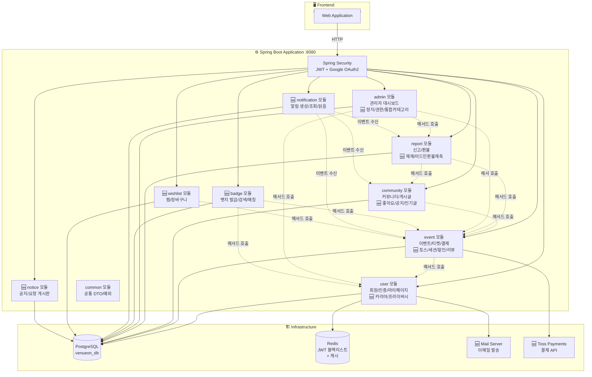

# 🏗️ VenueOn 목표 아키텍처 v6

> **작성일:** 2026-04-02  
> **기반:** MVP 아키텍처 v5 + 최종 기획 확정안 반영  
> **핵심:** 유료·무료 이벤트 중계 + 뱃지 기반 커뮤니티 매칭 + 토스 결제 + 관리 체계 고도화 (v6: 기획 조율사항 반영)  
> **기술 스택:** Spring Boot + Next.js + Vanilla CSS Module  
> **범례:**  
> - ✅ `MVP 및 이전 전제 구현 완료`  
> - 🆕 `신규 추가 및 정책 확정` — v6에서 새로 추가/변경 확정된 항목

---

## 💡 v5 대비 상세 변경 포인트 (기획 확정안 반영 요약)

1. **카테고리 관리 통합**: 어드민 대시보드와 메뉴 구조에서 중복되던 '관심 카테고리 관리(`/admin/interest-categories`)' 페이지/라우팅을 완전히 삭제하고, 기존의 '카테고리 관리' 메뉴 하나로 전체 관리 업무를 통합했습니다.
2. **뱃지 초대 시스템 삭제**: 초대장 발송과 관련된 유스케이스(`InviteBadgeHolderUseCase`)와 포트를 빼고, 순수하게 검색과 유저 인증 용도로만 시스템을 간소화했습니다.
3. **사용자 프라이버시 설정 & 커리어 추가**: `USER` ERD(테이블)을 수정하여 사용자의 **커리어 이력(`career_history`) 컬럼**을 새롭게 추가하고, 활동 내역(리뷰/댓글 등)을 시스템에 다 노출할지 직접 켜고 끌 수 있는 공개 여부 토글 기능(`is_activity_public`)을 정책적으로 추가했습니다.
4. **어드민 환불 권한 개편**: 환불의 전권은 '기획자(HOST)'가 갖도록 어드민의 환불 승인/거절 권한을 없애고, **오직 '처리 지연 건에 대한 호스트 화면 내 재촉 알림 발송'**만 할 수 있도록 비즈니스 구조와 페이지 명세를 변경했습니다.

---

## 📌 1. 기능 범위 (v6 전체)

| # | 기능 | 설명 | 상태 |
|---|------|------|------|
| 1 | **회원가입/로그인** | 이메일 인증 + Google OAuth2, JWT | ✅ 기본 → 🆕 고도화 |
| 2 | **이벤트 CRUD** | Step 1~4 플로우, Rich Editor, 세션 구성 | ✅ 기본 → 🆕 고도화 |
| 3 | **이벤트 검색/필터** | 지역별 + 날짜별 + 카테고리 + 페이지네이션 | ✅ 기본 → 🆕 고도화 |
| 4 | **리뷰 시스템** | 수강 후 별점 리뷰 + 어드민 관리 | 🆕 신규 |
| 5 | **결제** | 토스 페이먼츠 테스트 모드 + 환불 체계 | ✅ 더미 → 🆕 토스 |
| 6 | **찜/장바구니** | 찜 목록 + 수강 바구니 + 일괄 결제 | 🆕 신규 |
| 7 | **할인/패키지** | 할인 설정 + 패키지 강의 묶기 | 🆕 신규 |
| 8 | **커뮤니티** | 좋아요, 대댓글, 공지 고정, 인기글, 권한 체계 | ✅ 기본 → 🆕 대폭 고도화 |
| 9 | **마이페이지** | 탭 통합 (강의/커뮤니티), 관심 카테고리, 알림 센터 | ✅ 기본 → 🆕 대폭 고도화 |
| 10 | **알림 시스템** | 쌓이는 알림 5종 + 읽음 처리 + 헤더 배지 | 🆕 신규 |
| 11 | **호스트 센터** | 결제 내역 관리 + 직접 환불 + 요청 게시판 | ✅ 기본 → 🆕 고도화 |
| 12 | **신고 시스템** | 처리 단계 + 제재 상태 + 이의 제기 + 이력 추적 | ✅ 기본 → 🆕 고도화 |
| 13 | **환불 관리** | 사용자 환불 요청 + 호스트 직접 승인/거절 중심 체계 | ✅ 기본 → 🆕 확정 고도화 |
| 14 | **어드민 대시보드** | 회원 정지/권한 + 통합 카테고리 관리 + 제재 관리 | ✅ 기본 → 🆕 확정 고도화 |
| 15 | **뱃지 시스템** | 자동 발급 + 노출 설정 + 보유자 검색 + 커뮤니티 매칭 | 🆕 신규 (확정) |
| 16 | **사용자 공개 프로필** | 보유 뱃지 + **커리어 이력** + 활동 내역 (선택적 공개 토글링) | 🆕 신규 (확정) |
| 17 | **공지/게시판** | 통합 공지 + 요청 게시판 + 이의 제기 | 🆕 신규 |

---

## 📌 2. 타겟 사용자 & 권한 정책 (v6 확정안)

### 사용자 역할

| 구분 | 대상 | 역할 | 가입 방식 |
|------|------|------|----------|
| **관리자 (ADMIN)** | 서비스 운영팀 | 시스템 전체 관리 (환불은 처리 지연 재촉만 전담) | 사전 등록 |
| **기획자 (HOST)** | 기업·공공기관·사업자 | 이벤트 생성·관리·**결제/환불 직접 처리 전권** | 사업자 인증 + 이메일 검증 |
| **일반 사용자 (USER)** | 개인 | 이벤트 탐색·구매·커뮤니티 활동 및 스스로 프로필 노출 범위 조정 | 이메일 검증 / Google OAuth2 |

### 권한 정책 (v6 확장 및 변경)

| 항목 | 설명 | 상태 |
|------|------|------|
| **권한** | ADMIN / HOST / USER 3단계 | ✅ |
| **이벤트 생성** | HOST만 이벤트 생성 | ✅ |
| **이벤트 관리** | 본인 이벤트만 수정/삭제 + ADMIN 숨김/삭제 | ✅ |
| **리뷰 작성** | 수강 완료 USER만 (1인 1리뷰) | 🆕 |
| **커뮤니티 개설/권한** | 뱃지 기반 개설 → 어드민 승인 / 관리자 5단계 권한 제어 | 🆕 확장 |
| **뱃지 기반 권한** | 관리자가 뱃지 보유 여부로 읽기/쓰기 권한 설정 | 🆕 |
| **신고 처리** | ADMIN → 접수→검토→조치→완료 4단계 | 🆕 확장 |
| **환불 (정책 반영)** | **USER 환불 요청 → HOST 직접 환불 승인/거절 → ADMIN은 지연 건 재촉 푸시만 수행** | 🆕 정책 변경 |
| **회원 관리** | ADMIN → 정지(일시/영구), 권한 수정, 경고 | 🆕 확장 |
| **사용자 프라이버시** | USER 스스로 커리어 정보 기록 추가 및 활동 공개여부 토글링 | 🆕 정책 변경 |
| **알림** | 댓글·강의·제재·결제·신고처리·환불재촉 알림 발송 | 🆕 확장 |

---

## 📌 3. 모듈러 모놀리스 (v6)



### 모듈별 역할 (v6)

| 모듈 (패키지) | 담당 | 상태 |
|--------------|------|------|
| **com.venueon.user** | 회원가입, 로그인, JWT, 프로필, 🆕 **커리어 관리, 활동 내역 프라이버시 제어** | ✅ → 🆕 확장 |
| **com.venueon.event** | 이벤트 CRUD, 🆕 토스 결제 연동, 세션 구성, 할인, 리뷰 | ✅ → 🆕 확장 |
| **com.venueon.community** | 커뮤니티 CRUD, 게시글, 댓글, 🆕 좋아요, 인기글, 권한 체계 | ✅ → 🆕 확장 |
| **com.venueon.report** | 신고 CRUD, 🆕 처리 단계, 제재 상태, **환불 재촉 알림** 로직 | ✅ → 🆕 방식 변경 |
| **com.venueon.admin** | 관리자 대시보드, 🆕 회원 정지/권한, **통합 카테고리 관리** (관심 카테고리 삭제) | ✅ → 🆕 간소화 확장 |
| **🆕 com.venueon.badge** | 뱃지 자동 발급, 노출 설정, **순수 조회 및 검색** (초대 제외) | 🆕 정책 확정 |
| **🆕 com.venueon.notification** | 알림 생성 (5종+재촉), 알림 조회, 읽음 처리 | 🆕 신규 |
| **🆕 com.venueon.wishlist** | 찜 목록, 수강 바구니, 장바구니 관리 | 🆕 신규 |
| **🆕 com.venueon.notice** | 통합 공지, 요청 게시판, 이의 제기 게시판 | 🆕 신규 |
| **com.venueon.common** | ApiResponse, 예외 처리, @UseCase 등 공통 | ✅ |

---

## 📌 4. ERD (v6 — 커리어 및 공개 제어 컬럼 추가)

```mermaid
erDiagram
    USER ||--o{ EVENT : "creates"
    USER ||--o{ ORDER : "places"
    USER ||--o{ POST : "writes"
    USER ||--o{ COMMENT : "writes"
    USER ||--o{ COMMUNITY_MEMBER : "joins"
    USER ||--o{ REPORT : "reports"
    USER ||--o{ REVIEW : "writes"
    USER ||--o{ BADGE : "earns"
    USER ||--o{ WISHLIST : "saves"
    USER ||--o{ CART : "adds"
    USER ||--o{ NOTIFICATION : "receives"
    USER ||--o{ USER_INTEREST_CATEGORY : "selects"
    USER ||--o{ POST_BOOKMARK : "bookmarks"

    CATEGORY ||--o{ EVENT : "classifies"
    EVENT ||--o{ ORDER : "registered_via"
    EVENT ||--o{ COMMUNITY : "has"
    EVENT ||--o{ REPORT : "reported"
    EVENT ||--o{ REVIEW : "reviewed"
    EVENT ||--o{ BADGE : "issued_from"
    EVENT ||--o{ EVENT_SESSION : "has_sessions"

    COMMUNITY ||--o{ COMMUNITY_MEMBER : "has"
    COMMUNITY ||--o{ POST : "contains"
    POST ||--o{ COMMENT : "has"
    POST ||--o{ REPORT : "reported"
    POST ||--o{ POST_LIKE : "liked"
    POST ||--o{ POST_BOOKMARK : "bookmarked"
    COMMENT ||--o{ REPORT : "reported"
    COMMENT ||--o{ COMMENT_LIKE : "liked"

    ORDER ||--o| REFUND : "refund_request"

    USER {
        bigint id PK
        string email UK
        string password
        string nickname
        string profile_img
        text career_history "🆕 커리어 이력"
        boolean is_activity_public "🆕 커뮤니티 활동/리뷰 공개 여부 DEFAULT false"
        enum role "ADMIN, HOST, USER"
        boolean is_active "DEFAULT true"
        enum suspension_status "NONE, TEMP, PERMANENT"
        timestamp suspension_until "NULL"
        boolean email_verified "DEFAULT false"
        string oauth_provider "NULL (GOOGLE)"
        string oauth_id "NULL"
        timestamp created_at
        timestamp updated_at
    }

    CATEGORY {
        bigint id PK
        string name UK
        string description "NULL"
        int sort_order "DEFAULT 0"
    }

    EVENT {
        bigint id PK
        bigint creator_id FK
        bigint category_id FK
        string title
        text description
        enum type "SEMINAR, CLASS, MEETUP, CONFERENCE"
        enum status "DRAFT, PUBLISHED, ONGOING, ENDED, CANCELLED"
        string location
        string region_sido "시/도"
        string region_sigungu "시/군/구"
        boolean is_online
        int price "0이면 무료"
        int discount_rate "할인율 0~100"
        int discounted_price "할인 적용 가격"
        timestamp discount_start "할인 시작일"
        timestamp discount_end "할인 종료일"
        int max_attendees
        string thumbnail_url
        string session_link "온라인 세션 URL"
        boolean is_hidden "DEFAULT false"
        timestamp start_date
        timestamp end_date
        timestamp created_at
        timestamp updated_at
    }

    EVENT_SESSION {
        bigint id PK
        bigint event_id FK
        string title
        text description
        int sort_order
        timestamp start_time
        timestamp end_time
    }

    ORDER {
        bigint id PK
        bigint user_id FK
        bigint event_id FK
        enum status "PENDING, PAID, CANCELLED, REFUNDED, REGISTERED"
        int quantity "DEFAULT 1"
        int amount
        string payment_method "CARD, KAKAO_PAY, TOSS_PAY"
        string toss_payment_key "토스 결제 키"
        string toss_order_id "토스 주문 ID"
        timestamp ordered_at
    }

    COMMUNITY {
        bigint id PK
        bigint event_id FK
        bigint creator_id FK
        string name
        text description
        string thumbnail_url
        int member_count
        boolean is_public
        enum approval_status "APPROVED, PENDING, REJECTED"
        text purpose "커뮤니티 목적"
        text rules "운영 규칙"
        int popular_threshold_likes "인기글 좋아요 기준"
        int popular_threshold_comments "인기글 댓글 기준"
        int popular_threshold_views "인기글 조회 기준"
        timestamp created_at
    }

    COMMUNITY_MEMBER {
        bigint id PK
        bigint community_id FK
        bigint user_id FK
        enum role "ADMIN, SUB_ADMIN, READ_WRITE, READ_ONLY, BLOCKED"
        timestamp joined_at
    }

    POST {
        bigint id PK
        bigint community_id FK
        bigint author_id FK
        string title
        text content
        enum type "GENERAL, REVIEW, QUESTION, NOTICE"
        int view_count
        int comment_count
        int like_count "DEFAULT 0"
        boolean is_pinned "DEFAULT false"
        boolean is_hidden "DEFAULT false"
        timestamp created_at
        timestamp updated_at
    }

    COMMENT {
        bigint id PK
        bigint post_id FK
        bigint author_id FK
        bigint parent_id FK "대댓글"
        text content
        int like_count "DEFAULT 0"
        boolean is_hidden "DEFAULT false"
        timestamp created_at
    }

    POST_LIKE {
        bigint id PK
        bigint post_id FK
        bigint user_id FK
        timestamp created_at
    }

    COMMENT_LIKE {
        bigint id PK
        bigint comment_id FK
        bigint user_id FK
        timestamp created_at
    }

    POST_BOOKMARK {
        bigint id PK
        bigint post_id FK
        bigint user_id FK
        timestamp created_at
    }

    REVIEW {
        bigint id PK
        bigint event_id FK
        bigint user_id FK
        int rating "1~5"
        text content
        boolean is_hidden "DEFAULT false"
        timestamp created_at
        timestamp updated_at
    }

    REPORT {
        bigint id PK
        bigint reporter_id FK
        enum target_type "EVENT, POST, COMMENT, USER, REVIEW"
        bigint target_id
        string reason
        text detail "max 300"
        enum status "RECEIVED, REVIEWING, ACTIONED, COMPLETED, REJECTED"
        string admin_action "DELETE, HIDE, WARN, SUSPEND, DISMISS"
        enum sanction_type "NONE, WARNING, TEMP_SUSPEND, PERM_SUSPEND"
        timestamp created_at
        timestamp resolved_at
    }

    REFUND {
        bigint id PK
        bigint order_id FK
        bigint user_id FK
        bigint processed_by FK "처리자 (Host 중심)"
        int amount
        enum status "PENDING, APPROVED, REJECTED"
        string reason
        enum refund_source "USER, HOST, ADMIN (재촉용 표기)"
        timestamp requested_at
        timestamp processed_at
    }

    BADGE {
        bigint id PK
        bigint user_id FK
        bigint event_id FK
        string badge_name
        string badge_image_url
        boolean is_visible "DEFAULT true"
        timestamp earned_at
    }

    WISHLIST {
        bigint id PK
        bigint user_id FK
        bigint event_id FK
        timestamp created_at
    }

    CART {
        bigint id PK
        bigint user_id FK
        bigint event_id FK
        int quantity "DEFAULT 1"
        timestamp created_at
    }

    NOTIFICATION {
        bigint id PK
        bigint user_id FK
        enum type "COMMENT, LECTURE, SANCTION, PAYMENT, REPORT, REFUND_PROMPT"
        string title
        text message
        string link_url "클릭 시 이동 경로"
        boolean is_read "DEFAULT false"
        timestamp created_at
    }

    USER_INTEREST_CATEGORY {
        bigint id PK
        bigint user_id FK
        bigint category_id FK
        timestamp created_at
    }

    NOTICE {
        bigint id PK
        bigint author_id FK
        string title
        text content
        enum type "GUIDE, ANNOUNCEMENT, QNA, OBJECTION"
        enum target_role "ALL, USER, HOST"
        boolean is_pinned "DEFAULT false"
        int view_count
        timestamp created_at
        timestamp updated_at
    }
```



---

## 📌 5. 기술 스택 (v6)

| 카테고리 | 기술 | 비고 |
|----------|------|------|
| **프론트엔드** | Next.js 14+ (App Router) | React 18, SSR/SSG |
| **스타일링** | Vanilla CSS Module | 컴포넌트별 스코프 CSS |
| **백엔드** | Spring Boot 3.x, Java 17 | RESTful API |
| **아키텍처 패턴** | Hexagonal Architecture | Ports & Adapters |
| **아키텍처 구조** | Modular Monolith | 9개 도메인 모듈 |
| **DB** | PostgreSQL 15 | 단일 DB, 20개 테이블 |
| **캐시** | Redis 7 | JWT 블랙리스트, 캐시 |
| **인증** | Spring Security + JWT | Access + Refresh Token |
| **소셜 인증** | Google OAuth2 | Spring Security OAuth2 Client |
| **이메일** | Spring Mail (SMTP) | 인증 코드, 임시 비밀번호 |
| **결제** | Toss Payments (테스트 모드) | 토스 SDK + Webhook 검증 |
| **에디터** | Rich Text Editor (WYSIWYG) | 이벤트/커뮤니티 글 등록 |
| **CI/CD** | GitHub Actions | 빌드/테스트 자동화 |

---

## 📌 6. 헥사고날 아키텍처 — 주요 변경 모듈 구조

### 6-1. User 모듈 (🆕 커리어 및 프라이버시 추가)
```
com.venueon.user/
├── application/
│   ├── port/in/
│   │   ├── RegisterUserUseCase.java
│   │   ├── GetMyProfileUseCase.java
│   │   ├── UpdateCareerHistoryUseCase.java      # 커리어 업데이트 (추가)
│   │   └── ToggleActivityVisibilityUseCase.java # 활동내역 공개 토글 (추가)
│   ├── port/out/
│   └── service/
```

### 6-2. Badge 모듈 (🆕 초대 기능 제거 후 간소화)
```
com.venueon.badge/
├── domain/model/
├── application/
│   ├── port/in/
│   │   ├── IssueBadgeUseCase.java        # 수강 완료 시 자동 발급
│   │   ├── GetMyBadgesUseCase.java       # 내 뱃지 조회
│   │   ├── ToggleBadgeVisibilityUseCase.java  # 공개/비공개 토글
│   │   └── SearchBadgeHoldersUseCase.java     # 뱃지 보유자 검색 (초대 UseCase 제거)
│   ├── port/out/
│   └── service/
```

### 6-3. Notification 모듈
```
com.venueon.notification/
├── application/
│   ├── port/in/
│   │   ├── CreateNotificationUseCase.java
│   │   ├── PromptRefundNotificationUseCase.java # 어드민의 호스트 환불 재촉(추가)
│   │   ├── GetNotificationsUseCase.java
│   │   └── MarkAsReadUseCase.java
```

*(이 외의 Event, Community, Report 모듈의 구조는 v5 명세도와 동일합니다.)*

---

## 📌 7. 페이지 구성 (v6 — 45개로 최적화)

### 공통 / 인증 (4)
| # | 페이지 | 경로 | 비고 |
|---|--------|------|------|
| 1 | 메인 홈 | `/` | |
| 2 | 수강생 로그인 | `/auth/login` | |
| 3 | 수강생 회원가입 | `/auth/signup` | |
| 4 | 호스트 로그인/회원가입 | `/host/login`, `/host/signup` | |

### 이벤트 (5)
| # | 페이지 | 경로 | 비고 |
|---|--------|------|------|
| 5 | 강의 리스트 | `/events` | |
| 6 | 강의 상세 | `/events/[id]` | |
| 7 | 이벤트 생성 | `/host/seminars/new` | |
| 8 | 이벤트 수정 | `/host/seminars/[id]/edit` | |
| 9 | 리뷰 (상세 내) | `/events/[id]#reviews` | |

### 커뮤니티 (4)
| # | 페이지 | 경로 | 비고 |
|---|--------|------|------|
| 10 | 커뮤니티 목록 | `/community` | |
| 11 | 커뮤니티 상세 | `/community/[id]` | |
| 12 | 커뮤니티 생성/수정 | `/community/new`, `/community/[id]/edit` | |
| 13 | 커뮤니티 사용자 관리 | `/community/[id]/members` | |

### 결제 / 장바구니 (3)
| # | 페이지 | 경로 | 비고 |
|---|--------|------|------|
| 14 | 수강 바구니 | `/cart` | |
| 15 | 결제 (토스 위젯) | `/orders/checkout` | |
| 16 | 결제 완료 | `/orders/[id]/complete` | |

### 마이페이지 & 프로필 (8)
| # | 페이지 | 경로 | 비고 |
|---|--------|------|------|
| 17 | 마이페이지 메인 | `/mypage` | |
| 18 | 결제 내역 | `/mypage/orders` | |
| 19 | 내 강의 | `/mypage/events` | |
| 20 | 찜 목록 | `/mypage/wishlist` | |
| 21 | 내 커뮤니티 | `/mypage/communities` | |
| 22 | 프로필 설정 | `/mypage/profile` | 🆕 커리어 및 프라이버시 노출 토글 |
| 23 | 알림 센터 | `/mypage/notifications` | |
| 24 | 뱃지 목록 | `/mypage/badges` | |

### 호스트 (6)
| # | 페이지 | 경로 | 비고 |
|---|--------|------|------|
| 25 | 호스트 센터 | `/host` | |
| 26 | 호스트 대시보드 | `/host/dashboard` | |
| 27 | 내가 등록한 이벤트 | `/host/events` | |
| 28 | 호스트 결제 내역/환불 | `/host/payments` | 🆕 환불 처리 전권 |
| 29 | 호스트 요청 게시판 | `/host/requests` | |
| 30 | 호스트 프로필 설정 | `/host/profile` | |

### 어드민 (9) - 관심카테고리 제거됨
| # | 페이지 | 경로 | 비고 |
|---|--------|------|------|
| 31 | 어드민 대시보드 | `/admin` | |
| 32 | 회원 관리 | `/admin/users` | |
| 33 | 통합 카테고리 관리 | `/admin/categories` | 🆕 일반/관심 카테고리 병합 관리 |
| 34 | 신고 관리 | `/admin/reports` | |
| 35 | 커뮤니티 요청 관리 | `/admin/community-requests` | |
| 36 | 요청 처리 | `/admin/requests` | |
| 37 | 리뷰 관리 | `/admin/reviews` | |
| 38 | 환불 관리 | `/admin/refunds` | 🆕 재촉 푸시 관리 전용 |
| 39 | 커뮤니티 제재 관리 | `/admin/communities/sanctions` | |

### 뱃지 / 공개 프로필 / 게시판 (6)
| # | 페이지 | 경로 | 비고 |
|---|--------|------|------|
| 40 | 뱃지 보유자 검색 | `/badges/search` | |
| 41 | 사용자 공개 프로필 | `/users/[id]/profile` | 🆕 뱃지, 커리어 및 토글옵션 기반 노출 |
| 42 | 뱃지 기반 개설 | `/community/new` (연동) | |
| 43 | 통합 공지 게시판 | `/notice` | |
| 44 | 요청 게시판 | `/requests` | |
| 45 | 관리자 요청 | `/community/[id]/requests` | |

---

## 📌 8. 프론트엔드 폴더 구조 (v6)

```
frontend/src/app/
├── (auth)/
│   ├── login/, signup/, forgot-password/
├── events/
│   ├── [id]/, components/
├── community/
│   ├── new/, [id]/
├── cart/
├── mypage/
│   ├── orders/, events/, wishlist/, communities/, profile/, notifications/, badges/
├── users/
│   └── [id]/profile/page.tsx          # 🆕 프라이버시(활동 공개) 로직이 반영된 프로필 UI
├── badges/
│   └── search/page.tsx
├── notice/
├── requests/
├── host/
│   ├── login/, signup/, dashboard/, seminars/, events/, payments/, requests/, profile/
└── admin/
    ├── login/, page.tsx, users/, categories/, reports/, reviews/, refunds/, requests/
    └── communities/sanctions/
        (※ 기존 interest-categories 삭제 완료)
```

---

## 📌 9. Docker Compose

```yaml
version: '3.8'

services:
  postgres:
    image: postgres:15
    environment:
      POSTGRES_DB: venueon_db
      POSTGRES_USER: ${DB_USER}
      POSTGRES_PASSWORD: ${DB_PASSWORD}
    ports:
      - "5432:5432"
    volumes:
      - pg-data:/var/lib/postgresql/data

  redis:
    image: redis:7-alpine
    ports:
      - "6379:6379"

  mailhog:
    image: mailhog/mailhog
    ports:
      - "1025:1025"    # SMTP
      - "8025:8025"    # Web UI
    profiles:
      - dev

  backend:
    build: ../backend
    ports:
      - "8080:8080"
    depends_on:
      - postgres
      - redis
    environment:
      SPRING_DATASOURCE_URL: jdbc:postgresql://postgres:5432/venueon_db
      SPRING_DATASOURCE_USERNAME: ${DB_USER}
      SPRING_DATASOURCE_PASSWORD: ${DB_PASSWORD}
      SPRING_REDIS_HOST: redis
      JWT_SECRET: ${JWT_SECRET}
      UPLOAD_PATH: /app/upload
      GOOGLE_CLIENT_ID: ${GOOGLE_CLIENT_ID}
      GOOGLE_CLIENT_SECRET: ${GOOGLE_CLIENT_SECRET}
      TOSS_SECRET_KEY: ${TOSS_SECRET_KEY}
      TOSS_CLIENT_KEY: ${TOSS_CLIENT_KEY}
      SPRING_MAIL_HOST: mailhog
      SPRING_MAIL_PORT: 1025
    volumes:
      - upload-data:/app/upload

volumes:
  pg-data:
  upload-data:
```

---

## 📌 10. 요약 (v6 최종 구조)

```
┌───────────────────────────────────────────────────────────┐
│              VenueOn 목표 아키텍처 v6                       │
│              (Modular Monolith)                            │
│                                                           │
│  ┌─ src/main/java/com/venueon/ ────────────────────────┐  │
│  │                                                     │  │
│  │  user/           event/           community/        │  │
│  │  회원/커리어 제어  이벤트 CRUD       커뮤니티 CRUD      │  │
│  │  마이페이지      세션/할인          게시글/댓글        │  │
│  │                                                     │  │
│  │  report/        admin/            common/           │  │
│  │  신고 시스템      관리자 대시보드     공통 DTO          │  │
│  │  환불(어드민재촉)  사용자 관리        예외 처리          │  │
│  │                 통합카테고리 관리                    │  │
│  │                                                     │  │
│  │  badge/         notification/     wishlist/         │  │
│  │  뱃지 발급        알림 5종+재촉      찜 목록          │  │
│  │  보유자 검색                                         │  │
│  │                                                     │  │
│  │  notice/                                            │  │
│  │  통합 공지                                           │  │
│  └─────────────────────────────────────────────────────┘  │
│                                                           │
│  Frontend: Next.js 14 + Vanilla CSS Module                │
│  Infra: Docker Compose + PostgreSQL + Redis               │
│         + Toss API + MailHog                              │
│                                                           │
│  📊 v6 최종 확정 요약:                                      │
│  ├── 모듈: 9개 (구조 최적화)                                │
│  ├── 엔티티: 20개 (커리어 및 활동 내역 공개 여부 컬럼 반영)      │
│  ├── 페이지: 45개 (관심 카테고리 등 잉여 라우팅 제거 완벽 최적화)   │
└───────────────────────────────────────────────────────────┘
```
