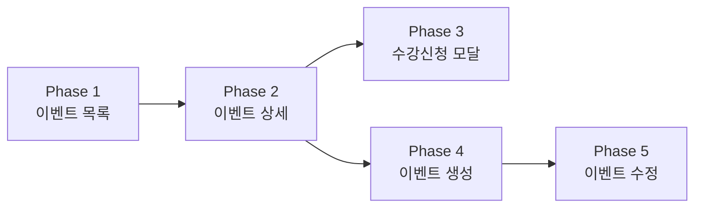

# 🗓️ 오늘의 작업 계획 — 이벤트 CRUD + 수강신청

> **날짜:** 2026-04-06  
> **전략:** 기능별 Vertical Slice (BE → BFF → FE 한 묶음)  
> **장점:** 프론트엔드 화면이 곧 API 검증 → Postman 별도 테스트 불필요

---

## 📊 현재 상태 요약

- ✅ Event 도메인 모델 + JPA Entity + Repository — 완성
- ✅ DataInitializer에 10개 이벤트 더미 데이터 — 테스트 가능
- ⚠️ EventController — `hello world`만 존재 (API 미구현)
- ⚠️ FE `/events`, `/events/[id]`, `/events/new` — 스켈레톤만 존재
- ❌ Service/Port 레이어, BFF 라우트 — 없음

---

## 🎯 기능별 작업 단계 (5 Phases)



---

### Phase 1. 📋 이벤트 목록 조회 (검색/필터/페이징)
**예상:** ~1시간 | **BE + BFF + FE 풀스택**

하나의 기능을 BE부터 FE까지 관통해서 만들고, **화면에서 목록이 나오면 Phase 1 완료.**

| 순서 | 레이어 | 태스크 |
|------|--------|--------|
| 1 | **BE** | Event Port(In/Out) 인터페이스 정의 |
| 2 | **BE** | EventService — 목록 조회 UseCase 구현 |
| 3 | **BE** | EventPersistenceAdapter + Mapper (Entity ↔ Domain) |
| 4 | **BE** | EventListResponse DTO 정의 |
| 5 | **BE** | EventController — `GET /events` (검색/필터/페이징) |
| 6 | **BFF** | `GET /api/events` Next.js API Route |
| 7 | **FE** | EventCard 컴포넌트 |
| 8 | **FE** | SearchBar + FilterBar 컴포넌트 |
| 9 | **FE** | Pagination 컴포넌트 |
| 10 | **FE** | `/events/page.tsx` 조립 |

> **✅ 완료 기준:** 브라우저에서 `/events` 접속 → 이벤트 카드 그리드 보임 → 검색/필터/페이징 작동

---

### Phase 2. 🔍 이벤트 상세 조회 (디테일 페이지)
**예상:** ~40분 | **BE + BFF + FE 풀스택**

Phase 1의 카드 클릭 → 상세 페이지 이동까지.

| 순서 | 레이어 | 태스크 |
|------|--------|--------|
| 1 | **BE** | EventDetailResponse DTO 정의 (Host 정보 포함) |
| 2 | **BE** | EventService — 상세 조회 UseCase 추가 |
| 3 | **BE** | EventController — `GET /events/{id}` |
| 4 | **BFF** | `GET /api/events/[id]` Next.js API Route |
| 5 | **FE** | EventDetail 컴포넌트 (썸네일/제목/설명/일정/장소) |
| 6 | **FE** | HostInfoCard 컴포넌트 (주최자 정보) |
| 7 | **FE** | TicketSection 컴포넌트 (가격/잔여석/신청 버튼) |
| 8 | **FE** | `/events/[id]/page.tsx` 조립 |

> **✅ 완료 기준:** 목록에서 카드 클릭 → 상세 페이지 → 이벤트 정보 + 주최자 정보 + 신청 버튼 표시

---

### Phase 3. 🎟️ 수강 신청 모달
**예상:** ~30분 | **BE + BFF + FE 풀스택**

Phase 2의 "수강 신청" 버튼 클릭 → 모달 → 신청 완료까지.

| 순서 | 레이어 | 태스크 |
|------|--------|--------|
| 1 | **BE** | OrderCreateRequest DTO 정의 |
| 2 | **BE** | OrderService — 수강 신청 UseCase (이미 일부 존재하면 확인) |
| 3 | **BE** | OrderController — `POST /orders` |
| 4 | **BFF** | `POST /api/orders` Next.js API Route |
| 5 | **FE** | EnrollmentModal 컴포넌트 (인원수/결제방법 선택) |
| 6 | **FE** | 모달 애니메이션 + 성공/에러 토스트 연동 |

> **✅ 완료 기준:** 상세 페이지 → 수강 신청 버튼 → 모달 → 인원/결제 선택 → 완료 토스트

---

### Phase 4. ➕ 이벤트 생성 (new)
**예상:** ~1시간 20분 | **BE + BFF + FE 풀스택**

Host 로그인 후 이벤트를 새로 만드는 전체 흐름.

| 순서 | 레이어 | 태스크 |
|------|--------|--------|
| 1 | **BE** | EventCreateRequest DTO 정의 |
| 2 | **BE** | EventService — 생성 UseCase |
| 3 | **BE** | EventService — 상태 변경 (DRAFT→PUBLISHED) |
| 4 | **BE** | HostEventController — `POST /host/events` + `PATCH .../status` |
| 5 | **BFF** | `POST /api/events` + `PATCH /api/events/[id]/status` |
| 6 | **FE** | EventForm 컴포넌트 (mode: create) |
|   |       | — 기본 정보 입력 (제목/설명/카테고리) |
|   |       | — 대표 이미지 업로드 (드래그앤드롭/프리뷰) |
|   |       | — 날짜/시간 설정 |
|   |       | — 온라인/오프라인 선택 + 장소 |
|   |       | — 무료/유료 + 가격 설정 |
|   |       | — 최대 수강 인원 설정 |
| 7 | **FE** | 폼 검증 (Validation) |
| 8 | **FE** | Publish 버튼 (Draft 저장 or 바로 게시) |
| 9 | **FE** | `/events/new/page.tsx` 조립 |

> [!TIP]
> EventForm은 **섹션 분리된 긴 폼** 방식 추천 (Step Wizard보다 구현 빠르고, `mode` prop으로 Phase 5에서 재사용 가능)

> **✅ 완료 기준:** Host 로그인 → `/events/new` → 폼 작성 → 게시 → `/events` 목록에서 확인

---

### Phase 5. ✏️ 이벤트 수정 (edit)
**예상:** ~30분 | **BE + BFF + FE 풀스택**

Phase 4의 EventForm을 재사용하므로 가장 빠릅니다.

| 순서 | 레이어 | 태스크 |
|------|--------|--------|
| 1 | **BE** | EventUpdateRequest DTO 정의 |
| 2 | **BE** | EventService — 수정 UseCase |
| 3 | **BE** | HostEventController — `PUT /host/events/{id}` |
| 4 | **BFF** | `PUT /api/events/[id]` Next.js API Route |
| 5 | **FE** | `/events/[id]/edit/page.tsx` 생성 |
| 6 | **FE** | EventForm 재사용 (mode: edit, 기존 데이터 prefill) |
| 7 | **FE** | 수정 완료 → 상세 페이지로 리다이렉트 |

> **✅ 완료 기준:** 상세 페이지 → "수정" 버튼 → 프리필된 폼 → 수정 → 상세에서 변경 확인

---

## ⏱️ 시간 요약

| Phase | 기능 | 범위 | 예상 시간 | 누적 |
|-------|------|------|----------|------|
| 1 | 이벤트 목록 | BE+BFF+FE | 1시간 | 1시간 |
| 2 | 이벤트 상세 | BE+BFF+FE | 40분 | 1시간 40분 |
| 3 | 수강신청 모달 | BE+BFF+FE | 30분 | 2시간 10분 |
| 4 | 이벤트 생성 | BE+BFF+FE | 1시간 20분 | 3시간 30분 |
| 5 | 이벤트 수정 | BE+BFF+FE | 30분 | **4시간** |

---

## 🧠 왜 이 순서인가?

```
Phase 1 (목록) → 가장 먼저: BE 기반 인프라(Port/Service/Adapter)가 여기서 만들어짐
    ↓
Phase 2 (상세) → 목록의 카드 클릭으로 진입, Phase 1의 인프라 재사용
    ↓
Phase 3 (수강신청) → 상세 페이지의 버튼에서 트리거, Order 도메인 추가
    ↓
Phase 4 (생성) → Host 전용, 쓰기 API는 읽기와 분리하여 나중에
    ↓
Phase 5 (수정) → Phase 4의 EventForm 재사용, 가장 적은 공수
```

> [!IMPORTANT]
> **핵심 원칙:** 각 Phase가 끝나면 **브라우저에서 동작하는 화면**이 하나씩 완성됩니다.
> Postman 없이 화면 자체가 API 검증 도구 역할을 합니다.

---

## ✅ 진행 체크리스트

- [ ] Phase 1: 이벤트 목록 (검색/필터/페이징) — BE+BFF+FE
- [ ] Phase 2: 이벤트 상세 (디테일 페이지) — BE+BFF+FE
- [ ] Phase 3: 수강신청 모달 — BE+BFF+FE
- [ ] Phase 4: 이벤트 생성 (new) — BE+BFF+FE
- [ ] Phase 5: 이벤트 수정 (edit) — BE+BFF+FE

---

> 📌 Phase 1부터 시작할까요?
