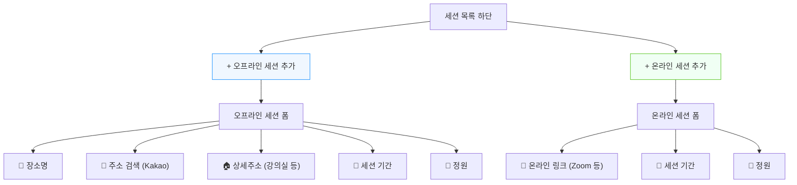
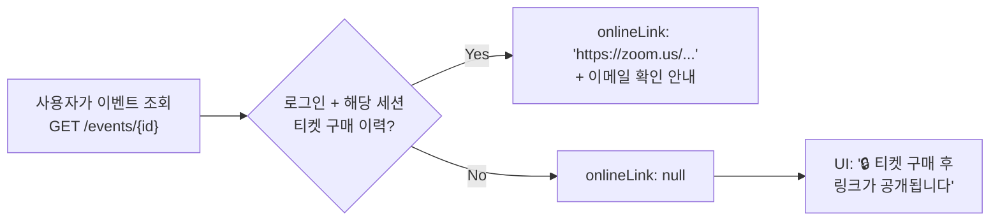
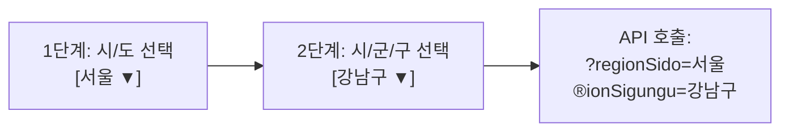

# VenueOn 기능 확장 제안서 v2

> **작성일:** 2026-04-12 (v2 업데이트)  
> **대상:** 메인페이지 정보 표시, 상태 관리, 카테고리 선택, 리치 에디터, 온/오프라인 세션 관리, 주소 체계, 필터링  
> **기반:** v6 아키텍처 (Hexagonal, 티켓-세션 중심)

---

## 확정된 결정 사항

| 항목 | 결정 |
|------|------|
| Tiptap 에디터 범위 | 이벤트 설명(`description`)에만 적용. 세션 설명은 plain text 유지 |
| 인기순 정렬 기준 | **판매 수(order_count)** 기반 |
| 지역 필터 단위 | **시/군/구** 단위까지 2단계 필터 |
| 주소 검색 API | **Kakao 우편번호 서비스** (무료, API 키 불필요, UI 내장) |
| 가격 필터 기준 | 이벤트의 활성 티켓 중 **최저가** 기준 |
| 세션 온/오프라인 UI | **버튼 분리 방식** — "온라인 세션 추가" / "오프라인 세션 추가" |

---

## 1. 메인페이지 카드에 가격/날짜/모집·이벤트 상태 표시

### 현황

- `EventListResponse`에 `startDate`, `endDate`, `status`, `recruitmentStatus`는 이미 세션 기반으로 계산되어 포함됨
- **가격(price)** 은 `EventListResponse`에 없음 (Ticket 도메인 분리로 인해)
- 프론트엔드 `page.tsx`에서 `event.price`를 참조하나 항상 0으로 표시됨

### 변경 내용

#### 백엔드: `EventListResponse` 필드 추가

| 추가 필드 | 타입 | 설명 |
|-----------|------|------|
| `minPrice` | `Integer` | 활성 티켓 최저 판매가 (0이면 무료) |
| `maxPrice` | `Integer` | 활성 티켓 최고 판매가 |
| `hasDiscount` | `boolean` | 할인 티켓 존재 여부 |
| `primaryLocation` | `String` | 첫 번째 세션의 장소 |
| `isOnline` | `boolean` | 전체 세션이 온라인인지 |

#### 백엔드: `EventController.getEventList()` — 티켓 벌크 조회 추가

```java
// 기존: 세션만 벌크 조회
List<Session> allSessions = getSessionUseCase.getSessionsByEventIds(eventIds);

// 추가: 티켓 벌크 조회
List<Ticket> allTickets = getTicketUseCase.getTicketsByEventIds(eventIds);
Map<Long, List<Ticket>> ticketsByEventId = allTickets.stream()
        .collect(Collectors.groupingBy(Ticket::getEventId));

// EventListResponse.from(event, sessions, tickets) 호출
```

#### 프론트엔드: `EventData` 인터페이스 API 응답과 동기화

```typescript
interface EventData {
  id: number;
  title: string;
  thumbnailUrl: string | null;
  type: string;
  status: string;             // DRAFT | PUBLISHED | ONGOING | ENDED | CANCELLED
  recruitmentStatus: string; // OPEN | PENDING | CLOSED
  categoryId: number;
  creatorId: number;
  createdAt: string;
  hasSession: boolean;
  startDate: string | null;
  endDate: string | null;
  minPrice: number;          // 신규
  maxPrice: number;          // 신규
  hasDiscount: boolean;      // 신규
  primaryLocation: string;   // 신규
  isOnline: boolean;         // 신규
}
```

---

## 2. 이벤트 디테일 페이지 — 상태 수동관리 + 카테고리 선택

### 2-A. 이벤트/모집 상태 수동 관리

호스트(생성자)에게만 보이는 **관리 패널**을 이벤트 디테일 페이지 상단에 추가합니다.

```
┌─ 호스트 관리 패널 ──────────────────────────────────┐
│                                                      │
│  이벤트 상태: [게시 전] → [게시하기 ▶] [취소 ✕]      │
│                                                      │
│  ── 세션별 모집 관리 ──                               │
│  세션 1: AI 입문    모집중 ✅  [마감하기]              │
│  세션 2: AI 실전    모집 대기  [수동 오픈] (불가)      │
│  세션 3: AI 특강    마감 🔴    [재오픈]                │
│                                                      │
└──────────────────────────────────────────────────────┘
```

**신규 API 필요:**

```
PATCH /host/sessions/{sessionId}/recruitment
Body: { "closed": true | false }
```

### 2-B. 카테고리 선택

**1단계:** `/categories` API 수정 — ID + name + description 반환 (현재 name만 반환)

```java
// CategoryController — UseCase를 통해 정상 응답
@GetMapping
public ResponseEntity<ApiResponse<List<CategoryResponse>>> getCategories() {
    List<CategoryResponse> responses = categoryUseCase.getAllCategories().stream()
        .map(c -> new CategoryResponse(c.getId(), c.getName(), c.getDescription(), c.getSortOrder(), c.getEventCount()))
        .collect(Collectors.toList());
    return ResponseEntity.ok(ApiResponse.success(responses));
}
```

**2단계:** EventForm에 카테고리 드롭다운 추가 (서버에서 동적 로드)

**3단계:** 메인페이지 카테고리 탭도 서버에서 동적 로드 (현재 하드코딩 제거)

---

## 3. 이벤트 상세 페이지 — Tiptap 리치 에디터

- **적용 범위:** 이벤트 `description`에만 적용 (세션 설명은 plain text 유지)
- **저장 형식:** HTML → DB `description TEXT` 컬럼
- **하위 호환:** 기존 plain text는 그대로 렌더링, 신규만 HTML
- **XSS 방지:** `DOMPurify` 라이브러리로 sanitize 후 렌더링

#### 패키지 구성

```
@tiptap/react, @tiptap/starter-kit, @tiptap/extension-image,
@tiptap/extension-link, @tiptap/extension-placeholder
```

#### 적용 위치

| 위치 | 변경 |
|------|------|
| `EventForm.tsx` | `<textarea>` → `<TiptapEditor>` 컴포넌트 교체 |
| `events/[id]/page.tsx` | `{event.description}` → `dangerouslySetInnerHTML` + sanitize |

---

## 4. 세션별 온/오프라인 관리 — 버튼 분리 방식

### 변경: "기본값 상속" → "버튼 분리" 방식 채택

세션 추가 시 온라인/오프라인을 미리 선택하여, 해당 유형에 맞는 전용 폼을 보여줍니다.



#### UI 목업

```
┌─── 세션 목록 ────────────────────────────────────────┐
│                                                       │
│  ┌─ 세션 1 ─────────────────── 🏢 오프라인 ────────┐ │
│  │  [제목] UX 디자인 워크숍                         │ │
│  │  [장소] 코엑스 컨벤션센터                        │ │
│  │  [주소] 서울 강남구 영동대로 513                  │ │
│  │  [상세] 3층 세미나룸 A                           │ │
│  │  [기간] 2026-05-01 10:00 ~ 18:00                │ │
│  │  [정원] 50명                           [🗑️ 삭제] │ │
│  └──────────────────────────────────────────────────┘ │
│                                                       │
│  ┌─ 세션 2 ─────────────────── 💻 온라인 ──────────┐ │
│  │  [제목] AI 실습 라이브                           │ │
│  │  [링크] https://zoom.us/j/1234567890             │ │
│  │  [기간] 2026-05-03 14:00 ~ 16:00                │ │
│  │  [정원] 100명                          [🗑️ 삭제] │ │
│  └──────────────────────────────────────────────────┘ │
│                                                       │
│  ┌──────────────────────────────────────────────────┐ │
│  │  + 🏢 오프라인 세션 추가    + 💻 온라인 세션 추가 │ │
│  └──────────────────────────────────────────────────┘ │
└───────────────────────────────────────────────────────┘
```

#### 구현 로직

```typescript
const addSession = (isOnline: boolean) => {
  setSessions([...sessions, {
    title: isOnline ? '새 온라인 세션' : '새 오프라인 세션',
    isOnline,
    // 온라인 전용
    onlineLink: isOnline ? '' : undefined,
    // 오프라인 전용
    location: isOnline ? undefined : '',
    addressRoad: isOnline ? undefined : '',
    addressDetail: isOnline ? undefined : '',
    regionSido: isOnline ? undefined : '',
    regionSigungu: isOnline ? undefined : '',
    // 공통
    maxAttendees: 50,
    sortOrder: sessions.length,
    startDate: '', startTimeOnly: '10:00',
    endDate: '', endTimeOnly: '18:00',
  }]);
};
```

```tsx
{/* 세션 추가 버튼 */}
<div style={{ display: 'flex', gap: '1rem' }}>
  <button onClick={() => addSession(false)}>
    🏢 오프라인 세션 추가
  </button>
  <button onClick={() => addSession(true)}>
    💻 온라인 세션 추가
  </button>
</div>
```

세션 카드 렌더링 시 `session.isOnline` 값에 따라 다른 폼 필드를 표시:

```tsx
{session.isOnline ? (
  // 온라인 전용 필드
  <OnlineLinkInput value={session.onlineLink} onChange={...} />
) : (
  // 오프라인 전용 필드
  <>
    <LocationNameInput value={session.location} onChange={...} />
    <AddressSearchButton onSelect={...} />  {/* Kakao 주소 검색 */}
    <DetailAddressInput value={session.addressDetail} onChange={...} />
  </>
)}
```

> [!IMPORTANT]
> **DB 스키마 변경 없음.** 이미 `event_sessions.is_online`, `online_link`, `location`, `region_sido`, `region_sigungu` 가 세션 단위로 존재합니다. 프론트엔드 로직 변경만으로 구현 가능합니다 (주소 관련 신규 컬럼은 §6에서 별도 처리).

---

## 5. 온라인 세션 — 링크 보안 제공

### 대형 플랫폼 사례 조사

| 플랫폼 | 온라인 링크 제공 방식 |
|--------|----------------------|
| **Eventbrite** | "Online Event Page" — 구매 확정 후 로그인 필수, 해당 계정으로만 접근 가능한 전용 페이지에서 Zoom/Meet 링크 노출. 구매 확인 이메일에도 링크 포함 |
| **Ticket Tailor** | Zoom API 연동 — 구매 시 자동으로 Zoom 참가자 등록, 구매자에게 고유 참가 링크를 이메일로 전송 |
| **클래스101 / 인프런** | DRM 기반 자체 스트리밍 — 링크가 아닌 플랫폼 내 전용 플레이어에서만 재생. 로그인 + 수강권 확인 후 복호화 키 발급 |
| **줌(Zoom) 자체** | Waiting Room + Registration 필수 설정 — 링크를 알아도 호스트가 참가자 명단과 대조 후 수동 승인 |

### VenueOn에 적합한 방식 — 2단계 전략

VenueOn은 DRM이 필요한 강의 플랫폼이 아니라 **이벤트 티켓 플랫폼**이므로, Eventbrite의 접근 방식이 가장 적합합니다.

#### Phase 1: API 레벨 마스킹 (단기, 권장)



**구현:**

```java
// EventController.getEventDetail() 내
Long currentUserId = getCurrentUserId(); // null이면 비로그인
Set<Long> purchasedSessionIds = (currentUserId != null)
    ? orderService.getPurchasedSessionIds(currentUserId, eventId)
    : Set.of();

List<SessionResponse> maskedSessions = sessions.stream()
    .map(s -> {
        if (s.isOnline() && !purchasedSessionIds.contains(s.id())) {
            return s.withMaskedLink(); // onlineLink = null
        }
        return s;
    })
    .toList();
```

**프론트엔드 표시:**

```tsx
{session.isOnline && (
  session.onlineLink 
    ? <a href={session.onlineLink}>🔗 온라인 참여하기</a>
    : <span className={styles.lockedLink}>🔒 티켓 구매 후 링크가 공개됩니다</span>
)}
```

#### Phase 2: 구매 확인 이메일 발송 (중기)

티켓 구매 확정(`PAID`) 시 구매자에게 온라인 링크를 포함한 확인 이메일을 자동 발송합니다. 이메일에는:

- 참여 링크 (Zoom/Meet URL)
- 이벤트 일정 정보
- 캘린더 추가 링크 (.ics 파일)

> [!TIP]
> Phase 1만으로도 충분히 실용적입니다. Phase 2는 사용자 경험 향상을 위한 선택 사항입니다.

---

## 6. 오프라인 세션 — 주소 체계 개선

### 주소 검색 API → Kakao 우편번호 서비스

| 비교 항목 | Kakao 우편번호 서비스 | 행정안전부 도로명주소 API |
|-----------|----------------------|--------------------------|
| **비용** | ✅ 완전 무료 | ✅ 무료 (쿼리 제한 있음) |
| **API 키** | ✅ 불필요 | ❌ 발급 필요 |
| **UI** | ✅ 팝업 UI 내장 | ❌ 직접 개발 |
| **구현 난이도** | ✅ 매우 쉬움 (스크립트 1줄) | ⚠️ REST API + UI 직접 구현 |
| **데이터** | 행정안전부 데이터 실시간 반영 | 공식 원본 데이터 |

**결론: Kakao 우편번호 서비스 사용** — 무료, API 키 불필요, UI 내장으로 가장 간단합니다.

### DB 스키마 변경

```sql
ALTER TABLE event_sessions
  ADD COLUMN address_road    VARCHAR(200),  -- 도로명주소 (카카오 자동 입력)
  ADD COLUMN address_detail  VARCHAR(100),  -- 상세주소 (호스트 수동: "3층 301호")
  ADD COLUMN latitude        DECIMAL(10,7), -- 위도 (향후 지도/거리 검색)
  ADD COLUMN longitude       DECIMAL(10,7); -- 경도
```

**변경 후 주소 필드 체계:**

| 필드 | 용도 | 입력 방법 | 필터링 사용 |
|------|------|-----------|-------------|
| `region_sido` | 시/도 | Kakao API **자동** 추출 | ✅ 1차 필터 |
| `region_sigungu` | 시/군/구 | Kakao API **자동** 추출 | ✅ 2차 필터 |
| `address_road` | 도로명주소 표시용 | Kakao API **자동** | 표시 전용 |
| `location` | 장소명 (기존 유지) | 호스트 수동 | 표시 전용 |
| `address_detail` | 상세주소 | 호스트 수동 ("3층 세미나실") | 표시 전용 |
| `latitude/longitude` | 좌표 | Kakao Geocoding (선택) | 향후 거리순 정렬 |

### UX 플로우: 주소 입력

```
┌──────────────────────────────────────────┐
│  [장소명]  코엑스 컨벤션센터              │
│                                          │
│  [📍 주소 검색]  ← 클릭하면 Kakao 팝업   │
│  ┌─────────────────────────────────────┐ │
│  │  🔍 삼성동 코엑스              [검색]│ │  ← Kakao 팝업 UI (자동 제공)
│  │  ─────────────────────────────────  │ │
│  │  📍 서울 강남구 영동대로 513 (삼성동)│ │
│  │  📍 서울 강남구 삼성동 159           │ │
│  └─────────────────────────────────────┘ │
│                                          │
│  [선택된 주소] 서울 강남구 영동대로 513   │  ← 자동 채워짐
│  [시/도] 서울  [시/군/구] 강남구          │  ← 자동 채워짐 (hidden)
│  [상세 주소]   3층 컨퍼런스홀 B           │  ← 호스트 직접 입력
└──────────────────────────────────────────┘
```

### Kakao 우편번호 서비스 연동

```typescript
// 1. next.config.ts 또는 layout.tsx에 스크립트 로드
// <Script src="//t1.daumcdn.net/mapjsapi/bundle/postcode/prod/postcode.v2.js" />

// 2. 주소 검색 함수
const openAddressSearch = (sessionIndex: number) => {
  new (window as any).daum.Postcode({
    oncomplete: (data: any) => {
      const ns = [...sessions];
      ns[sessionIndex].addressRoad = data.address;       // "서울 강남구 영동대로 513"
      ns[sessionIndex].regionSido = data.sido;           // "서울"
      ns[sessionIndex].regionSigungu = data.sigungu;     // "강남구"
      setSessions(ns);
    }
  }).open();
};
```

> [!TIP]
> **좌표 변환(Geocoding)** 은 선택 사항입니다. 지도 미리보기나 거리순 정렬이 필요하면 Kakao Maps API(무료 일 30만회)를 추가로 사용합니다. 초기에는 좌표 없이 시작해도 충분합니다.

---

## 7. 메인페이지 필터링/정렬 시스템

### 현황 문제점

> [!WARNING]
> **긴급 버그:** 현재 `EventPersistenceAdapter.buildSpecification()`에서 v6에서 제거된 `price`, `isOnline` 컬럼을 참조하고 있어, 해당 필터 사용 시 **Runtime Exception** 발생. 즉시 수정 필요.

### 필터 UI

```
┌─────────────────────────────────────────────────────────┐
│  🔍 검색어를 입력하세요                                  │
├─────────────────────────────────────────────────────────┤
│  [카테고리]  전체 | 디자인 | 개발 | 마케팅 | ...  (동적) │
│                                                         │
│  ┌── 필터 ──────────────────────────────────────────┐   │
│  │  정렬: 최신순 | 인기순 | 가격 낮은순 | 임박순    │   │
│  │  지역: [서울 ▼] → [강남구 ▼]   (2단계 셀렉트)   │   │
│  │  유형: 전체 | 오프라인 | 온라인                   │   │
│  │  상태: 전체 | 모집중 | 모집 대기                  │   │
│  └──────────────────────────────────────────────────┘   │
│                                                         │
│  [🔄 필터 초기화]                           12건 검색됨  │
└─────────────────────────────────────────────────────────┘
```

### 정렬 옵션

| 정렬 | 구현 | 비고 |
|------|------|------|
| **최신순** | `ORDER BY e.created_at DESC` | 기존 구현 유지 |
| **인기순** | `ORDER BY e.order_count DESC` | 이벤트 테이블에 `order_count` 컬럼 추가 |
| **가격 낮은순** | 서브쿼리: `MIN(t.price)` | 티켓 테이블 JOIN |
| **임박순** | 서브쿼리: `MIN(s.start_time)` | 세션 테이블 JOIN |

### 인기순을 위한 카운터 캐시 추가

```sql
ALTER TABLE events ADD COLUMN order_count INT NOT NULL DEFAULT 0;
```

- 주문 확정(`PAID`) 시 `order_count++`
- 주문 취소/환불 시 `order_count--`
- `OrderService`에서 이벤트 카운터 업데이트

> [!TIP]
> 실시간 집계 쿼리 대신 **카운터 캐시**를 사용하면 목록 조회 성능이 크게 향상됩니다.

### 지역 필터 — 2단계 셀렉트 박스



**시/도 목록:** 프론트엔드에 상수로 정의 (17개 시/도)

**시/군/구 목록 조회 방식:**

- **Option A (권장):** 프론트엔드에 전체 시/군/구 상수 매핑 (정적 데이터, 변경 거의 없음)
- **Option B:** 백엔드 API `GET /regions?sido=서울` → 해당 시/도의 시/군/구 목록 반환

### 백엔드 변경: `EventSearchCondition` 확장

```java
record EventSearchCondition(
    String keyword,
    Long categoryId,
    EventType type,
    Boolean isOnline,        // 세션 기반으로 재구현
    String regionSido,       // 신규
    String regionSigungu,    // 신규
    String sort              // latest | popular | priceLow | upcoming
) {}
```

### `buildSpecification()` 수정 (버그 수정 + 신규 필터)

```java
private Specification<EventJpaEntity> buildSpecification(EventSearchCondition condition) {
    return (root, query, cb) -> {
        List<Predicate> predicates = new ArrayList<>();
        predicates.add(cb.isFalse(root.get("isHidden")));
        predicates.add(cb.equal(root.get("status"), EventStatus.PUBLISHED));

        // 키워드 검색 (기존 유지)
        if (condition.keyword() != null && !condition.keyword().isBlank()) {
            predicates.add(cb.like(cb.lower(root.get("title")),
                    "%" + condition.keyword().toLowerCase() + "%"));
        }

        // 카테고리 (기존 유지)
        if (condition.categoryId() != null) {
            predicates.add(cb.equal(root.get("category").get("id"), condition.categoryId()));
        }

        // 이벤트 타입 (기존 유지)
        if (condition.type() != null) {
            predicates.add(cb.equal(root.get("type"), condition.type()));
        }

        // ⚠️ 제거: isFree, minPrice, maxPrice (v6에서 price 컬럼 삭제됨)
        // ⚠️ 제거: isOnline 직접 참조 (v6에서 이벤트에서 제거됨)

        // 🆕 온라인 필터 (세션 기반 JOIN)
        if (condition.isOnline() != null) {
            Join<EventJpaEntity, SessionJpaEntity> sj = root.join("sessions", JoinType.LEFT);
            predicates.add(cb.equal(sj.get("isOnline"), condition.isOnline()));
            query.distinct(true);
        }

        // 🆕 지역 필터 (세션 기반 JOIN)
        if (condition.regionSido() != null) {
            Join<EventJpaEntity, SessionJpaEntity> sj = root.join("sessions", JoinType.LEFT);
            predicates.add(cb.equal(sj.get("regionSido"), condition.regionSido()));
            if (condition.regionSigungu() != null) {
                predicates.add(cb.equal(sj.get("regionSigungu"), condition.regionSigungu()));
            }
            query.distinct(true);
        }

        return cb.and(predicates.toArray(new Predicate[0]));
    };
}
```

> [!IMPORTANT]
> **EventJpaEntity에 sessions 관계 매핑 추가 필요:**
> 현재 `EventJpaEntity`에는 `@OneToMany` sessions 관계가 선언되어 있지 않아, Specification JOIN이 불가합니다. `@OneToMany(mappedBy = "event") private List<SessionJpaEntity> sessions;` 추가가 필요합니다.

---

## 구현 우선순위

| 우선순위 | 항목 | 난이도 | 파일 변경 규모 |
|---------|------|-------|---------------|
| 🔴 P0 | `buildSpecification()` 버그 수정 | 쉬움 | 백엔드 1개 파일 |
| 🟠 P1 | 카테고리 선택 (API 수정 + EventForm 드롭다운) | 쉬움 | 백엔드 1, 프론트 2 |
| 🟠 P1 | 메인페이지 카드 가격/날짜/상태 표시 | 보통 | 백엔드 3, 프론트 1 |
| 🟡 P2 | 세션 온/오프라인 버튼 분리 | 보통 | 프론트 1 (EventForm) |
| 🟡 P2 | 상태 수동관리 UI + API | 보통 | 백엔드 2, 프론트 1 |
| 🟡 P2 | 주소 검색 (Kakao) + DB 컬럼 추가 | 보통 | 백엔드 3, 프론트 1 |
| 🟢 P3 | Tiptap 리치 에디터 | 보통 | 프론트 2 (신규 컴포넌트 + EventForm) |
| 🟢 P3 | 필터링/정렬 확장 (지역/인기순/가격순) | 높음 | 백엔드 4, 프론트 1 |
| 🟢 P3 | 온라인 링크 보안 (API 마스킹) | 보통 | 백엔드 2 |

---

## 검증 계획

### 자동 테스트
- `buildSpecification()` 수정 후 기존 이벤트 목록 API 정상 동작 확인
- 카테고리 API 응답 형식 변경 후 프론트엔드 정상 로드 확인
- 필터 파라미터 조합 테스트 (keyword + category + region 복합)

### 수동 검증
- 메인페이지에서 가격/날짜/상태 카드 표시 확인 (브라우저)
- 이벤트 생성 폼에서 온라인/오프라인 세션 추가 UX 확인
- Kakao 주소 검색 팝업 → 자동 채워짐 동작 확인
- 호스트 관리 패널에서 상태 전환 동작 확인
