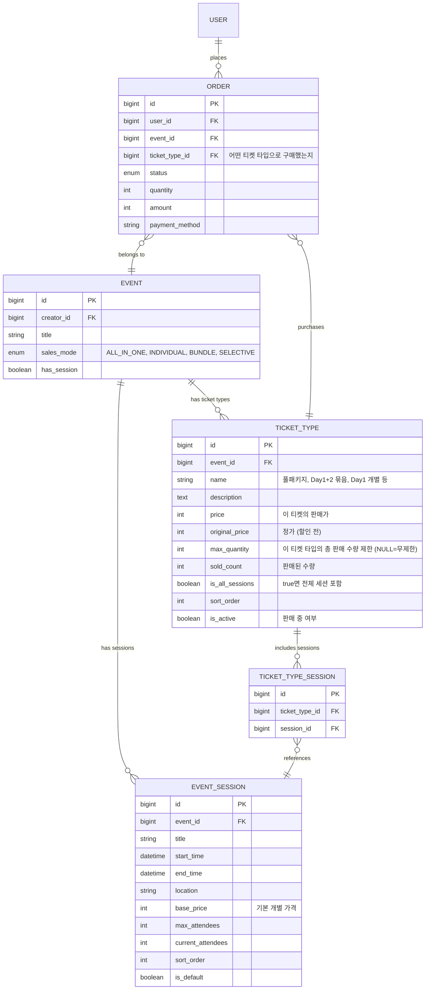
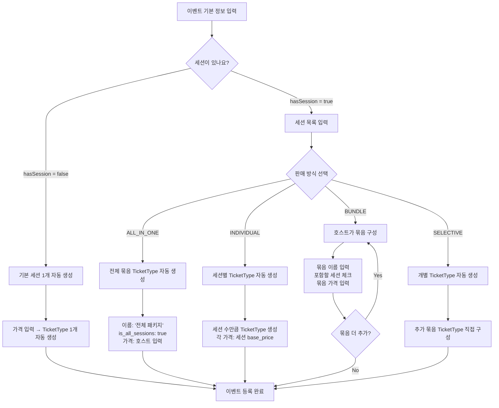
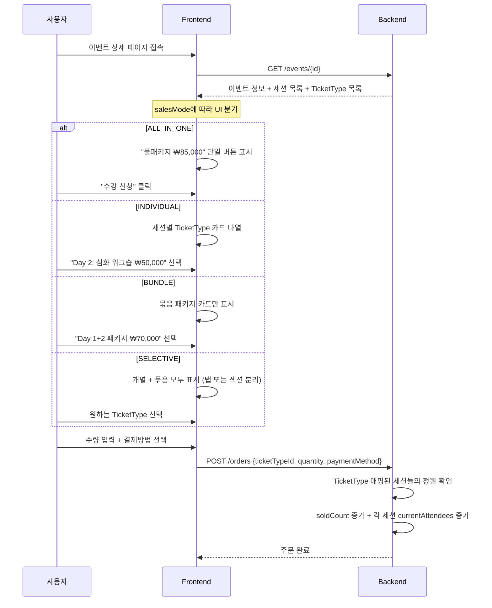
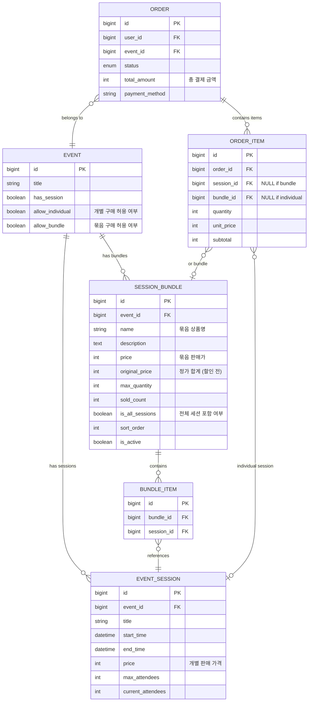
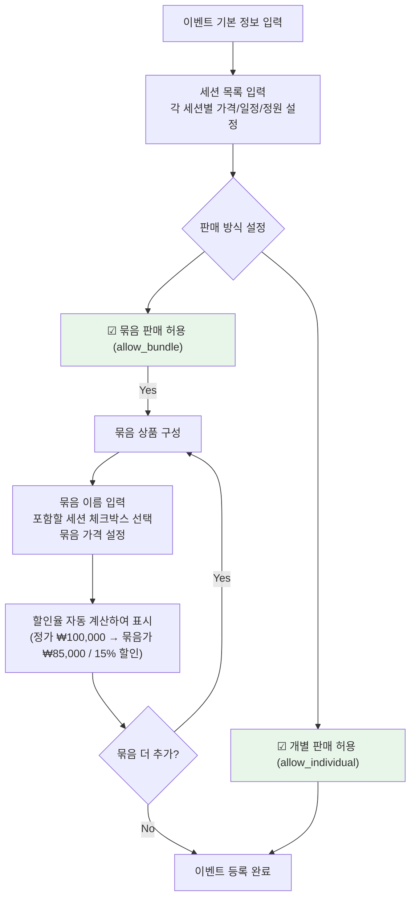
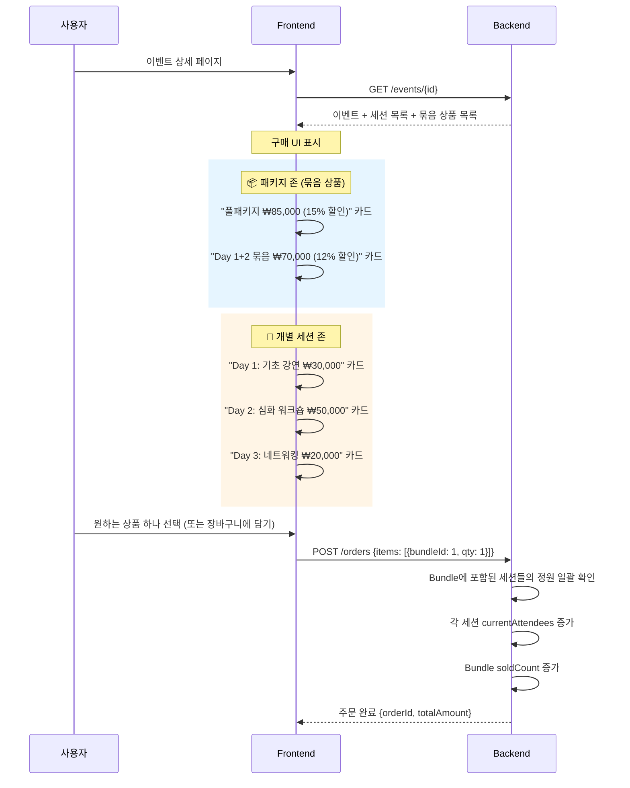
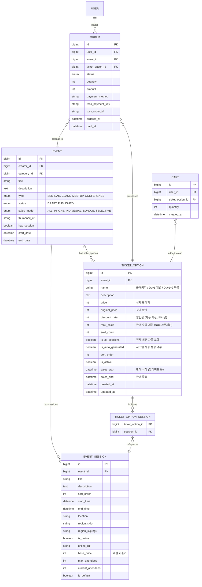
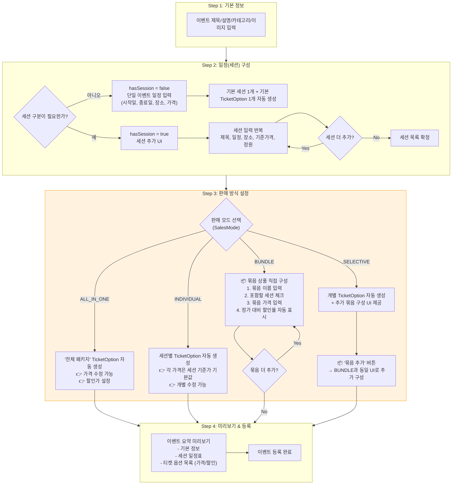
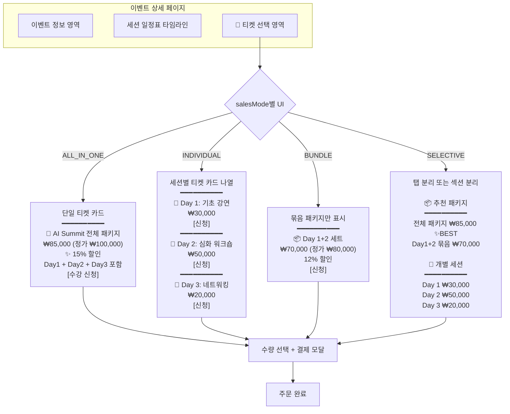

# 🎫 VenueOn 세션 판매 전략 설계서

> **작성일:** 2026-04-09  
> **기반:** 현재 코드 분석 (Event, EventSession, Order, Cart, PurchaseType)  
> **목표:** 세미나 일정(세션)을 다양한 방식으로 판매할 수 있는 DB 구조 + 등록 흐름 설계

---

## 📌 현재 구조 분석

### 현재 코드에 이미 존재하는 것들

| 구조 | 현재 상태 | 비고 |
|------|----------|------|
| `Event` → `EventSession` | ✅ 1:N 관계 | 세션별 독립적 장소/가격/정원 |
| `PurchaseType` | ✅ `SINGLE`, `MULTI` | SINGLE=세션 1개 선택, MULTI=여러 세션 동시 구매 |
| `Order` → `session_id` | ✅ 세션 단위 주문 | FK로 연결됨 |
| `Cart` → `event_session_id` | ✅ 세션 단위 장바구니 | FK로 연결됨 |
| `hasSession` 플래그 | ✅ false이면 기본 세션 1개 자동 생성 | 단일 이벤트 지원 |

### 부족한 점 (현재 지원 불가)

| 시나리오 | 현재 가능 여부 | 문제점 |
|---------|-------------|--------|
| 세션 **개별 판매** | ✅ 가능 | `PurchaseType.SINGLE` → 1개씩 구매 |
| 세션 **복수 선택 판매** | 🟡 부분 가능 | `PurchaseType.MULTI` 존재하나, 묶음 할인/제약 없음 |
| 세션 **전체 통째 판매** | ❌ 불가 | "모든 세션 일괄 구매" 상품 개념이 없음 |
| 세션 **묶음 판매** (Day1+Day2) | ❌ 불가 | 세션 그룹핑 + 묶음 할인 구조가 없음 |
| **할인 가격** 적용 | ❌ 불가 | 묶음 시 할인 로직/필드가 없음 |

---

## 🎯 판매 시나리오 정의

> **예시: 3일짜리 AI 세미나**

```
📅 AI Summit 2026 (이벤트)
├── Day 1: 기초 강연     (₩30,000)
├── Day 2: 심화 워크숍   (₩50,000)
└── Day 3: 네트워킹 데이 (₩20,000)
    합계: ₩100,000
```

호스트가 선택할 수 있는 판매 방식:

| # | 판매 방식 | 설명 | 예시 |
|---|----------|------|------|
| 1 | **통째 판매 (ALL_IN_ONE)** | 전체 세션을 하나의 상품으로 판매 | "3일 풀패키지 ₩85,000" (할인) |
| 2 | **개별 판매 (INDIVIDUAL)** | 각 세션을 독립적으로 판매 | "Day 1만 ₩30,000" |
| 3 | **묶음 판매 (BUNDLE)** | 호스트가 세션을 묶어 패키지 상품 구성 | "Day 1+2 패키지 ₩70,000" |
| 4 | **선택적 판매 (SELECTIVE)** | 개별 + 묶음을 동시에 제공 | "개별도 가능하고, 패키지도 있음" |

---

## 💡 방안 A: TicketType 기반 (세션 직접 판매 확장)

### 핵심 아이디어
> 현재 `PurchaseType`을 확장하고, `TicketType` 엔티티를 추가하여 "이 이벤트의 티켓을 어떤 구성으로 팔 것인가"를 정의한다.

### ERD



### 테이블 상세

#### `TICKET_TYPE` (신규)

```sql
CREATE TABLE ticket_types (
    id              BIGSERIAL PRIMARY KEY,
    event_id        BIGINT NOT NULL REFERENCES events(id),
    name            VARCHAR(100) NOT NULL,         -- "풀패키지", "Day 1 개별", "Day 1+2 묶음"
    description     TEXT,
    price           INT NOT NULL DEFAULT 0,        -- 실제 판매가
    original_price  INT NOT NULL DEFAULT 0,        -- 정가 (할인 표시용)
    max_quantity    INT,                           -- NULL이면 무제한
    sold_count      INT NOT NULL DEFAULT 0,
    is_all_sessions BOOLEAN NOT NULL DEFAULT false, -- true면 전체 세션 자동 포함
    sort_order      INT NOT NULL DEFAULT 0,
    is_active       BOOLEAN NOT NULL DEFAULT true,
    created_at      TIMESTAMP NOT NULL DEFAULT now(),
    updated_at      TIMESTAMP
);
```

#### `TICKET_TYPE_SESSION` (신규 — 매핑 테이블)

```sql
CREATE TABLE ticket_type_sessions (
    id             BIGSERIAL PRIMARY KEY,
    ticket_type_id BIGINT NOT NULL REFERENCES ticket_types(id) ON DELETE CASCADE,
    session_id     BIGINT NOT NULL REFERENCES event_sessions(id) ON DELETE CASCADE,
    UNIQUE(ticket_type_id, session_id)
);
```

### `SalesMode` Enum (PurchaseType 대체)

```java
public enum SalesMode {
    ALL_IN_ONE,   // 통째 판매: TicketType 1개 (is_all_sessions=true)
    INDIVIDUAL,   // 개별 판매: 세션 수만큼 TicketType 자동 생성
    BUNDLE,       // 묶음 판매: 호스트가 직접 TicketType 구성
    SELECTIVE     // 선택적 판매: 개별 TicketType + 묶음 TicketType 동시 제공
}
```

### 이벤트 등록 흐름



### 구매 흐름



### 장단점

| 항목 | 평가 |
|------|------|
| ✅ 유연성 | `TicketType`으로 어떤 조합이든 자유롭게 구성 가능 |
| ✅ 확장성 | 얼리버드, VIP, 학생 할인 등 티켓 종류 추가도 자연스러움 |
| ✅ 직관성 | "어떤 티켓을 샀는가"가 Order에 명확히 기록 |
| ⚠️ 복잡도 | 테이블 2개 추가 (ticket_types, ticket_type_sessions) |
| ⚠️ 정원 관리 | 묶음 티켓 구매 시 포함된 모든 세션의 정원을 동시에 관리해야 함 |
| ⚠️ 현재 코드 변경 | `PurchaseType` → `SalesMode` 교체, Order 구조 변경 필요 |

### 현재 코드 변경 범위

```diff
 # Event 도메인
- private PurchaseType purchaseType;
+ private SalesMode salesMode;

 # Order 도메인
- private Long sessionId;
+ private Long ticketTypeId;

 # 신규 도메인
+ TicketType.java
+ TicketTypeSession.java (또는 List<Long> sessionIds)

 # 신규 JPA Entity
+ TicketTypeJpaEntity.java
+ TicketTypeSessionJpaEntity.java

 # Cart 변경
- private Long sessionId;
+ private Long ticketTypeId;
```

---

## 💡 방안 B: Bundle 엔티티 기반 (묶음 상품 전용)

### 핵심 아이디어
> 세션은 **항상 개별 판매 가능**하되, 호스트가 선택적으로 **묶음 상품(Bundle)**을 추가 등록한다. 구매자는 세션 개별 구매 또는 Bundle 구매 중 선택한다.

### ERD



### 테이블 상세

#### `SESSION_BUNDLE` (신규)

```sql
CREATE TABLE session_bundles (
    id              BIGSERIAL PRIMARY KEY,
    event_id        BIGINT NOT NULL REFERENCES events(id),
    name            VARCHAR(100) NOT NULL,
    description     TEXT,
    price           INT NOT NULL DEFAULT 0,
    original_price  INT NOT NULL DEFAULT 0,
    max_quantity    INT,
    sold_count      INT NOT NULL DEFAULT 0,
    is_all_sessions BOOLEAN NOT NULL DEFAULT false,
    sort_order      INT NOT NULL DEFAULT 0,
    is_active       BOOLEAN NOT NULL DEFAULT true,
    created_at      TIMESTAMP NOT NULL DEFAULT now(),
    updated_at      TIMESTAMP
);
```

#### `BUNDLE_ITEM` (신규 — 매핑 테이블)

```sql
CREATE TABLE bundle_items (
    id         BIGSERIAL PRIMARY KEY,
    bundle_id  BIGINT NOT NULL REFERENCES session_bundles(id) ON DELETE CASCADE,
    session_id BIGINT NOT NULL REFERENCES event_sessions(id) ON DELETE CASCADE,
    UNIQUE(bundle_id, session_id)
);
```

#### `ORDER_ITEM` (신규 — 주문 상세 항목)

```sql
CREATE TABLE order_items (
    id         BIGSERIAL PRIMARY KEY,
    order_id   BIGINT NOT NULL REFERENCES orders(id) ON DELETE CASCADE,
    session_id BIGINT REFERENCES event_sessions(id),  -- 개별 세션 구매 시
    bundle_id  BIGINT REFERENCES session_bundles(id),  -- 묶음 구매 시
    quantity   INT NOT NULL DEFAULT 1,
    unit_price INT NOT NULL DEFAULT 0,
    subtotal   INT NOT NULL DEFAULT 0,
    CONSTRAINT chk_item_type CHECK (
        (session_id IS NOT NULL AND bundle_id IS NULL) OR
        (session_id IS NULL AND bundle_id IS NOT NULL)
    )
);
```

### 이벤트 등록 흐름



### 구매 흐름



### 장단점

| 항목 | 평가 |
|------|------|
| ✅ 개념 분리 | "세션"과 "판매 상품(Bundle)"의 관심사가 명확히 분리 |
| ✅ 유연한 조합 | 개별 판매와 묶음 판매를 동시에 허용/비허용 가능 |
| ✅ 주문 내역 상세 | `OrderItem`으로 "무엇을 몇 개 샀는지" 상세 기록 |
| ⚠️ 테이블 3개 추가 | session_bundles, bundle_items, order_items |
| ⚠️ 복잡한 정원 관리 | 개별 구매 + 묶음 구매가 동시에 같은 세션의 정원에 영향 |
| ⚠️ 통째 판매만 할 때 과도 | ALL_IN_ONE만 필요한 케이스에 Bundle 구조가 부담 |

### 현재 코드 변경 범위

```diff
 # Event 도메인
- private PurchaseType purchaseType;
+ private boolean allowIndividual;
+ private boolean allowBundle;

 # Order 도메인 (기존 유지 + 확장)
- private Long sessionId;  // 제거
+ private int totalAmount;  // 합산

 # 신규 도메인
+ SessionBundle.java
+ BundleItem.java (또는 List<Long> sessionIds)
+ OrderItem.java

 # 신규 JPA Entity
+ SessionBundleJpaEntity.java
+ BundleItemJpaEntity.java
+ OrderItemJpaEntity.java
```

---

## 💡 방안 C: 하이브리드 방안 (TicketType + Smart Default) — ⭐ 권장

### 핵심 아이디어
> 방안 A의 `TicketType` 개념을 채택하되, **호스트의 인지 부하를 최소화**하는 Smart Default 자동 생성 로직을 결합한다. 이름을 "Bundle"이나 "TicketType" 대신 **`TicketOption`** (티켓 옵션)으로 통일하여 호스트와 구매자 모두에게 직관적인 UX를 제공한다.

### 왜 이 방안을 권장하는가

| 비교 항목 | 방안 A | 방안 B | 방안 C (권장) |
|----------|--------|--------|-------------|
| 추가 테이블 수 | 2개 | 3개 | **2개** |
| 개념 모델 | TicketType 중심 | Bundle + OrderItem 분리 | **TicketOption 단일 모델** |
| 현재 코드 변경 | 중간 | 큼 | **중간** |
| 호스트 UX | 수동 구성 필요 | 수동 구성 필요 | **자동 + 커스텀** |
| 구매자 UX | 명확 | 명확 | **명확 + 할인 표시** |
| 확장성 (얼리버드 등) | 높음 | 중간 | **높음** |
| MVP 구현 난이도 | 중 | 상 | **중** |

### ERD



### 테이블 상세 설계

#### `SalesMode` Enum

```java
/**
 * 이벤트의 판매 모드
 * 호스트가 이벤트 등록 시 선택
 */
public enum SalesMode {
    /** 통째 판매: 전체 세션을 하나의 티켓으로 판매 */
    ALL_IN_ONE,
    
    /** 개별 판매: 각 세션을 독립적으로 판매 */
    INDIVIDUAL,
    
    /** 묶음 판매: 호스트가 직접 구성한 묶음 상품만 판매 */
    BUNDLE,
    
    /** 선택적 판매: 개별 + 묶음을 모두 제공 */
    SELECTIVE
}
```

#### `TICKET_OPTION` 테이블

```sql
CREATE TABLE ticket_options (
    id                BIGSERIAL PRIMARY KEY,
    event_id          BIGINT NOT NULL REFERENCES events(id) ON DELETE CASCADE,
    name              VARCHAR(100) NOT NULL,
    description       TEXT,
    price             INT NOT NULL DEFAULT 0,
    original_price    INT NOT NULL DEFAULT 0,
    discount_rate     INT NOT NULL DEFAULT 0,        -- 퍼센트 (자동 계산)
    max_sales         INT,                            -- NULL = 무제한
    sold_count        INT NOT NULL DEFAULT 0,
    is_all_sessions   BOOLEAN NOT NULL DEFAULT false,
    is_auto_generated BOOLEAN NOT NULL DEFAULT false, -- 시스템 자동 생성 여부
    sort_order        INT NOT NULL DEFAULT 0,
    is_active         BOOLEAN NOT NULL DEFAULT true,
    sales_start       TIMESTAMP,                      -- NULL이면 이벤트 공개 즉시
    sales_end         TIMESTAMP,                      -- NULL이면 이벤트 종료까지
    created_at        TIMESTAMP NOT NULL DEFAULT now(),
    updated_at        TIMESTAMP
);
```

#### `TICKET_OPTION_SESSION` 매핑 테이블

```sql
CREATE TABLE ticket_option_sessions (
    ticket_option_id BIGINT NOT NULL REFERENCES ticket_options(id) ON DELETE CASCADE,
    session_id       BIGINT NOT NULL REFERENCES event_sessions(id) ON DELETE CASCADE,
    PRIMARY KEY (ticket_option_id, session_id)
);
```

### Smart Default 자동 생성 로직 (핵심 차별점)

```java
/**
 * SalesMode에 따라 TicketOption을 자동 생성하는 서비스
 * 호스트가 판매 모드를 선택하면, 기본 TicketOption이 자동 생성된다.
 * 호스트는 이후 가격/이름을 수정하거나 추가 TicketOption을 생성할 수 있다.
 */
public class TicketOptionAutoGenerator {

    /**
     * ALL_IN_ONE: "전체 패키지" 1개 자동 생성
     */
    public TicketOption generateAllInOne(Event event, List<EventSession> sessions) {
        int totalPrice = sessions.stream()
                .mapToInt(EventSession::getBasePrice)
                .sum();

        return TicketOption.builder()
                .eventId(event.getId())
                .name(event.getTitle() + " 전체 패키지")
                .price(totalPrice)                    // 호스트가 나중에 할인가로 수정 가능
                .originalPrice(totalPrice)
                .isAllSessions(true)
                .isAutoGenerated(true)
                .sortOrder(0)
                .build();
    }

    /**
     * INDIVIDUAL: 세션 수만큼 개별 TicketOption 자동 생성
     */
    public List<TicketOption> generateIndividuals(Event event, List<EventSession> sessions) {
        return sessions.stream()
                .map(session -> TicketOption.builder()
                        .eventId(event.getId())
                        .name(session.getTitle())
                        .price(session.getBasePrice())
                        .originalPrice(session.getBasePrice())
                        .isAllSessions(false)
                        .isAutoGenerated(true)
                        .sortOrder(session.getSortOrder())
                        .sessionIds(List.of(session.getId()))
                        .build())
                .toList();
    }

    /**
     * SELECTIVE: 개별 TicketOption + 전체 패키지 자동 생성
     * 호스트가 추가로 묶음 TicketOption을 직접 구성 가능
     */
    public List<TicketOption> generateSelective(Event event, List<EventSession> sessions) {
        List<TicketOption> options = new ArrayList<>();
        
        // 1. 전체 패키지 (할인가 제안)
        options.add(generateAllInOne(event, sessions));
        
        // 2. 개별 세션들
        options.addAll(generateIndividuals(event, sessions));
        
        return options;
    }

    /**
     * BUNDLE: 호스트가 직접 구성 (자동 생성 없음)
     */
    // → 호스트 UI에서 직접 TicketOption 생성
}
```

### 이벤트 등록 전체 흐름



### 구매 흐름 (프론트엔드 UX)



### 정원 관리 로직 (핵심 비즈니스 규칙)

> [!IMPORTANT]
> 묶음 티켓과 개별 티켓이 동시에 같은 세션의 정원에 영향을 미치므로, **세션 단위 정원 관리**가 핵심입니다.

```java
/**
 * 주문 생성 시 정원 확인 + 차감 로직
 */
@Transactional
public Order createOrder(Long userId, Long ticketOptionId, int quantity) {
    TicketOption option = ticketOptionPort.findById(ticketOptionId);
    
    // 1. TicketOption 자체 판매 수량 확인
    if (option.getMaxSales() != null && 
        option.getSoldCount() + quantity > option.getMaxSales()) {
        throw new SoldOutException("해당 티켓이 매진되었습니다.");
    }
    
    // 2. 포함된 모든 세션의 정원 확인 (핵심!)
    List<EventSession> sessions;
    if (option.getIsAllSessions()) {
        sessions = sessionPort.findAllByEventId(option.getEventId());
    } else {
        sessions = sessionPort.findByIds(option.getSessionIds());
    }
    
    for (EventSession session : sessions) {
        if (!session.hasCapacity(quantity)) {
            throw new CapacityExceededException(
                String.format("'%s' 세션의 정원이 부족합니다. (잔여: %d)",
                    session.getTitle(),
                    session.getMaxAttendees() - session.getCurrentAttendees())
            );
        }
    }
    
    // 3. 정원 차감 + 판매 수량 증가
    for (EventSession session : sessions) {
        session.incrementAttendees(quantity);
        sessionPort.save(session);
    }
    option.incrementSoldCount(quantity);
    ticketOptionPort.save(option);
    
    // 4. 주문 생성
    int totalAmount = option.getPrice() * quantity;
    return Order.createPending(userId, option.getEventId(), ticketOptionId, quantity, totalAmount, null);
}
```

### 현재 코드 변경 범위 요약

```diff
 # ===== 변경되는 파일 =====
 
 # 1. Event 도메인
  Event.java
- private PurchaseType purchaseType;
+ private SalesMode salesMode;
 
  EventJpaEntity.java
- private PurchaseType purchaseType;
+ private SalesMode salesMode;

 # 2. EventSession 도메인 (필드명만 변경)
  EventSession.java
- private int price;
+ private int basePrice;  // "기준가"로 명칭 변경 (판매가는 TicketOption에)

 # 3. Order 도메인
  Order.java
- private Long sessionId;
+ private Long ticketOptionId;

  OrderJpaEntity.java
- private EventSessionJpaEntity session;
+ private TicketOptionJpaEntity ticketOption;

 # 4. Cart 도메인
  Cart.java / CartJpaEntity.java
- private Long sessionId;
+ private Long ticketOptionId;

 # 5. PurchaseType → SalesMode 대체
- PurchaseType.java (삭제)
+ SalesMode.java (신규)
 
 # ===== 신규 파일 =====
 
 # 도메인
+ TicketOption.java          (도메인 모델)
+ TicketOptionSession.java   (도메인 모델 — 매핑용, 또는 List<Long>으로 대체)
 
 # JPA Entity
+ TicketOptionJpaEntity.java
+ TicketOptionSessionJpaEntity.java (또는 @ElementCollection)
 
 # Application Layer
+ CreateTicketOptionUseCase.java
+ GetTicketOptionUseCase.java
+ UpdateTicketOptionUseCase.java
+ DeleteTicketOptionUseCase.java
+ TicketOptionAutoGenerator.java   (Smart Default 생성 서비스)
 
 # Adapter Layer
+ TicketOptionPersistenceAdapter.java
+ TicketOptionJpaRepository.java
+ TicketOptionMapper.java
 
 # Controller (Host 전용)
+ HostTicketOptionController.java  (POST/PUT/DELETE ticket options)
 
 # DTO
+ TicketOptionCreateRequest.java
+ TicketOptionUpdateRequest.java
+ TicketOptionResponse.java
```

---

## 📊 3개 방안 최종 비교

| 비교 항목 | 방안 A (TicketType) | 방안 B (Bundle) | 방안 C (하이브리드) ⭐ |
|----------|-------|---------|-----------|
| **추가 테이블** | 2개 | 3개 | 2개 |
| **핵심 개념** | TicketType = 판매 단위 | Bundle = 묶음 상품 | TicketOption = 판매 옵션 |
| **호스트 UX** | 모든 것을 수동 구성 | 묶음만 수동, 개별은 세션 직접 | 자동 생성 + 필요 시 커스텀 |
| **Auto-generation** | ❌ 없음 | ❌ 없음 | ✅ SalesMode별 자동 생성 |
| **할인 표시** | 가능 (original_price) | 가능 | 가능 + **할인율 자동 계산** |
| **얼리버드/기간 한정** | ❌ 별도 구현 필요 | ❌ 별도 구현 필요 | ✅ sales_start/end 내장 |
| **정원 관리** | 세션별 관리 | 세션별 관리 | 세션별 관리 |
| **Order 구조** | ticket_type_id FK | order_items 테이블 | ticket_option_id FK |
| **구현 난이도** | ★★★ 중 | ★★★★ 상 | ★★★ 중 |
| **확장성** | 높음 | 높음 | **매우 높음** |

---

## 🚀 권장 구현 순서 (방안 C 기준)

### Phase 1: MVP 핵심 (1주차)

1. `SalesMode` enum 생성, `PurchaseType` 대체
2. `TicketOption` + `TicketOptionSession` 도메인/JPA 구현
3. `TicketOptionAutoGenerator` — ALL_IN_ONE, INDIVIDUAL 자동 생성
4. `Order`에서 `sessionId` → `ticketOptionId` 마이그레이션
5. `Cart`에서 `sessionId` → `ticketOptionId` 마이그레이션

### Phase 2: 묶음 판매 (2주차)

6. BUNDLE 모드: 호스트 UI에서 TicketOption 직접 구성
7. SELECTIVE 모드: 자동 생성 + 추가 묶음 구성 UI
8. 구매 페이지: salesMode별 UI 분기 렌더링
9. 정원 관리 로직 고도화 (동시성 처리)

### Phase 3: 고급 기능 (3주차 이후)

10. 얼리버드 할인 (sales_start/end 활용)
11. 수량 한정 티켓 (max_sales)
12. 할인 코드/프로모션 연동
13. 대기열(Waitlist) 기능

---

> [!TIP]
> **MVP 전략**: Phase 1의 `ALL_IN_ONE`과 `INDIVIDUAL`만으로도 대부분의 세미나/강의 시나리오를 커버할 수 있습니다. BUNDLE과 SELECTIVE는 실제 호스트 피드백을 받은 후 구현해도 충분합니다.

> [!NOTE]
> **정원 관리 주의점**: 묶음 티켓과 개별 티켓이 같은 세션 정원을 공유하므로, 동시성 이슈를 고려해야 합니다. MVP에서는 `@Transactional` + 비관적 락(Pessimistic Lock)으로 처리하고, 향후 트래픽이 증가하면 Redis 기반 재고 관리로 전환할 수 있습니다.
