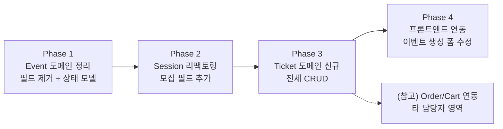
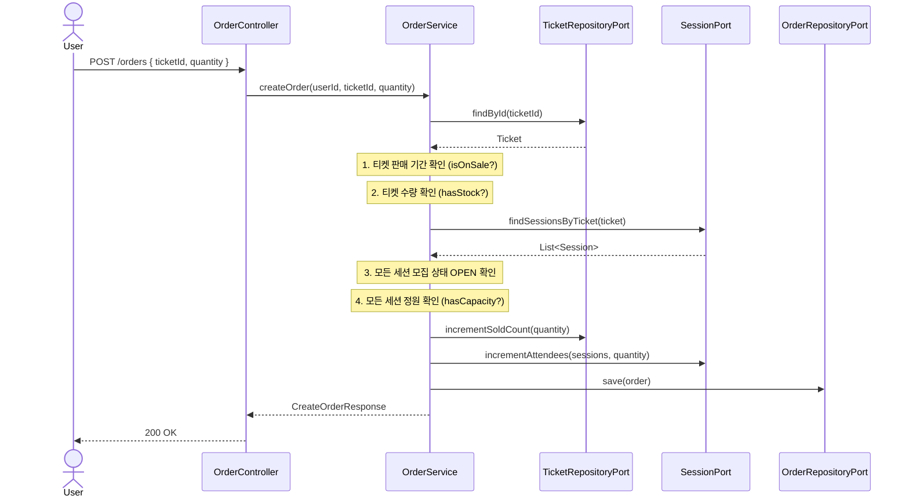
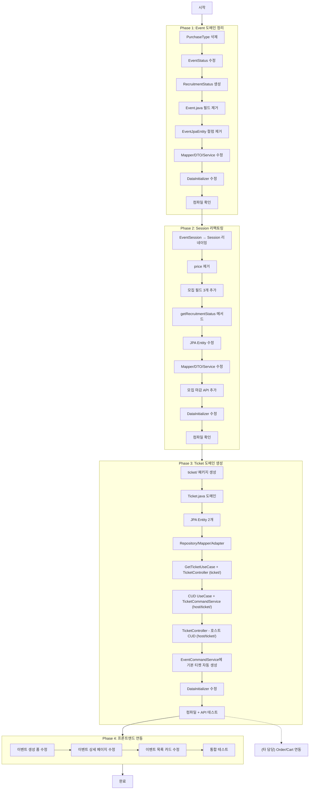

# 🔧 이벤트/세션/티켓 CRUD 구현 워크플로우

> **작성일:** 2026-04-10  
> **최종 수정:** 2026-04-11 (Phase 1~3 완료 반영)  
> **기반 설계:** `티켓_중심_설계서.md`, `이벤트_상태관리_설계서.md`, `아키텍처_v6`, `ERD_v6`, `API_스펙_v6`  
> **목표:** 현재 코드 → v6 아키텍처로 전환 (이벤트/세션/티켓 CRUD + 상태 관리)

---

## 📌 현재 코드 상태 분석

### 현재 존재하는 것

| 파일 | 현재 상태 |
|------|----------|
| `Event.java` (domain) | price, maxAttendees, location, startDate, endDate, purchaseType 포함 |
| `EventSession.java` (domain) | price, maxAttendees, location, region 포함 |
| `EventJpaEntity.java` | price, maxAttendees, location, startDate, endDate, purchaseType 컬럼 |
| `EventSessionJpaEntity.java` | price 컬럼 포함, 모집 필드 없음 |
| `PurchaseType.java` | SINGLE, MULTI enum |
| `OrderJpaEntity.java` | session_id FK 참조 |
| `CartJpaEntity.java` | event_id FK 참조 |
| `CreateOrderRequest.java` | eventId, sessionId 필드 |

### v6으로 변경해야 할 것

| 변경 대상 | 변경 내용 |
|-----------|----------|
| `Event` | ⛔ price, maxAttendees, location, startDate, endDate, purchaseType **제거** |
| `EventSession` → `Session` | ⛔ price 제거, ✅ 모집 필드 3개 추가 |
| `PurchaseType.java` | ⛔ **삭제** |
| `RecruitmentStatus.java` | 🆕 **생성** |
| `Ticket` 도메인 | 🆕 **전체 신규** (ticket 모듈) |
| `Order` | 🔄 session_id → ticket_id |
| `Cart` | 🔄 event_id → ticket_id |

---

## 📌 구현 페이즈 개요



---

## Phase 1. Event 도메인 정리 (필드 제거 + 상태 모델)

### 1-1. `PurchaseType.java` 삭제

```
삭제: event/domain/model/PurchaseType.java
```

### 1-2. `EventStatus.java` 수정

```diff
 public enum EventStatus {
-    DRAFT, PUBLISHED, PREPARING, ONGOING, ENDED, CANCELLED
+    DRAFT, PUBLISHED, ENDED, CANCELLED
+    // ONGOING은 DB에 저장하지 않음 — 세션 기반 Computed
 }
```

### 1-3. `RecruitmentStatus.java` 생성

```
신규: event/domain/model/RecruitmentStatus.java
```

```java
public enum RecruitmentStatus {
    PENDING,  // 모집 대기
    OPEN,     // 모집중
    CLOSED    // 마감
}
```

### 1-4. `Event.java` 도메인 수정

**제거할 필드:**
- `location`, `isOnline` → 세션으로 이동 완료 (세션에 이미 존재)
- `price`, `maxAttendees` → 세션/티켓으로 이동
- `startDate`, `endDate` → 세션에서 도출
- `purchaseType` → 삭제

**유지할 필드:**
- `id`, `creatorId`, `categoryId`, `title`, `description`, `type`, `status`, `thumbnailUrl`, `hasSession`, `isHidden`, `createdAt`, `updatedAt`

**추가할 메서드:**
- `getEffectiveStatus(List<Session> sessions)` → ONGOING 계산
- `getRecruitmentStatus(List<Session> sessions)` → OR 종합
- `getStartDate(List<Session> sessions)` → min(startTime)
- `getEndDate(List<Session> sessions)` → max(endTime)

**수정 범위:**

> `event/` = 공개 조회 (R), `host/event/` = 호스트 CUD (교훈 3 패키지 분리)

| 파일 | 패키지 | 변경 |
|------|--------|------|
| `Event.java` | `event/domain/model/` | 필드 제거, 생성자 수정, Computed 메서드 추가, `validateForPublish()` 추가 |
| `EventJpaEntity.java` | `event/adapter/out/` | price, maxAttendees, location, startDate, endDate, purchaseType, isOnline 컬럼 제거 |
| `EventMapper.java` | `event/adapter/out/` | 매핑 로직 수정 |
| `EventDetailResponse.java` | `event/adapter/in/web/dto/` | 세션/티켓 기반 응답으로 재구성 |
| `EventListResponse.java` | `event/adapter/in/web/dto/` | minPrice, totalCapacity 등 Computed 필드 추가 |
| `CreateEventUseCase.java` | `host/event/application/port/in/` | Command에서 price, maxAttendees 등 제거 |
| `UpdateEventUseCase.java` | `host/event/application/port/in/` | Command 수정 |
| `EventCreateRequest.java` | `host/event/adapter/in/web/dto/` | DTO에서 불필요 필드 제거 |
| `EventUpdateRequest.java` | `host/event/adapter/in/web/dto/` | 위와 동일 |
| `EventCommandService.java` | `host/event/application/service/` | createEvent, updateEvent 로직 수정 |

### 1-5. 스키마 변경 (JPA 자동 처리)

> `spring.jpa.hibernate.ddl-auto=create` 사용 → Entity 수정 후 앱 재시작으로 자동 반영.  
> `DataInitializer.java`에서 제거된 필드(가격, 장소 등) 참조 코드 제거 필요.

**DataInitializer 수정 필요 항목:**
- Event 생성 시 `price`, `maxAttendees`, `location`, `startDate`, `endDate`, `purchaseType` 제거
- 세션에 모집 날짜 추가 (`recruitStartDate`, `recruitEndDate`)

### Phase 1 체크리스트 ✅ 완료 (2026-04-10)

- [x] `PurchaseType.java` 삭제
- [x] `EventStatus.java` 수정 (PREPARING 제거)
- [x] `RecruitmentStatus.java` 생성 (`event/domain/model/`)
- [x] `Event.java` 필드 제거 + Computed 메서드 + `validateForPublish()` 추가
- [x] `EventJpaEntity.java` 컬럼 제거 (`event/adapter/out/`)
- [x] `EventMapper.java` 매핑 수정
- [x] `CreateEventUseCase.java` Command 수정 (`host/event/`)
- [x] `UpdateEventUseCase.java` Command 수정 (`host/event/`)
- [x] `EventCreateRequest.java` DTO 수정 (`host/event/`)
- [x] `EventUpdateRequest.java` DTO 수정 (`host/event/`)
- [x] `EventCommandService.java` 서비스 로직 수정 (`host/event/`)
- [x] `EventDetailResponse.java` 응답 재구성 (`event/`)
- [x] `EventListResponse.java` Computed 필드 추가 (`event/`)
- [x] PurchaseType 참조하는 모든 import 제거
- [x] `DataInitializer.java` 수정 (제거된 필드 참조 제거)
- [x] 컴파일 + 앱 재시작 확인 (JPA ddl-auto로 테이블 자동 재생성)

---

## Phase 2. Session 리팩토링 (모집 필드 추가 + 네이밍)

### 2-1. `EventSession.java` → `Session.java` 리네이밍

> 도메인 모델 클래스명만 변경. 패키지는 `event/domain/model/` 유지.

```
event/domain/model/EventSession.java → event/domain/model/Session.java
```

### 2-2. `Session.java` 변경 사항

**제거:**
- `price` 필드 + getter + updateDetails 파라미터

**추가:**
```java
// 모집 관리 필드
private LocalDateTime recruitStartDate;
private LocalDateTime recruitEndDate;
private boolean isRecruitmentClosed;
```

**추가할 메서드:**
```java
/** 이 세션의 모집 상태 계산 */
public RecruitmentStatus getRecruitmentStatus() {
    if (isRecruitmentClosed) return RecruitmentStatus.CLOSED;
    if (maxAttendees > 0 && currentAttendees >= maxAttendees) return RecruitmentStatus.CLOSED;
    LocalDateTime now = LocalDateTime.now();
    if (recruitStartDate != null && now.isBefore(recruitStartDate)) return RecruitmentStatus.PENDING;
    if (recruitEndDate != null && now.isAfter(recruitEndDate)) return RecruitmentStatus.CLOSED;
    return RecruitmentStatus.OPEN;
}

/** 이 세션의 진행 상태 계산 */
public EventStatus getSessionStatus() {
    LocalDateTime now = LocalDateTime.now();
    if (startTime != null && endTime != null) {
        if (now.isBefore(startTime)) return EventStatus.PUBLISHED;
        if (now.isAfter(endTime)) return EventStatus.ENDED;
        return EventStatus.ONGOING;
    }
    return EventStatus.PUBLISHED;
}

/** 수동 마감/재개 */
public void closeRecruitment() { this.isRecruitmentClosed = true; }
public void openRecruitment() { this.isRecruitmentClosed = false; }
```

### 2-3. JPA Entity 수정

```
EventSessionJpaEntity.java → SessionJpaEntity.java (클래스명만 변경)
테이블명 @Table(name = "event_sessions") 유지
```

**변경:**
- `price` 컬럼 제거
- `recruit_start_date`, `recruit_end_date`, `is_recruitment_closed` 컬럼 추가

### 2-4. 관련 파일 전체 리네이밍 + 수정

| 현재 파일 | 변경 후 |
|-----------|---------|
| `EventSession.java` | `Session.java` |
| `EventSessionJpaEntity.java` | `SessionJpaEntity.java` |
| `EventSessionMapper.java` | `SessionMapper.java` |
| `EventSessionPersistenceAdapter.java` | `SessionPersistenceAdapter.java` |
| `EventSessionJpaRepository.java` | `SessionJpaRepository.java` |
| `SessionCreateRequest.java` | DTO에 regionSido, regionSigungu, recruitStart/End 추가 |
| `SessionUpdateRequest.java` | 위와 동일 |
| `SessionResponse.java` | recruitmentStatus, sessionStatus 추가 |
| `CreateSessionUseCase.java` | Command에서 price 제거, recruit 필드 추가 |
| `EventSessionService.java` | `SessionService.java` (또는 유지) |

### 2-5. 스키마 변경 (JPA 자동 처리)

> Entity 수정 후 앱 재시작으로 자동 반영.  
> `DataInitializer.java`에서 세션 생성 시 `price` 제거, `recruitStartDate/EndDate` 추가 필요.

### Phase 2 체크리스트 ✅ 완료 (2026-04-10)

- [x] `EventSession.java` → `Session.java` 리네이밍
- [x] `Session.java`에서 price 제거, 모집 필드 3개 추가
- [x] `Session.java`에 getRecruitmentStatus(), getSessionStatus() 추가
- [x] `EventSessionJpaEntity.java` → `SessionJpaEntity.java` 리네이밍
- [x] JPA Entity에서 price 컬럼 제거, 모집 컬럼 3개 추가
- [x] Mapper/Adapter/Repository 리네이밍
- [x] DTO (CreateRequest, UpdateRequest, Response) 수정
- [x] UseCase/Service 수정
- [x] `host/event/` SessionController에 모집 마감/재개 API 추가
- [x] 기존 EventSession 참조하는 모든 파일 import 수정
- [x] `DataInitializer.java` 수정 (세션 시드 데이터 업데이트)
- [x] 컴파일 + 앱 재시작 확인

> [!NOTE]
> **Phase 2 부수 작업 — 타 모듈 컴파일 에러 최소 수정**  
> Event/Session 필드 제거로 인해 Cart, Order, Wishlist, HostEvent 모듈에서 컴파일 에러가 발생하여  
> **import 변경 + 플레이스홀더 값 대입**만 수행함. Order/Cart의 근본적인 FK 전환(`session_id → ticket_id`,  
> `event_id → ticket_id`)은 Phase 4(타 담당자 영역)에서 진행 예정.  
> 수정된 파일: `CartJpaEntity`, `CartMapper`, `CartPersistenceAdapter`, `CartService`,  
> `OrderJpaEntity`, `OrderPersistenceAdapter`, `OrderService`, `MyOrderResponse`,  
> `WishlistResponse`, `EventInfoAdapter`, `HostEventMapper`, `DevDataController`

---

## Phase 3. Ticket 도메인 신규 생성

### 3-1. 전체 생성 파일 목록

> `ticket/` = 공개 조회 + 도메인/JPA, `host/ticket/` = 호스트 CUD (교훈 3 패키지 분리)

```
com.venueon.ticket/                      ← 공개 조회 (R) + 도메인/JPA
├── domain/model/
│   └── Ticket.java
├── application/
│   ├── port/in/
│   │   └── GetTicketUseCase.java
│   ├── port/out/
│   │   └── TicketRepositoryPort.java
│   └── service/
│       └── TicketQueryService.java
├── adapter/
│   ├── in/web/
│   │   ├── TicketController.java        ← GET /events/{id}/tickets
│   │   └── dto/response/
│   │       └── TicketResponse.java
│   └── out/persistence/
│       ├── entity/
│       │   ├── TicketJpaEntity.java
│       │   └── TicketSessionJpaEntity.java
│       ├── repository/
│       │   ├── TicketJpaRepository.java
│       │   └── TicketSessionJpaRepository.java
│       ├── TicketPersistenceAdapter.java
│       └── TicketMapper.java

com.venueon.host.ticket/                 ← 호스트 CUD
├── application/
│   ├── port/in/
│   │   ├── CreateTicketUseCase.java
│   │   ├── UpdateTicketUseCase.java
│   │   └── DeleteTicketUseCase.java
│   └── service/
│       └── TicketCommandService.java
├── adapter/
│   └── in/web/
│       ├── TicketController.java        ← POST/PUT/DELETE /host/events/{id}/tickets
│       └── dto/request/
│           ├── TicketCreateRequest.java
│           └── TicketUpdateRequest.java
```

### 3-2. `Ticket.java` 도메인 모델

```java
public class Ticket {
    private Long id;
    private Long eventId;
    private String name;          // "전체 패키지", "Day 1 입장권"
    private String description;
    private int price;            // 실제 판매가
    private int originalPrice;    // 정가 (할인 전)
    private Integer maxQuantity;  // NULL = 무제한
    private int soldCount;
    private boolean isAllSessions;
    private int sortOrder;
    private boolean isActive;
    private LocalDateTime salesStart;
    private LocalDateTime salesEnd;
    private List<Long> sessionIds; // 매핑된 세션 ID 목록
    private LocalDateTime createdAt;
    private LocalDateTime updatedAt;

    // 비즈니스 메서드
    public boolean isOnSale();           // 판매 기간 내 + isActive
    public boolean hasStock(int qty);    // maxQuantity 확인
    public int getDiscountRate();        // (original - price) / original * 100
    public Integer getRemainingQuantity(); // maxQuantity - soldCount or null
    public void incrementSoldCount(int qty);
    public void decrementSoldCount(int qty);
}
```

### 3-3. `TicketJpaEntity.java`

```java
@Entity
@Table(name = "tickets")
public class TicketJpaEntity {
    @Id @GeneratedValue(strategy = GenerationType.IDENTITY)
    private Long id;

    @ManyToOne(fetch = FetchType.LAZY)
    @JoinColumn(name = "event_id", nullable = false)
    private EventJpaEntity event;

    private String name;
    private String description;
    private int price;
    private int originalPrice;
    private Integer maxQuantity;  // nullable
    private int soldCount;
    private boolean isAllSessions;
    private int sortOrder;
    private boolean isActive;
    private LocalDateTime salesStart;
    private LocalDateTime salesEnd;
    private LocalDateTime createdAt;
    private LocalDateTime updatedAt;
}
```

### 3-4. `TicketSessionJpaEntity.java` (매핑 테이블)

```java
@Entity
@Table(name = "ticket_sessions")
@IdClass(TicketSessionId.class)
public class TicketSessionJpaEntity {
    @Id
    @ManyToOne(fetch = FetchType.LAZY)
    @JoinColumn(name = "ticket_id")
    private TicketJpaEntity ticket;

    @Id
    @ManyToOne(fetch = FetchType.LAZY)
    @JoinColumn(name = "session_id")
    private SessionJpaEntity session;
}
```

### 3-5. API 엔드포인트

| Method | Path | 컨트롤러 패키지 | 설명 |
|--------|------|---------------|------|
| `GET` | `/events/{eventId}/tickets` | `ticket/` TicketController | 이벤트의 티켓 목록 (공개) |
| `POST` | `/host/events/{eventId}/tickets` | `host/ticket/` TicketController | 티켓 생성 |
| `PUT` | `/host/tickets/{ticketId}` | `host/ticket/` TicketController | 티켓 수정 |
| `DELETE` | `/host/tickets/{ticketId}` | `host/ticket/` TicketController | 티켓 삭제 |

### 3-6. TicketCreateRequest

```java
public record TicketCreateRequest(
    @NotBlank String name,
    String description,
    @Min(0) int price,
    @Min(0) int originalPrice,
    Integer maxQuantity,        // null = 무제한
    boolean isAllSessions,
    List<Long> sessionIds,      // isAllSessions=false일 때 필수
    int sortOrder,
    LocalDateTime salesStart,   // null = 즉시
    LocalDateTime salesEnd      // null = 이벤트 종료까지
) {}
```

### 3-7. 비즈니스 로직 핵심

```
티켓 생성 시:
1. eventId로 이벤트 존재 확인
2. 이벤트 소유자 확인
3. isAllSessions=false면 sessionIds 필수 검증
4. sessionIds가 해당 이벤트의 세션인지 확인
5. 저장 → ticket_sessions 매핑 저장

티켓 삭제 시:
1. soldCount > 0이면 삭제 불가 (422)
2. 활성 주문 존재 시 삭제 불가
```

### 3-8. 이벤트 생성 시 기본 티켓 자동 생성

```
hasSession=false (단일 이벤트):
  → 기본 세션 1개 자동 생성 (기존 로직 유지)
  → 기본 티켓 1개 자동 생성 (isAllSessions=true, 호스트 입력 가격)

hasSession=true (다중 세션):
  → 호스트가 세션 직접 구성
  → 호스트가 티켓 직접 구성 (프론트에서 Step 4)
```

### 3-9. 스키마 생성 (JPA 자동 처리)

> `TicketJpaEntity`, `TicketSessionJpaEntity` 작성 후 앱 재시작으로 `tickets`, `ticket_sessions` 테이블 자동 생성.  
> `DataInitializer.java`에 티켓 시드 데이터 추가 필요.

**참고: 테이블 구조 (JPA Entity에서 자동 생성됨)**
```sql
-- tickets: id, event_id, name, description, price, original_price,
--          max_quantity, sold_count, is_all_sessions, sort_order,
--          is_active, sales_start, sales_end, created_at, updated_at

-- ticket_sessions: ticket_id, session_id (composite PK)
```

### Phase 3 체크리스트 ✅ 완료 (2026-04-11)

**`ticket/` 패키지 (공개 조회 + 도메인/JPA):**
- [x] `Ticket.java` 도메인 모델 (isOnSale, hasStock, getDiscountRate 등 비즈니스 메서드 포함)
- [x] `TicketJpaEntity.java` + `TicketSessionJpaEntity.java` + `TicketSessionId.java`
- [x] `TicketJpaRepository.java` + `TicketSessionJpaRepository.java`
- [x] `TicketMapper.java` + `TicketPersistenceAdapter.java`
- [x] `TicketRepositoryPort.java` (port/out)
- [x] `GetTicketUseCase.java` + `TicketQueryService.java`
- [x] `TicketController.java` (공개 조회: `GET /events/{eventId}/tickets`)
- [x] `TicketResponse.java` (discountRate, remainingQuantity, isOnSale 등 computed 필드 포함)

**`host/ticket/` 패키지 (호스트 CUD):**
- [x] `CreateTicketUseCase.java`, `UpdateTicketUseCase.java`, `DeleteTicketUseCase.java`
- [x] `TicketCommandService.java` (소유자 검증, 세션 매핑 검증, 판매 수량 검증 포함)
- [x] `HostTicketController.java` (호스트 CUD: `POST/PUT/DELETE`)
- [x] `TicketCreateRequest.java`, `TicketUpdateRequest.java`

**공통:**
- [ ] 이벤트 생성 시 기본 티켓 자동 생성 로직 (`host/event/` EventCommandService) — 미구현, Phase 5(프론트 연동) 시 추가 예정
- [x] `DataInitializer.java`에 티켓 시드 데이터 추가 (기본 티켓 10개 + 개별 세션 티켓 5개 = 총 15개)
- [x] 컴파일 + 앱 재시작 + API 테스트 (`GET /events/1/tickets`, `GET /events/10/tickets` 검증 완료)

> [!NOTE]
> **할인 구조:** 별도의 할인율 CRUD 없음. 티켓의 `price`(판매가)와 `originalPrice`(정가) 차이로
> `discountRate`가 조회 시 자동 계산됨. 호스트가 티켓 생성/수정 시 두 가격을 직접 입력하는 방식.

---

## Phase 4. Order / Cart 연동 (ticketId 참조 전환)

### 4-1. OrderJpaEntity 수정

```diff
  @ManyToOne(fetch = FetchType.LAZY)
- @JoinColumn(name = "session_id")
- private EventSessionJpaEntity session;
+ @JoinColumn(name = "ticket_id")
+ private TicketJpaEntity ticket;
```

### 4-2. CartJpaEntity 수정

```diff
  @ManyToOne(fetch = FetchType.LAZY)
- @JoinColumn(name = "event_id", nullable = false)
- private EventJpaEntity event;
+ @JoinColumn(name = "ticket_id", nullable = false)
+ private TicketJpaEntity ticket;
```

### 4-3. CreateOrderRequest 수정

```diff
- @NotNull private Long eventId;
- private Long sessionId;
+ @NotNull private Long ticketId;
```

### 4-4. OrderService 주문 생성 로직 변경

```
기존: eventId → 이벤트 검증 → session 정원 확인 → 주문 생성
변경: ticketId → 티켓 검증 → 판매 기간/수량 확인 
                → 포함된 모든 세션 정원 확인 (핵심!)
                → 모집 상태 OPEN 확인
                → soldCount + currentAttendees 증가
                → 주문 생성
```

### 4-5. 주문 생성 상세 플로우



### 4-6. 스키마 변경 (JPA 자동 처리)

> Entity FK 수정 후 앱 재시작으로 자동 반영.  
> `DataInitializer.java`에서 Order/Cart 생성 시 `ticketId` 참조로 변경 필요.

### Phase 4 체크리스트

- [ ] `OrderJpaEntity.java` — session → ticket 참조 변경
- [ ] `CartJpaEntity.java` — event → ticket 참조 변경
- [ ] `CreateOrderRequest.java` — eventId/sessionId → ticketId
- [ ] `Order.java` 도메인 모델 업데이트
- [ ] `Cart.java` 도메인 모델 업데이트
- [ ] `OrderService.java` — 주문 생성 로직 변경 (티켓 → 세션 정원 확인)
- [ ] `CartService.java` — 장바구니 추가 로직 변경
- [ ] `LoadEventInfoPort.java` (cart) — ticketId 기반으로 변경
- [ ] `EventInfoAdapter.java` (cart) — 어댑터 수정
- [ ] `DataInitializer.java` 수정 (Order/Cart 시드 데이터 업데이트)
- [ ] 컴파일 + 앱 재시작 + E2E 테스트

---

## Phase 5. 프론트엔드 연동

### 5-1. 이벤트 생성 폼 (Step 구조 변경)

```
Step 1 — 기본 정보 (기존 유지)
  - 제목, 카테고리, 유형, 썸네일, 설명 (Rich Editor)

Step 2 — 세션 구성 (변경)
  - 세션별: 제목, 시작/종료 시각, 장소, 지역, 온라인 여부, 정원
  - 세션별: 모집 시작일, 모집 마감일
  - hasSession 토글로 단일/다중 전환

Step 3 — 티켓 설정 (🆕 변경)
  - 기존 "가격 + 할인" → "티켓 CRUD"
  - 티켓 추가 UI: 이름, 가격, 정가, 수량 제한, 판매 기간
  - 세션 매핑: isAllSessions 토글 or 개별 세션 선택
  - 무료 이벤트 → 티켓 가격 0원

Step 4 — 미리보기 + 게시 (유지)
```

### 5-2. 이벤트 상세 페이지 변경

```
기존: 
  - event.price, event.discountedPrice 표시
  - "수강 신청" 버튼 → 주문 모달

변경:
  - tickets[] 목록 표시 (이름, 가격, 정가, 할인율, 잔여수량)
  - 티켓 선택 → "수강 신청" → ticketId 기반 주문
  - 세션별 recruitmentStatus 표시
  - 이벤트 레벨 status: Computed (ONGOING 등)
```

### 5-3. API 호출 변경

| 기존 | 변경 |
|------|------|
| `POST /orders { eventId }` | `POST /orders { ticketId }` |
| `POST /cart { eventId }` | `POST /cart { ticketId }` |
| `GET /events/{id}` 응답의 `price` | `tickets[]` 배열로 변경 |

### Phase 5 체크리스트 (진행 중)

- [ ] 이벤트 생성 폼 Step 2 수정 (세션에 모집 기간 추가)
- [x] 이벤트 생성 폼 Step 3 변경 (티켓 CRUD UI)
- [x] 이벤트 상세 페이지 — 티켓 목록 + 선택 UI (`TicketList` 컴포넌트, 할인율/잔여수량/판매상태 표시)
- [x] 이벤트 상세 페이지 — 세션 카드 v6 (모집 상태 Tag 표시, `session.price` 제거)
- [x] 이벤트 상세 페이지 — 가격 범위 표시 (`minPrice ~ maxPrice`, 할인 배지)
- [ ] 주문 API 호출: eventId → ticketId (Order 담당자 영역)
- [ ] 장바구니 API 호출: eventId → ticketId (Cart 담당자 영역)
- [ ] 이벤트 목록 카드 — minPrice / 할인 표시 로직 수정
- [ ] 호스트 대시보드 — 티켓별 판매 현황

---

## 📌 전체 작업 흐름도



---

## 📌 주의사항

> [!WARNING]
> **Phase 순서를 반드시 지켜야 함.** Phase 1~2(Event/Session 정리)가 완료되어야 Phase 3(Ticket 생성)에서 참조 가능.

> [!IMPORTANT]
> **내 담당 범위:** Phase 1~3 (백엔드 CRUD) + Phase 4 (프론트엔드 연동). Order/Cart 연동은 해당 도메인 담당자가 Phase 3 완료 후 진행.

> [!IMPORTANT]
> **JPA ddl-auto=create 사용:** Entity 수정 후 앱 재시작으로 테이블이 자동 재생성된다. 별도의 SQL 마이그레이션 스크립트는 불필요. `DataInitializer.java`만 업데이트하면 된다.

> [!NOTE]
> **브랜치 전략:** 각 Phase별로 브랜치를 분리하거나, 전체를 하나의 feature 브랜치에서 작업 후 한 번에 PR하는 것을 권장.
