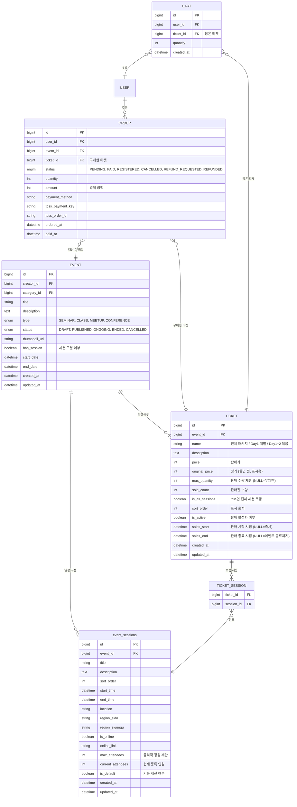
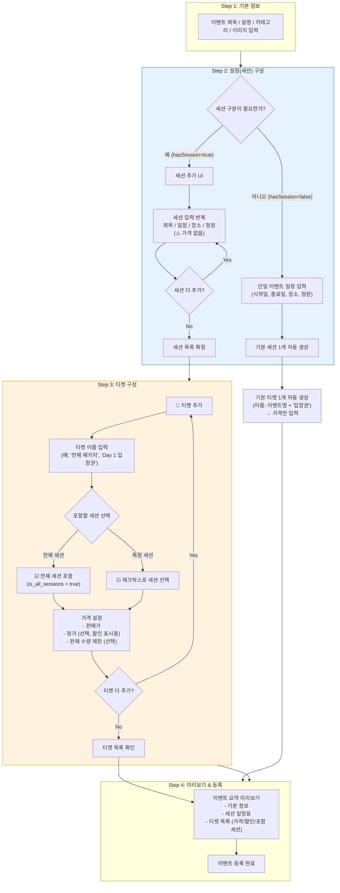
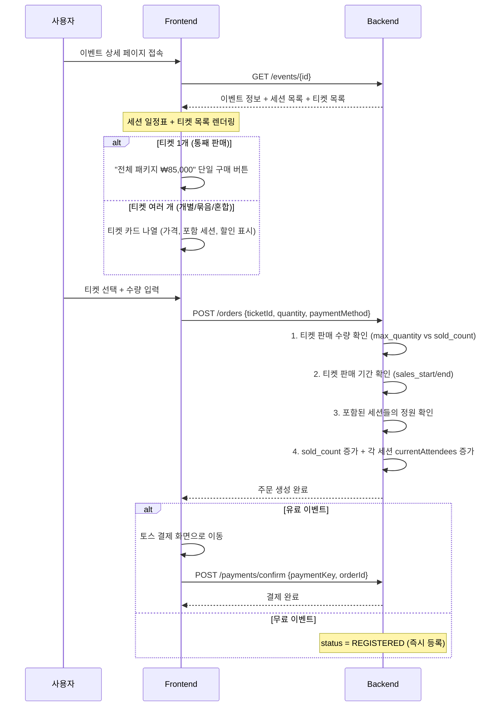
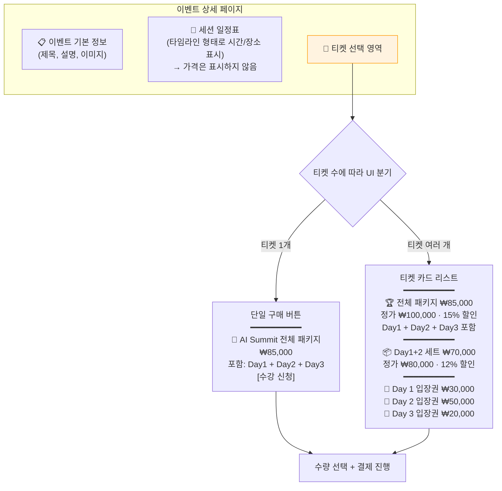

# 🎫 VenueOn 티켓 중심 설계서

> **작성일:** 2026-04-10  
> **이전 문서:** `세션_판매_전략_설계서.md`  
> **핵심 변경:** 세션 = 일정(스케줄), 티켓 = 판매 단위. `SalesMode` 제거.

---

## 📌 설계 철학

### 이전 설계의 문제점

| 문제 | 설명 |
|------|------|
| 세션이 구매 단위 | 세션에 `price`, `currentAttendees`가 있어서 세션 자체가 "상품"처럼 작동 |
| `SalesMode` enum 불필요 | ALL_IN_ONE / INDIVIDUAL / BUNDLE / SELECTIVE를 호스트가 선택해야 하는 구조 → 비직관적 |
| 유연성 부족 | 판매 모드에 따라 시스템이 `TicketOption`을 자동 생성 → 호스트의 자유도를 오히려 제한 |

### 새로운 원칙

```
세션(Session) = 이벤트 일정 / 시간표  →  "언제, 어디서, 무슨 내용인가"
티켓(Ticket)  = 판매 상품           →  "얼마에, 어떤 세션에 입장할 수 있는가"
```

- **세션에서 가격을 제거**한다. 가격은 티켓의 속성이다.
- **세션에 정원은 유지**한다. 물리적 장소 제약이므로 세션의 속성이 맞다.
- **`SalesMode` / `PurchaseType`을 제거**한다. 호스트가 티켓을 어떻게 구성하느냐에 따라 판매 전략이 자연스럽게 결정된다.
- **티켓에 `is_all_sessions` 플래그를 유지**한다. 전체 패키지 티켓의 경우, 세션이 추가되어도 자동으로 포함되도록.

---

## 🏢 도메인 분리 전략

### 패키지 구조

```
com.venueon
├── event/          ← Event + Session (일정/스케줄 관심사)
│   ├── domain/model/
│   │   ├── Event.java
│   │   └── Session.java
│   ├── application/
│   └── adapter/
│
├── ticket/         ← Ticket (판매 상품 관심사) ⭐ 독립 도메인
│   ├── domain/model/
│   │   └── Ticket.java
│   ├── application/
│   │   ├── service/TicketService.java
│   │   └── port/
│   └── adapter/
│       ├── in/web/HostTicketController.java
│       └── out/persistence/
│
├── order/          ← Order (주문/결제 관심사)
├── cart/           ← Cart (장바구니 관심사)
└── ...
```

### 왜 Ticket은 독립 도메인이고, Session은 Event 안에 있는가?

도메인 분리 판단 기준 4가지:

| # | 판단 기준 | Session | Ticket |
|---|----------|---------|--------|
| 1 | **독립적 생명주기** | ❌ 이벤트 생성/삭제에 종속 | ✅ 활성화/비활성화, 판매 기간 독립 관리 |
| 2 | **자체 비즈니스 규칙 복잡도** | ❌ `hasCapacity()` 정도 | ✅ 가격, 할인율, 판매 기간, 수량 제한, 매진 처리 |
| 3 | **다른 도메인이 직접 참조** | ❌ 항상 이벤트를 통해 접근 | ✅ Order, Cart가 직접 ticketId로 참조 |
| 4 | **독립 CRUD API 필요** | ❌ 이벤트 편집 안에서 추가/삭제 | ✅ `POST /tickets`, `PUT /tickets/{id}` 독립 API |

**Session**은 Event의 Aggregate 내부 구성 요소다. 이벤트 없이 존재할 수 없고, 항상 이벤트 컨텍스트 안에서 접근한다.

**Ticket**은 자체 생명주기, 복잡한 비즈니스 규칙, 다른 도메인에서의 직접 참조가 있으므로 독립 도메인으로 분리.

### 도메인 간 의존 방향

```
event  ←  ticket  ←  order
  ↑                    ↑
  └────── cart ─────────┘
```

- `ticket`은 `event`의 ID만 참조 (event_id FK)
- `order`, `cart`는 `ticket`의 ID만 참조 (ticket_id FK)
- 도메인 간 직접적인 클래스 참조 없이, **ID 기반 느슨한 결합**

### Session이 향후 분리되어야 하는 경우

현재는 분리 불필요. 하지만 아래와 같은 비즈니스 요구가 생기면 분리를 고려:

| 시나리오 | 설명 |
|---------|------|
| 교차 이벤트 스케줄링 | "이 강연자가 참여하는 모든 세션 조회" |
| 세션별 출석 관리 | QR 체크인, 출석부 등 자체 시스템 |
| 세션 독립 평가/리뷰 | 세션별 별점, 리뷰 |
| 반복 세션 (Recurring) | 매주 수요일 같은 세션 — 스케줄링 복잡도 증가 |

---

## 📛 네이밍 규칙

### `EventSession` → `Session` 리네이밍

`event` 패키지 안에 있으므로 `Event` 접두사는 중복. 패키지가 이미 컨텍스트를 제공한다.

| 대상 | Before | After |
|------|--------|-------|
| 도메인 모델 | `EventSession.java` | `Session.java` |
| JPA Entity | `EventSessionJpaEntity.java` | `SessionJpaEntity.java` |
| Mapper | `EventSessionMapper.java` | `SessionMapper.java` |
| Service | `EventSessionService.java` | `SessionService.java` |
| Adapter | `EventSessionPersistenceAdapter.java` | `SessionPersistenceAdapter.java` |
| **DB 테이블명** | `event_sessions` | **`event_sessions` (유지)** |

> [!NOTE]
> DB 테이블명은 `event_sessions`으로 유지한다. `sessions`는 SQL 예약어와 혼동될 수 있고, 테이블 컨텍스트를 명확히 하기 위함.

```java
@Entity
@Table(name = "event_sessions")  // 테이블명은 event_ 접두사 유지
public class SessionJpaEntity {   // 클래스명은 Session
    ...
}
```

---

## 🏗️ ERD



---

## 📋 테이블 상세 설계

### `EVENT` — 변경 사항

기존 `Event` 도메인에서 **제거되는 필드**:

```diff
  # Event 도메인
- private int price;              # 가격은 Ticket으로 이동
- private int maxAttendees;       # 정원은 Session에만 유지
- private PurchaseType purchaseType;  # 판매 모드 개념 제거
```

> [!NOTE]
> `hasSession` 플래그는 유지. `hasSession=false`이면 기본 세션 1개 + 기본 티켓 1개가 자동 생성되는 기존 편의 로직은 그대로 활용.

### `SESSION` (기존 `EVENT_SESSION`) — 변경 사항

```diff
  # Session 도메인 (EventSession에서 리네이밍)
- private int price;              # 가격 제거 → Ticket의 속성
  private int maxAttendees;       # 유지 (물리적 장소 제약)
  private int currentAttendees;   # 유지 (정원 추적)
```

세션의 역할이 **일정/장소 정보 + 정원 관리**로 명확해진다.

### `TICKET` (신규)

```sql
CREATE TABLE tickets (
    id              BIGSERIAL PRIMARY KEY,
    event_id        BIGINT NOT NULL REFERENCES events(id) ON DELETE CASCADE,
    name            VARCHAR(100) NOT NULL,           -- "전체 패키지", "Day 1 입장권" 등
    description     TEXT,
    price           INT NOT NULL DEFAULT 0,          -- 실제 판매가
    original_price  INT NOT NULL DEFAULT 0,          -- 정가 (할인 표시용)
    max_quantity    INT,                             -- NULL이면 무제한
    sold_count      INT NOT NULL DEFAULT 0,
    is_all_sessions BOOLEAN NOT NULL DEFAULT false,  -- true면 전체 세션 자동 포함
    sort_order      INT NOT NULL DEFAULT 0,
    is_active       BOOLEAN NOT NULL DEFAULT true,
    sales_start     TIMESTAMP,                       -- NULL이면 이벤트 공개 즉시
    sales_end       TIMESTAMP,                       -- NULL이면 이벤트 종료까지
    created_at      TIMESTAMP NOT NULL DEFAULT now(),
    updated_at      TIMESTAMP
);
```

### `TICKET_SESSION` (신규 — 매핑 테이블)

```sql
CREATE TABLE ticket_sessions (
    ticket_id  BIGINT NOT NULL REFERENCES tickets(id) ON DELETE CASCADE,
    session_id BIGINT NOT NULL REFERENCES event_sessions(id) ON DELETE CASCADE,
    PRIMARY KEY (ticket_id, session_id)
);
```

> [!IMPORTANT]
> `is_all_sessions = true`인 티켓은 이 매핑 테이블에 데이터가 없어도 된다. 백엔드 조회 시 해당 이벤트의 전체 세션을 자동으로 가져온다.

---

## 🎯 호스트의 티켓 구성 예시

> `SalesMode` 없이 호스트가 티켓을 자유롭게 구성하면 어떤 판매 전략이든 자연스럽게 구현된다.

### 예시: 3일짜리 AI 세미나

```
📅 AI Summit 2026 (이벤트)
├── [세션] Day 1: 기초 강연     (정원 100명)
├── [세션] Day 2: 심화 워크숍   (정원 50명)
└── [세션] Day 3: 네트워킹 데이 (정원 80명)
```

#### 시나리오 1: 통째 판매

호스트가 티켓 1개만 생성:

| 티켓 | 가격 | is_all_sessions | 매핑 세션 |
|------|------|----------------|----------|
| 전체 패키지 | ₩85,000 | `true` | — (전체 자동) |

#### 시나리오 2: 개별 판매

호스트가 세션마다 티켓 생성:

| 티켓 | 가격 | is_all_sessions | 매핑 세션 |
|------|------|----------------|----------|
| Day 1 입장권 | ₩30,000 | `false` | Day 1 |
| Day 2 입장권 | ₩50,000 | `false` | Day 2 |
| Day 3 입장권 | ₩20,000 | `false` | Day 3 |

#### 시나리오 3: 묶음 판매

호스트가 세션 조합으로 티켓 생성:

| 티켓 | 가격 | 정가 | is_all_sessions | 매핑 세션 |
|------|------|------|----------------|----------|
| Day 1+2 세트 | ₩70,000 | ₩80,000 | `false` | Day 1, Day 2 |
| 전체 패키지 | ₩85,000 | ₩100,000 | `true` | — (전체 자동) |

#### 시나리오 4: 혼합 판매 (개별 + 묶음)

호스트가 모든 종류의 티켓을 자유롭게 생성:

| 티켓 | 가격 | 정가 | is_all_sessions | 매핑 세션 |
|------|------|------|----------------|----------|
| 🏆 전체 패키지 | ₩85,000 | ₩100,000 | `true` | — |
| 📦 Day 1+2 세트 | ₩70,000 | ₩80,000 | `false` | Day 1, Day 2 |
| 🎫 Day 1 입장권 | ₩30,000 | ₩30,000 | `false` | Day 1 |
| 🎫 Day 2 입장권 | ₩50,000 | ₩50,000 | `false` | Day 2 |
| 🎫 Day 3 입장권 | ₩20,000 | ₩20,000 | `false` | Day 3 |

→ **호스트가 만드는 그대로가 판매 전략**. 시스템이 분류할 필요 없음.

---

## 📐 이벤트 등록 플로우



### hasSession=false (단일 이벤트)인 경우

```
1. 기본 세션 1개 자동 생성 (이벤트와 동일 일정/장소)
2. 기본 티켓 1개 자동 생성 (is_all_sessions=true)
3. 호스트는 가격만 입력하면 됨
```

→ 기존 단일 이벤트 UX와 동일한 경험 유지.

---

## 🛒 구매 플로우



---

## 🔧 정원 관리 로직

> [!IMPORTANT]
> 다른 티켓이라도 같은 세션을 포함할 수 있다. 따라서 정원 관리는 **항상 세션 단위**.

```java
/**
 * 주문 생성 시 정원 확인 + 차감 로직
 */
@Transactional
public Order createOrder(Long userId, Long ticketId, int quantity) {
    Ticket ticket = ticketPort.findById(ticketId);

    // 1. 티켓 판매 기간 확인
    if (ticket.getSalesStart() != null && LocalDateTime.now().isBefore(ticket.getSalesStart())) {
        throw new TicketNotOnSaleException("아직 판매가 시작되지 않았습니다.");
    }
    if (ticket.getSalesEnd() != null && LocalDateTime.now().isAfter(ticket.getSalesEnd())) {
        throw new TicketNotOnSaleException("판매가 종료되었습니다.");
    }

    // 2. 티켓 자체 판매 수량 확인
    if (ticket.getMaxQuantity() != null &&
        ticket.getSoldCount() + quantity > ticket.getMaxQuantity()) {
        throw new SoldOutException("해당 티켓이 매진되었습니다.");
    }

    // 3. 포함된 모든 세션의 정원 확인 (핵심!)
    List<Session> sessions = resolveTicketSessions(ticket);

    for (Session session : sessions) {
        if (!session.hasCapacity(quantity)) {
            throw new CapacityExceededException(
                String.format("'%s' 세션의 정원이 부족합니다. (잔여: %d)",
                    session.getTitle(),
                    session.getRemainingCapacity())
            );
        }
    }

    // 4. 정원 차감 + 판매 수량 증가
    for (Session session : sessions) {
        session.incrementAttendees(quantity);
        sessionPort.save(session);
    }
    ticket.incrementSoldCount(quantity);
    ticketPort.save(ticket);

    // 5. 주문 생성
    int totalAmount = ticket.getPrice() * quantity;
    return Order.createPending(userId, ticket.getEventId(), ticketId, quantity, totalAmount, null);
}

/**
 * is_all_sessions 분기 처리
 */
private List<Session> resolveTicketSessions(Ticket ticket) {
    if (ticket.getIsAllSessions()) {
        return sessionPort.findAllByEventId(ticket.getEventId());
    } else {
        return sessionPort.findByIds(ticket.getSessionIds());
    }
}
```

---

## 📦 도메인 모델

### `Ticket` (신규)

```java
/**
 * Ticket 도메인 모델 (순수 POJO)
 *
 * 티켓은 이벤트의 판매 단위이다.
 * 호스트가 자유롭게 구성하며, 하나 이상의 세션에 대한 입장권 역할을 한다.
 */
public class Ticket {

    private Long id;
    private Long eventId;
    private String name;           // "전체 패키지", "Day 1 입장권"
    private String description;
    private int price;             // 실제 판매가
    private int originalPrice;     // 정가 (할인 전, 표시용)
    private Integer maxQuantity;   // 판매 수량 제한 (null = 무제한)
    private int soldCount;
    private boolean isAllSessions; // true면 전체 세션 자동 포함
    private int sortOrder;
    private boolean isActive;
    private LocalDateTime salesStart;
    private LocalDateTime salesEnd;
    private LocalDateTime createdAt;
    private LocalDateTime updatedAt;

    // 매핑된 세션 ID 목록 (is_all_sessions=false일 때 사용)
    private List<Long> sessionIds;

    // --- 비즈니스 메서드 ---

    public boolean isOnSale() {
        if (!isActive) return false;
        LocalDateTime now = LocalDateTime.now();
        if (salesStart != null && now.isBefore(salesStart)) return false;
        if (salesEnd != null && now.isAfter(salesEnd)) return false;
        return true;
    }

    public boolean isSoldOut() {
        return maxQuantity != null && soldCount >= maxQuantity;
    }

    public void incrementSoldCount(int quantity) {
        this.soldCount += quantity;
    }

    public void decrementSoldCount(int quantity) {
        this.soldCount = Math.max(0, this.soldCount - quantity);
    }

    public int getDiscountRate() {
        if (originalPrice <= 0 || price >= originalPrice) return 0;
        return (int) Math.round((1.0 - (double) price / originalPrice) * 100);
    }

    public int getRemainingQuantity() {
        if (maxQuantity == null) return Integer.MAX_VALUE;
        return Math.max(0, maxQuantity - soldCount);
    }
}
```

### `Session` — 변경 후 (기존 `EventSession`)

```java
/**
 * Session 도메인 모델 (기존 EventSession에서 리네이밍)
 *
 * 세션은 이벤트의 일정/시간표이다.
 * 장소와 정원만 관리하며, 가격은 Ticket에서 결정된다.
 */
public class Session {

    private Long id;
    private Long eventId;
    private String title;
    private String description;
    private int sortOrder;
    private LocalDateTime startTime;
    private LocalDateTime endTime;

    // 장소 / 온라인
    private String location;
    private String regionSido;
    private String regionSigungu;
    private boolean isOnline;
    private String onlineLink;

    // 정원 (물리적 장소 제약)
    private int maxAttendees;
    private int currentAttendees;
    // ⚠️ price 필드 제거됨

    // 시스템 관리
    private boolean isDefault;
    private LocalDateTime createdAt;
    private LocalDateTime updatedAt;

    // --- 비즈니스 메서드 ---

    public boolean hasCapacity(int quantity) {
        return maxAttendees == 0 || (currentAttendees + quantity) <= maxAttendees;
    }

    public int getRemainingCapacity() {
        if (maxAttendees == 0) return Integer.MAX_VALUE;
        return Math.max(0, maxAttendees - currentAttendees);
    }

    public void incrementAttendees(int quantity) {
        this.currentAttendees += quantity;
    }

    public void decrementAttendees(int quantity) {
        this.currentAttendees = Math.max(0, this.currentAttendees - quantity);
    }
}
```

### `Order` — 변경 사항

```diff
  # Order 도메인
- private Long sessionId;       # 세션 직접 참조 제거
+ private Long ticketId;        # 구매한 티켓 참조
```

### `Cart` — 변경 사항

```diff
  # Cart 도메인
- private Long sessionId;        # 세션 참조 제거
- private String sessionTitle;
+ private Long ticketId;          # 티켓 참조
+ private String ticketName;
```

---

## 🗂️ 전체 코드 변경 범위

```diff
 # =============================================
 # 변경되는 기존 파일 (event 도메인)
 # =============================================

 # 1. Event — 불필요한 필드 제거
   event/domain/model/Event.java
-  private int price;
-  private int maxAttendees;
-  private PurchaseType purchaseType;

   event/adapter/out/persistence/entity/EventJpaEntity.java
-  private int price;
-  private int maxAttendees;
-  @Enumerated(EnumType.STRING) private PurchaseType purchaseType;

 # 2. EventSession → Session 리네이밍 + 가격 필드 제거
-  event/domain/model/EventSession.java
+  event/domain/model/Session.java
-  private int price;

-  event/adapter/out/persistence/entity/EventSessionJpaEntity.java
+  event/adapter/out/persistence/entity/SessionJpaEntity.java
-  private int price;

-  event/adapter/out/persistence/EventSessionMapper.java
+  event/adapter/out/persistence/SessionMapper.java

-  event/adapter/out/persistence/EventSessionPersistenceAdapter.java
+  event/adapter/out/persistence/SessionPersistenceAdapter.java

-  event/application/service/EventSessionService.java
+  event/application/service/SessionService.java

 # 3. PurchaseType 삭제
-  event/domain/model/PurchaseType.java (삭제)

 # 4. 관련 DTO/Request/Response 수정
   EventCreateRequest.java    → price, maxAttendees, purchaseType 제거
   EventUpdateRequest.java    → price, maxAttendees, purchaseType 제거
   EventDetailResponse.java   → price, purchaseType 제거, tickets 필드 추가
   EventListResponse.java     → purchaseType 제거

 # 5. Mapper 수정
   EventMapper.java           → 제거된 필드 반영

 # 6. DataInitializer.java    → 초기화 데이터 수정


 # =============================================
 # 변경되는 기존 파일 (order 도메인)
 # =============================================

   order/domain/model/Order.java
-  private Long sessionId;
+  private Long ticketId;

   order/adapter/out/persistence/entity/OrderJpaEntity.java
-  @ManyToOne EventSessionJpaEntity session;
+  @ManyToOne TicketJpaEntity ticket;


 # =============================================
 # 변경되는 기존 파일 (cart 도메인)
 # =============================================

   cart/domain/model/Cart.java
-  private Long sessionId;
-  private String sessionTitle;
+  private Long ticketId;
+  private String ticketName;

   cart/adapter/out/persistence/entity/CartJpaEntity.java
-  @ManyToOne EventSessionJpaEntity eventSession;
+  @ManyToOne TicketJpaEntity ticket;


 # =============================================
 # 신규 파일 (ticket 도메인 — 독립 패키지)
 # =============================================

 # 도메인
+  ticket/domain/model/Ticket.java

 # JPA Entity
+  ticket/adapter/out/persistence/entity/TicketJpaEntity.java
+  ticket/adapter/out/persistence/entity/TicketSessionJpaEntity.java  (또는 @JoinTable)

 # Application Layer
+  ticket/application/port/in/CreateTicketUseCase.java
+  ticket/application/port/in/GetTicketUseCase.java
+  ticket/application/port/in/UpdateTicketUseCase.java
+  ticket/application/port/in/DeleteTicketUseCase.java
+  ticket/application/port/out/TicketPort.java
+  ticket/application/service/TicketService.java

 # Adapter — Persistence
+  ticket/adapter/out/persistence/TicketPersistenceAdapter.java
+  ticket/adapter/out/persistence/TicketJpaRepository.java
+  ticket/adapter/out/persistence/TicketMapper.java

 # Adapter — Web (Host 전용 CRUD)
+  ticket/adapter/in/web/HostTicketController.java

 # DTO
+  ticket/adapter/in/web/dto/TicketCreateRequest.java
+  ticket/adapter/in/web/dto/TicketUpdateRequest.java
+  ticket/adapter/in/web/dto/TicketResponse.java
```

---

## 🖥️ 프론트엔드 구매 페이지 UI 구성



### 할인 표시 규칙

- `original_price > price` 이면 할인율을 자동 계산하여 표시
- `original_price == price` 또는 `original_price == 0` 이면 할인 표시 없음
- **정가 취소선 + 할인율 뱃지** UI 활용

---

## 🚀 구현 순서

### Phase 1: 핵심 구조 마이그레이션 (1주차)

| # | 작업 | 우선순위 |
|---|------|---------|
| 1 | `Ticket` 도메인 + JPA Entity 생성 | 🔴 |
| 2 | `TicketSession` 매핑 테이블 생성 | 🔴 |
| 3 | `EventSession` → `Session` 리네이밍 + `price` 필드 제거 | 🔴 |
| 4 | `Event`에서 `price`, `maxAttendees`, `purchaseType` 제거 | 🔴 |
| 5 | `Order`의 `sessionId` → `ticketId` 변경 | 🔴 |
| 6 | `Cart`의 `sessionId` → `ticketId` 변경 | 🔴 |
| 7 | `PurchaseType` enum 삭제 | 🔴 |
| 8 | Host 티켓 CRUD API (Controller, UseCase, Adapter) | 🔴 |
| 9 | `hasSession=false` 시 기본 세션 + 기본 티켓 자동 생성 로직 | 🔴 |

### Phase 2: 구매 플로우 연동 (2주차)

| # | 작업 | 우선순위 |
|---|------|---------|
| 10 | 주문 생성 로직 — 세션별 정원 확인 + 차감 | 🟡 |
| 11 | 이벤트 상세 API — 티켓 목록 포함 응답 | 🟡 |
| 12 | 프론트엔드 — 이벤트 등록 UI (세션 → 티켓 단계 분리) | 🟡 |
| 13 | 프론트엔드 — 구매 페이지 티켓 선택 UI | 🟡 |
| 14 | DataInitializer 수정 (샘플 데이터) | 🟡 |

### Phase 3: 고급 기능 (3주차 이후)

| # | 작업 | 우선순위 |
|---|------|---------|
| 15 | 얼리버드 할인 (sales_start/end 활용) | 🟢 |
| 16 | 수량 한정 티켓 (max_quantity) | 🟢 |
| 17 | 주문 취소 시 정원/판매수량 롤백 | 🟢 |
| 18 | 동시성 처리 (Pessimistic Lock) | 🟢 |

---

## ✅ 이전 설계 대비 개선 사항

| 항목 | 이전 설계 (세션 판매 전략) | 현재 설계 (티켓 중심) |
|------|------------------------|-------------------|
| 세션의 역할 | 구매 단위 (가격 + 정원) | **일정 + 정원만** |
| 가격의 위치 | 세션에 `base_price` | **티켓에 `price`** |
| 판매 모드 | `SalesMode` enum 4개 | **없음. 티켓 구성이 곧 전략** |
| 호스트 UX | 판매 모드 선택 → 자동 생성 | **티켓 자유 구성** |
| 추가 테이블 | 2개 (TicketOption, TicketOptionSession) | **2개 (Ticket, TicketSession)** |
| 자동 생성 로직 | SalesMode별 Smart Default 필요 | **hasSession=false일 때만 기본 1개** |
| 확장성 | 높음 | **높음 (동일)** |
| 개념적 복잡도 | 중 (SalesMode 분류 부담) | **낮음** |

> [!TIP]
> **MVP 전략**: `hasSession=false` (단일 이벤트) 케이스를 먼저 구현하면, 기존 이벤트 흐름을 깨뜨리지 않고 티켓 구조를 도입할 수 있습니다. 이후 `hasSession=true` + 다중 티켓 구성을 추가하면 됩니다.
